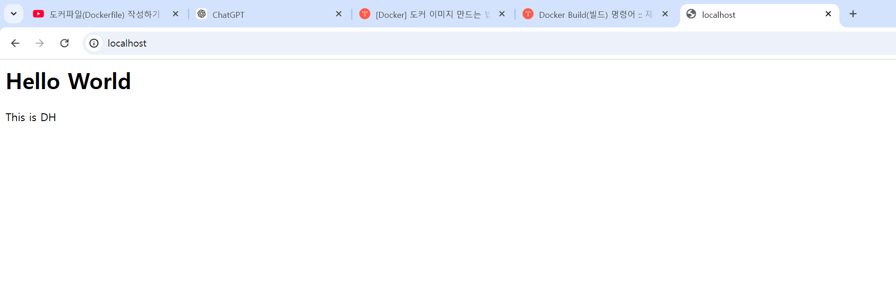

[유튜브강의](https://www.youtube.com/watch?v=p1-wm-ThnTI&list=PLlTylS8uB2fDLJRJCXqUowsOViG-ZKnWy&index=1)


# docker의 구성
* image
* container

---

## image
* template이다.
* 불변
* 격리되지도 않고 실행되지도 않는다.
* 지속적
* 컨테이너는 이미지를 사용한다.
* 공통적
* 이미지 위에 컨테이너를 생성.

## container
* 독립적 실행환경
* 동적
* 다른 컨테이너와 격리됨(독립적)
* 실행 중에만 실시된다.
* 개별적
* application 실행


# docker 통신

도커 컨테이너는 기본적으로 독립적인 환경에서 실행되기 때문에 컨테이너 밖에서 접근될 수 없다.

컨테이너와 통신하기 위해서는 컨테이너를 가동시키면서 'p' 옵션을 사용하여 호스트(pc 또는 서버)의 포트와 컨테이너의 (컨테이너가 외부와 통신하기 위해 열리는)포트를 설정해야 함.

-p \${host_port}:${container_port}<br>
ex) 8080:80         (호스트가 8080, 컨테이너가 80)

이 설정을 사용하기 위해서는 host에서 사용 중인 포트와 번호가 겹치지 않는지 확인해야 한다.

예시)
>docker run --name test1 -d httpd<br>

>docker run --name test1 -d -p 8080:80 httpd

* --name1 > test1이라는 이름으로 컨테이너를 생성한다.
* -d > 백그라운드로 동작한다.
* -p 8080:80 > 호스트의 포트는 8080, 컨테이너의 포트는 80으로 세팅하여 네트워크를 설정한다.

<br>

### 상태 확인
>docker ps<br>
>docker ps -a
* docker ps : 현재 실행 중인 컨테이너만 나옵
* docker ps -a : 실행 중이든 종료되었든 모든 컨테이너를 나열

>docker container ls
* 실행중인 container만 보여준다.
>docker container ls -a
* 위의 docker ps -a와 같은 기능의 명령어이다. 근데 쓸 거면 얘를 써라.

>docker image ls
* 실행중인 이미지를 보여준다.

### 중지 및 삭제
container를 실습할 때 중지 및 삭제를 해주는 것이 좋다.

>docker stop test1
* test1 중지
>docker rm test1
* test1 삭제

또는 docker desktop에서 리스트를 보고 gui를 통해 삭제해도 괜찮다.


## 실습
>docker run --name test1 -d httpd<br>

를 하고 난 후<br>
>docker run --name test1 -d -p 8080:80 httpd

를 하면 에러가 남.<br>

왜 와이? 이미 test1이라는 container가 돌아가고 있는데 test1이라는 이름으로 또 run을 하면 충돌이 일어나기 때문.<br>
solution is ... 이름을 바꿔서 run을 하면 된다.<br>
>ex) docker run --name test2 -d -p httpd 8080:80

run 하다가 삭제할 거면 먼저 중지를 시킨다.
>docker stop test1

그러고 삭제
>docker rm test1

---

# dockerfile

docker file은 docker image를 생성하기 위한 script file이다.<br>
여러 키워드를 사용하여 dockerfile을 작성하여 빌드를 보다 쉽게 수행할 수 있다.

참고)<br> 
[dockerfile instruction1](https://rampart81.github.io/post/dockerfile_instructions/)<br>

[dockerfile instruction2](https://toramko.tistory.com/entry/docker-%EB%8F%84%EC%BB%A4%ED%8C%8C%EC%9D%BCDockerfile-%EC%9D%98-%EA%B0%9C%EB%85%90-%EC%9E%91%EC%84%B1-%EB%B0%A9%EB%B2%95%EB%AC%B8%EB%B2%95-%EC%9E%91%EC%84%B1-%EC%98%88%EC%8B%9C)

dockerfile에서 사용되는 주요 instruction은 다음과 같다.

* FROM
    * From 키워드를 사용하여 base가 되는 image를 지정.
    * 주로 os 이미지나 runtime 이미지를 지정한다.

* RUN
    * 이미지를 빌드할 때 사용하는 command를 설정할 때 사용.

* ADD
    * 이미지에 호스트의 파일이나 폴더를 추가하기 위해 사용
    * 만약 이미지에 복사하려는 디렉토리가 존재하지 않으면 docker가 자동으로 생성.

* COPY
    * 호스트의 환경의 파일이나 폴더를 이미지 안으로 복사하기 위해 사용.
    * 'ADD'와 동일하게 동작하지만 가장 확실한 차이점은 URL을 지정하거나, 압축파일을 자동으로 풀지 않음.

* EXPOSE
    * 이미지가 통신에 사용할 포트를 지정할 때 사용

* ENV
    * 환경 변수를 지정할 때 사용
    * 여기서 설정한 변수는 $name, ${name} 의 형태로 사용할 수 있음.
    * 추가로 아래와 같은 문법을 사용하여 사용할 수 있음.
      * ${name:-else}:name 이 정의가 안 되어 있다면 'else'가 사용됨.
* CMD
    * 도커 컨테이너가 실행될 때 실행한 커맨드를 지정
    * 'RUN'과 비슷하지만 CMD는 도커이미지를 빌드할 때 실행되는 것이 아니라 컨테이너를 시작할 때 실행된다는 것이 다름.
* ENTRYPOINT
    * 도커 이미지가 실행될 때 사용되는 기본 커맨드를 지정(강제)
* WORKDIR
    * RUN, CMD, ENTRYPOINT 등을 사용한 커맨드를 실행하는 디렉토리를 지정
    * -w 옵션으로 오버라이딩 할 수 있음.
* VOLUME
    * 퍼시스턴스 데이터를 저장할 경로를 지정할 때 사용
    * 호스트의 디렉토리를 도커 컨테이너에 연결
    * 주로 휘발성으로 사용되면 안되는 데이터를 저장할 때 사용


* 기타 옵션 - 많이 사용 안된다.
    * SHELL
    * LABEL
    * USER
    * ARG
    * STOPSIGNAL
    * HEALTHCHECK


## docker build 커맨드
dockerfile을 실행하기 위해서는 docker build 커맨드를 사용

docker build ${option} ${dockerfile directory}

        ex) docker build-t test . ( 이러면 이미지의 이름이 test가 됨. (space). 은 현재 디렉터리 라는 의미.)

생성된 이미지를 컨테이너를 실행하기 위해서는 run 커맨드를 사용<br>

        ex) docker run --name test_app -p 80:80 test    (test는 위에서 만든 이미지 이름)


# dockerfile 실습편

> docker run --name original_httpd -p 80:80 httpd

httpd 이미지를 컨테이너로 올렸을 때 localhost를 한다면 실행이 된다.

> docker stop original_httpd

httpd를 멈추려면 stop을 한다.

>docker rm original_httpd

그러고는 rm을 통해 삭제

>docker container ls -a  # 지워졌는지 확인

지우고 localhost를 F5를 하면? 연결이 안됨이 뜬다.


---

다음 파일들을 이용해보자.

dockerfile
```dockerfile
FROM httpd 

COPY index.html /usr/local/apache2/htdocs
```

* FROM httpd: Apache HTTP 서버를 기본 이미지로 사용하여 새로운 이미지를 생성

* COPY index.html /usr/local/apache2/htdocs/: 현재 디렉토리에 있는 index.html 파일을 Apache 서버의 웹 루트 디렉토리인 /usr/local/apache2/htdocs/에 복사. 이렇게 하면 Apache 서버가 이 HTML 파일을 웹 페이지로 제공. <br>!!중요!!: COPY는 지정된 directory가 없으면 자동으로 directory를  생성해줌

<br>

index.html
```html
<html>
    <meta charset="utf-8"/>
    <body>
        <h1>Hello World</h1>
        <p>This is DH</p>
    </body>
</html>
```
1. \<html>: HTML 문서의 시작을 알림. \<html> 태그는 HTML 문서의 시작과 끝을 나타낸다.
2. \<meta charset="utf-8"/>: 문자 인코딩을 UTF-8로 설정하여 다양한 문자가 제대로 표시되도록 함.
3. \<body>: 웹 페이지의 본문 영역이다. 실제로 사용자에게 보여질 내용은 모두 이 영역 안에 들어감. 웹페이지 안의 내용은 모두 \<body> 안에 들어가야한다.
4. \<h1>: 가장 중요한 제목을 나타내며, **"Hello World"** 가 표시됨.(md 파일과 비슷)
5. \<p>: 단락을 정의하고, **"This is DH"** 라는 텍스트가 표시됨. 텍스트가 여러 문장으로 이루어졌을 때, 이 텍스트를 하나의 단락으로 묶어준다. \<h1>에 비해 작은 크기의 글자가 된다.


<br>

파일을 생성 후 build를 해보자.

```docker
docker build -t test123 . #-t는 tag, 뒤의 . 은 현재 directory를 의미
```

```docker
docker image ls         #이 코드를 통해 이미지가 생성된 것을 확인 가능
```
* tag가 latest 로 된 것을 확인인 가능. 

* 만일
```docker
  docker build -t test123:1.1 . # 이렇게 한 후에 docker image ls를 하면  
                                # tag에 1.1이 뜬다. 
```


### 이번에는 실행을 해보자.
```docker
docker run --name test123_app -p 80:80 test123
```
(만약 tag가 1.1인 test123 이미지를 실행하고 싶다면 뒤에 test123:1.1을 적으면 됨.)



원래의 결과가 It works! 였다면 이번에는 index.html을 COPY해줘서 이런 결과가 나옴.

이제 멈추자.
```docker
docker stop test123_app
```

만약
```docker
docker inspect test123:1.1
```
을 한다면 layer를 관찰할 수 있다.

"Layers": [
                "sha256:8b296f48696071aafb5a6286ca60d441a7e559b192fc7f94bb63ee93dae98f17",
                "sha256:fa084c5dde2584a7b0fdd8592d88e956780dc1adfd7d6ea65b0d3f03f3f86556",
                "sha256:5f70bf18a086007016e948b04aed3b82103a36bea41755b6cddfaf10ace3c6ef",
                "sha256:5dceadbf19012836b14024f8c310b1fa241f948a0ef8727fb8a55ca2cc169e52",
                "sha256:ca565a60a706cb16a23638feca3f550cafafd57435f90014ea9bc7a8e2293f43",
                "sha256:52168ee29b8324df38821ffde57f46efe89f6141833afdac12b52ddb0142afd6",
                "sha256:3fcbe81f91995cdd111103870b6e71a06ad952bc1b780e5802c43e4eb713122e"<br>
            ]

<br>
여기에

```docker
docker inspect httpd
```
를 하면

 "Layers": [
                "sha256:8b296f48696071aafb5a6286ca60d441a7e559b192fc7f94bb63ee93dae98f17",
                "sha256:fa084c5dde2584a7b0fdd8592d88e956780dc1adfd7d6ea65b0d3f03f3f86556",
                "sha256:5f70bf18a086007016e948b04aed3b82103a36bea41755b6cddfaf10ace3c6ef",
                "sha256:5dceadbf19012836b14024f8c310b1fa241f948a0ef8727fb8a55ca2cc169e52",
                "sha256:ca565a60a706cb16a23638feca3f550cafafd57435f90014ea9bc7a8e2293f43",
                "sha256:52168ee29b8324df38821ffde57f46efe89f6141833afdac12b52ddb0142afd6"
            ]

<br>
가 나오는데 상위 다섯개의 layer가 동일한 것을 볼 수 있다.<br>
내가 만든 이미지에는 6번째 layer가 추가가 된 것을 확인할 수 있다.<br>
이것은 git에 commit을 올리는 것과 비슷하다고 생각할 수 있다.<br>
기본 이미지의 내용들은 갖고오고 거기에 6번째 layer만큼 변경사항이 있다는 것을 표현해주는 것이다. 여기에 index.html 을 COPY한 내용이 포함되어 있을 것이다. 이걸 통해 우리가 dockerfile을 사용해서 이미지를 빌드할 수 있구나 정도로 이해하면 된다.