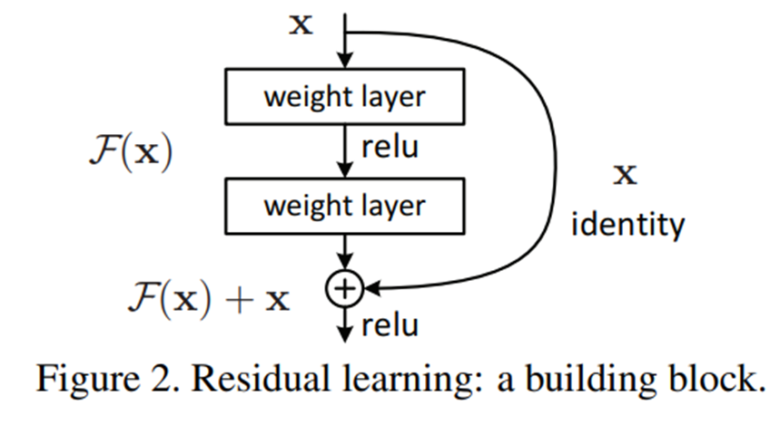

# ResNet 개념 정리

상태: 완료

### Skip-Connection



- x 가 나가서 F(x) 가 나가는게 기존의 방식
- x + F(x) 가 나가게끔 연결해주는 것이  skip-connection
    
    
    
- layer에 들어온 x 를 받아서 만들고 싶은 이상적인 애가 H(x) 라고 하자

→ 얘를 F(x)로 만드는 것과 x + F(x) 로 만드는 거 두개를 비교해보자

### ResNet 의 귀띔

- 깊은 네트워크는 한 번에 큰 변환을 만드는 것보다, 각 layer 가 조금씩 feature 을 수정하는 방식이 안정적이다.
    - 예를 들어, 잘 학습된 ResNet-50 같은 경우 34 ~ 36 층을 갈때 값의 변화가 그리 크진 않을 것이다.
        
        
        
- skip-connection 이 있을 때는 x 랑 비슷한 H(x) 를 만들기가 굉징히 쉽다.
    - skip-connection 이라는 것은 “값의 변화가 그리 크지 않을 테니(거의 H(x) = x 일 테니) layer 하나에서 모든 것을 다 하려고 하지 말고 조금씩 만 바꿔나가라” 라고 말해주는 것이다.
- 각 layer의 출력 feature map의 표준편차 (standard deviation)
    
    
    
    - Conv → BatchNorm → (ReLU 전) : 에서 나온 activation 값들의 분산 크기
        - 값이 크다 → layer 가 큰 변환을 만들고 있음
        - 값이 작다 → layer  출력이 거의 0에 가까움

### ResNet block 이 하는 일


- x = 기존 feature
- F(x) = layer 가 만든 작은 변화량
    - 즉, layer 는 이렇게 생각하면 된다 : 기존 값 x 가 꽤 괜찮으니까 조금만 수정하자
        
        
        
        
        

### ResNet 은 Vanishing Gradient 문제를 해결하기 위해 나온 것이 아닌가?

→ NO!!

skip-connection이 기울기 소실 문제"**도**" 완화시켜주는 것은 맞지만 기울기 소실 문제"**를**" 해결하기 위해 제안된 것은 아니다.

- **Gradient Vanishing Problem**
    - 문제
        - backpropagation 할 때, gradient가 점점 작아져서 앞쪽 layer가 학습이 안 되는 현상
    - 하지만 이 문제는 어느 정도 해결되었다.
        - 대표적인 방법
            - ReLU
            - Batch Normalization
            - Initialization
            
- **Degradation Problem**
    
    논문에서 한 실험:
    
    ```
    20 layer network
    56 layer network
    ```
    
    직관적으로는
    
    ```
    56 layer > 20 layer
    ```
    
    왜냐하면 더 깊으면 더 복잡한 함수 표현이 가능하기 때문이다.
    
    하지만 실제 결과는
    
    ```
    56 layer training error > 20 layer training error
    ```
    
    → 더 깊은 모델이 학습조차 잘 안된다.
    
    이것을 **degradation problem**이라고 한다.
    

- **그럼 Degradation 은 왜 생기나?**
    
    이론적으로는 다음과 같은 상황이 가능하다.
    
    예를 들어
    
    ```
    20 layer network
    ```
    
    가 좋은 모델이라고 하자.
    
    그러면
    
    ```
    56 layer network
    ```
    
    는 최소한 이렇게 만들 수 있어야 한다.
    
    ```
    앞 20 layer = 기존 모델
    나머지 36 layer = identity mapping
    ```
    
    즉
    
    ```
    입력 = 출력
    ```
    
    이면 된다.
    
    그러면
    
    ```
    56 layer ≥ 20 layer 성능
    ```
    
    이 되어야 한다. 
    
    하지만 실제로는 identity mapping을 학습하기가 어렵다
    
    그래서 deep network가 오히려 학습이 안 되는 현상이 생긴다.
    
    이것이 degradation problem이다.
    
- **왜 이것이 degradation 문제를 해결하는가**
    
    만약 어떤 layer가 필요 없다면
    
    plain network에서는 H(x)= x 을 학습해야 한다. → 하지만 이것은 쉽지 않다.
    
    하지만 ResNet에서는 F(x) = 0 이면 된다.
    
    → 전체 함수 H(x)를 학습하는 대신residual F(x)를 학습하게 하자
    
    그러면 y= x 가 된다.
    
    즉
    
    ```
    필요 없는 layer는
    자동으로 identity가 된다
    ```
    
    그래서
    
    ```
    깊어져도 성능이 떨어지지 않는다
    ```