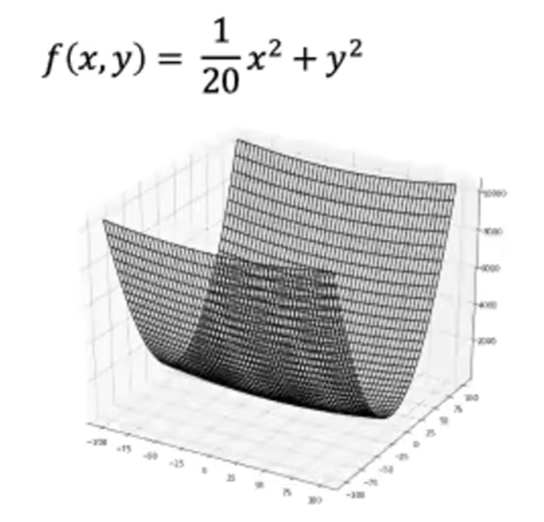

# 06_학습 관련 기술들

## 최적화(Optimization)

- 신경망 학습에서 손실 함수의 값을 가능한 한 낮추는 최적의 매개변수를 찾는 것

### SGD

```python
class SGD:
    def __init__(self,lr = 0.01):
        self.lr = lr
        
    
    def update(self,params, grads):
        for key in params.keys():
            params[key] -= self.lr * grads[key]
```

- $W \leftarrow W - \eta \frac{\partial L}{\partial W}$
    - `params[key]`: 현재의 매개변수 값 ($W$)
    - `self.lr`: 학습률 ($\eta$)
    - `grads[key]`: 비용 함수에 대한 해당 매개변수의 기울기 ($\frac{\partial L}{\partial W}$)
    - **`-=`** 연산자**:** 기울기가 양수($+$)라면 해당 방향의 반대(음수 방향)로 이동하여 오차를 줄이겠다는 의미
    - 현재 위치의 기울기($\frac{\partial L}{\partial W}$) 만을 보고 다음 스텝을 결정한다.
- SGD 의 단점
    
    
    
    - SGD 같은 경우 단순하고 구현도 쉽지만, 문제에 따라서는 비효율적일 수 있다.
    - 비등방성(방향에 따라 기울기가 달라지는 함수)에서는 탐색 경로가 비효율적이다.
        
        
        

### 모멘텀


- 모멘텀은 운동량을 뜻하는 단어이다.
    - alpha : 모멘텀
    - v : 속도
- 방향은 변하지 않기 때문에 일정하게 가속한다.
- 매개변수($W$)를 직접 업데이트하지 않고, 속도($v$)라는 변수를 먼저 업데이트한 뒤에 그 속도를 이용해 매개변수를 움직입니다.
- $\mathbf{v} \leftarrow \alpha\mathbf{v} - \eta \frac{\partial L}{\partial \mathbf{W}}$
    - $\mathbf{v}$ (Velocity): 현재 매개변수가 이동하는 '속도'와 '방향'
    - $\alpha$ (Momentum): 이전의 속도를 얼마나 유지할지 결정하는 마찰 계수. 보통 $0.9$ (90%) 를 많이 사용
    - **$-\eta \frac{\partial L}{\partial \mathbf{W}}$**: 현재 위치의 기울기에 학습률을 곱한 값, 물체에 새롭게 가해지는 힘(Force)
- $\mathbf{W} \leftarrow \mathbf{W} + \mathbf{v}$
    - 단순히 현재 기울기만큼 빼는 SGD와 달리, 누적된 속도($\mathbf{v}$)만큼 매개변수($\mathbf{W}$)를 이동시킴
        
        
        
        - 기울기가 7 에서 -5로 급격하게 바뀌는 비등방성 함수 상상
            - 초기 상태 ($v_i$):
                - 처음엔 멈춰 있기 때문에 속도는 0 이다
                - 기울기가 7이기 때문에 역방향으로 힘을 받아 속도는 -0.7이 된다.
                    - $v_i = 0.9 \times 0 - 0.1 \times 7 = -0.7$
            - 다음 상태 ($v_f$):
                - 기울기가 -5 로 역전되었다.
                - 일반 SGD 였다면 순수하게 기울기만 반영하기때문에 $-0.1 \times (-5) = \mathbf{+0.5}$ 만큼 반대 방향으로 튕겨 나갔을 것이다. → 지그재그 현상 발생
                - 모멘텀 적용 : 이전 속도 $-0.7$ 의 90%인 $-0.63$의 관성이 남아있다. 여기에 새로운 힘 $+0.5$ 가 더해진다. ($v_f = 0.9 \times (-0.7) - 0.1 \times (-5) = \mathbf{-0.13}$)
            
            → 반대 방향으로 아주 강한 힘($+0.5$)을 받았음에도 불구하고, 원래 가던 방향의 관성($-0.63$) 덕분에 튕겨 나가는 힘이 상쇄되어  $-0.13$ 만큼만 움직였다.
            
            
            

### AdaGrad

- $\mathbf{h} \leftarrow \mathbf{h} + \frac{\partial L}{\partial \mathbf{W}} \odot \frac{\partial L}{\partial \mathbf{W}}$
    - h : 기존 기울기 값을 제곱하여 계속 더해나간다.
    - **$\frac{\partial L}{\partial \mathbf{W}} \odot \frac{\partial L}{\partial \mathbf{W}}$:** 현재 기울기의 원소별(element-wise) 제곱을 의미
    - 어떤 매개변수가 그동안 많이 움직였다면(기울기가 컸다면) $\mathbf{h}$값이 아주 커지고, 적게 움직였다면 $\mathbf{h}$값이 작게 유지된다. 즉, $\mathbf{h}$는 각 매개변수가 얼마나 활발하게 업데이트되었는지를 기록하는 '피로도' 같은 역할을 한다.
- $\mathbf{W} \leftarrow \mathbf{W} - \eta \frac{1}{\sqrt{\mathbf{h}}} \frac{\partial L}{\partial \mathbf{W}}$
    - 이 수식은 일반적인 SGD의 업데이트 수식($\mathbf{W} \leftarrow \mathbf{W} - \eta \frac{\partial L}{\partial \mathbf{W}}$)과 거의 똑같지만, 중간에 $\frac{1}{\sqrt{\mathbf{h}}}$가 곱해져 있다는 것이 다르다
    - 기존의 고정된 학습률 $\eta$를 $\sqrt{\mathbf{h}}$로 나눠준다
        - **$\mathbf{h}$**가 큰 매개변수 (많이 움직인 애들): 분모가 커지므로 실제 적용되는 학습률($\frac{\eta}{\sqrt{\mathbf{h}}}$)은 작아진다.
        - $\mathbf{h}$가 작은 매개변수 (적게 움직인 애들): 분모가 작으므로 학습률이 크게 유지된다.
    - 장점
        - 학습률 감소 기법을 매개변수 각각에 맞게 적용한다
        - 비등방성 함수에서도 y 축 방향은 크게 움직였으니 보폭을 줄이고, x 축 방향은 적게 움직였으니 보폭을 키워서 최적점을 찾아간다.
    - 단점
        - 과거의 모든 기울기 제곱을 계속 더하기만 했기 때문에 $\mathbf{h}$ 가 무한히 팽창한다.
        
        
        

### RMSProp

과거의 기억은 잊고, 최근의 변화량을 더 중요하게 반영하겠다. → Exponential Moving Average 

- 수식
    - $\mathbf{h} \leftarrow \rho \mathbf{h} + (1 - \rho) \left( \frac{\partial L}{\partial \mathbf{W}} \odot \frac{\partial L}{\partial \mathbf{W}} \right)$
        - $\rho$ (Decay rate)**:** 과거의 기억을 얼마나 유지할지 결정하는 '감쇠율'. 보통 0.9나 0.99를 주로 사용
        - **$(1 - \rho)$:** 반대로 '**현재의 기울기**'를 얼마나 반영할지 결정. $\rho$가 0.9라면 현재 기울기 제곱 값은 0.1만 반영하는 것이다.
        - $\rho$ 덕분에 과거의 기울기 값들은 스텝이 지날수록 $0.9 \times 0.9 \times 0.9 \dots$ 식으로 기하급수적으로 작아져서 결국 잊혀진다.
    - $\mathbf{W} \leftarrow \mathbf{W} - \frac{\eta}{\sqrt{\mathbf{h} + \epsilon}} \frac{\partial L}{\partial \mathbf{W}}$
        - 매개변수를 업데이트 하는 식은 AdaGrad 와 거의 동일하다.
        - **$\epsilon$ :** $\mathbf{h}$가 완전히 0이 되었을 때 분모가 0이 되어 0으로 나누는 오류(Divide by Zero)가 발생하는 것을 막기 위한 작은 안정화 값

### Adam(Adaptive Moment Estimation)

- 방향은 모멘텀처럼 잡고, 보폭은 RMSProp 처럼 조절하자 : Momentum + RMSProp
- 최종 수식
    - $\theta_t = \theta_{t-1} - \frac{\eta}{\sqrt{\hat{v}_t} + \epsilon} \hat{m}_t$
        - $\eta$: 학습률 (Learning Rate)
        - $\epsilon$: 분모가 **0**이 되어 계산이 터지는 것을 막기 위한 아주 작은 숫자
- 모멘텀(방향 기억하기) → 과거의 기울기 누적
    - $m_t = \beta_1 m_{t-1} + (1 - \beta_1) g_t$
        - $m_t$ : 1차 모멘트 (속도, 방향)
        - $\beta_1$ : 모멘텀 관성을 얼마나 유지할지 결정하는 값 (보통 **0.9**를 사용)
        - $g_t$ : 현재의 기울기
- RMSProp → 보폭 조절하기
    - $v_t = \beta_2 v_{t-1} + (1 - \beta_2) g_t^2$
        - $v_t$: 2차 모멘트 (기울기 변화의 크기, 보폭)
        - $\beta_2$: 과거의 보폭 크기를 얼마나 유지할지 결정하는 값 (보통 **0.999**를 사용)
- Adam 만의 특별한 방법 : 편향 보정
    - 처음에 m과 v는 모두 0으로 초기화된다. 이 상태에서 수식을 계산하면, 학습 초반에는 m 과 v 의 값이 실제보다 0에 너무 가깝게 왜곡 되는 문제가 생긴다.
    - Adam은 학습 진행 횟수($t$)를 이용해 이 초기 왜곡을 바로잡아 준다. → 편향보정
        
        $\hat{m}_t = \frac{m_t}{1 - \beta_1^t}$
        
        $\hat{v}_t = \frac{v_t}{1 - \beta_2^t}$
        
    - 학습 초반 ($t$가 작을 때)**:** 분모가 **1**보다 훨씬 작아져서 $m$과 $v$의 값이 적절히 커진다. (0으로 쏠리는 것을 막아줌)
    - 학습 후반 ($t$가 커질 때): $\beta^t$가 사실상 **0**이 되면서 분모가 **1**에 가까워져 자연스럽게 보정 효과가 사라진다.

### MNIST 데이터 셋으로 본 갱신 방법 비교


### 가중치의 초기값 → 출발지점을 잘 잡기

- 가중치를 균일한 값으로 설정해서는 안된다.
    
    → 오차 역전파법에서 모든 가중치의 값이 똑같이 갱신되기 때문
    
- 가중치가 고르게 되어 버리는 상황을 막으려면(가중치의 대칭적인 구조를 무너뜨리려면) 초깃값을 무작위로 설정해야 함
- 가중치의 초깃값에 따라 은닉층 활성화 값들이 어떻게 변하는지 간단한 실험 진행
    - 층이 5개가 있으며, 각 층의 뉴련은 100개씩
    - 1,000 개의 데이터를 정규분포로 무작위로 생성하여 신경망에 흘린다.
    - 표준편차를 바꾸어가며 활성화 값들의 분포가 어떻게 분포하는지 관찰한다.
    
- 표준편차가 1인 정규분포를 사용하였을 경우


시그모이드 함수는 출력이 0 또는 1에 가까워지면 미분값은 0에 가까워진다. 그래서 데이터가 0 과 1에 치우쳐 분포하게 되면 역전파 기울기 값이 점점 작아지다가 사라진다. → 기울기 소실 문제

- 표준편차가 0.01인 정규분포를 사용했을 경우
    
    
    

활성화 값들이 치우쳤다는 것은 다수의 뉴런이 거의 같은 값을 출력하고 있다는 뜻이다. 그렇기 때문에 표현력을 제한한다는 문제가 발생한다.

### Xavier 초깃값


- 앞 층의 노드 수($n_{in}$)에 맞춰 가중치의 표준편차를 조절하자
    - 가중치의 표준편차($\sigma$)를 $\frac{1}{\sqrt{n_{in}}}$ (또는 $\sqrt{\frac{2}{n_{in} + n_{out}}}$)로 설정
    - 앞 층의 노드가 많을수록 더해지는 항의 개수가 많아지기 때문이다.
        
        
        

### ReLU 를 사용할 때의 가중치 초기값

이 초기값은 He 초기값이라고도 한다.

활성화 함수를 ReLU 로 선택할 때 사용 


- ReLU 를 사용했음에도 Xavier 초기값을 사용하게 되면 층이 깊어질수록 데이터의 분포가 왼쪽으로 치우치게 된다.
- He 초기값은 치우침이 없다.

### 배치 정규화

- 배치 정규화의 장점
    - 학습 속도 개선
    - 초기값에 크게 의존하지 않음
    - overfitting 의 억제
- 배치 정규화의 효과
    - MNIST 데이터셋을 사용했을 때, 배치 정규화를 사용한 경우와 그렇지 않을 때의 학습 진도 차이이다.
    
    
    


batch 의 학습????????????????????????????

### Overfitting

- 매개변수가 많고 표현력이 높은 모델
- 훈련 데이터가 적은 경우


- 훈련데이터와 시험데이터의 차이가 크게 벌어지게 되는데 이것은 훈련 데이터에만 적응해서이다.

### 가중치 감소

- 큰 가중치에 대해서는 그에 상응하는 큰 패널티를 부과하여 오버피팅을 억제하는 방법. 오버피팅은 가중치 매개변수의 값이 커서 발생하는 경우가 많기 때문이다.
1. 손실 함수에 패널티 추가하기
    - $\text{Total Loss} = \text{Original Loss} + \frac{1}{2}\lambda W^2$
        - **$\frac{1}{2}\lambda W^2$:** 패널티 항
        - **$W$:** 가중치 값
        - $\lambda$(Weight Decay) : 패널티를 얼마나 세게 먹일 것인가 → 하이퍼파라이터 : 해당 값이 클수록 가중치가 커지는 것을 더 강하게 억제
2. 기울기 계산에 $\lambda W$ 더하기
    - 기존 손실($\text{Loss}$)을 미분하면 원래의 기울기가 나온다.
    - 패널티 항($\frac{1}{2}\lambda W^2$)을 $W$에 대해 미분하면 $\lambda W$가 된다.
    - 결과적으로 업데이트할 때마다 원래 기울기에 $\lambda W$만큼을 더해서 가중치를 수정하게 된다.
        - 왜? : 가중치는 기울기의 반대 방향으로 움직인다.
            - 가중치는 현재 값에서 (학습률 $\times$ 기울기)를 빼서 업데이트한다.
                - $W_{new} = W_{old} - \eta \times (\text{기울기})$
            - 여기에 가중치 감소 항인 $\lambda W$ 를 추가하면 다음과 같다.
                - $W_{new} = W_{old} - \eta \times (\frac{\partial L}{\partial W} + \lambda W)$
            - 이 식을 전개하면 다음과 같은 형태가 된다.
                - $W_{new} = (1 - \eta\lambda)W_{old} - \eta \frac{\partial L}{\partial W}$
            
            이때 $\eta$와 $\lambda$는 아주 작은 양수이므로 $(1 - \eta\lambda)$ 는 1보다 작은 값이 된다. 즉 가중치를 업데이트 할 때마다 원래의 가중치 값을 조금씩 깎아내고 시작하는 것과 같다.
            


### Dropout

- 신경망 모델이 복잡해지면 가중치 감소만으로는 대응하기가 힘들다.
- 드롭아웃을 사용하여 뉴런을 임의로 삭제하면서 학습한다.
- 훈련 때는 데이터를 흘릴 때마다 삭제할 뉴런을 무작위로 선택하고, 시험 때는 모든 뉴런에 신호를 전달함
- 단, 시험 때는 각 뉴런의 출력에 훈련 때 삭제 안 한 비율을 곱하여 출력


### 적절한 하이퍼파라미터 값 찾기

- 데이터의 세 가지 역할
    - 모델을 만드는 경우 데이터를 단순히 훈련용과 시험용으로 나누지 않고 validation data 를 넣는 이유는 공정성 때문이다.
        - Train Data : 모델의 가중치($W$)와 편향($b$)을 실제로 학습시키는 용도
        - Validation Data : 학습률($\eta$)이나 가중치 감소($\lambda$) 같은 하이퍼파라미터가 적절한지 시험해 보는 모의고사
            - 학습률(Learning Rate) : Validation loss 가 요동치거나 발산한다면, 학습률이 너무 큰 것이다.
                - 오추가 너무 느리게 줄어들거나 정체된다면 학습률이 작은 것이다.
            - 가중치 감소(Weight Decay)
                - 훈련 데이터 정확도는 높은데 검증 정확도가 낮다면 : 과적합(Overfitting) 상태이므로 가중치 감소 강도($\lambda$)를 높여한다.
                - 둘다 낮다면 : Underfitting 상태일 수 있으므로 강도를 낮춰야 한다.
- 하이퍼파라미터 최적화 : 무작위 탐색(Random Search)
    
    하이퍼파라미터의 최적값은 보통 $10^{-3} \sim 10^{3}$처럼 매우 넓은 범위(Log Scale)에 퍼져 있다. 이를 효율적으로 찾는 단계별 방법은 다음과 같다.
    
    - 0~1 단계 : 범위 설정과 무작위 추출
        - 범위 설정: 학습률이나 가중치 감소 계수처럼 값이 변할 때 효과가 기하급수적으로 나타나는 경우, $0.001, 0.01, 0.1$과 같이 로그 스케일로 범위를 잡는 것이 일반적이다.
        - 무작위 추출 : 그리드 방식처럼 일정한 간격으로 찾는 것보다, 무작위로 값을 뽑는 것이 더 효율적이다. 중요하지 않은 파라미터에 힘을 빼고, 중요한 파라미터의 다양한 지점을 볼 수 있기 때문이다.
    - 2단계 : 학습 및 평가
        - 짧은 Epoch : 하이퍼파라미터 후보가 수백 개일 수 있는데, 각각을 끝까지 학습시키면 시간이 너무 오래 걸린다.
        - Epoch 을 작게 잡아 초반 기세만 보고 빠르게 판단한다.
    - 3단계: 범위 좁히기 (반복)
        - 무작위로 뽑은 값들 중 검증 데이터 정확도가 높게 나온 구역을 확인한다.
        - 예를 들어 학습률이 $0.01 \sim 0.1$ 사이에서 결과가 좋았다면, 다음 반복에서는 범위를 $0.03 \sim 0.07$ 정도로 좁혀서 다시 무작위 추출을 진행한다.