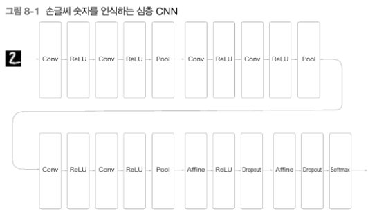

# 08_딥러닝

### 심층 신경망

- 여기서 사용되는 합성곱 계층은 모두 3x3 크기의 작은 필터로 층이 깊어지면서 채널 수가 더 늘어나는 것이 특징이다.
    - 합성곱 계층의 채널 수는 앞 계층에서부터 순서대로 16, 16, 32, 32, 64, 64 로 늘어간다.
- 그림과 같이 풀링 계층을 추가해 중간 데이터와 공간 크기를 점차 줄여간다.
- 마지막 단의 완전 연결 계층에서는 드롭아웃 계층을 사용한다.
- 신경망의 특징
    - 3x3 의 필터를 사용한 합성곱 계층
    - 활성화 함수는 ReLU
    - 완전연결 계층 뒤에 드롭아웃 계층 사용
    - Adam 을 사용해 최적화
    - 가중치 초기값은 ‘He’

### 정확도를 높이기 위해서

- 데이터 Augmentation 은 입력 이미지를 알고리즘을 동원해 인위적으로 확장한다.

- 입력 이미지를 회전하거나 세로로 이동하는 등 미세한 변화를 주어 이미지의 개수를 늘릴 수 있다.
    - 이는 이미지의 개수가 적을 때 효과적이다
- 이미지 crop
- 이미지 flip

### 층을 깊게 하는 이유

1. 매개변수(Parameter) 수의 효율
    
    가장 역설적이지만 중요한 점은, 층을 깊게 쌓을수록 적은 수의 매개변수로 더 넓은 영역을 볼 수 있다는 것이다.
    
    - **작은 필터의 중첩**: 큰 필터(예: $5 \times 5$) 하나를 쓰는 것보다 작은 필터(예: $3 \times 3$) 두 개를 층을 나누어 쓰는 것이 유리하다.
        - $5 \times 5$ 필터 1개: 매개변수 **25개**
        - $3 \times 3$ 필터 2개: 매개변수 9 + 9 = **18개**
        - 두 방식 모두 똑같은 영역($5 \times 5$ 크기의 수용 영역)을 커버할 수 있지만, 층을 나눈 쪽이 적은 파라미터를 사용하면서도 동일한 표현력을 가진다.
        
2. 비선형성(Non-linearity)을 통한 표현력 증폭

층을 깊게 하면 층과 층 사이에 **ReLU** 같은 활성화 함수가 더 많이 들어간다

`Conv1` → `ReLU1` → `Conv2` → `ReLU2`  : ReLU2( Conv2( ReLU1( Conv1(x) ) ) )

- 비선형 힘의 가중: 활성화 함수는 데이터에 '비선형성'을 부여한다.
    - 층이 깊어져 이 함수들이 여러 번 겹치면, 단순한 선형 결합으로는 절대 표현할 수 없는 복잡하고 구부러진 데이터의 경계를 찾아낼 수 있다.
- 복잡한 패턴 표현: 더 깊은 층은 더 복잡한 특징(추상적인 정보)을 학습할 수 있는 능력을 갖게 된다.

1. 학습의 효율성: 문제를 계층적으로 분해

복잡한 문제를 한 번에 풀려 하지 않고, 단순한 개별적 문제로 만들어서 해결한다.

- 계층적 분해: 전체 문제를 한꺼번에 학습하는 대신, 각 층이 담당할 문제를 단순화한다.
- 예시:
    - 하위 층: 아주 기초적인 '에지(테두리)' 추출에만 집중한다. 문제가 단순하므로 적은 데이터로도 빠르게 학습된다.
    - 상위 층: 하위 층이 찾아낸 에지 정보를 조합하여 고차원적인 패턴을 학습한다.
    

4. 정보의 계층적 전달 (Bottom-up 추상화)

층이 깊어지면 아래에서 위로 올라가면서 정보가 점점 추상화된다.

- 이전 층의 결과물 활용: 다음 층은 바닥부터 다시 시작하는 것이 아니라, 이전 층이 고생해서 추출해낸 '에지 정보'를 재료로 삼는다.
- 효율적 학습: 기초적인 정보가 이미 준비되어 있으므로, 더 복잡한 패턴을 학습할 때 훨씬 효율적으로 결과에 도달할 수 있다.

### 딥러닝 고속화

- 딥러닝 프레임워크 대부분은 GPU를 활용해 대량의 연산을 고속으로 처리할 수 있다.

### 분산 학습

- 딥러닝 계산을 더욱 고속화하고자 다수의 GPU와 기기로 계산을 분산하기도 한다.

### ResNet

- Skip Connection
    - 기존의 방식 : 입력 $x$가 반드시 모든 가중치 층(weight layer)을 통과하며 변형되어야 했다.
    - ResNet 방식 : 입력 $x$ 를 아무런 가공 없이 다음 층으로 전달하는 지름길을 만든다. 마지막에 층을 통과한 출력 $F(x)$와 원본 $x$를 그냥 더해버리는($F(x) + x$) 아주 단순한 아이디어이다.
    
- 왜 더하기($F(x) + x$)를 하나?
    - 층이 수십, 수백 개로 깊어지면 학습 신호(기울기)가 뒤로 갈수록 사라지는 기울기 소실(Vanishing Gradient) 문제가 발생
        - 정보 보존: $F(x) + x$ 구조는 설령 중간의 가중치 층들이 학습이 잘 안 되어 0에 가까운 값을 내뱉더라도, 최소한 원본 데이터인 $x$는 그대로 살아남아 다음 층으로 전달된다.
        - 잔차(Residual) 학습: 모델은 이제 처음부터 끝까지 다 배우는 게 아니라, 입력 $x$ 에서 부족한 부분인 ‘차이(잔차, $F(x)$)’ 만 보충하면 된다.

### RCNN

- RCNN 의 알고리즘
    - 입력 이미지
    - Region Proposals: 이미지에서 사물이 있을 법한 영역을 약 2,000개 정도 뽑아낸다.
        - 이때 Selective Search라는 알고리즘을 사용하여 그림처럼 노란색 박스들(후보 영역)을 제안한다.
    - CNN 특징 계산: 추출된 각 영역을 CNN에 넣기 위해 일정한 크기로 변형(Warping)한 후, 특징을 추출한다.
    - Classification : 추출된 특징을 바탕으로 해당 영역이 어떤 클래스인지 최종 판정한다.