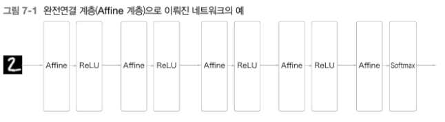

# 07_합성곱 신경망

### 전체구조

- CNN 구조
    
    
    
    - CNN 에서는 합성곱 계층과 풀링 계층이 추가된다.
    - CNN 계층은 Conv-ReLU 흐름으로 연결된다. → Affine-ReLU에서 Conv-ReLU 로 바뀌었다고 생각하면된다.
    - 출력과 가까운 층에서는 Affine-ReLU 구성을 사용할 수 있다.
    - 마지막 계층에서는 Affine-ReLU 조합을 그대로 사용한다.
    

### 합성곱 계층

- 완전연결 계층의 문제점
    - 완전연결 계층에서는 인접하는 계층의 뉴런이 모두 연결되고 출력의 수는 임의로 정할 수 있다.
    - 하지만 데이터의 형상이 무시된다는 문제점이 있다.
    
    예) 가로 세로 채널 으로 구성된 3차원을 입력할 때에는 1차원 데이터로 평탄화해줘야 한다.
    
    - 이미지의 형상에는 중요한 공간적 정보가 있다. 그러나 완전연결 계층은 이것을 무시해버리고 모든 입력 데이터를 동등한 뉴런(같은 차원의 뉴런)으로 취급하여 형상에 담긴 정보를 살릴 수 없다.
    - 합성곱 계층은 형상을 유지한다.
    - 이미지도 3차원 데이터로 입력받고 전달도 3차원 데이터로 전달한다.
    - CNN에서는 합성곱 계층의 입출력 데이터를 피처 맵이라고도 한다.
    - 입력 데이터를 입력 피처 맵, 출력 데이터를 출력 피처 맵이라고 하는 식이다.

### 합성곱 연산

- 합성곱 연산은 이미지 처리에서 말하는 필터 연산에 해당한다.
    
    
    
- 합성곱 연산은 입력 데이터에 필터(커널)을 적용한다.
- 합성곱 연산은 필터의 윈도우를 일정 간격으로 이동해가며 입력 데이터에 적용한다.
- 입력과 필터에서 대응하는 원소끼리 곱한 후 그 총합을 출력의 해당 장소에 저장한다.
- 완전연결 신경망에서는 가중치 매개변수와 편향이 존재하는 데 CNN에서는 필터의 매개변수가 그 동안의 가중치에 해당한다.

### 패딩

합성곱 연산을 수행하기 전에 입력 데이터 주변을 특정 값으로 채우기도 하는데, 이를 패딩이라고 한다.

→ 패딩은 주로 출력 크기를 조정할 목적으로 사용된다.

- (4,4) 입력 데이터에 (3,3) 필터를 적용하면 출력은 (2,2)가 되어 입력보다 2만큼 줄어든다. 이를 계속 진행하다보면 출력 크기가 줄어들어 더 이상은 합성곱 연산을 적용할 수 없을 때가 온다.
    - 이를 방지하기 위해 사용한다.

### 스트라이드

필터를 적용하는 위치의 간격을 스트라이드라고 한다. 스트라이드를 2로 하면 필터를 적용하는 윈도우가 두 칸씩 이동하게 된다.

- Stride = 2

- Stride = 1

### 3차원 데이터의 합성곱 연산

### 블록으로 생각하기

- 3차원 합성곱 연산은 데이터와 필터를 직육면체 블록이라 생각하면 된다. 블록은 3차원 직육면체이다.
- 채널 수C, 높이 H, 너비 W인 데이터의 형상은 (C,H,W)로 쓴다.

### 풀링 레이어

- Max Pooling
    
    
    
    - 채널별로 독립적으로 시행한다.
    - 입력 데이터 : N x C x H x W
    - 출력 데이터 : N x C x OH x OW
    - 학습해야 할 매개변수가 없다.
- Max Pooling 을 했을때 실제 이미지의 변화
    
    
    
    - pooling 이 클수록 해상도가 줄어든다. → BUT 제일 중요한 정보만 뽑아낸다

### im2col

im2col 은 입력 데이터를 필터링하기 좋게 전개하는 함수이다

- im2col 은 4차원 텐서를 2차원 텐서, 즉 행렬로 바꾸어 익숙한 선형대수를 사용하게 해주고, 한번의 행렬계산으로 처리해서 속도를 높여준다.

1. 데이터를 합성곱 순서대로 부분 tensor 를 뽑아내서 flatten 시킨 후 각 행에 넣어 col 이란 행렬을 만든다.
2. 각 필터를 flatten 시켜 각 열에 넣어 colw 이란 행렬을 만든다.
3. 두 행렬 col 과 colw 를 곱한다.
4. N x OH x OW x FN 로 reshape 한다.
5. transpose(0,3,1,2) 를 취한다.

