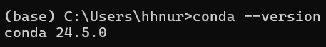

# Anaconda

## 가상환경

- 특정 프로그램을 개발 & 실행하기 위해 필요한 도구(외부 라이브러리 & 패키지)의 집합
    - 이를 의존성이라고 한다.
- 예를 들어 딥러닝 프로그램 개발을 위해, numpy, pytorch 등의 패키지에 의존 필요
- 목표하는 프로그램마다 서로  다른 가상 환경이 필요하다.

## Anaconda

- 쉬운 가상 환경 관리 기능 제공
    - 가상 환경을 쉽게 만들고 필요한 패키지 및 라이브러리 설치 가능



- Conda 설치 완료


## 개발 환경 만들기

- Conda 를 활용해 개발 환경 구축 가능
- 개발 환경 이름과 파이썬 버전을 선택
- 파이썬 버전은 새로운 것 일수록 좋지만, 다른 패키지와의 호환성도 고려해야한다.

```python
conda create -n <환경_이름> python=<원하는_버전>
conda activate <환경_이름>
conda deactivate
```


- test 환경 활성


- test  환경 비활성화


## 환경 관리

```python
conda env list
conda env remove -n [환경이름]
```


## 패키지 설치 및 관리

- conda 환경 상태에서 conda 혹은 pip 패키지 관리자로 원하는 패키지 설치, 삭제 및 확인

```python
conda install -c [channel명] [패키지명]
	• 기본 channel은 conda-forge이며, 변경 가능

conda remove [패키지명]
conda list

pip install [패키지명]
pip uninstall [패키지명]
pip list
```


- numpy 패키지 설치해보기


## 가상 환경 공유와 재현

- Github를 보면, 머신러닝 & 딥러닝 코드를 실행시키기 위해 conda 환경을 공유하고, 그것을 받아와 재현하는 상황이 많다.
    
    
    

```python
# 추출하고 싶은 환경을 활성화 한 상태로
conda env export environment.yml
# 원하는 환경의 이름을 변경한 뒤
conda env create -f enviornment.yml
```


- name 을 test1 으로 변경


- test1 으로 다시 환경 실행


## VSCode에서 Conda 활용하기

- python 환경과 conda 연결시키기


- 우측 하단부 변화 확인 가능


- terminal 에서도 확인 가능


