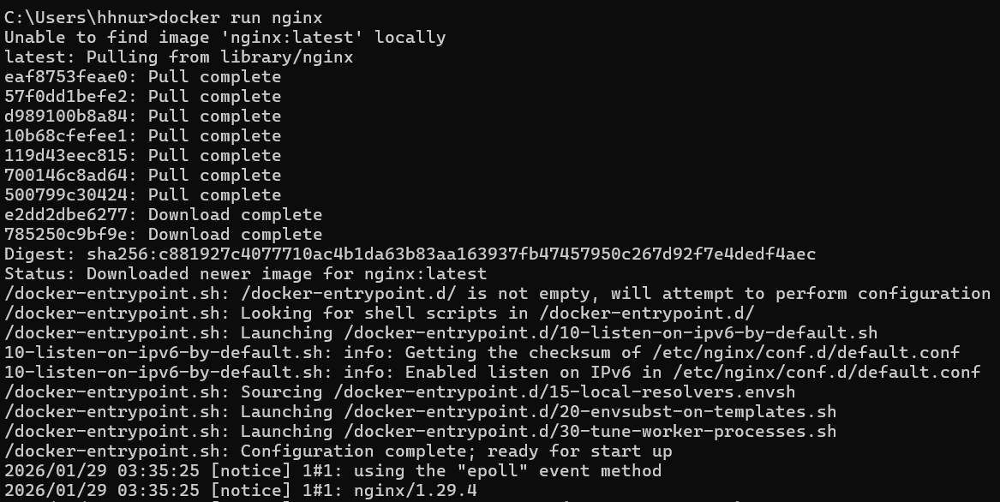

# 2.4 컨테이너 생성/ 실행 -2

- Docker run : create 와 start 를 한꺼번에 처리

- 포그라운드(foreground)
    - 내가 실행시킨 프로그램의 내용이 화면에서 실행되고 출력되는 상태
        - 다른 프로그램을 조작할 수 없다.
- 백그라운드(foreground)
    - 내가 실행시킨 프로그램이 컴퓨터 내부적으로 실행되는 상태

- 한꺼번에 지울 수 있는 명령어

- nginx 이미지를  기반으로 생성한 컨테이너의 이름을 붙이는 기능

- 컨테이너 내부 포트 80번 → 현재는 [localhost](http://localhost) 에서 연결되지 않음

- 4000번 포트 → 80번 포트

