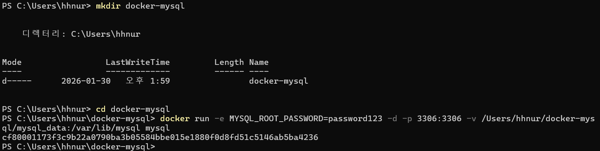

# 3.4 Docker로 MySQL 실행시키기

- `e MYSQL_ROOT_PASSWORD=password123`
    - 환경 변수(Environment Variable) 설정
- `d` (Detached)
    - 백그라운드 실행
- `p 3306:3306` (Port Forwarding)
    - 포트 연결
- `v /Users/hhnur/docker-mysql/mysql_data:/var/lib/mysql` (Volume)
    - `[내 컴퓨터 경로] : [컨테이너 내부 경로]`
    - 컨테이너 내부의 `/var/lib/mysql`(데이터가 저장되는 실제 폴더)을 사용자의 윈도우 폴더인 `/Users/hhnur/docker-mysql/mysql_data`와 동기화시킨다.
    - MySQL이 데이터를 저장하면 컨테이너 안이 아니라 하드디스크에 직접 기록

- Database 확인 및 mydb 생성

- Docker 제거 후 다시 생성

- mydb 그대로 남아 있는 것을 확인할 수 있음

- Docker 를 지웠다가 새로 만든 후, 비밀번호를 재설정 하였더니 mysql 로 들어가지지 않는다. 왜그럴까?

→Volume 으로 설정해둔 폴더에 이미 비밀번호 정보가 저장되어버렸기 때문이다.

- 비밀번호를 바꾸고 싶다면, mysql_data 를 아예 지워버리고 다시 mysql 을 띄워야한다.

