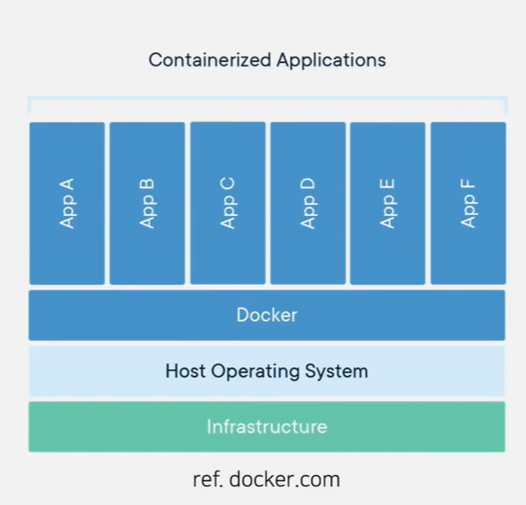

# Docker 기초~ 재생목록 12 (스프링 부트 Dockerfile 만들기 [ 도커 (Docker) 기초 ])

# 1강. 도커 기초

[https://www.youtube.com/watch?v=MsMHStVibEk&list=PLlTylS8uB2fDLJRJCXqUowsOViG-ZKnWy&index=13](https://www.youtube.com/watch?v=MsMHStVibEk&list=PLlTylS8uB2fDLJRJCXqUowsOViG-ZKnWy&index=13)

## 도커(Docker)란?

도커는 컨테이너 기반의 오픈소스 가상화 플랫폼이다.

도커는 어떤 프로그램을 외부 환경과 격리시켜 구동할 수 있게 해주는 소프트웨어이다.

## 컨테이너(Container)란?

- 컨테이너랑 OS 상에 논리적인 영역(컨테이너)을 구축하고, 애플리케이션이 작동하는데 필요한 요소들을 모아 별도의 서버처럼 동작하는 것
- 필요한 요소(커널의 일부분)만으로 구성되어 있어 오버헤드가 적음

# 2강. 컨테이너 구조 및 커맨드 사용법-이론

### 도커 컨테이너 구조

- 도커 컨테이너는 컨테이너 레이어와 이미지 레이어로 구성되어 있다.

- 컨테이너 레이어
    - 읽기/쓰기 모두 가능한 계층이다.
    - 최상단 레이어에 추가된다.
    - 컨테이너를 실행하고 진행되는 변경사항은 이 계층에 저장된다.
    - Copy-on-Write
        - 복사(Copy): Docker는 이미지 레이어에 있는 원본 `index.html` 파일을 Thin R/W Layer(투명 필름)로 복사해옵니다.
        - 수정(Write): 이제 사용자 1은 이미지 레이어의 원본이 아니라, 필름 위로 복사된 파일을 수정합니다.
        - 병합(View): 사용자가 컨테이너 안에서 파일을 조회하면, Docker는 이미지 레이어보다 위에 있는 필름(R/W Layer)의 파일을 우선적으로 보여줍니다.

- 이미지 레이어
    - 읽기 전용 계층으로 다른 컨테이너와 공유할 수 있는 레이어이다.

- 이미지 레이어는 여러 컨테이너가 공유하고, 컨테이너 레이어는 각 컨테이너가 독립적으로(따로) 가진다.

### 도커 명령어 구조

- 도커의 모든 명령은 ‘docker’ 로 시작하며 어떤 대상에게 명령어를 실행할 것인지로 구분하면 보기 쉽다.

### 도커 커맨드

- 도커에서 사용할 수 있는 커맨드 리스트
    - ‘docker’ 입력
    - ‘docker [command 대상] —help’ 입력
    - 위와 같은 방법으로 커맨드 수준을 높이고 뒤에 —help 입력

### Container 관련 커맨드

- ‘docker container’ 이후에 작성하는 주요 커맨드는 아래와 같음

### Image 관련 커맨드

- ‘docker image’ 이후에 작성하는 주요 커맨드는 아래와 같음

- 주로 사용하는 옵션에 대한 설명은 아래와 같음

# 3강. 도커 커맨드 사용법

# 4강. 도커 컨테이너 통신하기

### 도커 컨테이너와 통신하기

- 도커 컨테이너는 기본적으로 독립적인 환경에서 실행되기 때문에 컨테이너 밖에서 접근할 수 없음

- 이 설정을 사용하기 위해서는 호스트(서버 또는 PC) 에서 사용 중인 포트와 번호가 겹치지 않는지 확인이 필요함
- 컨테이너와 통신하기 위해서는 컨테이너를 가동시키면서 ‘p’ 옵션을 사용하여 호스트의 포트와 컨테이너의 포트를 설정해야한다.

- 각 옵션의 설명
    - `--name test1` : test1 이라는 이름으로 컨테이너를 생성한다.
    - `-d` : 백그라운드로 동작한다.
    - `-p 8080:80` : 호스트의 포트는 8080, 컨테이너의 포트는 80 으로 세팅하여 네트워크를 설정한다.
    
    
    
- 앞의 커맨드를 실행한 후에 docker 데스크탑으로 컨테이너 상태를 확인
- 또는 위의 커맨드를 입력하여 상태 확인

- 컨테이너 실습을 마치면 위의 커맨드를 통해 실행을 중지하고 삭제하는 작업을 수행하는 것이 좋다

# 6강. 도커파일(Dockerfile) 작성하기 - 이론편

### Dockerfile 이란?

- dockerfile 은 도커 이미지를 생성하기 위한 스크립트 파일
- 여러 키워드를 사용하여 dockerfile 을 작성하여 빌드를 보다 쉽게 수행할 수 있음

### Dockerfile Instruction

- dockerfile 에서 사용되는 주요 인스터럭션은 아래와 같다.
- From
    - From 키워드를 사용하여 base 가 되는 image 를 지정
    - 주로 OS 이미지나 런타임 이미지를 지정함
- Run
    - 이미지를 빌드할 때 사용하는 커맨드를 설정할 때 사용
- ADD
    - 이미지에 호스트의 파일이나 폴더를 추가하기 위해 사용
    - 만약 이미지에 복사하려는 디렉토리가 존재하지 않으면 docker 가 자동으로 생성
- COPY
    - 호스트 환경의 파일이나 폴더를 이미지 안으로 복사하기 위해 사용
    - ‘ADD’와 동일하게 동작하지만 확실한 차이점은 URL을 지정하거나, 압축파일을 자동으로 풀지 않음
- EXPOSE
    - 이미지가 통신에 사용할 포트를 지정할 때 사용
- ENV
    - 환경 변수를 지정할 때 사용
        - 여기서 설정한 변수는 $name, ${name} 의 형태로 사용할 수 있음
    - 추가로 아래와 같은 문법을 사용할 수 도 있음
        - ${name:-else} : name 이 정의가 안되어 있다면 ‘else’ 가 사용됨
- CMD
    - 도커 컨테이너가 실행될 때 실행할 커맨드를 지정
    - ‘RUN’ 과 비슷하지만 CMD는 도커 이미지를 빌드할 때 실행되는 것이 아니라 컨테이너를 시작할 때 실행된다는 것이 다름
- ENTRYPOINT
    - 도커 이미지가 실행될 때 사용되는 기본 커맨드를 지정(강제)
- WORKDIR
    - RUN, CMD, ENTRYPOINT 등을 사용한 커맨드를 실행하는 디렉토리를 지정
    - -w 옵션으로 오버라이딩 할 수 있음
- VOLUME
    - 퍼시스턴스 데이터를 저장할 경로를 지정할 때 사용
    - 호스트의 디렉토리를 도커 컨테이너에 연결
    - 주로 휘발성으로 사용되면 안되는 데이터를 저장할 때 사용

### Docker Build 커맨드

- dockerfile을 실행하기 위해서는 docker build 커맨드를 사용

- 생성된 이미지를 컨테이너로 실행하기 위해서는 run 커맨드를 사용

# 8강. 도커 컴포즈(Docker-compose) 파일 작성하기

### Docker compose 파일

- compose 파일은 도커 애플리케이션의 서비스, 네트워크, 볼륨 등의 설정을 yaml 형식으로 작성하는 파일
    - 서비스 (Services): 실행할 컨테이너들의 목록 (예: 웹 서버 서비스, DB 서비스 등)
    - 네트워크 (Networks): 컨테이너들끼리 서로 통신할 수 있는 전용 통로를 설정 (포트 설정 등이 포함)
    - 볼륨 (Volumes): 컨테이너가 삭제되어도 데이터가 사라지지 않게 하드디스크와 연결하는 설정을 모아둔다.

- 공식 사이트에서 소개하는 예제 파일은 아 이미지와 같다
- 큰 틀에서의 구성 요소는 아래와 같다
    - version
    - services
    - network
    - volume
    - config
    - secret

- 이 중에 version은 deprecated 되어 더 이상 설정하지 않아도 된다.

### Docker Compose 구성 요소

- ‘Services’ 는 여러 컨테이너를 정의하는데 사용된다.

- 예를 들어 위와 같이 파일을 작성했다면, ‘frontend’와 ‘backend’는 각 컨테이너를 정의하게 되며, 각 컨테이너의 이름이 된다.
- 컨테이너를 설정할 때 사용되는 키워드는 아래와 같다.

- image : 컨테이너의 이미지를

### Docker Compose 파일 실행

- 작성된 docker-compose.yml 파일을 실행하기 위해서는 아래와 같은 커맨드를 사용
    - docker-compose up
- 추가로 아래와 같은 주요 옵션들을 사용할 수 있다.
    - -f 옵션
        - docker-compose 는 기본적으로 ‘docker-compose.yml’ 또는 ‘docker-compose.yaml’의 이름을 사용
        - 만약 다른 이름으로 파일을 관리하고 사용한다면 아래와 같이 입력
            - docker-compose -f docker-compose-custom.yml up
    - -d 옵션
        - 백그라운드에서 docker-compose 를 실행하기 위해 사용
        
        → 터미널과 컨테이너의 실행을 분리하겠다.
        
        터미널 창을 계속 쓸 수 있느냐, 아니면 컨테이너의 로그만 바라보고 있어야 하느냐 의 차이
        
        - docker-compose up -d

# 9강. 도커 컴포즈 파일 작성하기 - 실습편

- docker compose -up

1. 설계도(YAML) 분석 및 이미지 준비

- 이미지 확인: 각 서비스(`aroundhub_db`, `aroundhub_redis`)에 적힌 이미지가 내 컴퓨터에 있는지 확인
- 다운로드/빌드: 이미지가 없다면 인터넷(Docker Hub)에서 다운로드하거나, `build` 설정이 있다면 직접 이미지를 만든다.

2. 네트워크 및 볼륨 생성

컨테이너를 띄우기 전, 이들이 활동할 기초 환경을 먼저 조성한다.

- 볼륨: `./master_db/data` 폴더를 컨테이너와 연결하여, 나중에 컨테이너가 사라져도 데이터가 보존될 수 있도록 한다.

3. 컨테이너 생성 및 실행 (컨테이너 레이어 적층)

- 레이어 얹기: 읽기 전용인 이미지 레이어 위에, 데이터를 쓰고 읽을 수 있는 얇은 컨테이너 레이어를 한 장 얹는다.
- 포트 바인딩: 내 컴퓨터의 3307번 문을 열어 MariaDB 컨테이너로 연결하고, 6380번 문을 열어 Redis로 연결한다.
- 환경 변수 주입: 설정된 비밀번호나 DB 이름 같은 정보들을 컨테이너 내부 메모리(환경 변수)에 심는다.

# 10강. 도커 이미지 생성 및 저장

### 도커 이미지 생성하기

- 똑같은 이미지에서 설정을 추가하여 컨테이너를 가동해도 되지만, 매번 같은 설정을 사용하고 있다면 그 설정을 가지고 있는 이미지를 생성하여 사용할 수 있음
- 주로 이미지를 생성하는 경우
    - 특정 이미지에 자주 사용하는 설정을 추가하여 편하게 사용하고 싶을 경우
    - 본인이 개발 한 어플리케이션을 이미지로 생성하고 싶을 경우

### 컨테이너로 이미지 생성하기

- 기존 이미지 + 추가 설정 레이어
    - 기존 이미지: 도커 허브에서 받아온 순수한 상태의 설계도
    - 추가 설정 내역이 포함된 레이어: 컨테이너를 실행한 뒤, 그 안에서 파이썬 라이브러리를 깔거나 파일을 수정하는 등 '직접 손으로 작업한 내용'이 담긴 컨테이너 레이어(R/W)를 의미

- 컨테이너 박스 (작업 중인 상태)
    - 아래쪽의 이미지 레이어와 위쪽의 추가 설정 레이어가 합쳐져서 실제로 돌아가고 있는 컨테이너 자체

- 변경 내용이 반영된 이미지 (새로운 탄생)
    - 박제 과정: 도커의 `commit`이라는 기능을 사용하면, 작업 중이던 컨테이너를 통째로 얼려서 새로운 이미지로 만들 수 있다.
    - 결과: 이제 왼쪽의 '추가 설정'은 더 이상 날아가는 컨테이너 레이어가 아니라, 오른쪽 그림처럼 이미지의 한 층(읽기 전용 레이어)으로 완전히 고정.

- 이 작업을 수행하기 위해서는 컨테이너가 있는 상황에서 아래의 커맨드를 입력
    - container_name : 이미지로 만들고자 하는 컨테이너의 이름
    - image_name : 생성할 이미지의 이름
    - docker commit {container_name}{image_name}

### Dockerfile 로 이미지 생성하기

- 다른 방법으로는 Dockerfile 을 사용할 수 있다
    - Dockerfile 에 추가하고자 하는 설정을 반영하고 그 파일로 이미지를 빌드
    - docker build ${option}${dockerfile directory}

### 도커 이미지 파일로 저장

- 이렇게 생성된 이미지는 파일로 저장할 수 있음
- 많이 사용하지 않지만, 대체로 운영서버에서 이미지를 사용해야할 때 종종 사용되기도 함
- 방법은 크게 2가지가 존재
    - save/load 커맨드
    - export/import 커맨드