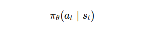

# ACT

[arxiv.org](https://arxiv.org/pdf/2304.13705)

## IV. ACTION CHUNKING WITH TRANSFORMERS

### ACT 의 전체 입력과 출력

- 논문에서 말하는 한 timestep 의 observation
    - follwer robot 의 현재 joint positions
    - 4개 카메라 RGB 이미지
- Action
    - 양쪽 로봇의 다음 목표 joint positions

→ 두 팔 합쳐서 14 차원 action

ACT 는 다음과 같은 함수를 배운다. 

: observation→future action sequence

### Action Chunking

- 기존의 singe-step policy



→ 즉, 현재 상태에서 다음 행동 하나만 예측한다.

- ACT
    
    
    

→ 앞으로 k개 timestep 의 action sequence 전체를 예측한다.

### 왜 chunking 이 도움이 되는가

- Effective horizon 감소
    - 원래 task가 500 step이라면, 매 step마다 의사결정을 해야한다. 그런데 한 번에 100 step씩 예측하면, 정책이 실질적으로 해결해야 할 sequential decision 길이가 크게 줄어든다.
    
    → imitation learning 의 가장 큰 문제인 compounding error 때문에 중요
    
- Non-Markovian behavior 완화
    - 마르코프 정책
        - $\pi(a|s)$
            - **$s$ (현재 상태):** 지금 카메라에 보이는 이미지와 로봇 팔의 각도
            - **$a$ (행동):** 바로 다음 순간에 취해야 할 움직임
    - Temporally correlated confounders
        - 중간 pause
        - 같은 state처럼 보여도 time context에 따라 다른 행동
- Temporal Ensembling의 제안
    - 만약 정책이 매 k step마다 한 번씩만 관찰하고, 그 다음 k개 action을 한꺼번에 실행한다면?
    - 새로운 observation이 **k step마다 한 번만 반영**되므로 행동이 뚝뚝 끊기고 jerk가 생길 수 있다. 논문도 naive chunking은 이런 문제를 일으킬 수 있다고 언급한다.
- Temporal Ensembling 의 아이디어
    - policy 를 매 timestep 마다 query 한다.
        - 시점 t에서 예측한 chunk, t+1에서 예측한 chunk, t+2에서 예측한 chunk가 서로 겹치게 된다.
        
        예)
        
        - 기본 상황 : ACT 한번에 k 개의 action 을 예측한다.
            - k =4 라고 하자
            - 현재 상태 s_t → [a_t , a_{t+1}, a_{t+2}, a_{t+3}]
        - t = 0 에서 예측
            - [a0, a1, a2, a3]
        - t = 1 에서 예측
            - [a1', a2', a3', a4']
        - t = 2 에서 예측
            - [a2'', a3'', a4'', a5'']
        - t=3에서 예측
            - [a3''', a4''', a5''', a6''']
        
        이때 timestep 3 에 대한 action 후보가 여러 개 생긴다.
        
        t=0 chunk → a3
        t=1 chunk → a3'
        t=2 chunk → a3''
        t=3 chunk → a3'''
        
        → 같은 timestep 에 대한 action 이 4개 : **Overlapping Predictions**
        
    
    - 그렇다면 어떤 action 을 실행해야할까? : **Temporal Ensembling**
        - 이것들을 그냥 버리지 않고 weighted average로 합친다. 논문은 exponential weighting을 사용한다고 말한다.
            - $w_i = \exp(-mi)$
                - i 번째 action prediction에 부여하는 weight
                - i : 얼마나 오래된 prediction인지
                - m : 하이퍼파라미터
            - 최종 action
                
                
                

### Human demonstration의 variability

ACT가 해결하려는 또 다른 문제는 **human demonstration가 noisy하고 multi-modal하다**는 점이다.

- 논문은 같은 observation이 주어져도 사람은 여러 방식으로 task를 해결할 수 있다고 말한다.
- precision이 덜 중요한 구간에서는 사람이 더 stochastic하게 행동할 수 있다고 설명한다.

예를 들어 테이프를 넘겨주는 handover 위치는 매 episode마다 조금 다를 수 있다.

중요한 건 “정확히 같은 좌표에서 넘겨준다”가 아니라

```
충돌하지 않고
상대 gripper가 잡을 수 있는 위치에 준다
```

는 구조이이다.

→ policy는 demonstration의 세부 노이즈를 그대로 외우는 것이 아니라, **중요한 구조적 패턴**을 배워야한다.

### ACT


- **Sample Data**


- **CVAE encoder** : action sequence 와 일부 observation 을 보고 latent style variable z 를 추론


- 입력
    - current joints(14차원)
    - target action sequence (k × 14)
        - 현재 시점 t 부터 미래의 k 단계까지의 행동 묶음
        - action dimension = 14
            - 7 joints × 2 arms = 14
    - [CLS] feature
- 출력
    - [CLS] 위치의 feature
    - 그걸로 z_mean, z_std 예측
    - reparameterization으로 z 샘플링
    
- **ACT policy decoder** : 현재 observation과 z를 이용해 action sequence 를 생성


- 입력
    - RGB images ( 4개 카메라)
        - 480 × 640 × 3
    - current joints(14차원)
        - 7 + 7 = 14 DoF
    - z
        - CVAE encoder 가 추론한 style variable
- 처리
    1. 각 이미지를 ResNet18로 feature 추출 →15 × 20 × 512
    2. spatial flatten  
        - 15 × 20 × 512 → 300 × 512
            - 15×20 = 300개의 spatial 위치를
            - 300개의 token처럼 생각하고
            - 각 token의 차원은 512
    3. positional embedding 추가
        - visual token = CNN fature + 2D 위치정보
    4. 4개 카메라 feature를 concat
        - 300 × 512
        - 카메라가 4개니까 전체 = 4 × 300 = 1200 tokens
        - 4개의 카메라를 모두 합치면 = 1200 × 512
        
        → 카메라별로 따로 transformer 를 돌리는 것이 아니라 4개의 카메라 token 을 한 시퀀스로 이어붙여 같이 처리한다.
        
    5. joints와 z도 projection해서 추가
        - joint positions (14)
        → linear projection
        → joint token (512)
        - z
        → linear projection
        → style token (512)
    6. transformer encoder가 전체 정보 통합
        - [visual tokens from 4 cameras]  = 1200 × 512
        - [joint token] = 1 × 512
        - [z token] = 1 × 512
        
        → 전체 입력 **1202 × 512**
        
    7. transformer decoder가 action sequence 생성
        1. decoder input sequence = k개의 query token
            - chunk size가 k라고 하면 decoder 입력은
            
            $Q^{(0)} \in \mathbb{R}^{k \times 512}$
            
            예를 들어 k=100이면, 100×512 크기의 query sequence가 들어간다.
            
            이 100개 token 각각은 의미상
            
            - query 1: “첫 번째 미래 timestep action은 뭐지?”
            - query 2: “두 번째 미래 timestep action은 뭐지?”
            - ...
            - query 100: “백 번째 미래 timestep action은 뭐지?”
            
            를 나타낸다.
            
        2. cross-attention에서 실제로 하는 일
            
            
            
            - **Query(Q)**: decoder의 k개 positional query token
                
                query_i
                
                → encoder memory를 읽음
                
                → i번째 미래 행동 생성
                
            - **Key(K)**: encoder output 1202 × 512
            - **Value(V)**: encoder output 1202 × 512
                
                
                
                - 1단계 : $QK^T$
                    - (k × 512) × (512 × 1202) = k × 1202
                    
                    → 각 query 가 1202개의 encoder token 과 얼마나 관련이 있는가?
                    
                - 2단계 : Softmax
                    - 각 query마다 1202개 token 가중치
                - 3단계 : softmax(...)V
                    - (k × 1202) × (1202 × 512) = k × 512
                    
                    → 각 query가 encoder memory를 weighted sum으로 읽어옴
                    
        3. Action head
            - k × 512 → MLP→ k × 14
- 출력
    - K x 14 action sequence


- **Temporal Alignment** : 시연 데이터는 시간 순서대로 [이미지, 관절값, 행동]이 저장되어 있다.
    - **슬라이딩 윈도우(Sliding Window)**:
        
        1. 시점 t 의 **이미지 4장**과 **현재 관절값**을 꺼낸다.
        
        2. 동시에, 데이터셋의 '행동' 열에서 시점 t부터 t+k-1까지의 **k개 데이터를 슬라이딩 윈도우처럼 잘라내어(Slice)** 하나의 시퀀스로 가져온다
        
    
    **추출의 의미**: “모델이 계산해서 뽑는 것"이 아니라, 데이터셋에서 학습을 위해 정답지(Action Sequence)와 문제지(Observations)를 세트로 꺼내오는 과정을 의미
    
- **Given: Demo dataset D, chunk size k, weight β.**
    - **D**: demonstration dataset 사람이 teleoperation으로 만든 trajectory들의 모음
    - **k**: chunk size 한 번에 예측할 미래 action 개수
    - **β**: KL regularization 가중치 latent variable z에 얼마나 강하게 제약을 걸지 정하는 하이퍼파라미터
- **Let $a_t$,  $o_t$ represent action and observation at timestep $t$ , $\bar{o}_t$  represent $o_t$ without image observations.**
    - **$a_t$**: t시점 action
    - **$o_t$**: t시점 observation
    - **$\bar{o}_t$**: 이미지 제외 observation
    
    ACT에서 observation $o_t$는
    
    - 4개 RGB 이미지
    - current joint positions
    
    그런데 $\bar{o}_t$ 는 image를 뺀 것이므로, 실제로는 거의
    
    - current joint positions 같은 proprioceptive observation 이다.
- **Initialize encoder $q_\phi(z \mid a_{t:t+k}, \bar{o}_t)$**
    - 현재 joint 상태와 실제 demonstration의 미래 action chunk를 보고,“이 action chunk가 어떤 style/variation에 해당하는지”를 latent variable z 로 압축
    - Input
        - 현재 proprioception $\bar{o}_t$
        - 정답 future action sequence $a_{t:t+k}$
    - 출력
        - z의 분포 파라미터
    
    encoder가 **z distribution의 mean과 variance를 예측하고**, 그 분포를 **diagonal Gaussian**으로 parameterize한다.
    
- **Initialize decoder** $\pi_\theta(\hat{a}_{t:t+k} \mid o_t, z)$
    - 실제 policy
    - 입력
        - 현재 observation $o_t$
            
            = 4개 RGB 이미지 + current joints
            
        - latent variable z
    - 출력
        - 예측한 미래 action chunk $\hat{a}_{t:t+k}$
        - training 때는 z를 encoder가 주지만, **test time에는 z=0으로 두고 deterministic decode**한다
- **$L_{reconst}=MSE(\hat{a}_{t:t+k}, {a}_{t:t+k})$**
    - 논문에서는 L1 loss 를 사용했다고 나와있다.
- **$L_{reg}=D_{KL}(q_ϕ(z∣a_{t:t+k},oˉt) ∥ N(0,I))$**
    - encoder가 만든 posterior $q_\phi(z \mid \cdot)$ 가 표준정규분포 $\mathcal{N}(0,I)$ 와 너무 멀어지지 않게 하라
- **Update $\theta, \phi$ with ADAM and**  $L = L_{\text{reconst}} + \beta L_{\text{reg}}$
    - 전체 loss는
    
    $L= L_{\text{reconst}} + \beta L_{\text{reg}}$
    
    - encoder parameter $\phi$
    - decoder/policy parameter $\theta$
    
    → Adam 으로 업데이트
    
    즉 training 동안 encoder와 decoder는 협력한다.
    
    - encoder는 좋은 z posterior를 만들고
    - decoder는 그 z와 observation으로 action chunk를 잘 복원하도록 배운다.
    
    하지만 test time에서는 encoder는 버린다.
    
    즉 encoder는 **policy를 잘 학습시키기 위한 training helper** 역할이다. 논문도 encoder는 decoder를 학습시키기 위한 용도이며 test time에 discard된다고 명시한다.
    


- **Given: trained $\pi_\theta$, episode length $T$, weight $m$**
    - **trained $\pi_\theta$**
        
        이미 학습이 끝난 ACT policy
        
    - **$T$**
        
        한 에피소드의 전체 길이
        
    - **$m$**
        
        temporal ensemble에서 exponential weight를 정하는 하이퍼파라미터
        
- **Initialize FIFO buffers $B[0:T]$, where $B[t]$ stores actions predicted for timestep t**
    - 각 timestep마다 버퍼 하나를 둔다.
    - B[1]: “1번 시점용으로 예측된 action들”
    - B[2]: “2번 시점용으로 예측된 action들”
    - ...
    - B[T]: “T번 시점용으로 예측된 action들”
    
    즉 buffer B[t]는 **실행 시점 t에 쓸 후보 action들을 저장하는 통이다.**
    
     **→ 같은 timestep에 대한 예측들이 시간 순서대로 쌓인다**
    
    예를 들어 B[10]에는 나중에 이런 값들이 순서대로 들어간다.
    
    - 과거 시점 7에서 예측된 “10시점 action”
    - 과거 시점 8에서 예측된 “10시점 action”
    - 과거 시점 9에서 예측된 “10시점 action”
    - 현재 시점 10에서 예측된 “10시점 action”
    
    즉 B[10]은 “시점 10에 대해 여러 번 예측된 결과들”의 리스트
    
- **for timestep $t=1,2,...T$ do**
    - 매 제어 주기마다 반복합니다.
    
    → 실제 로봇이 움직이는 동안 매 순간 다음 과정을 반복합니다.
    
    1. 현재 observation 받음
    2. policy로 미래 k개 action 예측
    3. 그 예측들을 관련 timestep buffer에 넣음
    4. 현재 timestep용 action 후보들만 모아서 평균
    5. 그 평균 action을 실제로 실행
- **Predict $\hat a_{t:t+k}$  with $\pi_\theta(\hat a_{t:t+k}\mid o_t, z)$ where z=0**
    - 훈련 때는 encoder가 z를 추론했지만, test time에는 encoder를 버리고 **z=0** 을 넣는다.
    - 즉 현재 시점 t에서 policy는 현재
        - observation $o_t$
        - latent $z=0$
    
    을 받아서
    
    $\hat a_t, \hat a_{t+1}, ..., \hat a_{t+k}$
    
    를 한 번에 예측
    
    →여기서 각 action은 14차원 absolute joint target입니다. 논문은 ACT policy output이 **$k \times 14$** tensor라고 설명
    
- **Add $\hat a_{t:t+k}$  to buffers $B[t : t+k]$  repectively**
    - 버퍼를 채우는 부분
    - 예를 들어 현재가 t=5 이고, chunk size가 k=4 라고 하자
    
    그러면 policy가 $[\hat a_5,\hat a_6,\hat a_7,\hat a_8]$ 이다.
    
    이제 이걸 각 buffer에 하나씩 넣는다.
    
    - $\hat a_5 \rightarrow B[5]$
    - $\hat a_6 \rightarrow B[6]$
    - $\hat a_7 \rightarrow B[7]$
    - $\hat a_8 \rightarrow B[8]$
    
    이 과정을 매 timestep마다 반복하면 buffer들은 점점 채워진다.
    
    예를 들어 시점 7쯤 되면 B[7] 안에는 여러 출처의 예측이 들어 있게 된다.
    
    - 시점 4에서 예측한 $\hat a_7$
    - 시점 5에서 예측한 $\hat a_7$
    - 시점 6에서 예측한 $\hat a_7$
    - 시점 7에서 예측한 $\hat a_7$
    
    이게 바로 논문이 말하는 **overlapping chunks**
    
- **Obtain current step actions** $A_t = B[t]$
    - 이제 현재 시점 t에서 실제 실행해야 할 action을 정해야 한다.
    - 그런데 ACT는 후보가 하나가 아니다.
    - 왜냐하면 같은 timestep t에 대해 과거 여러 시점에서 이미 예측해 둔 값들이 있기 때문
    
    →그래서 $A_t = B[t]$는 “현재 timestep t에 대해 지금까지 쌓인 모든 후보 action들의 집합” 이다.
    
    - 예를 들어 현재가 t=10이면
    
    $A_{10}=B[10] = [a_{10}^{(oldest)}, a_{10}^{(2nd)}, ..., a_{10}^{(latest)}]$ 이다.
    
    즉 현재 10번 시점에 대한 후보가 여러 개 있는 상태이다.
    
- **Apply** $a_t = \frac{\sum_i w_i A_t[i]}{\sum_i w_i}, \quad w_i = \exp(-m i)$
    - 이제 최종 action을 정한다.
    
    즉 후보 여러 개를 그냥 아무거나 고르는 게 아니라, **가중 평균한다**
    
    - 수식 의미
        - $A_t[i]: B[t]$ 안의 i번째 후보 action
        - $w_i$: 그 후보에 줄 가중치
        - 최종적으로는 가중 평균한 결과를 실제 action $a_t$ 로 실행
- **예시**
    - chunk size k=4 라고 가정
    
    **시점 1**
    
    policy가 예측:
    
    $[\hat a_1^{(1)}, \hat a_2^{(1)}, \hat a_3^{(1)}, \hat a_4^{(1)}]$
    
    buffer 상태:
    
    - $B[1] = [\hat a_1^{(1)}]$
    - $B[2] = [\hat a_2^{(1)}]$
    - $B[3] = [\hat a_3^{(1)}]$
    - $B[4] = [\hat a_4^{(1)}]$
    
    이때 시점 1에서는 후보가 하나뿐이라 그걸 실행한다.
    
    **시점 2**
    
    새 observation $o_2$로 다시 policy 호출:
    
    $[\hat a_2^{(2)}, \hat a_3^{(2)}, \hat a_4^{(2)}, \hat a_5^{(2)}]$
    
    buffer 상태:
    
    - $B[2]=[\hat a_2^{(1)}, \hat a_2^{(2)}]$
    - $B[3] = [\hat a_3^{(1)}, \hat a_3^{(2)}]$
    - $B[4] = [\hat a_4^{(1)}, \hat a_4^{(2)}]$
    - $B[5]=[\hat a_5^{(2)}]$
    
    이제 시점 2에서 실행할 action은 B[2] 안의 두 후보를 가중 평균한 값이다.
    
    **시점 3**
    
    다시 예측:
    
    $[\hat a_3^{(3)}, \hat a_4^{(3)}, \hat a_5^{(3)}, \hat a_6^{(3)}]$
    
    그러면
    
    - $B[3]=[\hat a_3^{(1)}, \hat a_3^{(2)}, \hat a_3^{(3)}]$
    
    시점 3에서는 이 세 개를 가중 평균해서 실행한다.