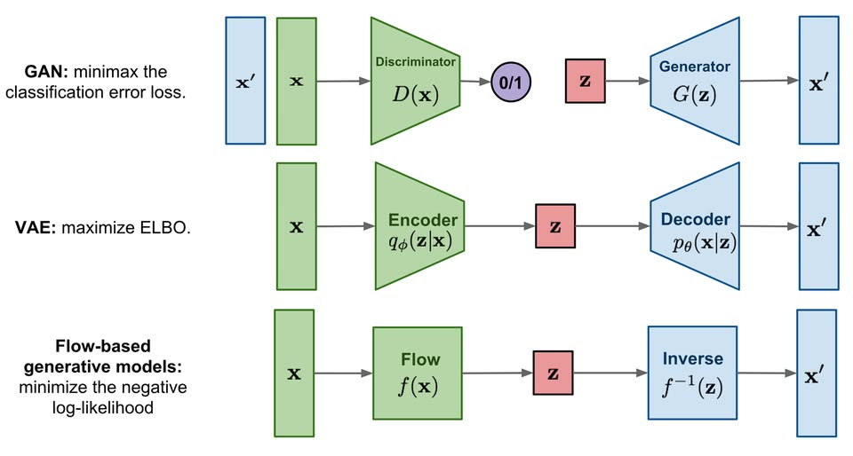

# Diffusion

URL: https://arxiv.org/pdf/2006.11239
날짜: 2026년 3월 25일
상태: 진행 중
키워드: Foundamental

[arxiv.org](https://arxiv.org/pdf/2006.11239)

# Background

## 1. Diffusion Model 은 Latent Variable Model 이다.

- Latent Variable Model

→ diffusion 은 latent variable model

- $x_0$ : 우리가 실제로 보고 싶은 데이터, 예를 들면 이미지
- $x_1, \dots, x_T$: 중간 latent states
- $x_{0:T} : x_0, x_1, \dots, x_T$ : 전체 체인

## 2. Reverse Process

1. 시작점: $p(\mathbf{x}_T)$ (표준 가우시안에서 뽑은 노이즈) 
    - $p(\mathbf{x}_T)=\mathcal{N}(\mathbf{x}_T; 0, \mathbf{I})$ : pixel 값들을 무작위로 정규분포에서 뽑았다.
        - GAN: latent z 하나에서 바로 생성
        - VAE: latent z에서 decoder로 복원
        - DDPM: 가우시안 노이즈 $x_T$ 에서 시작해서 여러 단계를 거쳐 복원
2. 첫 번째 복원 단계 ($t=T$) : $p_{\theta}(\mathbf{x}_{T-1}|\mathbf{x}_T)$
3. 두 번째 복원 단계 ($t=T-1$) : $p_{\theta}(\mathbf{x}_{T-2}|\mathbf{x}_{T-1})$
4. ………
5. 마지막 복원 단계 (**$t=1$) :** $p_{\theta}(\mathbf{x}_0|\mathbf{x}_1)$

$p_{\theta}(\mathbf{x}_{0:T}) = p(\mathbf{x}_T) \times p_{\theta}(\mathbf{x}_{T-1}|\mathbf{x}_T) \times p_{\theta}(\mathbf{x}_{T-2}|\mathbf{x}_{T-1}) \times \dots \times p_{\theta}(\mathbf{x}_1|\mathbf{x}_2) \times p_{\theta}(\mathbf{x}_0|\mathbf{x}_1)$

→ noise 에서 시작해서 image 로 내려오는 체인

- 마르코프 성질 : 전개된 수식을 보면 알 수 있듯이, 바로 다음 단계의 데이터($x_{t-1}$)를 예측하기 위해 오직 현재 단계의 데이터($x_t$)만 사용. 그 이전의 정보들($x_{t+1}, \dots, x_T$)은 고려하지 않아도 된다

### Reverse Step 은 어떻게 생기나?

- $p_θ(x_{t−1}∣x_t)=N(x_{t−1};μ_θ(x_t,t),Σ_θ(x_t,t))$
    - $p_{\theta}(\mathbf{x}_{t-1}|\mathbf{x}_t)$ : $x_t$ 가 주어졌을때 $x_{t-1}$ 가 나올 확률 분포
    - 여기서 $x_t, x_{t-1}$ 는 픽셀 하나가 아니라 이미지 전체다
        - $x_t$ : 시점 t의 전체 이미지 텐서
        - $x_{t-1}$ : 그보다 한 단계 덜 noisy한 전체 이미지 텐서

→ **각 픽셀 하나하나의 존재 확률**이 아니라 **이미지 전체 벡터가 어떤 값을 가질지를 나타내는 분포**

- $N(x_{t−1};μ_θ(x_t,t),Σ_θ(x_t,t))$ :
    
    $x_{t−1}$ 는 평균이 $\mu_\theta(x_t,t)$ , 공분산이 $\Sigma_\theta(x_t,t) = σ_t^2​I$ 인 Gaussian 분포를 따른다.
    
    - $x_{t−1}∼N(μ_θ(x_t,t),σ^2_I)$
        - $x_{t−1}=μ_θ(x_t,t)+ϵ$ , $\epsilon \sim \mathcal{N}(0, \sigma^2 I)$
            - $ϵ=[ϵ_1,ϵ_2,...,ϵ_n]$
            - $ϵ_i∼N(0,σ^2),independent$
    
    → 여기서 공분산 행렬의 Cov($x_i,x_j$) = 0 (i ≠ j) 라고 해서 픽셀들이 **실제로 연관이 없다**는 것이 아니라 연관성을 **모델링 하지 않는다** 가 맞는 표현이다.
    
    
    
    
    
    
    
    (1) $x_{t-1}$
    
    - 우리가 복원하려는 대상 →즉 “이전 단계 이미지”
    
    (2) $\mu_\theta(x_t,t)∈R^{H×W×C}$
    
    - 이전 단계 이미지의 **중심값 예측**
    - 즉 현재 noisy image $x_t$ 와 시간 $t$를 보고 “한 단계 전 이미지는 대략 이런 모습일 것”이라고 예측한 평균이다.
    
    (3) $\Sigma_\theta(x_t,t)$
    
    - 그 예측의 **불확실성 크기 →** 즉 평균 근처에서 얼마나 퍼져 있는지를 나타낸다.
    - 논문에서는 실험적으로 $\Sigma_\theta$ 를 학습하지 않고, 시간에만 의존하는 상수 $\sigma_t^2 I$ 로 두는 선택을 사용했다. 즉 reverse variance를 고정하고, 평균 쪽 modeling에 집중한 것이다.
    - $I=identity\,matrix$

→현재 $x_t$ 가 주어졌을 때, 그 직전 상태] $x_{t-1}$ 는 $\mu_\theta(x_t,t)$  근처에 있을 가능성이 가장 높고, 그 주변으로 Gaussian 형태의 불확실성을 가진다.

## 3. Forward Process

diffusion model의 가장 큰 특징은 **approximate posterior가 고정되어 있다**는 점이다.

논문은 이것을 **forward process** 또는 **diffusion process**라고 부른다.

$q(x_{1:T}\mid x_0):=\prod_{t=1}^{T} q(x_t\mid x_{t-1})$

그리고 각 단계는

$q(x_t\mid x_{t-1})=\mathcal{N}(x_t;\sqrt{1-\beta_t}\,x_{t-1}, \beta_t I)$ 로 둔다.

$x_{t}$ 는 평균이 $\sqrt{1-\beta_t}\,x_{t-1}$, 공분산이 $\beta_t I$ 인 Gaussian 분포를 따른다.

**현재 상태 $x_{t-1}$에서 다음 상태 $x_t$를 만들 때**

- 원래 신호를 $\sqrt{1-\beta_t}$ 만큼 줄이고
- $\beta_t I$ 크기의 가우시안 노이즈를 더한다

즉 한 step마다

- 신호는 조금 약해지고
- 노이즈는 조금 증가한다.

이 과정을 반복하면 결국 원본 정보가 거의 사라지고,

마지막에는 거의 순수 가우시안 노이즈가 된다.

**왜 $\beta_t$ 가 중요하나**

$β_t$는 각 단계에서 얼마나 noise를 추가할지를 정하는 **variance schedule**

- $\beta_t$ 가 너무 크면: 너무 빨리 원본 정보가 사라짐
- $\beta_t$ 가 너무 작으면: reverse chain이 너무 길어짐

그래서 diffusion model에서는 $\beta_t$ 스케줄이 매우 중요

**이 구조는 왜 특별한가?**

보통 latent variable model에서는 posterior approximation도 같이 학습하는 경우가 많다.

예를 들면 VAE에서는 encoder $q_\phi(z\mid x)$ 를 학습한다.

그런데 DDPM에서는 forward process $q$ 를 **직접 설계해서 고정한다.**

즉:

- **forward $q$** : 우리가 정함, 학습 안 함
- **reverse $p_\theta$**: 데이터로부터 학습

→ 노이즈를 넣는 과정은 학습할 필요가 없으니, 그 반대 방향인 denoising만 배우면 된다.

**Markov chain**

forward와 reverse 모두 **Markov chain**으로 다룬다.

Markov라는 건 현재 상태가 다음 상태를 결정할 때, 과거 전체를 볼 필요 없이 **직전 상태만 보면 된다**

## 4. Loss Function

### 왼쪽항: 원래 줄이고 싶은것 - (3)

$E[−logp_θ(x_0)]$

이건 데이터 $x_0$에 대한 **negative log-likelihood 이다.**

- 모델이 진짜 데이터 x0를 얼마나 잘 설명하는가
- 이 값이 작을수록 모델이 데이터 분포를 더 잘 맞춘다

그런데 문제는$p_\theta(x_0)$가

$p_{\theta}(\mathbf{x}_{0:T}) = p(\mathbf{x}_T) \times p_{\theta}(\mathbf{x}_{T-1}|\mathbf{x}_T) \times p_{\theta}(\mathbf{x}_{T-2}|\mathbf{x}_{T-1}) \times \dots \times p_{\theta}(\mathbf{x}_1|\mathbf{x}_2) \times p_{\theta}(\mathbf{x}_0|\mathbf{x}_1)$

$p_\theta(x_0)=\int p_\theta(x_{0:T})\,dx_{1:T}$

처럼 중간 latent $x_1,\dots,x_T$를 모두 적분해야 해서 직접 계산이 어렵다는 점이다. 그래서 바로 왼쪽 항을 최적화하지 못한다.

### 오른쪽 항: 계산 가능한 우회 목적식 - (3)

$E_q[−log\frac{p_θ(x_{0:T})}{q(x_{1:T}∣x_0)}]$

- $p_\theta(x_{0:T})$: 우리가 학습하는 **reverse generative model의 joint**
- $q(x_{1:T}\mid x_0)$: 원본 $x_0$ 에서 시작해 노이즈를 넣는 **forward process**
- $\mathbb{E}_q$: forward process로 만들어진 latent chain에 대해 평균낸다는 뜻

### Forward Process 를 한번에 작성 - (4)

- 평균 $\sqrt{\bar\alpha_t}x_0$ 의 의미
    - signal shrink를 다 곱한 값
    
    → 즉 원본 이미지 $x_0$의 정보가 시간이 갈수록 점점 줄어들어
    
    - 초반에는 $\sqrt{\bar\alpha_t}$ 가 1에 가까워서 원본이 많이 남고
    - 후반에는 0에 가까워져서 원본 정보가 거의 사라진다.
    
    그래서 평균이 $\sqrt{\bar\alpha_t}x_0$ 라는 것은 $x_t$ 안에 남아 있는 원본 신호의 기대값이라고 볼 수 있다.
    
- 분산 $(1-\bar\alpha_t)I$ 의 의미
    - 이 항은 $t$ 번 동안 누적된 전체 노이즈 크기
    - $t$ 가 작으면 $1−\bar\alpha_t$ 가 작아서 노이즈가 작고
    - $t$ 가 크면 $1−\bar\alpha_t$ 가 커져서 노이즈가 많이진다.
    
- 원래의 forward step
    
    $q(x_{1:T}\mid x_0):=\prod_{t=1}^{T} q(x_t\mid x_{t-1})$
    
    각 단계는 $q(x_t\mid x_{t-1})=\mathcal{N}(x_t;\sqrt{1-\beta_t}\,x_{t-1}, \beta_t I)$ 로 둔다. 
    
    $x_{t}$ 는 평균이 $\sqrt{1-\beta_t}\,x_{t-1}$, 공분산이 $\beta_t I$ 인 Gaussian 분포를 따른다.
    
    → 여기서 $α_t:=1−β_t$ 로 두면 평균은 $\sqrt{\alpha_t}x_{t-1}$, 공분산은 $(1-α_t)I$
    
- Gaussian은 다음과 같이 쓸 수 있다.
    
    
    
- t=1 부터…..
    
    
    
- 패턴
    
    
    
- 일반화
    
    
    
- noise 합
    - Gaussian + Gaussian = Gaussian
    
    
    
    - $x_t$는 **원본 신호 성분** $\sqrt{\bar\alpha_t}x_0$ + **노이즈 성분** $\sqrt{1-\bar\alpha_t}\epsilon$
    
    →diffusion forward 는 결국 원본과 **가우시안 노이즈를 시간 t 에 따라 섞는 과정**이다.
    
- Distribution 형태로 쓰면?
    
    
    
- 왜 이식이 중요한가?
    - 왜냐하면 원래는$x_t$ 를 만들기 위해 t 번 forward step을 다 돌려야 할 것 같지만, 이 식이 있으면 임의의  t 에 대해서 바로 $x_t$ 를 만들 수 있기 때문이다.
    
    
    

### 원래 Variational bound 를 KL 들의 합으로 다시 작성 - (5)

- KL 발산 : 두 확률 분포가 얼마나 다르게 생겼는가?
    - 도구 : $D_{KL}(P || Q)$ → 여기서 P 는 정답 분포, Q 는 모델의 예측
- 식의 의미
    - 전체 학습 목표를 timestep 별 local objective 로 분해한것
        - 즉, 맨 끝 prior $p(x_T)$ 가 맞는지?
        - 각 step 에서 reverse transition 이 맞는지?
        - 마지막 decoder $p_\theta(x_0\mid x_1)$가 맞는지
    
    → 를 각각 따로 보는 구조가 된다.
    
- $L_T$
    - 이 항은 forward process 로 끝까지 노이즈를 넣은 $x_T$ 의 분포가 prior 분포 $p(x_T)$ 와 얼마나 다른지 측정한다. 논문에서는 순방향 분산 $\beta_t$ 를 상수로 고정했기 때문에 이 항은 상수가 되어서 학습할 때 아예 무시할 수 있다.
- $L_{t-1}$
    - $q(x_{t-1}\mid x_t,x_0)$ : 정답 posterior
    - $p_\theta(x_{t-1}\mid x_t)$ : 모델이 예측한 reverse step
    
    → “현재 noise image $x_t$ 를 보고, 이전 상태 $x_{t-1}$ 의 조건부분포를 얼마나 잘맞추나”
    
- $L_0$
    - $x_1$에서 최종 clean data $x_0$ 를 얼마나 잘 복원하는지에 대한 negative log-likelihood

### Forward Process 의 Posterior - (6)

- 왜 posterior인가?
    - forward process 는 원래 $q(x_t∣x_{t−1})$ 이다. 즉 이전 상태에서 다음 상태로 가는 방향은 정해져 있다.
    - 하지만 학습에서 필요한 것은 그 반대이다.
        - 현재 $x_t$ 와 원본 $x_0$ 를 알고 있을 때, 진짜 $x_{t-1}$ 은 어떤 분포인가?
        - 즉 $q(x_{t−1}∣x_t,x_0)$ →이건 reverse model 이 맞춰야 할 정답 분포 역할을 한다.
        - $q(x_{t-1} | x_t, x_0) = \frac{q(x_t | x_{t-1}) q(x_{t-1} | x_0)}{q(x_t | x_0)}$
            - $q(x_{t-1} | x_0)$, $q(x_t | x_0)$ from $q(x_t | x_0) = \mathcal{N}(x_t; \sqrt{\bar{\alpha}_t} x_0, (1 - \bar{\alpha}_t) \mathbf{I})$
            - $q(x_t\mid x_{t-1})=\mathcal{N}(x_t;\sqrt{1-\beta_t}\,x_{t-1}, \beta_t I)$
        - forward process 안에서의 한 step 짜리 역추론이다.
        
- 왜 $x_0$ 까지 조건으로 들어가나?
    - 모델 $p_θ(x_{t−1}∣x_t)$ 는 실제 생성 시 $x_0$ 를 모른다.
    - 하지만 학습할 때는 데이터셋에서 정답 $x_0$ 를 알고 있다.
        - 그래서 학습 시에는 더 강한 조건인 $q(x_{t−1}∣x_t,x_0)$ 를 계산할 수 있다.
    
    → 학습 시 정답 posterior : $q(x_{t−1}∣x_t,x_0)$
    
    → 생성 시 모델 posterior : $p_θ(x_{t−1}∣x_t)$
    

### posterior mean과 variance - (7)

- $q(x_{t-1} | x_t, x_0) = \frac{q(x_t | x_{t-1}) q(x_{t-1} | x_0)}{q(x_t | x_0)}$
    - $q(x_t | x_0) = \mathcal{N}(x_t; \sqrt{\bar{\alpha}_t} x_0, (1 - \bar{\alpha}_t) \mathbf{I})$ 얘 이용
        - $q(x_t | x_{t-1}) = \mathcal{N}(x_t; \sqrt{\alpha_t} x_{t-1}, \beta_t \mathbf{I})$
        - $q(x_{t-1} | x_0) = \mathcal{N}(x_{t-1}; \sqrt{\bar{\alpha}_{t-1}} x_0, (1 - \bar{\alpha}_{t-1}) \mathbf{I})$
        - $q(x_t | x_0) = \mathcal{N}(x_t; \sqrt{\bar{\alpha}_t} x_0, (1 - \bar{\alpha}_t) \mathbf{I})$
        
        → 다 때려 넣고 정리해라
        
- 평균 $\tilde{\mu}_t = \frac{\sqrt{\bar{\alpha}{t-1}} \beta_t}{1 - \bar{\alpha}t} x_0 + \frac{\sqrt{\alpha_t}(1 - \bar{\alpha}{t-1})}{1 - \bar{\alpha}_t} x_t$
    
    원본 이미지 정보 $x_0$ 와 현재 noisy state $x_t$ 를 적절히 섞은 값
    
    - $x_t$는 현재 noisy observation
    - $x_0$는 궁극적으로 복원해야 할 clean target
- 분산 $\tilde{\beta}t = \frac{1 - \bar{\alpha}_{t-1}}{1 - \bar{\alpha}_t} \beta_t$
    
    Posterior Variance
    
    - 현재 step의 노이즈 크기 $β_t$
    - 그 전까지 누적된 노이즈 $αˉ_t,αˉ_{t−1}$

# Diffusion models and denoising autoencoders

## Forward process and $L_T$

- 앞서 순방향 과정의 분산인 $\beta_t$ 는 모델이 학습으로 찾는 값이 아니라, 실험자가 미리 정해두는 **상수** 로 고정한다.
- 그렇기 때문에 순방향 확률 분포 $q$ 에는 모델이 학습해야 할 파라미터가 아예 존재하지 않는다.

결과적으로 오차 식의 첫 번째 항인 $L_T$ 역시 학습 과정에서 변하지 않는 상수가 되므로, 계산에서 제외한다

## Reverse process and $L_{1:T-1}$

$L_{t-1} = D_{KL}(q(x_{t-1}|x_t, x_0) || p_{\theta}(x_{t-1}|x_t))$

$p_θ(x_{t−1}∣x_t)=N(x_{t−1};μ_θ(x_t,t),Σ_θ(x_t,t))$

$x_{t−1}$ 는 평균이 $\mu_\theta(x_t,t)$ , 공분산이 $\Sigma_\theta(x_t,t) = σ_t^2​I$ 인 Gaussian 분포를 따른다.

### $L_{t-1} = \mathbb{E}_q \left[ \frac{1}{2\sigma_t^2} || \tilde{\mu}_t(x_t, x_0) - \mu_\theta(x_t, t) ||^2 \right] + C$ - (8)

- $\tilde{\mu}_t$ **는 진짜 정답의 평균이고, *$\mu_\theta$* 는 모델이 예측한 평균이다.
- $C$ 는 분산에 관련된 상수 항인데 학습에 영향을 주지 않으니 무시해도 된다.

앞서 수식 (5) 에서 진짜 정답 분포 $q(x_{t-1}|x_t, x_0)$ 와 모델의 예측 분포 $p_\theta(x_{t-1}|x_t)$ 사이의 KL 발산인 $L_{t-1}$ 을 구해야 한다고 언급했다.

논문에서는 역방향 과정의 분산인 $\Sigma_\theta$ 를 $\sigma_t^2 \mathbf{I}$ 라는 상수로 고정시켰다. 두 가우시안 분포의 분산이 같아지면, KL 발산은 단순히 **두 분포의 평균값 차이의 제곱(MSE)** 으로 깔끔하게 떨어진다.

### $L_{t-1} - C = \mathbb{E}_{x_0, \epsilon} \left[ \frac{1}{2\sigma_t^2} || \tilde{\mu}_t \left( x_t, \frac{1}{\sqrt{\bar{\alpha}_t}}(x_t - \sqrt{1-\bar{\alpha}_t}\epsilon) \right) - \mu_\theta(x_t, t) ||^2 \right]$ - (10)

**수식 (8)** 의 문제는 정답 평균인 $\tilde{\mu}_t$ 를 계산하려면 원본 이미지인 $x_0$ 가 필요하다. 하지만 모델은 $x_t$ 만 보고 학습해야 한다. 그래서 $x_0$ 를 $x_t$ 와 노이즈인 $\epsilon$ 으로 바꿔치기하는 작업을 한다.

$x_t(x_0, \epsilon) = \sqrt{\bar{\alpha}_t}x_0 + \sqrt{1 - \bar{\alpha}_t}\epsilon$ 이 수식을 $x_0$ 에 대해 정리하면, $x_0 = \frac{1}{\sqrt{\bar{\alpha}_t}}(x_t - \sqrt{1-\bar{\alpha}_t}\epsilon)$ 가 된다. 이 부분을 수식 (8) 의  $\tilde{\mu}_t$ 안에 $x_0$ 대신 집어넣는다.

그럼 수식 (10) 이 된다.

$L_{t-1} - C = \mathbb{E}_{x_0, \epsilon} \left[ \frac{1}{2\sigma_t^2} || \tilde{\mu}_t \left( x_t, \frac{1}{\sqrt{\bar{\alpha}_t}}(x_t - \sqrt{1-\bar{\alpha}_t}\epsilon) \right) - \mu_\theta(x_t, t) ||^2 \right]$

그리고 $\tilde{\mu}_t$ 를 정리하면 다음과 같다. 

$\tilde{\mu}_t = \frac{1}{\sqrt{\alpha_t}} \left( x_t - \frac{\beta_t}{\sqrt{1-\bar{\alpha}_t}} \epsilon \right)$ 

### $\mu_\theta(x_t, t) = \frac{1}{\sqrt{\alpha_t}} \left( x_t - \frac{\beta_t}{\sqrt{1-\bar{\alpha}_t}} \epsilon_\theta(x_t, t) \right)$ - (11)

- Parameterization

$\tilde{\mu}_t = \frac{1}{\sqrt{\alpha_t}} \left( x_t - \frac{\beta_t}{\sqrt{1-\bar{\alpha}_t}} \epsilon \right)$

$\mu_\theta = \frac{1}{\sqrt{\alpha_t}} \left( x_t - \frac{\beta_t}{\sqrt{1-\bar{\alpha}_t}} \epsilon_\theta \right)$ 

입실론만 바꿔서 정의함

### $L_{t-1} - C = \mathbb{E}_{x_0, \epsilon} \left[ \frac{\beta_t^2}{2\sigma_t^2 \alpha_t (1-\bar{\alpha}_t)} || \epsilon - \epsilon_\theta(x_t, t) ||^2 \right]$ - (12)

$\tilde{\mu}_t = \frac{1}{\sqrt{\alpha_t}} \left( x_t - \frac{\beta_t}{\sqrt{1-\bar{\alpha}_t}} \epsilon \right)$

$\mu_\theta = \frac{1}{\sqrt{\alpha_t}} \left( x_t - \frac{\beta_t}{\sqrt{1-\bar{\alpha}_t}} \epsilon_\theta \right)$

$\tilde{\mu}_t - \mu_\theta = \left[ \frac{1}{\sqrt{\alpha_t}} \left( x_t - \frac{\beta_t}{\sqrt{1-\bar{\alpha}_t}} \epsilon \right) \right] - \left[ \frac{1}{\sqrt{\alpha_t}} \left( x_t - \frac{\beta_t}{\sqrt{1-\bar{\alpha}_t}} \epsilon_\theta \right) \right]$

$\text{Loss} = \frac{1}{2\sigma_t^2} || \tilde{\mu}_t - \mu_\theta ||^2$

그러면 $L_{t-1} - C = \mathbb{E}_{x_0, \epsilon} \left[ \frac{\beta_t^2}{2\sigma_t^2 \alpha_t (1-\bar{\alpha}t)} || \epsilon - \epsilon_\theta(x_t, t) ||^2 \right]$ 이 식이 된다.

- 앞에 붙은 분수는 t에 따라 정해지는 가중치 상수이다.
- 결국 남은 핵심은 $|| \epsilon - \epsilon_\theta ||^2$ 이다.
- 이때 $x_t = \sqrt{\bar{\alpha}_t}x_0 + \sqrt{1-\bar{\alpha}_t}\epsilon$
- distribution 형태는 다음과 같다.

### $L_{\text{simple}}(\theta) := \mathbb{E}_{t, x_0, \epsilon} \left[ || \epsilon - \epsilon_\theta(\sqrt{\bar{\alpha}_t}x_0 + \sqrt{1-\bar{\alpha}_t}\epsilon, t) ||^2 \right]$ - (14)

- 논문의 저자들은 실험을 통해 이 가중치를 과감하게 **제거** 하고, 단순히 오차의 제곱만 남긴 수식 (14) 를 사용하는 것이 이미지 생성 품질을 훨씬 높인다는 것을 발견했다.
- **이유:** 가중치를 없애면, 모델이 노이즈가 적은 쉬운 단계(t 가 작을 때)보다 노이즈가 많아 복원이 어려운 단계(t 가 클 때)에 더 집중하게 되기 때문이다. 결국 우리가 실제 딥러닝 코드를 짤 때 사용하는 최종 손실 함수는 이 수식 (14) 가 된다.

### Algorithm 1 (학습)

1. 데이터셋에서 깨끗한 원본 이미지 $x_0$ 뽑기
2. 1 부터 T 사이의 무작위 시간 t 뽑기
3. 주입할 진짜 가우시안 노이즈 $\epsilon$  생성
4. 모델 $\epsilon_\theta$ 에게 수식 (4) 를 이용해 만든 노이즈 섞인 이미지를 보여주고, 오차 $|| \epsilon - \epsilon_\theta ||^2$ 를 경사하강법으로 줄인다.

### **Algorithm 2 (생성):**

1. 완전한 무작위 노이즈 $x_T$ 에서 시작
2. T 부터 1 까지 역순으로 루프를 돌면서, 수식 (11) 의 원리를 이용해 모델이 예측한 노이즈를 빼주며 픽셀 평균을 구한다.
3. 매 단계마다 약간의 무작위 노이즈 $z$ 를 다시 더해주며 한 단계씩 $x_{t-1}$ 을 샘플링. (마지막 $t=1$ 일 때는 노이즈를 더하지 않는다.)