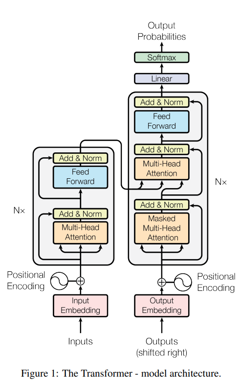

# Transformer

[arxiv.org](https://arxiv.org/pdf/1706.03762)

[Transformer Inference의 두 단계: Prefill과 Decode 및 KV Caching 차이](https://chasuyeon.tistory.com/entry/Transformer-Inference%EC%9D%98-%EB%91%90-%EB%8B%A8%EA%B3%84-Prefill%EA%B3%BC-Decode-%EB%B0%8F-KV-Caching-%EC%B0%A8%EC%9D%B4)

→ Memory bandwidth 를 줄이기 위한 technic

core 의 연산속도를 bandwidth 가 못따라감

## Model Architecture



### 왼쪽 반 : Encoder, 오른쪽 반 : Decoder

### 입력과 출력의 시작점

왼쪽:

- **Input**
- **Input Embedding**
- **Positional Encoding**

오른쪽:

- **Outputs**
- **Output Embedding**
- **Positional Encoding**

### 3-1. Input Embedding

예를 들어 입력 문장이

```
I love you, too
```

라면 토큰이 먼저 숫자 ID가 되고, 그 다음 embedding vector로 바뀐다.

예:

```
I     → e1
love  → e2
you   → e3
too   → e4
```

이때 각 벡터의 차원은 논문 base model 기준 $d_{model}=512$

즉 그림의 **Input Embedding**은 **“입력 토큰을 512차원 벡터로 바꾸는 단계”**

$E∈R^{4×512}$

### **3-2. Positional Encoding**

$Encoder Input=Input Embedding+Positional Encoding$

$Decoder Input=Output Embedding+Positional Encoding$


- $x_1$: 1번째 토큰
- $x_2$: 2번째 토큰
- $x_3$: 3번째 토큰
- $x_4$: 4번째 토큰

### 4. Encoder 의 전체 구조

논문은 encoder가 **N=6개의 identical layer**로 구성된다고 설명한다.

즉 Figure 1 왼쪽에서 반복된 블록은:

```
Encoder Layer 1
Encoder Layer 2
...
Encoder Layer 6
```

그림에는 보통 블록 옆에 **"Nx"** 같은 표시가 있는데, 이건 “이 블록이 N번 반복된다”는 뜻이다.

논문 기준 base model에서 $N=6$

### Q, K, V 는 어떻게 만들어지나?

- $Q=XW^Q,K=XW^K,V=XW^V$
- 차원관계
    - 입력
    
    $X \in \mathbb{R}^{n \times d_{model}}$
    
    - n 은 토큰수
    - $d_{model}$ = 4
    - 각 헤드의 개별 차원 $d_k,d_v = d_{model} / head=(4 \div 2 = 2).$
    - head = 2
    - 가중치 행렬
    
    $W^Q \in \mathbb{R}^{4 \times d_k}$
    
    $W^K \in \mathbb{R}^{4 \times d_k}$
    
    $W^V \in \mathbb{R}^{4 \times d_v}$
    
    - 결과
    
    $Q \in \mathbb{R}^{n \times d_k}$
    
    $K \in \mathbb{R}^{n \times d_k}$
    
    $V \in \mathbb{R}^{n \times d_v}$
    

### 5. Encoder 한 층

Encoder의 한 층 안에는 크게 두 부분이 있다.

1. **Multi-Head Attention**
2. **Feed Forward**

그리고 각각의 바깥에

- **Add & Norm**

논문은 각 encoder layer가

**(1) multi-head self-attention**

**(2) position-wise fully connected feed-forward network**

를 가지며, 각 sub-layer마다 residual connection과 layer normalization을 적용한다

$LayerNorm(x+Sublayer(x))$

### 5-1. Multi-Head Attention 블록

encoder의 이 attention은 **self-attention 이다.**

논문은 encoder self-attention에서는 query, key, value가 모두 이전 encoder layer 출력에서 나온다고 설명한다.

즉 encoder 안에서는 각 단어가 **입력 문장 안의 모든 단어를 볼 수 있다.**

예를 들어 입력 문장이

```
The cat sat on the mat
```

이라면 `"sat"`의 표현을 업데이트할 때

- `"The"`
- `"cat"`
- `"sat"`
- `"on"`
- `"the"`
- `"mat"`

전부 참고할 수 있다.

### Multi-Head Attention 의 과정


### 시작

- 입력 : $X∈R^{4×512}$

### Q, K, V 생성

- $W^Q,W^K,W^V∈R^{512×512}$
    - $W^Q=[W_1^Q, W_2^Q, ⋯W_8^Q]$
    - 각각 $W_i^Q ∈ R^{512×64}$
    - 그래서 $XW^Q=[XW_1^Q, XW_2^Q⋯XW_8^Q]$ : $(4 × 512) → (4 × 8 × 64)$
- $Q= XW^Q$
- $K=XW^K$
- $V=XW^V$

→$Q,K,V∈R^{4×512}$

### Multi-Head 분리

- Reshape
    - $Q→(4,8,64)$
    - $K \rightarrow (4, 8, 64)$
    - $V \rightarrow (4, 8, 64)$

→4 = 토큰수, 

→8 = head 개수, 

→64 = 각 head 차원

### 각 head 에 대해서 attention 수행

- 각 head i에 대해:
    
    $Q_i, K_i, V_i \in \mathbb{R}^{4 \times 64}$
    
1. Attention Score
    
    $Q_iK_i^T$
    
    $(4×64)⋅(64×4)=(4×4)$
    
    $S_i∈R^{4×4}$
    
    t1  t2  t3  t4
    
    t1      •   •   •   •
    t2      •   •   •   •
    t3      •   •   •   •
    t4      •   •   •   •
    
2. Scaling 
    - $d_k$ 는 하나의 헤드가 담당하는 key 벡터의 차원수를 의미
    
    
    
3. Softmax
    
    
    
4. Value 적용
    
    $Z_i=A_iV_i$
    
    $(4 \times 4) \cdot (4 \times 64) = (4 \times 64)$
    
    $Z_i \in \mathbb{R}^{4 \times 64}$
    

### 모든 head 결과 모으기

- 8개 head:
    
    $Z_1, Z_2, ..., Z_8$
    
    각각: ($4 \times 64$)
    
- Concat
    - $Z=concat(Z_1,...,Z_8)$
    - $Z = [head1 | head2 | ... | head8]$
        - $(64 + 64 + ... + 64) = 512$
    - $Z \in \mathbb{R}^{4 \times 512}$

### 최종 linear projection

→ Head 들을 섞는 역할

- $Z_{final}=ZW^O$
- $W^O \in \mathbb{R}^{512 \times 512}$

→ $Z_{final} \in \mathbb{R}^{4 \times 512}$

### Residual connection + layer norm

$Output=LayerNorm(X+Z_{final})$

$H=LayerNorm(X+Z_{final})$

### 5-2. Add & Norm

$LayerNorm(x+Sublayer(x))$

$H=LayerNorm(X+Z_{final})$

- 정보 손실 감소
- 깊은 모델 학습 안정화
- gradient 흐름 Good

### 5-3. Feed Forward

	$FFN(x)=max(0,xW_1+b_1)W_2+b_2$

- 입력 Shape : $H∈R^{4×512}$

$F=max(0,HW_1+b_1)W_2+b_2$

→각 토큰 위치마다 똑같은 MLP를 독립적으로 적용한다

즉 attention은 **“토큰끼리 정보를 섞는 단계”**이고, feed-forward는 **“각 토큰 벡터를 더 풍부하게 변환하는 단계”**

### 5-4. Add & Norm

$Output=LayerNorm(H+F) ∈ R^{4×512}$

### 6. Encoder output은 무엇인가

encoder의 여러 층을 모두 통과하면 최종 출력이 나온다.

이 출력은 입력 문장 각 토큰의 **context-aware representation** 이다.

즉 처음에는 `"bank"`가 단순한 embedding이었다면, encoder를 지나고 나면

주변 문맥을 반영한 `"bank"` 표현이 된다.

Figure 1에서는 이 encoder 출력이 오른쪽 decoder의 두 번째 attention 블록으로 전달된다.

### 7. Decoder 전체 구조

Decoder도 **N=6개의 identical layer**로 구성된다

그런데 encoder와 다른 점은, decoder layer에는 블록이 **3개** 있다

1. Masked Multi-Head Attention
2. Multi-Head Attention
3. Feed Forward

그리고 각 블록마다 Add & Norm이 있다.

### Decoder 의 전체 Flow

### 입력 1 : Encoder output

- $E_{enc}∈R^{4×512}$

### 입력 2 : Outputs(shifted right)

- 원래 target
    - [y1, y2, y3, y4]
- decoder 입력
    - [<sos>, y1, y2, y3] → 한칸 offset 시킨다.
    - 왜 shifted right 가 필요한가?
        - $p(y_t∣y_{<t},x)$

### 3. Decoder 에 들어가는 시작 입력

- $X_{dec}=Output Embedding+Positional Encoding$
- Shape :$X_{dec}∈R^{4×512}$
    - $x_1$: `<bos>`의 표현
    - $x_2$: $y_1$의 표현
    - $x_3$: $y_2$의 표현
    - $x_4$: $y_3$의 표현

### 4. Masked Multi-Head Self-Attention

**decoder 내부 토큰들끼리 attention**하는 부분

### 4.1 입력 shape

- $X_{dec}∈R^{4×512}$

### **4.2 Q, K, V 생성**

- self-attention이므로 같은 입력에서 세 개를 만든다.

$Q = X_{dec}W^Q,\quad K = X_{dec}W^K,\quad V = X_{dec}W^V$

$Q_i,K_i,V_i \in \mathbb{R}^{4 \times 512}$

그리고 8개 head로 나누면 각 head마다

$Q_i,K_i,V_i \in \mathbb{R}^{4 \times 64}$


### **4.3 Attention score 계산**

- 각 헤드에서
    - $S_i=Q_iK_i^T$
    - $S_i \in \mathbb{R}^{4 \times 4}$

→ decoder 의 각 위치가 decoder 의 다른 위치를 얼마나 볼것인지를 나타내는 score matrix 이다. 


### **4.4 Scaling + Softmax**


- mask된 위치는 softmax 후 확률 0이 된다.

### **4.5 Value 와 곱하기**

- 8개의 head 결과를 concat
- 마지막 projection
    
    
    

### 4.6 Residual + norm

$H_1=LayerNorm(X_{dec}+Z_{self})$

$H_1∈R^{4×512}$

### **5. Encoder-Decoder Attention**

- Query : 이전 decoder layer 에서 옴
- key, value: encoder output에서 옴

→ 이 Attention 은 self attention 이 아니라 cross-attention 이다.

### 5.1 입력의 출처가 두개

- decoder 쪽 입력
    - 첫 번째 sub-layer 출력 :
        
        $H_1∈R^{4×512}$
        
- encoder 쪽 입력
    - encoder 최종 출력 :
        - $E_{enc}∈R^{4×512}$

### 5.2 Q, K, V 생성


- Query: decoder에서
- Key/Value: encoder에서

shape는 모두 전체 기준으로

$Q,K,V \in \mathbb{R}^{4 \times 512}$

각 head(=8)로 나누면

$Q_i,K_i,V_i \in \mathbb{R}^{4 \times 64}$

### 5.3 Attention Score 계산

각 head에서

$S_i^{cross} = Q_iK_i^T$

$S_i^{cross} \in \mathbb{R}^{4 \times 4}$

- 행 = decoder 위치
- 열 = encoder 위치

즉 $(i,j)$ 원소는 **decoder의 i번째 위치가 encoder의 j번째 source 토큰을 얼마나 참고하는가** 를 나타낸다.

### 5.4 scaling + softmax


### 5.5 value와 곱해서 source 정보 가져오기

- 8개 head concat
- 최종 projection
- $W^O \in \mathbb{R}^{512 \times 512}$


### 5.6 Residual + norm

$H_2=LayerNorm(H_1+Z_{cross})$

$H_2 \in \mathbb{R}^{4 \times 512}$

이제 $H_2$는

- decoder 내부 과거 출력 정보
- encoder의 source 정보

를 반영하게 되었음

### 6. Feed Forward


### **8. Decoder 맨 아래: Output Embedding + Positional Encoding**

decoder 입력은 “정답 출력 전체”가 아니라, **이전까지 생성한 출력 토큰들이다.**

예를 들어 번역 중이라면:

- 첫 시점: `<sos>`
- 둘째 시점: `<sos> 나는`
- 셋째 시점: `<sos> 나는 너를`

이런 식으로 들어간다.

이 토큰들도 encoder와 마찬가지로 embedding이 되고 positional encoding이 더해진다.

### 9. Decoder 첫 번째 블록 : Masked Multi-Head Attention

Figure 1 오른쪽 decoder의 맨 아래 attention 블록에는 **Masked**라는 말이 붙어 있다.

논문은 decoder self-attention에서 **미래 위치를 보지 못하게 masking**한다고 설명한다. 이는 예측 위치 i가 i보다 뒤의 위치에 의존하지 않도록 하기 위함이다.

왜냐하면 decoder는 다음 단어를 생성해야 하기 때문이다.

예를 들어 출력 문장이

```
나는 너를 사랑해
```

라면 `"너를"`를 예측할 때 `"사랑해"`를 미리 알면 안 된다.

그래서 Figure 1의 첫 번째 decoder attention은:

- decoder 내부 self-attention이지만
- 미래 토큰은 가려진 상태

이다.

즉 볼 수 있는 범위가 이렇게 제한된다.

```
현재 위치 t에서는
1 ~ t 위치까지만 참조 가능
t+1 이후는 참조 불가
```

- **원래 정답**: `[I, love, you]`
- **디코더 입력 (Shifted Right)**: `[<SOS>, I, love, you]`
    - 이렇게 하면 모델은 다음과 같은 구조로 학습하게 된다.
        1. `<SOS>`를 보고 → `I`를 예측
        2. `<SOS>, I`를 보고 → `love`를 예측
        3. `<SOS>, I, love`를 보고 → `you`를 예측
        
    
    결과적으로 **현재 위치 $i$ 의 예측은 $i$ 보다 작은 위치에 있는 단어들(과거의 정보)에만 의존**
    

그래서 이름이 **Masked Multi-Head Attention이다.**

### 10. Decoder 두 번째 블록: Multi-Head Attention

이 블록은 decoder가 encoder 출력을 참조하는 부분

attention에서 query는 previous decoder layer에서 오고, key와 value는 encoder output에서 온다

- **Q**: decoder 쪽
- **K, V**: encoder 쪽

이것을 보통 **encoder-decoder attention** 또는 **cross-attention**이라고 부릅니다.

Figure 1에서 왼쪽 encoder의 최종 출력이 오른쪽 decoder 두 번째 attention 블록으로 연결되는 화살표

이 연결이 왜 중요하냐면, decoder는 출력 문장을 만들 때 입력 문장을 참고해야 하기 때문

예를 들어 입력이

```
I love you
```

이고 출력이

```
나는 너를 사랑해
```

라면 `"사랑해"`를 생성할 때 decoder는 encoder 출력 중 `"love"`와 관련된 표현에 집중할 수 있어야 한다.

그 기능을 하는 게 Figure 1의 두 번째 decoder attention이다.