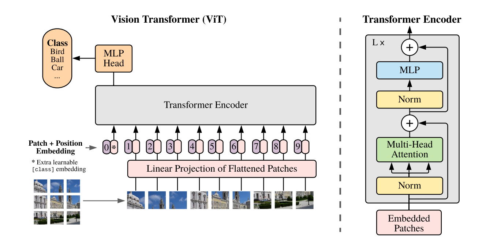

# ViT

URL: https://arxiv.org/pdf/2010.11929
상태: 완료
키워드: Foundamental

[arxiv.org](https://arxiv.org/pdf/2010.11929)

# METHOD

### 1. 입력 이미지를 받음

### **2. 이미지를 고정 크기 patch들로 나눔**

### **3. 각 patch를 펼쳐서(flatten) 벡터로 만듦**

- $x∈R^{H×W×C}$
    - H : 이미지 높이
    - W : 이미지 너비
    - C : 채널수
- 이 이미지를 $P×P$ 크기의 patch 로 자른다 → 전체 patch 개수 $N=\frac{HW}{P^2}$
- 이 patch 들을 flatten 해서 $x_p∈R^{N×(P^2×C)}$ 로 만든다
- patch 하나는 원래 $P×P×C$ 크기인데, 이를 1차원으로  flatten 하면 길이가 $P^2C$ 인 벡터가 된다. 이런 벡터가 총 N 개 생긴다
- 예
    - 입력이 $224×224×3$, patch 크기가 $16 \times 16$ 이면
    - patch 개수 : $N= \frac{224*224}{16^2} = \frac{50176}{256} = 196$
    - patch 하나를 펼친 길이 : $16×16×3 = 768$
    - 따라서 patch sequence 는 $196×768$
- 이미지를 2D grid 로 처리하는 것이 아니라, N 개의 토큰처럼 본다

### **4. Flattend Patch 를 embedding 으로 바꾸는 단계**

- Transformer 는 모든 토큰이 같은 차원의 latent vector 를 가져야 하기때문에, 각 patch 벡터를 hidden dimension D로 선형사상한다.
- $x_p^iE$ → 여기서 $E∈R^{(P^2C)×D}$ : 각 patch vector 를 D 차원으로 projection 하는 학습 가능한 행렬이다. 이 결과를 patch embedding 이라고 부른다.
- Shape 의 관점
    - $196×(P^2C)→196×D$
    - 예
        - $E∈R^{768×768}$
        - 각 patch 에 적용
            - $(196,768)×(768,768)→(196,768)$

### 5. [Class] token 을 앞에 붙이는 이유

- 논문은 BERT의 [class] token과 유사하게, 시퀀스 맨 앞에 **학습 가능한 벡터 하나**를 추가
    
    $z_0^0=x_{class}∈R^{1×768}$
    
    $(1,768)+(196,768)→(197,768)$
    
- 이 토큰은 transformer 를 통과하면서 다른 모든 patch 와 self-attention을 수행하고, 마지막에는 **이미지 전체를 대표하는 벡터** 역할을 하게 된다.
- 최종 출력에서 이 [class] token 에 해당하는 상태 $z_L^0$ 를 이미지 representation 으로 사용.
    - 그리고 이 벡터를 분류 head 안에 넣어서 class 예측
- 왜 patch 평균을 안 쓰고 Class token 을 쓰는가?
    - 원 논문에서는 기본적으로 **class token 방식**을 사용했다. 즉, patch들을 평균 내는 대신, 하나의 대표 토큰이 전체 patch 정보와 상호작용하며 “분류용 요약 벡터”를 학습하게 한 것

### 6. Positional Embedding 을 더하는 이유

- $E_{pos}∈R^{197×768}$
    - 각 위치마다 하나씩 존재
    - 0번 class token 용
    - 1 ~ 196번 : patch 위치용
- Transformer의 self-attention은 순서 정보를 자동으로 알지 못한다.
- 텍스트에서도 토큰 순서를 알려주기 위해 positional encoding/embedding이 필요하듯, 이미지 patch 역시 **어느 위치에서 잘려 나온 것인지** 알려줘야 한다.
- 그래서 논문은 patch embedding들에 **learnable 1D positional embedding**을 더한다.

- $[x_{class}; ...]$ : class token + patch embeddings를 이어붙인 것
- $E_{pos}∈R^{(N+1)×D}$ : 각 위치마다 더해지는 positional embedding
- 왜 1D positional Embedding 인가?
    - 이미지는 2D 구조인데 왜 1D를 쓰냐는 의문이 있을 수 있다. 논문은 **더 복잡한 2D-aware positional embedding을 써도 큰 성능 이득을 보지 못했다** 라고 한다. 기본적으로 learnable 1D positional embedding을 사용

## 7. Transformer Encoder 내부구조

1. LayerNorm
2. Multi-Head Self-Attention
3. Residual connection
4. LayerNorm
5. MLP
6. Residual connection

### 1. 입력

$z∈R^{197×768}$

### 2. LayerNorm

$(197,768)→(197,768)$

### 3. Multi-Head Self-Attention

**(1) Q, K, V 생성**

각각 linear projection:

$Q = zW_Q,\quad K = zW_K,\quad V = zW_V$

각 shape:

$(197,768)$

**(2) head 분할 (예: 12 heads)**

$768/12=64$

→ reshape:

$(197,12,64)$

**(3) attention 계산**

각 head에서:

$QK^T$

shape:

$(197,64)×(64,197)→(197,197)$

→ 이건 **token 간 관계 행렬**

**(4) softmax + V 곱**

$(197,197)×(197,64)→(197,64)$

**(5) head concat**

$(197,12,64)→(197,768)$

**(6) 최종 linear projection**

$(197,768)→(197,768)$

### 4. Residual Connection

z+attention output

$(197,768)$

### 5. LayerNorm

$(197,768)$

### 6. MLP(Feed Forward)

$MLP(x)=W_2(GELU(W_1x))$

$768→3072→768$

$(197,768)→(197,3072)→(197,768)$

- **MSA**: 토큰 간 정보 교환
- **MLP**: 각 토큰 내부 표현 가공

### 7. Residual

$(197,768)$

### 8. 최종 출력 y

$y=LN(z_L^0)$

마지막 $L$번째 encoder layer를 지난 뒤의 **[class] token 출력 → 이미지 전체 representation**

이 $y$ 를 classification head에 넣어 최종 class를 예측

최종 output:

$z_L \in \mathbb{R}^{197 \times 768}$

여기서:

$z_L^0 \in \mathbb{R}^{768}$ : **0번 token = class token → K :** 클래수 수

## 8. CNN 과 다른점

논문은 ViT가 CNN보다 **image-specific inductive bias가 훨씬 적다**. 구체적으로 CNN이 기본적으로 갖는 성질은:

- locality
- 2D neighborhood structure
- translation equivariance

반면 ViT에서는 이런 성질이 거의 않다.

ViT에서 2D 구조가 직접 반영되는 부분은 사실상 많지 않다.

1. 맨 처음 이미지를 patch로 자를 때
2. 나중에 해상도 변경 시 positional embedding을 보간할 때

정도이다. 그 외 spatial relation은 대부분 **데이터로부터 학습해야 한다**고 설명한다.

이게 왜 중요한가?

- 작은 데이터에서는 CNN이 유리할 수 있음
- 큰 데이터로 충분히 학습하면 ViT도 강력해짐

## 9. Hybrid Architecture

논문은 raw patch 대신 CNN feature map을 입력으로 쓰는 **hybrid model**도 언급한다.

즉, 원본 이미지에 바로 patch를 자르는 대신, 먼저 CNN으로 feature map을 만든 뒤 그 feature map을 patch처럼 잘라 Transformer에 넣는 방식이다.

이건 pure ViT와 달리 CNN의 inductive bias를 일부 가져오는 형태이다.