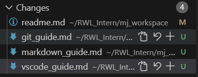
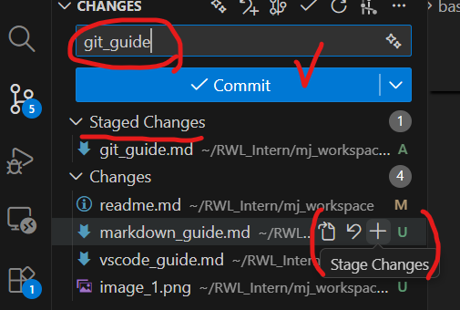
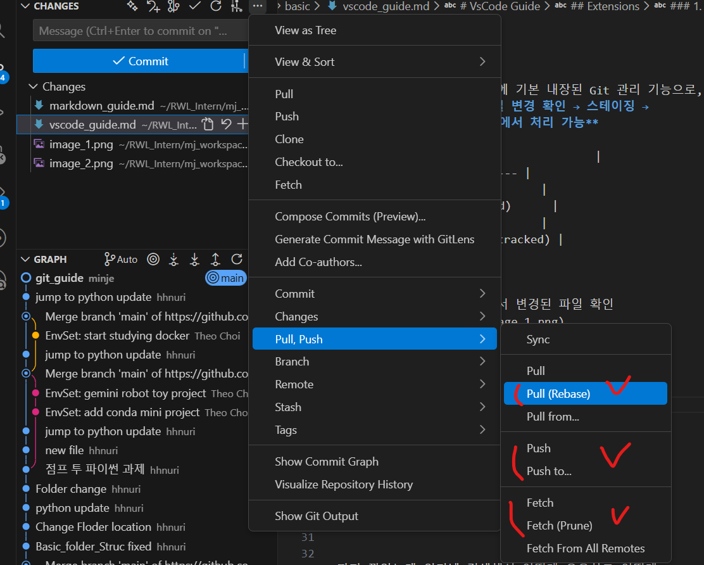

# VsCode Guide

## Extensions
### 1. source control
Source Control은 VS Code에 기본 내장된 Git 관리 기능으로,
**터미널 명령어 없이도 파일 변경 확인 → 스테이징 → 커밋까지의 작업을 GUI 환경에서 처리 가능**

| 파일 상태 표시  | 의미                |
| --- | ------------------- |
| `M` | 수정됨 (Modified)      |
| `A` | 새로 추가됨 (Added)      |
| `D` | 삭제됨 (Deleted)       |
| `U` | 추적되지 않음 (Untracked) |

- **기본 사용 흐름**
    1. 파일 수정
    2. Source control 에서 변경된 파일 확인
    
    3. 커밋할 파일 옆 '+' 클릭 -> Stage    
    4. 커밋 메시지 입력 후 커밋 실행
    
    5. git pull origin main (rebase)
        * rebase : 내 commit을 최신 원격 커밋 위로 이동 (히스토리가 한줄)
        * rebase X (merge) : 원격 변경과 로컬 변경을 합치면서 merge commit 생성 (그래프가 갈라졌다가 합쳐짐) 
    6. git push origin main **(bash에 치거나 Vscode GUI로 가능)**
    

### 2. gitlens

### 3. git graph

까지 깔았는데 인터넷 검색해서 어떤게 유용하고 어떻게 사용하는지 정리하기.