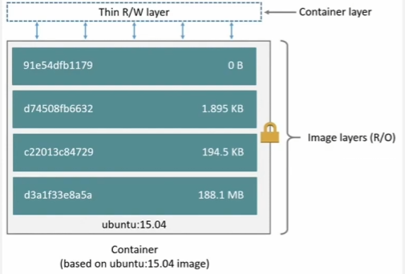
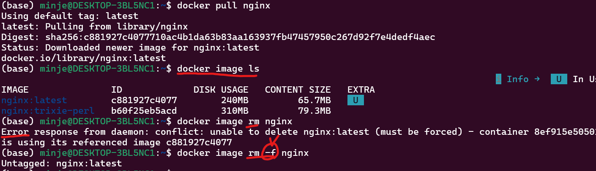
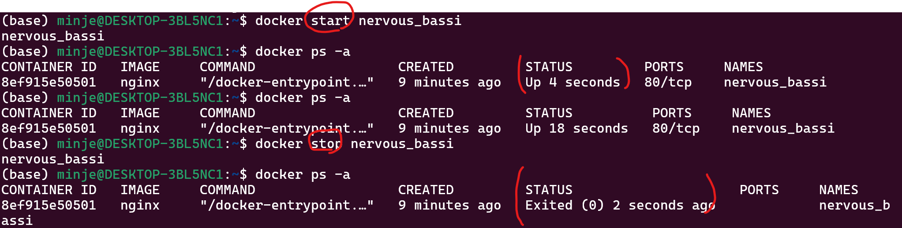
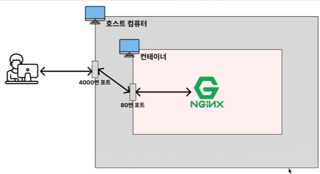
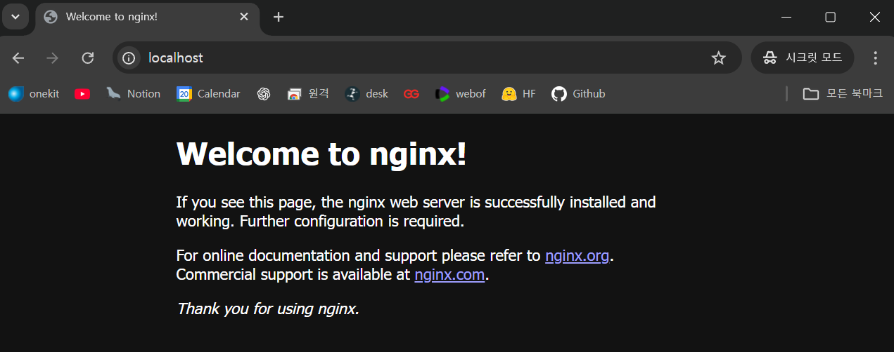
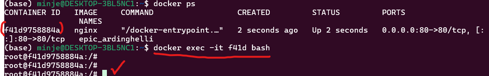
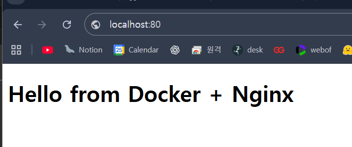
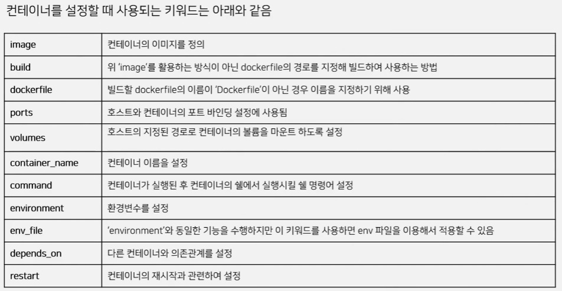
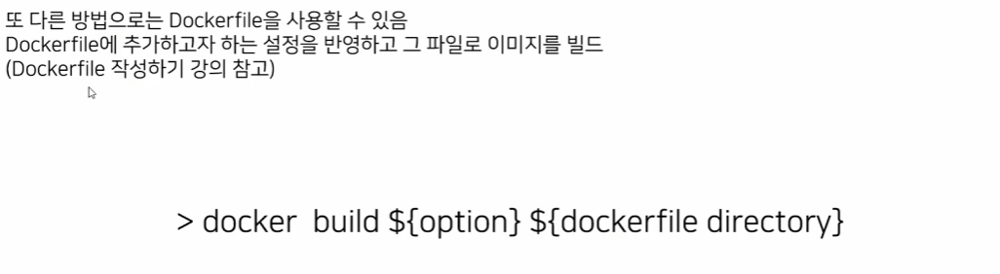

# Docker Study

[1. 스프링 부트 Dockerfile 만들기 [ 도커 (Docker) 기초] ~ 재생목록 12 ](https://www.youtube.com/watch?v=MsMHStVibEk&list=PLlTylS8uB2fDLJRJCXqUowsOViG-ZKnWy&index=12) 
[2. 인프런 ~ 2.8](https://www.youtube.com/watch?v=OPmSQCfzl1Q&list=PLtUgHNmvcs6rS5aNCRIZtVcyk3gRX2iOd) 

## Docker란?
>* 컨테이너를 사용하여 각각의 프로그램을 분리된 환경에서 실행 및 관리할 수 있는 툴
>* 특정 프로그램을 다른 곳을 쉽게 옮겨서 설치 및 실행할 수 있게 해줌.
- 매번 귀찮은 설치과정 필요 X
- 항상 일관되게 프로그램 설치 가능 (버전, 환경설정, 옵션 등)
- 각 프로그램이 독립적인 환경에서 실행되기 때문에 프로그램 간 충돌 X

## Image란? (설계도)
* **프로그램을 실행하는데 필요한 모든 것을 포함한 설계도.**
    * 필요한 라이브러리 설치과정, 설정, 버전 정보등을 포함.

## Container란? (설계도를 기반으로 실제 실행 중인 애플리케이션)
* Docker Image를 기반으로 하는 애플리케이션과 그 실행 환경을 독립되고 일관된 환경에서 실행할 수 있도록 해주는 가상화 기술이다.
* VM과 달리 **Host 운영체제의 커널을 공유** (성능 오버헤드가 적고 매우 효율적)
* **독립성**을 가짐 [**컨테이너 별로 각각의 저장공간, 고유 네트워크를 가짐**]

`컨테이너는 컨테이어 레이어(R/W)와 이미지 레이어(Read only)로 구성되어 있고, 변경사항은 모두 컨테이너 레이어에 기록된다. 이미지 레이어는 다른 컨테이너와 공유된다.`

`즉 하나의 이미지에 대해 여러 컨테이너를 사용가능하고 이미지레이어만 공유하게된다. -> 여러 컨테이너를 띄워도 효율적` 

## Docker 설치
```sh
# Add Docker's official GPG key:
sudo apt update
sudo apt install ca-certificates curl
sudo install -m 0755 -d /etc/apt/keyrings
sudo curl -fsSL https://download.docker.com/linux/ubuntu/gpg -o /etc/apt/keyrings/docker.asc
sudo chmod a+r /etc/apt/keyrings/docker.asc

# Add the repository to Apt sources:
sudo tee /etc/apt/sources.list.d/docker.sources <<EOF
Types: deb
URIs: https://download.docker.com/linux/ubuntu
Suites: $(. /etc/os-release && echo "${UBUNTU_CODENAME:-$VERSION_CODENAME}")
Components: stable
Signed-By: /etc/apt/keyrings/docker.asc
EOF

sudo apt update
sudo apt install docker-ce docker-ce-cli containerd.io docker-buildx-plugin docker-compose-plugin

sudo usermod -aG docker $USER
#(세션 다시시작)
```
---
## Docker 명령어
### Image 관련
```sh
#이미지 설치
docker pull nginx                 # dockerhub(image를 저장, 다운로드 받을 수 있는 곳)에서 nginx라는 이미지를 받아옴
docker pull nginx:trixie-perl     #image에 :(tag)를 붙여 특정 버전을 다운받기도 가능 

#확인
docker image ls                  # 설치된 image list 확인

#이미지 제거
docker image rm <IMAGE_NAME | IMAGE_ID>  # "image 이름/ID" 아무거나 넣어서 image 삭제가능 (컨테이너가 사용중인(실행 or 중단) image 삭제 불가 )
docker image rm -f ~~~ # 중단된 컨테이너의 image도 강제 삭제 가능
docker image rm $(docker iamges -q) # 컨테이너 없는 image 전체 삭제, -f 옵션 붙이면 중단된 컨테이너도 포함 (한번에 image들 정리할때 사용하기 좋음.)
```


### Container 관련
- **ID는 일부만 입력해도 인식함**
```sh
docker create nginx        # nginx라는 image를 기반으로 container를 생성만 함. (수동으로 docker pull을 하지않더라도 dockerhub에서 찾아서 알아서 만들어 줄수도 있음.)
docker ps -a               # 모든 container 목록 출력 
    #docker ps -a       -> 모든 컨테이너 조회
    #docker ps          -> 실행중인 컨테이너 조회
docker start <CONTAINER_ID | CONTAINER_NAME>     # 기존 container 실행
# image는 container 생성 시점에만 활용됨. (실행 대상이 아님)
docker stop <CONTAINER_ID | CONTAINER_NAME> # container stop 
    #docker stop        -> 차근차근 끄기
    #docker kill        -> 강제종료
docker rm <CONTAINER_ID | CONTAINER_NAME>  # container 제거
#여러 id, name을 띄어쓰기 하면서 입력해도 한번에 처리가능
```


### Image & Container
#### docker run (image가 없다면 자동 pull)
```sh
docker run <~~~~>               # create + start (주로 사용.)
# image를 다운로드하고 container 실행까지 한번에 한다.
docker run -d <~~~~>        # 백그라운드 실행.
docker run --name webserver -d <~~~~>        # --name을 통해 container 이름 붙이기
```
#### 호스트와 컨테이너 포트 연결하기
```sh
# docker run -d -p ${host port}:&{container port} <image_name>
docker run -d -p 4000:80 nginx      #localhost:4000 에서 연결 확인 가능
docker run -d -p 80:80 nginx   # localhost:80 에서 연결 확인 가능
```




### 컨테이너 로그 조회
```sh
docker logs <CONTAINER_ID | CONTAINER_NAME>    # container log조회
docker logs --tail 10 <CONTAINER_ID | CONTAINER_NAME> # 끝에 10줄만 조회
docker logs -f <CONTAINER_ID | CONTAINER_NAME> # 실시간 로그 조회 
```

### 실행중인 컨테이너 내부에 접속하기 (exec-it)
`컨테이너 내부에 진입하여 수정 및 기타 작업 수행가능`
```sh
docker exec -it <CONTAINER_ID | CONTAINER_NAME> bash
```



## 전체 흐름 정리
```sh
docker pull nginx            # image download
docker image ls              # image list확인

docker run --name webserver -d -p 80:80 nginx  # host와 80포트를 연결하는 webserver라는 이름을 가진 컨테이너 실행 
#localhost:80 으로 확인

docker ps                   #실행중인 컨테이너 확인

docker stop webserver        # ⬅ 실행 중이면 먼저 중지
docker rm webserver          # 컨테이너 제거

docker imag ls              #이미지 list확인
docker image rm ~~          # 이미지 제거
```
---
## Docker compose
* 컨테이너 여러 개를 “하나의 앱”처럼 관리하고 싶을 때
* 환경을 코드로 고정하고 팀과 공유하고 싶을 때
* ocker run 명령이 길어지기 시작할 때
`→ Docker Compose를 쓰는 시점`

| 문제          | docker run | docker compose |
| ----------- | ---------- | -------------- |
| 다중 컨테이너 실행  | 불편         | **1명령**        |
| 컨테이너 간 네트워크 | 수동         | **자동**         |
| 실행 순서 관리    | 어려움        | `depends_on`   |
| 환경 재현성      | 낮음         | **YAML로 고정**   |
| 팀 공유        | 어려움        | **파일 1개 공유**   |

---
## Dokcerfile 작성하기
`Dockerfile : 도커 이미지를 생성하기 위한 스크립트 파일`
### 주로 사용되는 키워드
* **FROM**
    * base가 되는 image를 지정. (주로 os 이미지나 런타임 이미지 지정)
* **RUN**
    * 이미지를 빌드할 때 사용되는 커맨드를 설정할 때 사용
* **ADD**
    * 이미지에 호스트의 파일이나 폴더를 추가하기 위해 사용
* **COPY**
    * 호스트 환경의 파일이나 폴더를 이미지 안으로 복사하기 위해 사용
    * (ADD와 동일하게 동작하나, URL을 지정하거나, 압축파일을 자동으로 풀지 않음)
* **EXPOSE**
    * 이미지가 통신에 사용할 포트를 지정할 때 사용
* **ENV**
    * 환경 변수를 지정할 때 사용 (설정한 변수는 $name, ${name}의 형태로 사용할 수 있음)
    * 특수 문법 ${name:-else} : name이 정의가 안되어있다면 else가 사용
* **CMD**
    * 도커 컨테이너가 실행될 때 실행할 커맨드를 지정
    * `RUN`(이미지를 빌드할때 실행)과 비슷하지만 `CMD`는 컨테이너를 시작할때 실행
* **ENTRYPOINT**
    * IMAGE가 실행될 때 사용되는 기본 커맨드를 지정 (강제)
* **WORKDIR**
    * `RUN, CMD, ENTRYPOINT`등을 사용한 커맨드를 실행하는 디렉토리를 지정
    * `-w` 옵션으로 오버라이딩 가능
* **VOLUME**
    * 퍼시스턴스 데이터를 저장할 경로를 지정할 때 사용
    * **호스트의 디렉토리를 도커 컨테이너에 연결**
    * 주로 희발성으로 사용되면 안되는 데이터를 저장할 때 사용

Dockerfile을 실행하기 위해서는 `docker build` 커맨드 사용
```sh
docker build ${option}${dockerfile directory}
#  ex) docker build -t test . (test라는 이름의 이미지로 빌드)
```
### dockerfile 실습
`index.html`
```html
<!DOCTYPE html>
<html>
  <head>
    <title>Nginx Docker Test</title>
  </head>
  <body>
    <h1>Hello from Docker + Nginx</h1>
  </body>
</html>
```
`Dockerfile`
```dockerfile
FROM nginx:latest

COPY index.html /usr/share/nginx/html/index.html
```

`이렇게 구성하고 image 빌드 및 컨테이너 실행!`
```sh
docker build -t my-nginx .
docker run -d -p 80:80 --name nginx-test my-nginx
```
`index.html`에 적은대로 잘 출력되는 것을 `localhost:80`에서 확인!


---

## dokcer-compose 파일 작성하기
`compose 파일은 도커 애플리케이션의 서비스, 네트워크, 볼륨 등의 설정을 yaml 형태로 작성하는 파일 `


#### 작성된 docker-compose.yml 파일을 실행하기 위해서는 아래와 같은 커맨드 사용.
```sh
docker compose up
# docker compose -f docker-compose-custom.yml up  : 다른 yml 파일 사용
# docker compose up -d       : 백그라운드 실행
```
`up` 은 이미지 없으면 자동 build도 한다. (image 있다면 재사용)
만약, 강제로 다시 빌드하고 싶다면 `docker compose up --build`


---
## Docker image 생성 및 저장하기
### 컨테이너로 image 생성하기!


`실습해보기`


`container를 image로 생성완료!`
**-> 기존 이미지(practice) + 해당 컨테이너(nginx-test)에서 발생한 변경사항을 합친 “새 이미지(test_copy)”가 생성됨**

### Dockerfile로 image 생성하기!



### image파일을 local에 저장

| 명령              | 대상                | 파일 형식 | 포함 내용                           | 주 용도               |
| --------------- | ----------------- | ----- | ------------------------------- | ------------------ |
| `docker save`   | **이미지**(여러 태그 가능) | tar   | 이미지 **레이어 + 메타데이터 + 태그**        | 이미지 그대로 백업/이관      |
| `docker load`   | tar               | -     | `save`로 만든 이미지 복원               | 오프라인 환경 복원         |
| `docker export` | **컨테이너**          | tar   | 컨테이너 **파일시스템 스냅샷(한 겹)**  우분투 루트 시스템처럼 /lib, /usr 이런형식       | 실행 결과만 뽑기(레이어 제거)  |
| `docker import` | tar/URL           | -     | tar를 **새 이미지로 생성(메타데이터 거의 없음)** | 깨끗한 단일 레이어 이미지 만들기 |

#### 실습해보기
###### Save
```sh
docker save -o test_copy.tar test_copy:latest
```
위 명령을 통해 `test_copy`라는 **image를 local에 tar형식으로 저장**완료!
###### Load
```sh
docker load -i test_copy.tar
```
위 명령을 통해 **local의 test_copy.tar 파일을 image로 불러**올 수 있음.

###### Export
`export로 추출한 이미지는 원본 이미지와 다르게 하나의 레이어로 통합되어 추출됨`
```sh
docker export nginx-test>test123.tar
```
위 명령을 통해 **docker 컨테이너를 tar파일로 추출**가능함

###### Import
```sh
docker import test123.tar test123:version
```
위 명령을 통해 export로 생성된 tar 파일을 새로운 docker image로 생성 가능함
| 명령              | 저장 대상               |
| --------------- | ------------------- |
| `docker save`   | **이미지(Image)**      |
| `docker export` | **컨테이너(Container)** |

`docker save`가 좀더 백업에 가까운듯. 
save는 load로, export는 import로 불러오기.