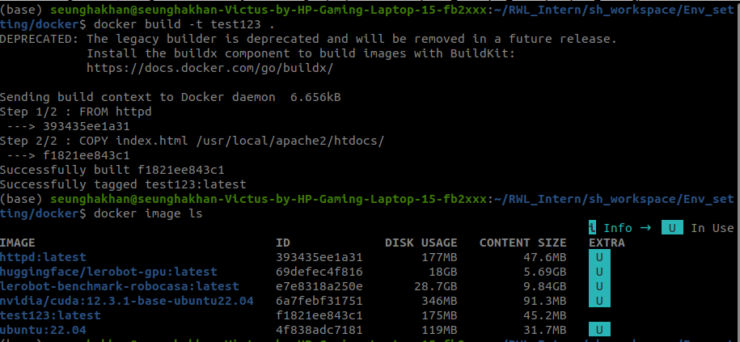
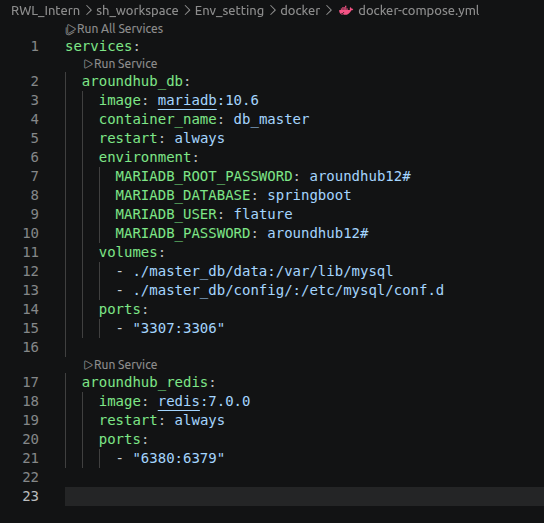
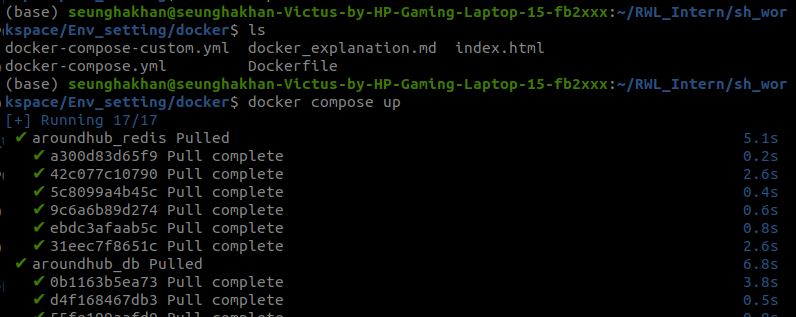
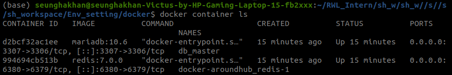
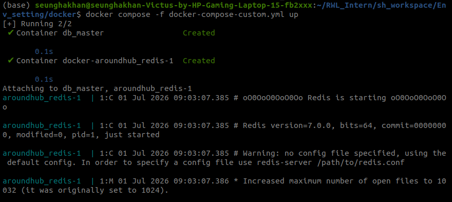

# Docker란?
###### 도커(Docker)는 컨테이너를 만들고 관리하는 프로그램이다.
###### container는 프로그램이 실행되는 독립적인 공간이다.(like minicomputer)

-----

### Docker를 사용하는 이유:

### **1. 동일한 환경을 어디서나 재현하기

### 2. 한 대의 컴퓨터에서 여러 환경을 사용하기


- image layer는 읽을 수만 있으며(수정 불가) container layer는 읽고 쓸 수가 있다. 아래 그림처럼 다른 container들이 하나의 image를 구성하는 image layer들을 공유한다.


---
# Docker command

#### docker command는 아래와 같은 규칙을 갖고 있다.


#### command를 어떻게 사용할지 모르겠거나 어떤 옵션을 사용할 수 있을지 궁금하다면 맨 뒤에 --help를 붙히면 된다.

**docker command를 쓸 때 최대한 구체화 한 상태에서 --help를 쓰며 명령어를 쓰면 된다**

- ex)
    
    - httpd 이미지를 기반으로 container를 실행시킴
    
    
    

    - 잘 되는지 결과 확인
    
    
    


    - container 중지시킴


    


    # Image
###### image: 닌텐도 칩과 같이 환경을 설치하기 위한 정보들이 들어가 있는 것.

- image를 다운받기 위해서는 아래와 같은 명령어를 사용하면 된다.(dockerhub이라는 사이트로부터 이미지를 설치한다.)

    ``` bash
        docker pull nginx
    ```


- :다음에 오늘 내용은 tag명으로 그 이미지의 어떤 버전인지를 나타내고 :입력을 안 한다면 자동으로 가장 최신 이미지인 latest가 다운받아진다.
    ```bash
        docker pull nginx:latest
    ```

- 중단된 컨테이너에서 사용하고 있는 이미지는 원래 삭제하지 못 하지만 -f를 붙힘으로써 강제로 삭제할 수 있다.

    ```bash
        docker image rm -f nginx
    ```


- 실행되고 있는 컨테이너에서 사용되고 있는 image를 제외하고 나머지 모든 image들을 삭제 하는 명령어

    ```bash
        docker image rm $(docker images -q)
    ``` 
    
    # Container

    ``` bash
        docker container create mysql # container를 생성만 하고 실행은 안 한다. 컴퓨터에 원하는 image가 설치되어 있지 않아서 자동 설치한다.
        docker container start {id_name} # 생성되어 있는 container를 실행한다.
        docker container run mysql # create과 start를 한 번에 실행한다.
        docker container rm -f testcontainer # 진행 중인 컨테이너도 -f 때문에 그냥 삭제해버린다. 
    ```


    # log 조회

    ``` bash
        docker logs {id}  # 지금까지 저장되어 있는 로그 한 번만 보여줌.
        docker logs --tail 10 {id} # 로그의 마지막 10줄만 보여줘라.
        docker logs -f {id} # 계속해서 실시간으로 로그를 받을 수 있음.
    ```

- 위의 명령어를 통해 현재 실행되고 있는 container의 log들을 확인할 수 있다.


    # 실행 중인 container 내부에 들어가기

    ``` bash
        docker exec -it {id} bash
    ```


---
# Docker 통신
###### container들은 독립적인 환경에서 실행되기 때문에 컨테이너 밖에서 접근할 수 없다. 그래서 컨테이너와 통신이 필요한건데 이를 위해서는 'p' 옵션을 사용하여 호스트의 포트와 컨테이너의 포트를 설정해야 한다.


---

# Dockerfile 작성하기
###### dockerfile은 도커 이미지를 생성하기 위한 스크립트 파일이다.


- Dockerfile Instruction
    - FROM: base가 되는 image를 지정
    - RUN: Dockerfile에서 이미지를 생성하는 과정에서 실행하고 싶은 명령어가 있을 때 Run을 사용하고 그 결과는 image에 반영된다.
    - ADD: 이미지에 파일이나 디렉터리를 복사하지만, COPY와 다르게 압축파일 자동 해제와 URL 다운로드 기능을 추가로 제공하는 명령어다.
    - COPY: ADD와 비슷하지만 좀 더 보수적이다.
    - EXPOSE: 이미지가 통신에 사용할 포트를 지정할 때 사용
    - ENV: 환경 변수를 지정할 때 사용
    - CMD: docker container가 실행될 때 실행할 커맨드를 지정
    - ENTRYPOINT: 똑같이 도커 이미지가 실행될 때 사용되는 기본 커맨드를 지정하지만 CMD와 다르게 수정할 수 없다.
    - WORKDIR: 커맨드를 실행하는 디렉토리를 지정
    - VOLLUME: 컨테이너의 데이터를 영구적으로 저장하기 위한 저장 공간을 생성하거나 연결하는 명령어


- ->dockerfile을 실행하기 위한 docker build 명령어world

- ex) 




----
# Docker compose 파일
###### compose 파일은 도커 애플리케이션의 서비스, 네트워크, 볼륨 등의 설정을 yaml 형식으로 작성하는 파일


- 이를 이용하여 똑같은 환경의 컨테이너들을 언제든지 다시 만들 수 있도록 환경을 정의해 높은 설정 파일


    ``` bash
        docker compose up
    ```

- 위의 명령어를 통해 docker-compose.yml 파일을 실행한다.


- practice)




- compose file




- docker compose up을 통해 compose file기반 container 생성





- 그 결과 container 2개가 돌아간다(compose 파일에서 돌아가는 container가 2개 있었기 때문)





- -f옵션을 이용해서 특정 compose 파일을 실행시켜서 container를 생성


---
# Docker 이미지 생성 및 저장


- 이미지를 생성하는 경우
    1. 특정 이미지에 자주 사용하는 설정을 추가하여 편하게 사용하고 싶을 경우

    2. 본인이 개발한 애플리케이션을 이미지로 생성하고 싶은 경우


    * 컨테이너로 이미지 생성하기
        * container_name: 이미지로 만들고자 하는 컨테이너 이름
        * image_name: 생성할 이미지의 이름
    

    ``` bash
        docker commit {container_name}{image_name}
    ``` 


    * save와 load 커맨드를 사용하여 이미지 불러오기
    ``` bash
        docker save -o test123.tar test123
    ```

    ``` bash
        docker load -i test123.tar
    ```


    * Dockerfile로 이미지 생성하기


    ``` bash
        docker build ${option}${dockerfile directory}
    ```


