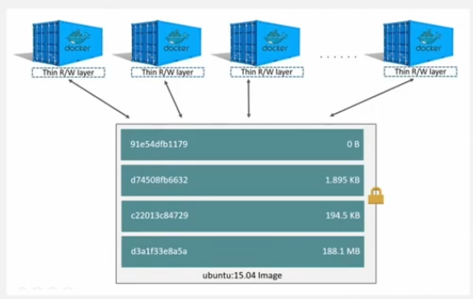
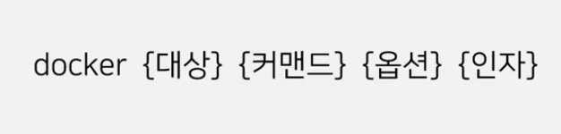
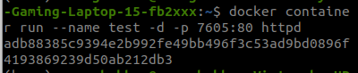
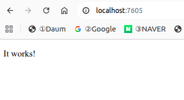
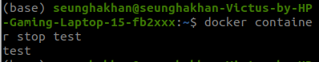
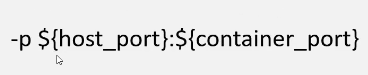
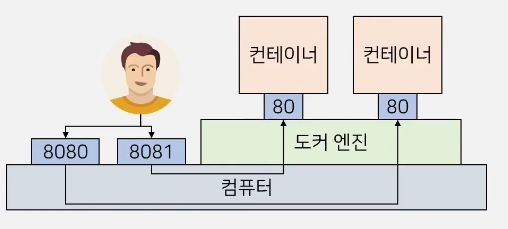
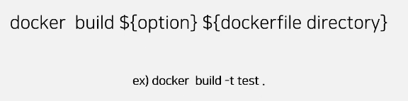

# Docker란?
###### 도커(Docker)는 컨테이너를 만들고 관리하는 프로그램이다.
###### container는 프로그램이 실행되는 독립적인 공간이다.

-----

### Docker를 사용하는 이유:

### **1. 동일한 환경을 어디서나 재현하기

### 2. 한 대의 컴퓨터에서 여러 환경을 사용하기

- image layer는 읽을 수만 있으며(수정 불가) container layer는 읽고 쓸 수가 있다. 아래 그림처럼 다른 container들이 하나의 image를 구성하는 image layer들을 공유한다.

---
# Docker command

#### docker command는 아래와 같은 규칙을 갖고 있다.

#### command를 어떻게 사용할지 모르겠거나 어떤 옵션을 사용할 수 있을지 궁금하다면 맨 뒤에 --help를 붙히면 된다.

**docker command를 쓸 때 최대한 구체화 한 상태에서 --help를 쓰며 명령어를 쓰면 된다**

- ex)
    
    - httpd 이미지를 기반으로 container를 실행시킴
    
    
    

    - 잘 되는지 결과 확인
    
    
    

    - container 중지시킴

    

---
# Docker 통신
###### container들은 독립적인 환경에서 실행되기 때문에 컨테이너 밖에서 접근할 수 없다. 그래서 컨테이너와 통신이 필요한건데 이를 위해서는 'p' 옵션을 사용하여 호스트의 포트와 컨테이너의 포트를 설정해야 한다.

---

# Dockerfile 작성하기
###### dockerfile은 도커 이미지를 생성하기 위한 스크립트 파일이다.

- Dockerfile Instruction
    - FROM: base가 되는 image를 지정
    - RUN: Dockerfile에서 이미지를 생성하는 과정에서 실행하고 싶은 명령어가 있을 때 Run을 사용하고 그 결과는 image에 반영된다.
    - ADD: 이미지에 파일이나 디렉터리를 복사하지만, COPY와 다르게 압축파일 자동 해제와 URL 다운로드 기능을 추가로 제공하는 명령어다.
    - COPY: ADD와 비슷하지만 좀 더 보수적이다.
    - EXPOSE: 이미지가 통신에 사용할 포트를 지정할 때 사용
    - ENV: 환경 변수를 지정할 때 사용
    - CMD: docker container가 실행될 때 실행할 커맨드를 지정
    - ENTRYPOINT: 똑같이 도커 이미지가 실행될 때 사용되는 기본 커맨드를 지정하지만 CMD와 다르게 수정할 수 없다.
    - WORKDIR: 커맨드를 실행하는 디렉토리를 지정
    - VOLLUME: 컨테이너의 데이터를 영구적으로 저장하기 위한 저장 공간을 생성하거나 연결하는 명령어

- ->dockerfile을 실행하기 위한 docker build 명령어

