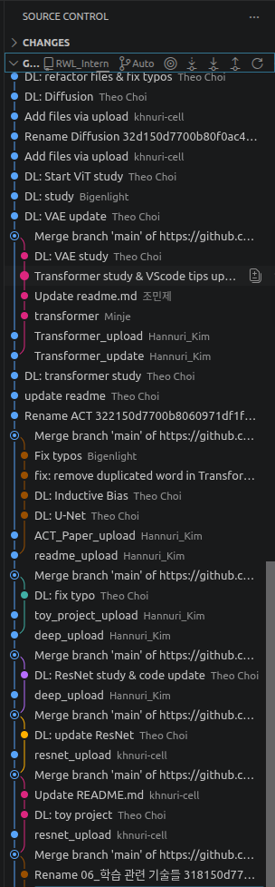
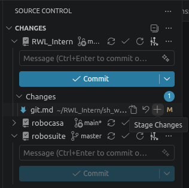
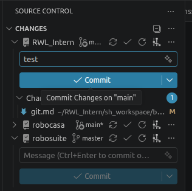
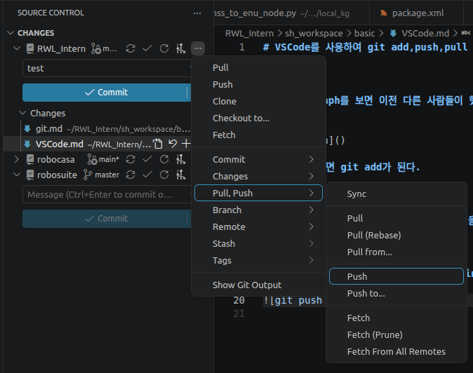
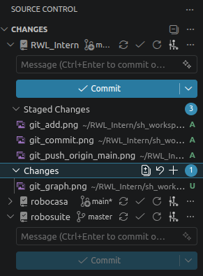

# VSCode를 사용하여 git add,push,pull 하기

----

### git graph를 보면 이전 다른 사람들이 했던 commit들도 시간 순으로 확인할 수 있다.

### +를 누르면 git add가 된다.

### commit messegae를 작성하고 commit을 누르면 git commit -m ""가 실행된다.

### push를 누르면 git push origin main이 실행된다.

### U는 아직 git add가 되지 않을 상태이고 위에 보는 것처럼 옆에 A가 나와있으면 git add가 된 상태다.

