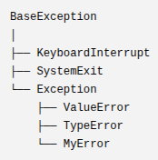

# PEP 8
###### Python 코드를 어떻게 작성하면 읽기 쉽고, 일관성 있게 만들 수 있는지를 정학 공식 스타일 가이드다.

1. 들여쓰기 rule
    1. Hanging Indent: 괄호 위치는 신경 쓰지 않고, 4칸 더 들여쓰기만 하면 된다.

    - ex)

    ``` python
        foo = long_function_name(
            var_one,
            var_two,
            var_three,
            var_four
        )
    ```
    2. Vertical alignment: 괄호 뒤 위치에 맞춰 정렬한다.


    - ex)

    ``` python
        foo = long_function_name(var_one, var_two
                                 var_three, var_four)
    ```

    - ),],} 와 같이 닫는 괄호를 어디에 둘 것인가?
        1. 스타일1: 마지막 요소와 맞추기
            ``` python
            my_list = [
                1,2,3,
                4,5,6
                ]
            ```

        2. 스타일2: 시작 위치와 맞추기
            ``` python
            my_list = [
                1,2,3,
                4,5,6
            ]
            ```
        
        - 줄 바꿈 할 때 연산자의 위치는 앞에 두자
            ``` python
            result = (
                a
                + b
                + c
                - d
            )


2. Maximum line length
    1. 코드: 한 줄 최대 79자 권장
    2. 주석: 한 줄 최대 72자 권장
    - 긴 줄은 (),{},[]를 이용해서 줄바꿈을 사용하자.
    - *\는 가능하면 사용하지 말자.


3. Blank lines

    1. 최상위에 있는 함수와 클래스는 위아래로 빈 줄 2개를 둔다.

    - ex) 
        ``` python
        class Student:
            pass


        def add(a, b):
            return a + b

            
        def subtract(a, b):
            return a - b
        ```


    2. 클래스 안의 매서드들은 빈 줄 1개로 구분한다.

    - ex)
        ``` python
        class Student:

            def study(self):
                print("study")

            def sleep(self):
                print("sleep")
        ```
        
4. Import
    1. Import는 한 줄에 하나씩 작성한다.
    2. from import는 여러 개 가져와도 된다.
        ``` python
        from subprocess import Popen, PIPE
        from math import sin, cos, tan
        ```
    3. *import는 세 그룹으로 나눈다.(순서대로)
        1. 표준 라이브러리
        2. 외부 라이브러리
        3. 내가 만든 모듈
        - 그룹 사이에 빈 줄 1개를 둔다.

    4. Import 방식
        1. Absolute Import
        - ex) 
        
        ``` python
        from project.model import cnn
        ```

        2. Relative Import
        - ex) 

        ``` python
        from .model import cnn
        ```

5. Level Dunder Names
    ###### Dunder는 Double Under Score의 줄임말로 Python이 특별한 용도로 사용하는 이름이라는 것을 나타내기 위해 Dunder를 사용한다.

    - 써야하는 순서: 
    1. module Docstring
    2. Future Import
    3. Module Level Dunder
    4. 일반 Import

    -ex) 
    ``` python
        """
        이 파일이 어떤 파일인지 설명
        """
        # module Docstring

        from __future__ import annotations # Future Import

        __version__ = "1.0" # Module Dunder

        import os # 일반 Import
        import sys

        PI = 3.14 # 전역 변수

        def add():
            pass # 함수

        class Student:
            pass # 클래스
    ```

6. String 작성 규칙
    1. 작은따옴표(')와 큰따옴표(")는 기능이 같다.
    2. 프로젝트에서는 둘 중에 하나로 통일하자.
    3. 문자열 안에 따옴표가 들어있으면 다른 따옴표를 사용해라.
    4. Triple Quote(""" """)는 항상 큰 따옴표를 사용하라.

7. 공백을 어떻게 사용하는지
    1. 괄호(), 대괄호[], 중괄호{} 바로 안쪽에는 공백을 넣지 않는다.
        - ex)
        ``` python
            spam (ham[1],{eggs: 2}) 
        ```

    2. 마지막 쉼표 뒤에 공백을 넣지 않는다. 
    3. 쉼표,세미콜론,콜론 앞에는 공백을 넣지 않는다.
    4. Slice에서는 :양쪽 공백을 맞춘다.
        - ex)
        ``` python
            numbers[lower + offset : upper + offset]
        ```
    5. 함수 호출 전에 공백 넣지 않는다.
        - ex)
        ``` python
            spam(1) # spam (1)처럼 공백을 넣지 않는다.
        ```
    6. 인덱싱할 때도 공백 넣지 않는다.
        -ex)
        ``` python
            dct["key"]
            lst[index]
        ```
    7. 기본 연산자 양쪽에는 공백 1개
        -ex) 
        ``` python
            i = i + 1 # 우선순위가 다른 연산자는 낮은 우선순위 쪽만 띄워도 된다.
        ```
    8. = 주변에 공백
        -ex)
        ``` python

            x = 10 # 일반 변수에는 항상 공백
            def complex(real, imag=0.0):
                return magic(r=real, i=imag) #함수 타입이 안 나와있기 때문에 공백을 넣지 않는다.
            def munge(sep: AnyStr = None, limit=1000):
                # 타입 힌트가 있으면 = 양쪽에 공백을 넣는다.
        ```

8. Trailing Comma(마지막 요소 뒤에 붙는 쉼표)
    1. 원소가 하나인 **튜플**에서는 반드시 필요하다.
        ex) 
        ``` python
            x = (1) # 튜플이 아니라 그냥 정수다.
            x = (1,) # 튜플이려면 반드지 쉼표가 있어야 한다.
        ```

    2. 리스트가 여러 줄이면 마지막에도 쉼표를 붙인다.
        ex) 
        ``` python
            FILES = [
                "setup.cfg",
                "tox.ini",
            ]

9. Comment(주석)
    1. 주석은 완전한 문장으로 작성한다.
    2. 여러 문장이면 문장 사이를 띄운다.
    3. Block Comment: 코드 위에 따로 적는 주석(# 뒤에는 공백 한 칸 두자.)
        - ex)
        ``` python
            # Calculate the average score.
            # Ignore invalid values.
            average = total / count
        ```
    4. Inline Comment: 코드와 같은 줄에 쓰는 주석
        - ex)
        ``` python
            x += 1 # Compensate for border.
        ```
        - 되도록이면 Inline Comment는 많이 쓰지 말자.

10. Docstring
    ###### Docstring은 모듈, 함수, 클래스, 메서드를 설명하는 공식 문서입니다.
    - 어디에 작성해야 하나?: 공개(public)되는 모든 것에는 Docstring을 작성하라.
    - 여러 줄 Docstring에는  큰 따옴표를 한 줄에 쓰면 안 되는데 한 줄만 될 때는 같은 줄에 쓴다.
        - ex) 
        ``` python
            def train():
                """
                Train the model.

                The model is trained using the Adam optimizer.
                Early stopping is enabled.
                """

            def add():
                """두 수를 더한다."""

        ```

11. Naming Convention
    1. 이름은 내부 구현보다 "사용하는 입장"에서 이해하기 쉽게 지어라.
    2. _name(이름의 앞에 붙었을 때)는 내부용이라는 의미가 있다.
        - ex) 
        ``` python
            class Student:

                def _caculate(self): # _caculate는 내부용이라는 의미
                    pass
        ```
    3. name_(이름의 뒤에 붙었을 때) 예약어와 이름이 겹칠 때 충돌을 피하기 위해서 사용
        - ex)
        ``` python
            def create_student(class_):
            print(class_)
        ```
    4. __name 앞에 언더스코어가 두 개 붙으면 Python이 이름을 자동으로 변경한다. **상속시 충돌 방지를 하기 위해서**
    5. __name__은 Python이 미리 특별한 의미와 기능을 부여한 이름이다.
        - ex)
        ``` python
            __init__
        ```
    6. 한 글자 이름 피하기
    7. ASCII 사용(영어,숫자,일부 특수문자)
    8. Package와 module 이름은 모두 소문자,가능하면 짧게 쓰기.
    9. Class 이름은 CapWords로 쓰기.
    10. Exception 이름도 CapWords 사용.
    11. Global Variable,Variable,Function 이름을 쓸 때는 함수 이름처럼 snake_case를 사용한다.
    12. 첫 번째 함수 인자는 항상 self, 첫 번째 클래스 메서드 인자는 clsek.
    13. 상수는 UPPER_CASE 사용.

12. Public and Internal Interfaces
    1. Public만 호환성을 보장해야 된다.(공개한 기능은 앞으로도 계속 사용할 수 있도록 해야 함.)
        - ex)
        ``` python
            def add(a,b) # 삭제하면 안 된다.
                return a + b 

            def _helper(): # 삭제해도 된다. 내부 기능이기 때문에
                ...
        ```
    2. 문서에 적혀 있으면 Public 아니면 Internal이다.
    3. __all__로 공식 API를 알려라.
        - ex)
        ``` python
            __all__ = ["add", "subtract"]
        ```
    4. 부모가 Internal이면 자식도 Internal이다.


## Programming Recommendations

1. None 비교는 is 사용.(왜냐하면 None은 Python에서 하나만 존재하는 Singleton객체이기 때문이다.)
    - ex)
    ``` python
        if x == None: # ==말고 is를 사용.
        if x is None:
    ```
2. if x와 x is not None은 다르다.
    - ex)
    ``` python
        x = []
        if x: # 리스트가 비어있기 때문에 false가 나옴.
        if x is not None: # true가 나옴.
    ```
3. is not 사용 
    - ex)
    ``` python
        if x is not None: # 이렇게 사용
    ```

4. 비교 연산자는 전부 구현하라 (클래스 내부에서 구현해야 된다. 왜냐하면 클래스끼리는 Python에서 비교를 할 수 없기 때문에 클래스 내부에서 따로 만들어줘야 한다.)

5. lamba 대신 def 사용 (함수 만들 때)

6. Exception은 Exception을 상속(우리가 만드는 예외는 일반적인 프로그램 오류이기 때문에 Exception을 상속한다.)



- Exceotion 상속 구조

7. except: 를 쓰지 말라 (except: 는 너무 광범위해서 내가 원하지 않는 에러들까지 잡아버린다.)


- ex) 


``` python
    try:
        x = int(input())
    except:
        print("에러 발생")
```
- ValueError뿐만 아니라 KeyboardInterrupt까지 잡아버려서 Ctrl + C로 프로그램이 안 멈출 수도 있다.


- --> 아래 코드처럼 쓰는 게 좋음.
``` python
    try:
        x = int(input())
    except
        print("숫자를 입력해야 합니다.")
```

8. ```try``` 안에는 에러가 날 것으로 예상하는 코드만 최소한으로 넣어라.


9. 자원은 ```with```를 사용하라. 핵심은 파일, DB연결, 네트워크 연결처럼 열고 닫아야 하는 자원은 ```with```를 쓰는 게 안전하다.


10. ```return```을 명확하게 작성해라.

- ex)

``` python
    def foo(x):
        if x >= 0:
            return math.sqrt(x)
        return None
```
- 위와 같이 코드를 작성해야 한다. return 값을 정확히 지정해주지 않는다면, 자동으로 ```NOne```을 반환한다. 그렇기 때문에 그런 경우에도 None이라고 명시해줘야 한다.


11. 문자열 앞/뒤 확인은 ```startswith```, ```endswith```를 이용한다. (가독성이 좋기 때문에)

- ex)

``` python
    # 나쁜 코드
    if name[:3] == "abc":
        print("abc로 시작함")

    # 좋은 코드
    if name.startswith("abc"):
        print("abc로 시작함")
    
```

13. 빈 리스트, 빈 문자열은 그냥 ```if seq```라고 하면 됨. (빈 리스크나 문자열 등은 애초에 false로 나오기 대문이다.)


14. if자체가 True, False를 비교해주기 때문에 굳이 ```greeting == True:```와 같이 쓰지 마라.


15. 함수나 변수 둘 다 타입 힌트를 쓰는게 좋을 거다.

- ex) 
``` python
    age: int = 20
    name: str = "Tom"
    height: float = 175.5
    is_student: bool = True
```


            


    


    


