### 계획
- [x] git 이론 복습
- [x] PC 세팅 복습
- [x] 기본 명령어로 복습
- [x] 추가로 유용한 명령어 익히기
  - [x] Stash 실습
  - [x] Rebase 실습
  - [x] Worktree 실습
  - [x] Bisect 실습
- [x] 브랜치 merge 문제 해결

---

# GIT 이론 복습

GIT은 분산 버전 관리 시스템(DVCS)으로, 파일을 변경 이력을 기록하고, 관리할 수 있도록 도와주는 개발자용 핵심 툴이다.

**기본 구조**
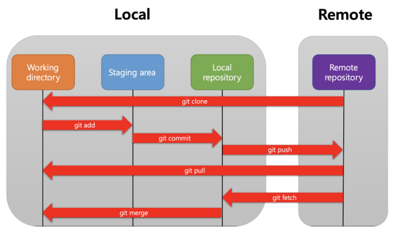

위에 보이는 것을 제외하고, 작업 중 이동할때 임시 저장용으로 주로 사용하는 *stash*라는 상태도 존재한다.

## PC 세팅 복습

기존 키 삭제 후

`ssh-keygen -t ed25519 -C "tpingouin@gmail.com"`

`cat ~/.ssh/id_ed25519.pub`

`git clone git@github.com:choibigo/RWL_Intern.git`

`git remote -v`

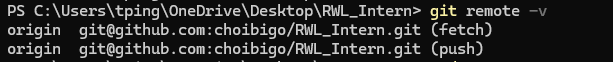

## 기본 명령어 복습

`git status`

`git add .\to_workspace\basic\`

`git commit -m "First commit: Start from basic"`

`git push origin main`

`git switch <branch 이름>`

> checkout으로도 브랜치 전환은 됨. 하지만 checkout 기능이 너무 많아서 요즘 브랜치간의 이동 및 생성은 switch을 권장하는 편.

|명령어| checkout | switch |
|:---:|:---:|:---:|
|커밋 이동| `git checkout 6cb87bb`| 놉 |
|브랜치 이동| `git checkout main` | `git switch main`|
|브랜치 생성하여 이동|`git checkout -b new_branch` | `git switch -c new_branch` |

참고로 리포지토리 하나 클론하고 다른 브랜치가 안보일때, 그냥 그 브랜치로 switch하면 알아서 찾음.

# 유용한 명령어 익히기

`git show` = 마지막 커밋 정보 출력

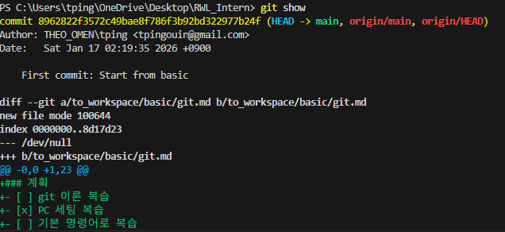

`git show 커밋명` = 해당 커밋 정보 출력

`git log -p` = 커밋 로그 + 개별 변경점 전부 출력

`git diff` = add 전에 어떤 것들이 변경 됐는지 출력

`git commit --amend -m "새로운 메시지"` = 이전 커밋 메시지 수정 (*단, 이미 remote까지 푸쉬가 됐다면 --force으로 강제로 덮어씌워야함, 협업 브랜치에서는 금지!*)

`git config --global core.editor "code --wait"` = Vim 대신에 vscode 사용해서 편집하기


## stash 실습

만약 커밋되지 않은 작업 내역이 있다면 다른 곳으로 checkout시 abort가 뜬다. (스테이지가 되도 안된다. 무조건 커밋이 되야한다.)


- 위 경우를 위해 stash이라는 임시저장공간에 현재 변경을 임시 저장 할 수 있다!

`git stash`

```bash
PS C:\Users\admin\Desktop\RWL_Intern> git stash
Saved working directory and index state WIP on to_basic_git: d3fc4c5 Complete rebase md
```

하지만 이 경우 **현재 변경점들이 사라진다는** 것을 인지하고 있어라.

그리고 VScode이 현재 상태들을 **다 저장하지 않으면** 이 사라진 상태를 창에 **반영하지 않으니**, 꼭 **저장하고 stash를** 해라.

`git stash list`를 저장된 stash 리스트를 볼 수 있다.

```bash
PS C:\Users\admin\Desktop\RWL_Intern> git stash list
stash@{0}: WIP on main: 8458f56 commit for rebase 0
stash@{1}: WIP on to_basic_git: d3fc4c5 Complete rebase md
```

- `git stash pop`이나 `git stash apply`을 통해서 저장된 것을 다시 꺼내 사용할 수 있다. pop으로 꺼낼시 stash은 그대로 삭제되고, apply는 적용되고 stash가 삭제되지 않는다.

하지만 주의해야할 것은 pop이나 apply시 **마지막**으로 저장된 stash **부터** 꺼내는 것이다. 해당 커밋이나 브랜치에서 했던 stash를 꺼내는 것이 아니다. (stack 처럼 쌓이는 것이다)

특정 stash를 꺼내고 싶으면 `git stash pop "stash@{1}"` 이렇게 stash 이름을 작성하면 된다. (" "이 있어야 함)

- `git stash drop "stash@{0}"`을 통해 특정 stash를 삭제할 수 있다.

- `git stash clear`는 모든 stash 삭제.

### 만약 pull시 이것저것 때문에 충돌이 발생했다?
`git stash -u` = 추적이 안되는 파일까지 stash (u추가 필요)

`git pull origin main` = 충동할 것이 없으니 pull

`git stash drop` = stash 삭제

## Rebase - 커밋 압축
커밋이 너무 많아질때 이를 유지보수하기 좋게 rebase를 이용하여 여러 커밋을 하나로 압축할 수 있다.

`git rebase -i`

이미 푸쉬를 했다면 --force 필요. 

개인 작업 브랜치에서 작업할 때 유지보수를 위해 rebase해도 상관없지만, 만약 공동 브랜치에서 rebase를 했다가 다른 사람과 커밋이 꼬이면 지옥의 merging 작업 펼쳐질 수 있기 때문에 각별한 주의가 필요하다. 그러니 공동 브랜치에서는 가급적으로 rebase을 사용하지 말아라.

- **개인** branch에서 한번 rebase를 해보자.
<div align="center">
  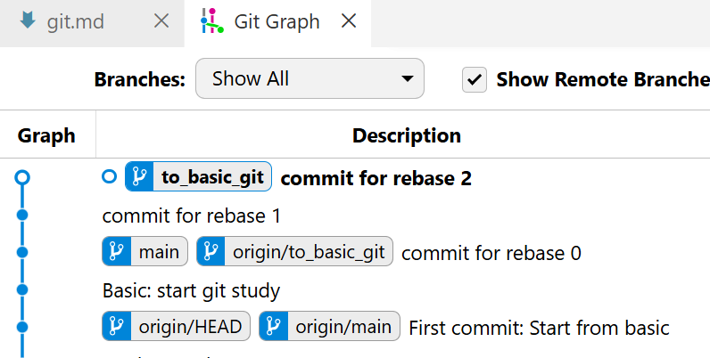
</div>
일단 commit for rebase 0,1,2를 만들었다.

- 푸쉬를 하면 리모트에 잘 올라가는 것을 볼 수 있다.
<div align="center">
  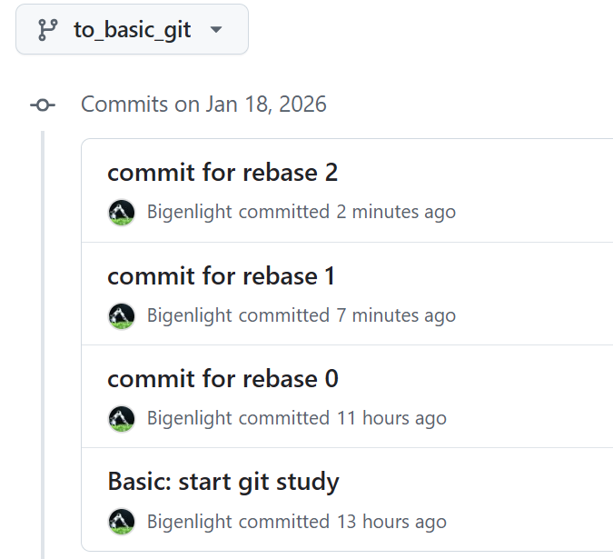
</div>

- 이제 rebase를 해보자.

`git rebase -i HEAD~3`

<div align="center">
  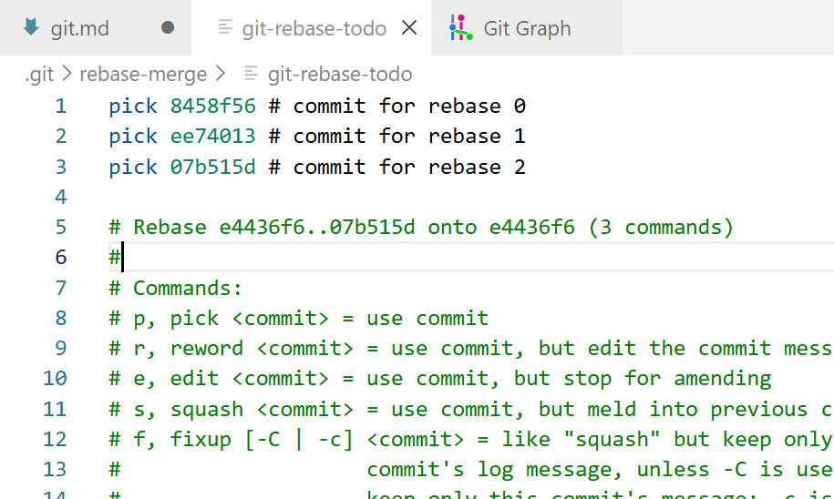
</div>

그러면 vscode으로 편집할 수 있는 상태가 나온다. (디폴트는 Vim)
- 여기서 커밋들을 개별적으로 편집할 수 있다. 이번에는 처음 것을 제외하고 squash해보자.
```
pick 8458f56 # commit for rebase 0
s ee74013 # commit for rebase 1
s 07b515d # commit for rebase 2
```
위를 위해 없앨 커밋 앞에 pick을 s(squash)으로 변경한다.

> 참고로 이 경우 위에만 꼭 pick으로 남고 나머지가 squash 되야한다.

> squash의 경우 애초에 이후 커밋이 이전 커밋으로 녹여낸다는 의미이다. 즉, 이후의 커밋들을 squash 해야한다.

<details>
<summary>그러면 왜 이런식으로 편집하게 만들었을까?</summary>
그거는 많은 양의 커밋들을 squash해야하고, 어떤 커밋이 어느 커밋으로 squash할지 일일이 정할수 있도록 만들었기 때문이다.

- 예를 들어 아래의 경우 처음 위의 커밋은 그냥 그대로 있고. 그 다음 커밋이 이후 2개를 흡수. 5번째 커밋이 이후 3개를 흡수하는 방식으로 끝난다.

```
pick 2be7f74 Commit for bisect 0
pick 365450b Commit for bisect 1
s 07e70fb Commit for bisect 2
s 4fd0272 Commit for bisect new test 0
pick 3ca7067 Commit for bisect new test 1
s 048f8ed Commit for bisect new test 2
s 4a46a78 Finish bisect test
s 980d96f Update git md
```

그래서 커밋이 8개에서 3개로 줄어든다 (하나는 그냥 그대로, 잘못 들어갔을 수도 있으니).

물론 이런식으로 하면 이후에 이름을 설정하는 창도 2번 뜬다.
</details>

<br>

- 위 창을 닫으면 이제 다음 창으로 넘어간다
<div align="center">
  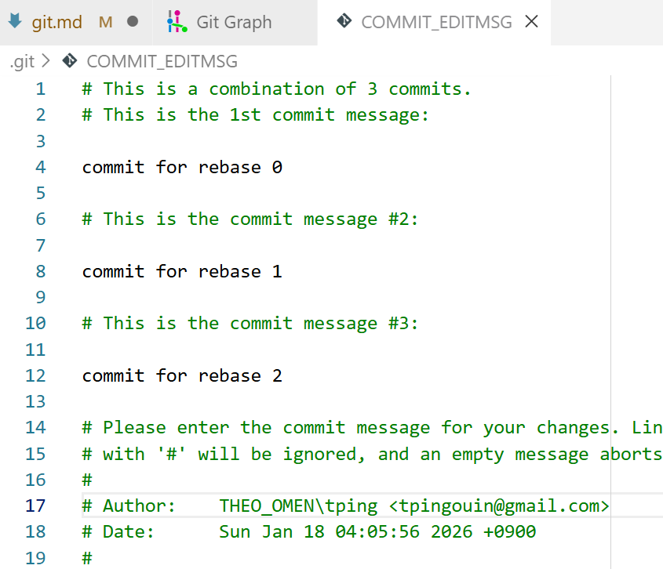
</div>
위 내용을 다 지우고 새로운 커밋명을 작성한다. (이렇게 안하면 선택한 커밋이 제목명으로 남고, 나머지는 본문명으로 들어간다.)
<div align="center">
  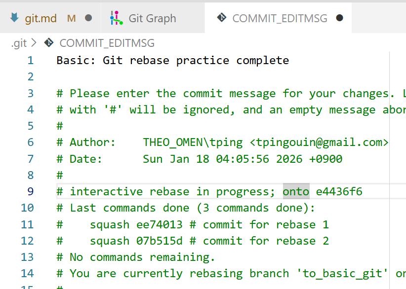
</div>

- 위 창도 닫으면 변경점이 적용됐다는 것을 볼 수 있다.
<div align="center">
  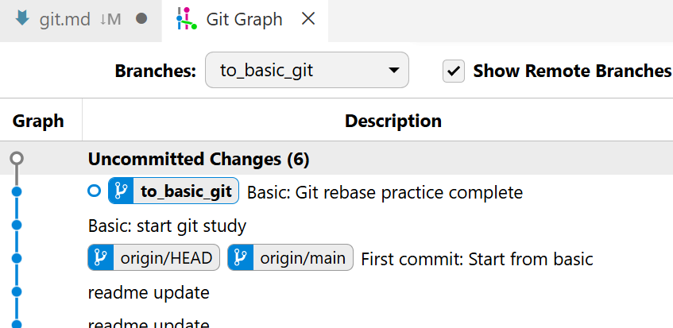
</div>
(브랜치 변경해서 보자)

- 마지막으로 리모트에 푸쉬해주자. `git push origin to_basic_git --force`
<div align="center">
  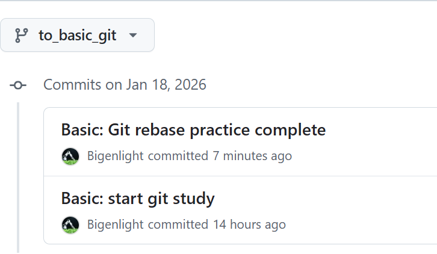
</div>
그러면 리모트에도 적용이 깔끔하게 된다.

## Worktree - 개별 워크스페이스 생성
그동안 현재 코드와 이전 레거시 코드, 또는 다른 브랜치를 비교할 때 현재 변화를 stash에 올려 checkout으로 이동하여 비교하거나, 아니면 아예 clone을 하는 방식을 취했다.

이 clone 방식을 쉽게하는 방식이 **worktree**를 이용하는 방식이다.

- Worktree는 마치 현재 워크스페이스와 별개로 새로 클론한 리포랑 같다.
  > 다만 복수의 worktree가 같은 브랜치를 **동시에 볼 수는 없다**.

  > Git이 헷갈리지 않게, 현재 git 리포 **바깥에** 워크트리를 새로 생성하는 것이 바람직하다.

- 워크트리를 추가해보자.

`git worktree add <경로> <브랜치명>`

RWL_fix이라는 워크트리는(또는 새로운 워크스페이스) 상위 폴더에 추가해보자(현재 폴더 밖에). 

생성된 worktree는 main 브랜치 기준으로 생길 것이다. (기존 브랜치명이 아니면 새로 생성됨)

`git worktree add ../RWL_fix main`

```bash
# 워크트리 생성
PS \RWL_Intern> git worktree add ../RWL_fix main # main 브랜치 기준으로 생성
Preparing worktree (checking out 'main')
HEAD is now at 8458f56 commit for rebase 0

PS \RWL_Intern> cd .. # 이동
PS > cd .\RWL_fix\

PS \RWL_fix> git branch # 브랜치 확인
* main
+ to_basic_git
```
- 기존 폴더 위치가 바탕화면이라 옆에 나란히 생긴 모습.

<div align="center">
  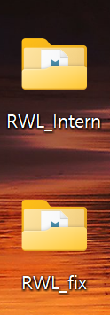
</div>

- 개별적으로 vscode을 켜서 관리하면 끝!

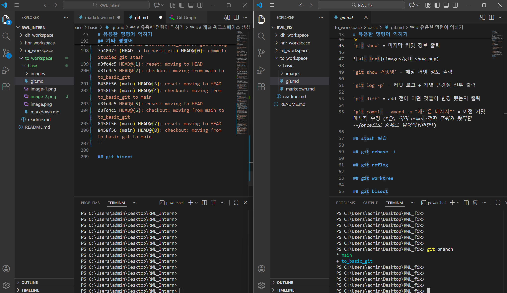

- 현재 가동중인 워크트리 리스트 출력. 

`git worktree list`
```bash
PS C:\Users\admin\Desktop\RWL_fix> git worktree list
C:/Users/admin/Desktop/RWL_Intern  7a4047f [to_basic_git]
C:/Users/admin/Desktop/RWL_fix     8458f56 [main]
```

- 만약 워크트리를 삭제하고 싶으면 그냥 폴더를 삭제하는 것이 아니라 명령어로 수동 제거를 해야한다.(아니면 유령 워크트리가 남는다.)

`git worktree remove ..\RWL_fix\`

(아니면 폴더 수동으로 삭제하고 `git worktree prune`)

- 혹시 시작 worktree가 어디인지 궁금하면 `type .git`을 치면 된다.
```bash
PS C:\Users\admin\Desktop\RWL_fix> type .git
gitdir: C:/Users/admin/Desktop/RWL_Intern/.git/worktrees/RWL_fix
PS C:\Users\admin\Desktop\RWL_fix>
```
## Bisect - 오류 자동 추적
Git에 커밋별로 테스트를 자동으로 돌려 버그를 찾아주는 훌륭한 **bisect** 기능이 있다.

- 테스트를 위해 여러 간단한 코드를 만들자. images 폴더에 calc.py를 계속 업데이트하고, 인위적으로 버그를 내서 잡아보자.

- 커밋0: 잘 작동하는 함수
```python
def add(a, b):
    return a + b

if __name__ == "__main__":
    print(add(10, 20)) 
```

- 커밋1: 오류나는 코드
```python
# def add(a, b):
#     return a - b 

if __name__ == "__main__":
    print(add(10, 20))  # 버그 발생!
```

- 커밋2: 그냥 다음 커밋을 위한 변경점
```python
#calc.py
def add(a, b):
    return a + b

if __name__ == "__main__":
    print(add(10, 20)) 
```

이렇게 커밋을 3개 만들고.

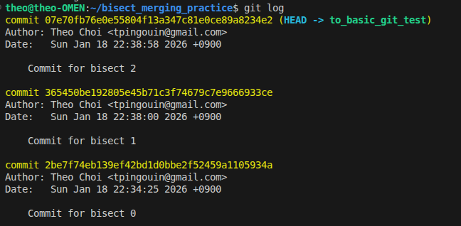

테스트 코드를 하나 만들자.

정상이면 0반환, 함수를 호출하고 사용했을 때 오류가 발생하면 1을 반환한다.

```python
# test.py
import sys

try:
    from calc import add
    r = (add(10, 20) == 30)
except Exception:
    print("Failed!")
    sys.exit(1) # 오류로 1반환

else:
    if r: 
        print("Success!")
        sys.exit(0) # 만약 True가 들어왔다면 성공으로 0반환
    else:
        print("Failed!")
        sys.exit(1)
```

- 이제 bisect을 하기 위해 다음 명령어들을 순서대로 실행한다.

`git bisect start` = 해당 명령를 실행하면 bisect을 위한 detached branch으로 진입한다.

`git bisect bad HEAD` = 버그가 발견된 곳의 커밋을 작성한다. 지금 발견했으니 일단 HEAD로(현재) 작성.

`git bisect good HEAD~2` = 정상이었을 때를 적는다. 2커밋 전에는 정상이었다.

`git bisect run python3 to_workspace/basic/images/test.py` = 이제 파이썬 테스트 코드를 실행한다. 이렇게하면 git 커밋을 이동하면서 알아서 다 테스트 코드를 돌려봐준다.

- 그러면 다음과 같이 결과가 나온다.

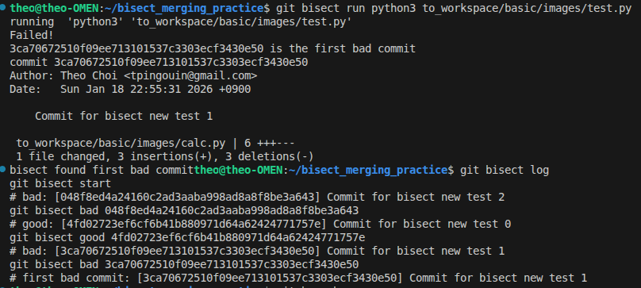

`git bisect log`를 하면 일일히 돌려봤을때 결과가 good인지 bad인지 체크해주는 것을 볼 수 있다.

`git bisect reset` = bisect 종료하고 돌아가기. 지금은 bisect용 개별 브랜치이 들어와있다. Bisect는 추적을 위한거지 수정을 위한 기능이 아니다, HEAD으로 다시 돌아가서 버그를 수정해주자.


## 기타 명령어

`git reflog` = 헤드 이동 이력을 볼 수 있다.
```bash
PS C:\Users\admin\Desktop\RWL_Intern> git reflog
7a4047f (HEAD -> to_basic_git) HEAD@{0}: commit: Studied git stash
d3fc4c5 HEAD@{1}: reset: moving to HEAD
d3fc4c5 HEAD@{2}: checkout: moving from main to to_basic_git
8458f56 (main) HEAD@{3}: reset: moving to HEAD
8458f56 (main) HEAD@{4}: checkout: moving from to_basic_git to main
d3fc4c5 HEAD@{5}: reset: moving to HEAD
d3fc4c5 HEAD@{6}: checkout: moving from main to to_basic_git
8458f56 (main) HEAD@{7}: reset: moving to HEAD
8458f56 (main) HEAD@{8}: checkout: moving from to_basic_git to main
```

`git branch -d <삭제할 브랜치명>` = 브랜치 삭제. 사용이 끝난 브랜치는 깔끔하게 삭제해두자.