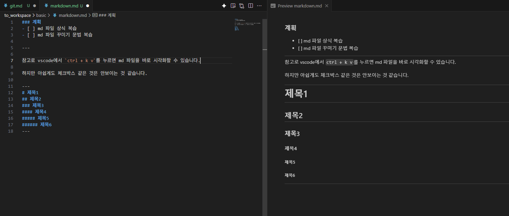

### 계획
- [x] md 파일 상식 복습
- [x] md 파일 꾸미기 문법 복습 

---

# Markdown
텍스트 기반의 마크업 언어로, 쉽게 읽고 작성할 수 있으며, HTML 등의 다른 형태로 변환하기 용이하도록 개발됐다.

`.md`를 작성하여 간단하게 이용 가능하다.

> 참고로 마크업 언어는 어떻게 보여야하는지 설명하는 언어. 대표적인 것이 HTML. 특징으로 태그를 주로 사용 (`<b>안녕</b>`). 

옵시디언이나 노션도 기본적으로 md 문법 기반으로 작동한다.

---

# MD 팁

참고로 vscode에서 `ctrl + k v`를 누르면 md 파일을 바로 시각화할 수 있습니다.




## 코드 블록 언어 이름 추가

```
    ```python
    import numpy as np
    print(&quot;Hello Robot&quot;)
    ```
```

```python
import numpy as np
print(&quot;Hello Robot&quot;)
```
cpp, python, md, bash, json 등을 붙여서 적용 가능

<details>
<summary>코드 변경점 작성시</summary>

언어 자리에 `diff`을 작성
```diff
- old_function()
+ new_function()
```

</details>

## 접기

```md
<details>

<summary>접기 이름</summary>

숨겨진 내용 작성

</details>
```
<details>
<summary>내용이 궁금하면 이곳을 누르시오</summary>

---

# 아머드 코어 6 루비콘의 화염 추천합니다.


</details>

## 표 작성
```md
|a|b|c|d|
|:---:|:---:|:---:|:---:|
|A|B|C|D|
|1|2|3|4|
```
|a|b|c|d|
|:---:|:---:|:---:|:---:|
|A|B|C|D|
|1|2|3|4|

## 수식
`$수식$`으로 인라인 수식 표현 가능: $x^2 = y$
또는 `$$`를 이용하여 블록 수식 구현 가능.
```
$$
\sum_{i=1}^{n} x_i
$$
```
$$
\sum_{i=1}^{n} x_i
$$


## 제목은 6개 분류까지 제공한다 
<details>
<summary>자세히 보기 </summary>

# 제목1
## 제목2
### 제목3
#### 제목4
##### 제목5
###### 제목6

####### 제목7

</details>

아래에 줄이 생기는 것은 2번까지이다.


## 인덱싱

아래와 같이 `1.`만 작성해도 인덱싱이 자동으로 된다. 굳이 번호를 재입력하는 수고를 덜 수 있다.
```
1. a
1. b
1. c
```
실제 아웃풋:
1. a
1. b
1. c

## 줄바꿈
엔터를 한번만 누르면 md 파일에서 줄바꿈으로 보여도 실제로는 띄어쓰기로 보인다.

다음과 같이 작성시
```
안
녕
```
아래와 같이 보임

안
녕

엔터를 두번 쳐야 줄이 바뀐다.

## 인용문
`>`으로 인용문을 작성한다.

> 인용문을 작성한다.

## 링크 달기
1. 그냥 링크 그대로 추가하고 싶을 때는 `<link.com>`을 이용한다. <https://github.com/choibigo/RWL_Intern/tree/main>
1. 아니면 글 안에 `[하이퍼 링크를](link.com)` 달 수 있다. [이렇게](https://github.com/choibigo/RWL_Intern/tree/main)

## 이미지 추가
이미지는 `` 이렇게 추가한다.
다만 정리를 위해 주로 images 폴더를 따로 만들어 안에 이미지를 보관한다.

## 이미지 정렬 및 크기 조절
아쉽게도 기본 md는 부가 이미지 설정을 지원하지 않는다. 그렇기에 HTML에서 설정을 빌려오자.
```html
<div align="center">
  
</div>
```

## 파일 관리 팁
만약 어떤 폴더의 명칭은 한꺼번에 전부 바꾸고 싶으면?

`Get-ChildItem *.png | Rename-Item -NewName { "git_" + $_.Name }`

위 명령어를 사용하면 된다. 아마 여러 이미지를 추가하고 위치를 바꿀때 사용할 것이다.

## 기타
- **볼드체** `**글**`
- *Italic* `*글*`
- ~~취소선~~ `~~글~~`

---