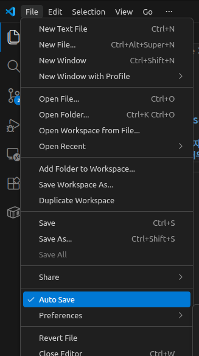
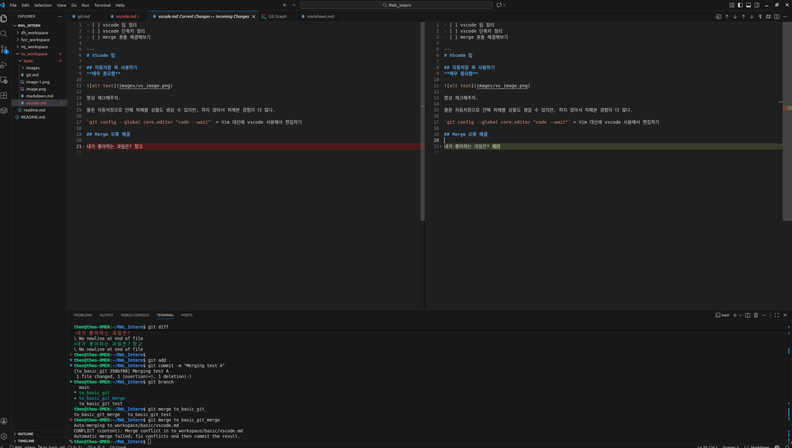
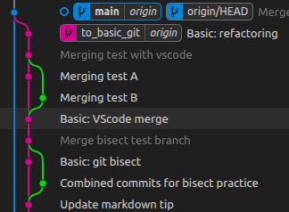
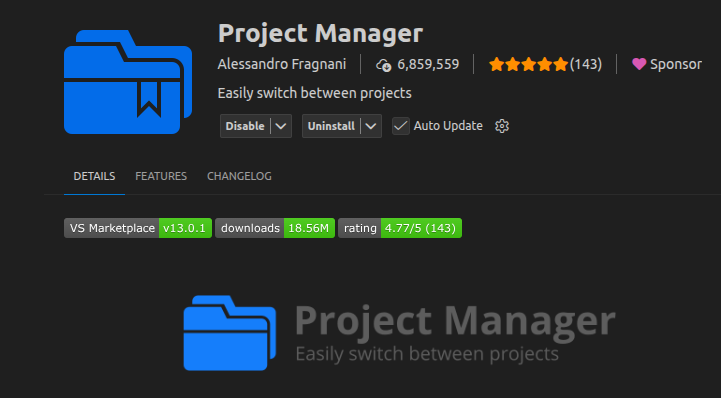
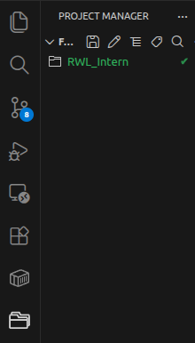
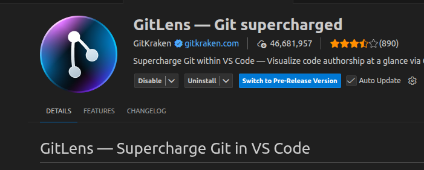
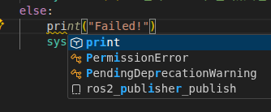
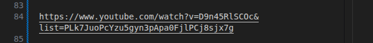
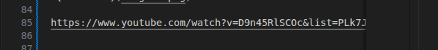
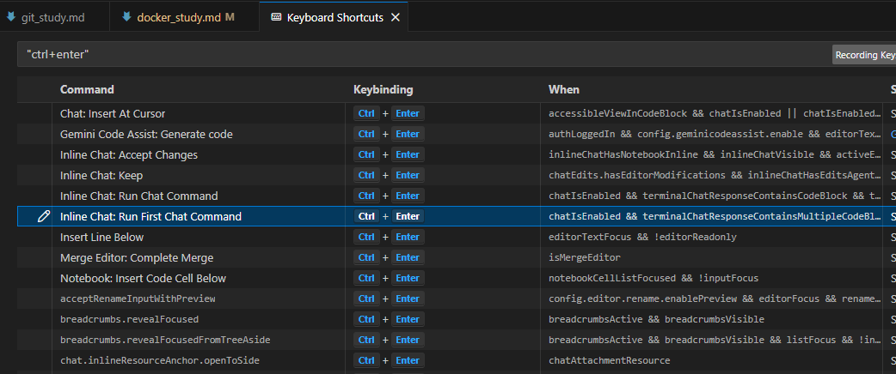

### 계획
- [x] vscode 팁 서치
- [x] vscode 단축키 정리
- [x] merge 충돌 해결해보기

---
# VScode 팁

## 자동저장 꼭 사용하기
**매우 중요함**

항상 체크해주자.

물론 자동저장으로 인해 피해볼 상황도 생길 수 있지만, 하지 않아서 피해본 경험이 더 많다.

## VScode를 깃 디폴트 편집기로 이용하기 (**중요**)

`git config --global core.editor "code --wait"` = Vim 대신에 vscode 사용해서 편집하기

## Merge 오류 해결

VScode에서 branch merge를 간편하게 해결할 수 있다.

- 먼저 merge를 받을 브랜치로 이동한 뒤

`git switch main`

- merge 수행

`git merge to_basic_git`

- 이때 git에서 vscode 편집을 디폴트로 세팅했다면 창에 바로 merge 편집 세팅이 뜬다.

- 그리고 충돌이 있다면 수동으로 merge를 진행하면 된다.

- 보통 다음 버튼 중에 누르면 된다.

    Accept Current Change: merge 받을 브랜치의(현 브랜치) 변경을 살리고, 들어오는 브랜치 변경은 버림.

    Accept Incoming Change: 들어오는 브랜치 코드를 살리고, merge 받을 브랜치 코드는 버림.

    Accept Both Changes: 둘 다 남김 (위아래로 붙여줌).

> 참고로 아래 처럼 둘다 비교하는 창으로도 들어올 수 있는데(compare 사용 시), 이때 수정은 안되고 보는 것만 된다. 확인한 뒤에 창 닫고 돌아가서 마저 수정하면 된다.
  

- 모든 충돌을 해결했다면 변경사항을 스테이지에 올리고, 커밋을 하면 끝난다.

`git add . `

`git commit -m "Merge done"`

그러면 이런식으로 예쁘게 merging이 된다.

### Project manager 익스텐션

그동안 여러 창을 켜둔 vscode 윈도우를 끄기 싫었지만 이제는 아니다.

프로젝트 매니저를 사용해서 현재 창들을 다 세이브하고, 나중에 한꺼번에 다시 꺼내 사용할 수 있다.

1. ctrl + p

1. `>pmsp` 입력

1. save project

우측 창에 세이브 됐다!

이제 vscode 윈도우를 끄고 새로 만들어도 해당 세이브를 가져오면 창들이 똑같이 열린다.

### GitLens
코드를 누가, 언제, 어떤 커밋에서 수정했는지 흐릿하게 볼 수 있음.

## 단축키 모음

ctrl + p : 파일 찾기

ctrl + ` : 터미널 열기

> 참고로 `의 명칭은 백틱이다.

ctrl + k v : md 파일 시각화

ctrl + shift + f : 폴더 전체에서 찾기

ctrl + l : 현재 라인 전체 선택

ctrl + d : 똑같은 글 동시 수정

ctrl + k ctrl + t : 테마 변경

**ctrl + enter** : 다음 줄에 공백 줄을 추가함. 들여쓰는거랑 다름 (이전 줄 중간에 있을 때 들여쓰면 줄이 잘리고 들여써짐).

ctrl + shift + enter : 위에 공백줄 추가

**ctrl + space** : 자동완성 선택 재오픈

ctrl + shift + space : 매개변수 정보 출력

**ctrl + shift + r** : 지정한 부분이 함수가 됨 or 변수로 담아쓰기 or 다른 파일로 옮기기.

alt + 위아래 방향키 : 선택한 것들 이동

alt + 여기저기 드래그 : 다중 선택

alt + 여기저기 클릭 : 여기저기 클릭한 곳들이 전부 커서가 됨.

**alt + z** : 우측 끝까지 넘어가게 설정 / 넘어가지 않게 설정

### VScode ctrl+enter 중복 문제
원래 ctrl + enter는 아래에 빈줄을 삽입하는 것이었다.

하지만 만약에 코파일럿을 동시에 사용중이면 코드를 생성하는 것으로 해당 단축키가 바뀌어있다.

ctrl + k ctrl + s로 단축키를 확인할 수 있다.

충돌하는 기능은 Gemini Code Assist으로 해당 키를 변경해서 해결했다.

앞으로 Gemini Code Assist는 ctrl + alt + a로 바꾸기로 했다.

### VScode에서 분명히 있는데 특정 구문이나 단어가 잘 검색이 안된다면

아마 검색탭에서 보이는 `ab` 옵션이 활성화 돼서 그럴거다.

- 이 옵션이 켜져 있으면 전체 단어가 일치해야하만 검색이 된다.
  - 꺼두자.

> 참고로 그 옆에 있는 `Aa`는 대소문자 구분임.

> 그리고 `.*`은 정규표현식임 사용 옵션임. 예를 들어 `설.*요`를 검색하면 '설'로 시작하고 '요'로 끝나는 문장을 전부 찾음.