## 계획

- [x] Attention Is All You Need 정독
- [x] 모르는 부분 점검
- [x] 정리
- [x] 번역기 논문 구현

---

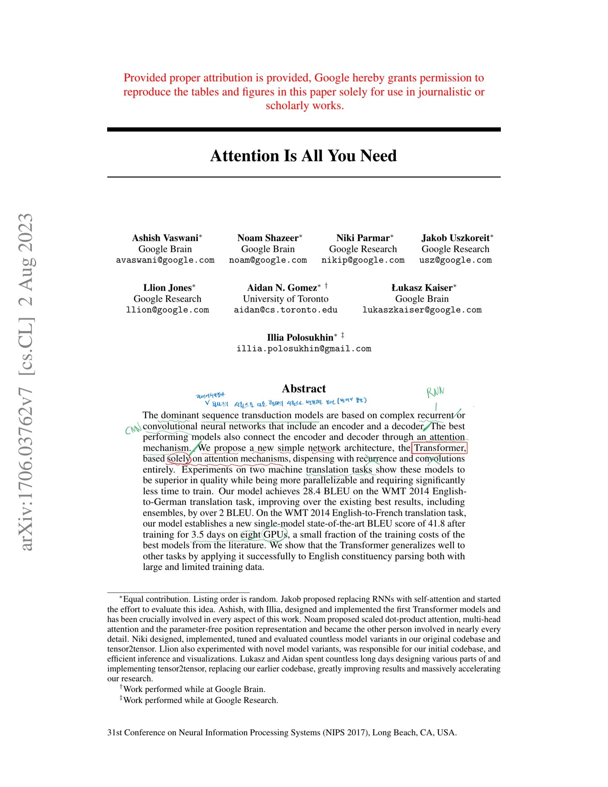

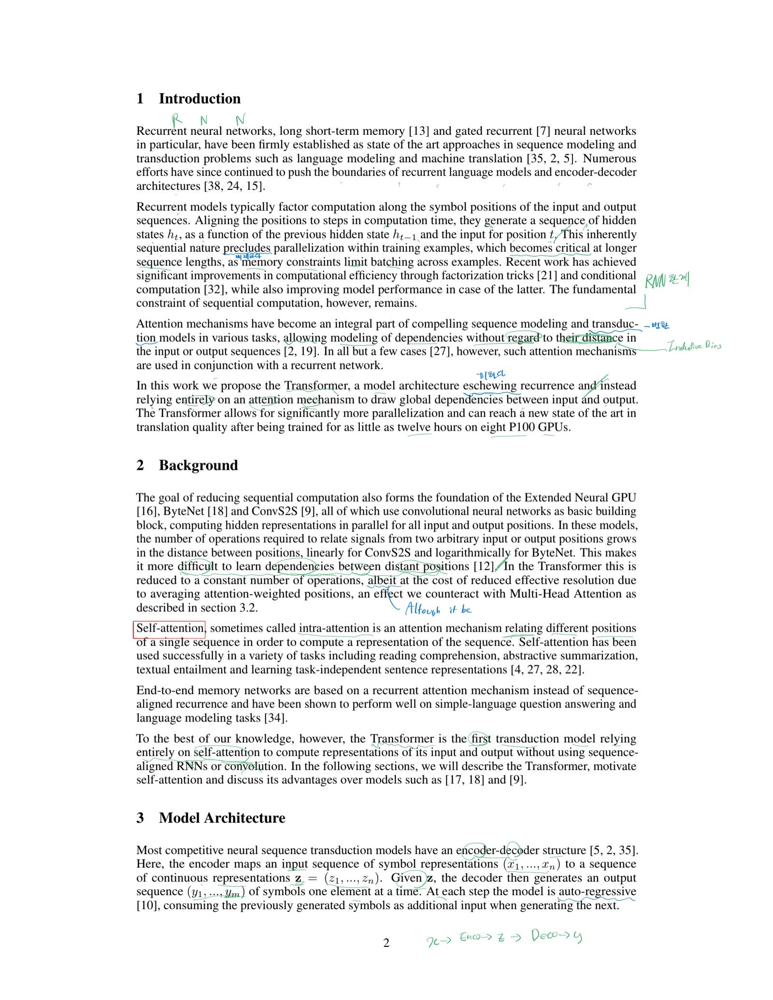

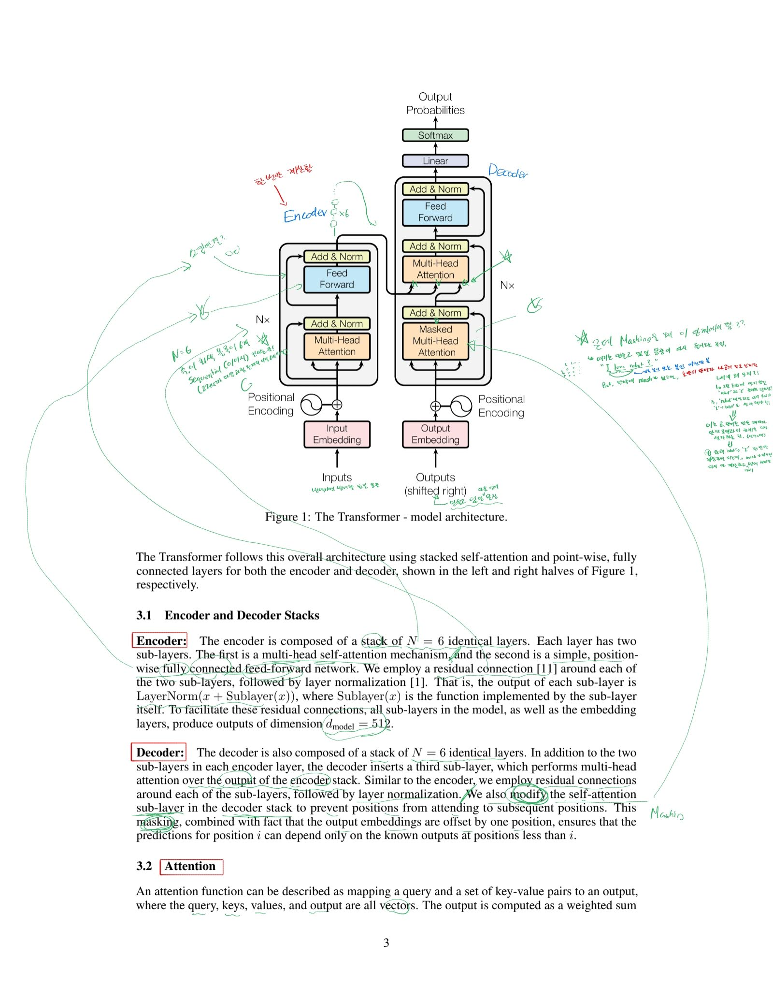

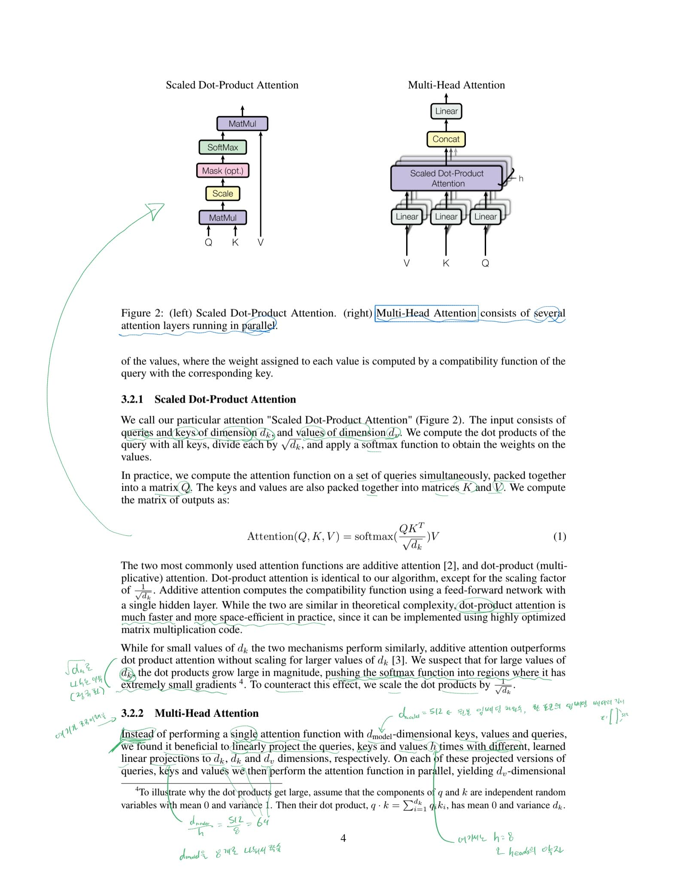

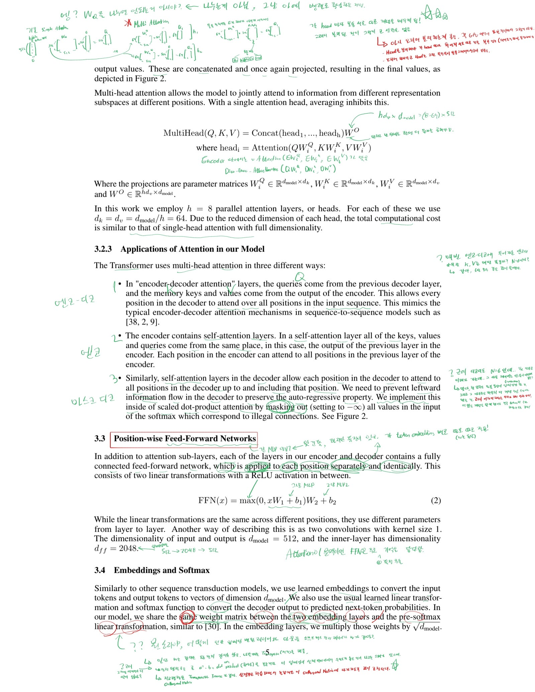

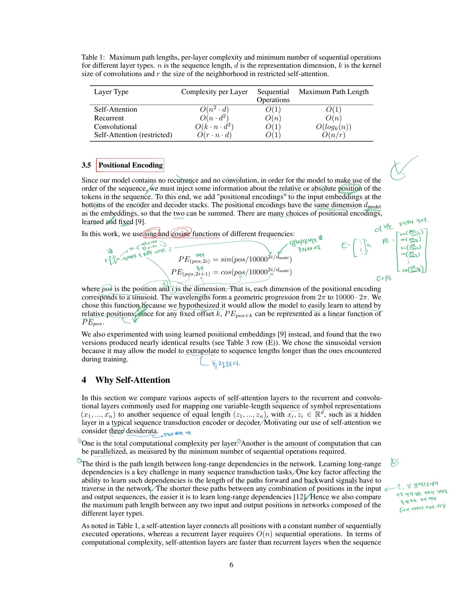

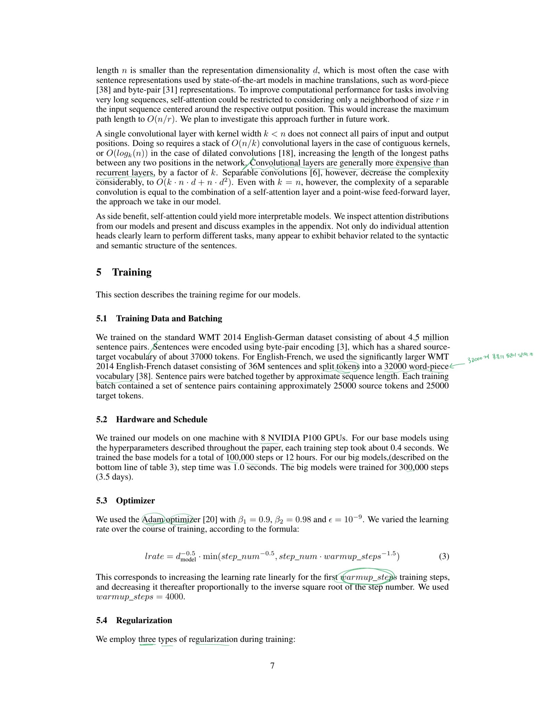

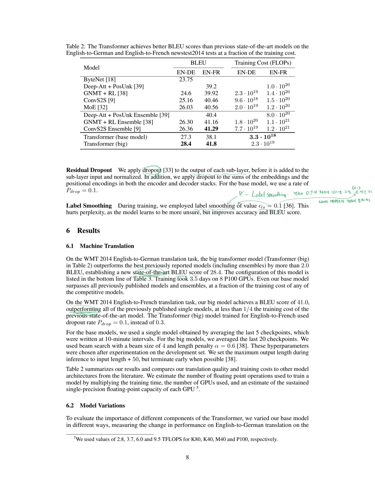

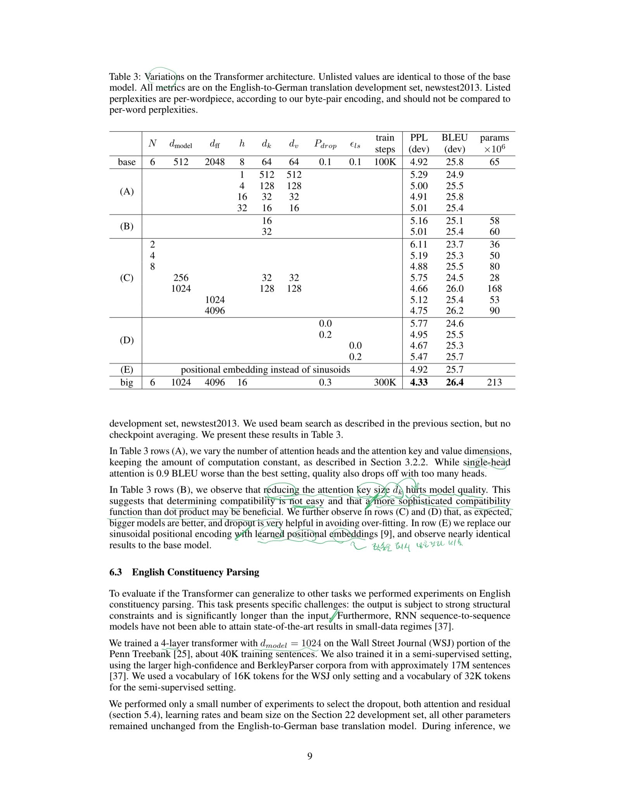

## Positional Encoding

(이쪽 부분이 태블릿으로 정리가 안돼서 따로 작성함)

RNN과 다르게 Attention 알고리즘은 순서와 위치에 대한 자각이 없다. 

- 그래서 수동으로 따로 위치에 대한 자각을 심어줘야한다. 마치 각 토큰에 라벨을 붙이는 것 처럼. 

- 아래 처럼 원래 인풋 임베딩에 그대로 Positional Encoding을 더한다.

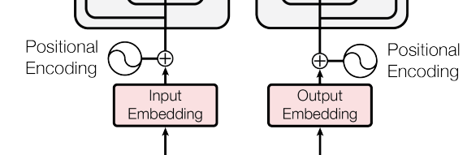

- Positional Encoding을 PE라고 하면 그냥 아웃풋이 $x = E + PE$ 가 되는 것이다.

> 이때 **각 토큰의 임베딩** 하나 하나가 **512 차원**으로 구성된 것을 잊지 말아라. 물론 **PE** 또한 이에 맞춰 **512개**의 더할 것을 준비한다.

- Positional Encoding의 공식 (위가 **짝수**용 공식, 아래는 **홀수**용):

$PE_{(pos, 2i)} = \sin(pos / 10000^{2i/d_{model}})$ 
$PE_{(pos, 2i+1)} = \cos(pos / 10000^{2i/d_{model}})$

- pos: 토큰, 또는 임베딩의 위치(또는 번호)

- $d_{model}$ : 512

- **i** : **(주목)** 각 토큰의 임베딩(512개 차원)의 요소들의 **인덱스**임. 이때 짝수가 0~255, 홀수도 0~255로 들어가면 **i가 0~255만 되도** 매번 **두개씩** 들어가서 **512개**를 만들 수 있음.

> 이 `i`를 통해 임베딩별로 다른 주파수를 가지게 될 수 있음 (sin/cos라도 512개 모두 서로 전혀 안겹치게 됨). 이를 통해 임베딩 요소들의 인코딩 위치가 겹치지 않고, 고유의 지문을 갖도록 만드는 것.

> 위 성질이 또 독특한 것을 만들 수 있는데, **초반의 임베딩 요소**들는 임베딩 위치(**토큰 위치**)에 따라 **단거리에서 더 민감하게** 움직이고 (물론 일정 이상 멀어지면 다시 초기화되지만, sin가 다시 내려오니). 인덱스가 큰, 즉 **후반 요소**들은 **멀리 있는 위치의 차이**를 더 잘 볼 수 있음. 

$\sin(pos/ 10000^{0/512})$ 의 그래프

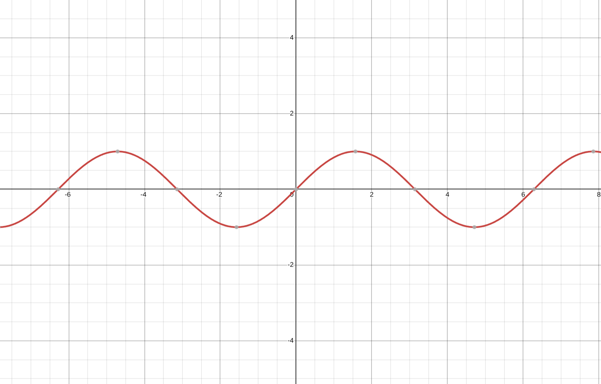
<image>

$\sin(pos/ 10000^{255/512})$ 의 그래프

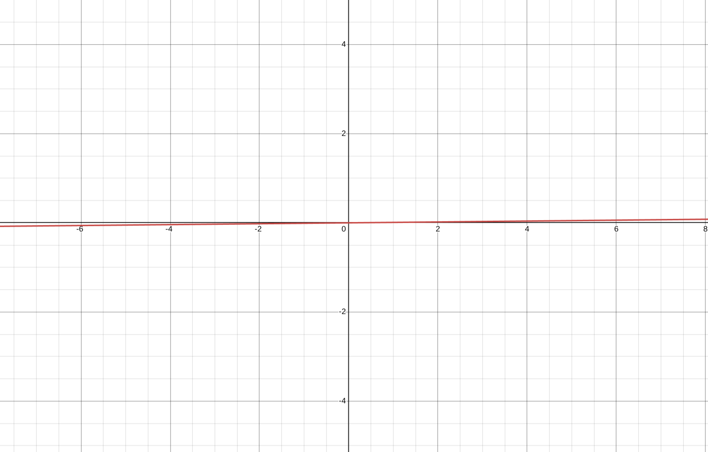

놀랍지 않냐? 와우!!

- 그러면 이제 $x = E + PE$를 통해 E에 위치 정보를 입력한다.

#### 하지만 왜 굳이 sin, cos를 고집했을까??

- 일단 $E + PE$를 넣어보고 한번 계산해보자.

- **Attention** 과정에서 **각 토큰**마다 서로의 상관하는 정도인 **Q**와 **K**의 곱셈 과정을 한번 봐보자.

$$Score_{i,j} = (E_i)W^Q \cdot ((E_j)W^K)^T$$

- 특정 임베딩 i와 j(토큰위치)를 보려고할때 원래 위와 같다고 볼 수 있는데, 이때 $E + PE$를 넣어서 한번 전개해보자. 정확히는 현재 i에 대한 j의 상관을 본다고 보는게 맞다.

$$Score_{i,j} = (E_i + PE_i)W^Q \cdot ((E_j + PE_j)W^K)^T$$

- 그러면 다음과 같이 4개의 항이 나온다!
    - $E_i W^Q \cdot (E_j W^K)^T$ (**단어 의미 $\leftrightarrow$ 단어 의미**) :위치와 상관없이 **토큰끼리** **의미**론적 상관 계산
    - $E_i W^Q \cdot (PE_j W^K)^T$ (**단어 의미 $\leftrightarrow$ 위치**) : **현재 토큰이 의미**상 이 **위치**에 있을 형용사를 얼마나 선호하는지 봄
    - $PE_i W^Q \cdot (E_j W^K)^T$ (**위치 $\leftrightarrow$ 단어 의미**) : **현재 위치**가 이 **형용사**를 선호하는지 봄.
    - $PE_i W^Q \cdot (PE_j W^K)^T$ (**위치 $\leftrightarrow$ 위치**) 현재 위치와 그 토큰 위치 <- **여기가 쥰네 핵심임**

- 똥싸다만 느낌이지만 잠시 삼각함수를 복습해보자.

이건 알것이다.

$\sin(A + B) = \sin A \cos B + \cos A \sin B$
$\cos(A + B) = \cos A \cos B - \sin A \sin B$

위 성질을 이용해 재미있는걸 만들어보자.

$\begin{bmatrix} \sin(c \cdot pos) \\ \cos(c \cdot pos) \end{bmatrix}$ 라는 벡터가 있을 때. 

그 벡터 pos에 k를 더한다고 가정해보자: $\begin{bmatrix} \sin(c \cdot pos + k) \\ \cos(c \cdot pos + k) \end{bmatrix}$ 

그리고 이를 이렇게 전개했을 때 위 벡터를 똑같이 만들 수 있다.

$$ \begin{bmatrix} \cos(c \cdot k) & \sin(c \cdot k) \\ -\sin(c \cdot k) & \cos(c \cdot k) \end{bmatrix} \begin{bmatrix} \sin(c \cdot pos) \\ \cos(c \cdot pos) \end{bmatrix} = \begin{bmatrix} \sin(c \cdot (pos+k)) \\ \cos(c \cdot (pos+k)) \end{bmatrix}$$

왼쪽 항을 봐라, 어디서 많이 본 형태 아니냐? -> 맞다! **그냥 회전 행렬**임!

즉, 놀랍게도 **내부에 더한 값**이 **회전**을 한 것과 **같은** 것이다.

- **다시 돌아와서** $PE_i$, $PE_j$가 각각 아래와 같이 생겼을 것이다. (c는 i로 곱한 개별적인 분수)

$$PE_{pos} = \begin{bmatrix} \sin(c_0 \cdot pos) \\ \cos(c_0 \cdot pos) \\ \sin(c_1 \cdot pos) \\ \cos(c_1 \cdot pos) \\ \vdots \\ \sin(c_{255} \cdot pos) \\ \cos(c_{255} \cdot pos) \end{bmatrix}$$

그리고 `j = i + k`라고 생각하면??

$PE_{i} = \begin{bmatrix} \sin(c_0 \cdot i) \\ \cos(c_0 \cdot i) \\ \sin(c_1 \cdot i) \\ \cos(c_1 \cdot i) \\ \vdots \\ \sin(c_{255} \cdot i) \\ \cos(c_{255} \cdot i) \end{bmatrix}$, $PE_{i+k} = \begin{bmatrix} \sin(c_0 \cdot i+k) \\ \cos(c_0 \cdot i+k) \\ \sin(c_1 \cdot i+k) \\ \cos(c_1 \cdot i+k) \\ \vdots \\ \sin(c_{255} \cdot i+k) \\ \cos(c_{255} \cdot i+k) \end{bmatrix}$

- 어? 근데 **sin, cos가 계속 반복**되네? 그러면 **위**에서 본걸 **응용**하면 되는거 아님?

맞다, 만족한다. 그냥 아래 처럼 만들면 된다. 가운데 회전 행렬을 $M_k$이라고 해보자.

$$PE_{i+k} = M_k \cdot PE_{i}$$

$M_k$는 다음과 같이 생길 것이다. 

$$M_k = \begin{bmatrix} \text{Rot}(c_0, k) & 0 & \dots & 0 \\ 0 & \text{Rot}(c_1, k) & \dots & 0 \\ \vdots & \vdots & \ddots & \vdots \\ 0 & 0 & \dots & \text{Rot}(c_{255}, k) \end{bmatrix}$$

여기서 $\text{Rot}(c_i, k)$는 각각 아까 본 $2 \times 2$ 회전 행렬임

- **그러면 다시 위에서 계산했던 Attention**의 **4번째 항**을 보자:

$PE_i W^Q \cdot (PE_j W^K)^T$

근데 위에서 나타냈던 대로 $PE_{j} = M_k \cdot PE_{i}$를 **대입**하면

$PE_i W^Q \cdot ((M_k \cdot PE_{i}) W^K)^T$

살짝 전개하면 다음과 같다. (선형대수)

$PE_i \cdot W^Q \cdot (W^K)^T \cdot (M_k \cdot PE_i)^T$

- 위 식을 보면 이렇게 생각할 수 있다: **Positional Embedding**은 결국 각 위치마다 서로 **회전**을(선형 변환) 추가하는 것. 그게 **출발점**임. (마치 residual의 출발점 처럼)
    - 그리고 거기에 각 $W^Q$, $W^K$가 추가돼서 이를 **튜닝**하는 것. 이 회전 기준으로 부터 얼마나 변경할지. 
    - 그리고 이걸 **각 임베딩 내부 요소별로** 개별적으로 다 보면서 결정함. 가까울 때는 가까운 것에 해당하는 요소를, 먼 곳은 먼 곳을 보는 요소를 개별적으로. (주파수가 달라 서로 맡는 것이 달라서 가능)

#### 근데 그러면 Transformer도 위치에 대한 자각이 있는거 아님? 왜 Inductive Bias로 자각이 없다고 함?

Positional Encoding은 Transformer 구조에 포함이 안되나?

- 아니다 포함된다. 하지만 그래도 없다고 또는 약하다고 하는 이유는 이를 **수동적**으로 **집어넣어야**해서 그렇다.

- CNN에게도 억지로 시간에 대한 관념을 집어넣는다고 해서 CNN이 시간에 대한 Inductive Bias가 있다고 말하지 않는다.

- **Inductive bias**는 어디까지나 **아키텍처 구조**에 대한 말이지, **입력 데이터 가공**에 대한 말이 아니다.

### Autoregressive?

**Autoregressive**(자기회귀) 모델은 말그대로 자기가 **생성한 아웃풋**을 다음 단계 **인풋**으로 다시 받는 모델을 말함.

### Cross? Self Attention?

- Decoder의 중간 단계 Transformer 처럼 **서로 다른 sentence의 서로간의** 상관을(문맥) 측정하는 Attention 과정이면 **Cross Attention**이라고 말함.

- Encoder이나 Decoder의 Masked 된 초반 Transformer은 **자기 자신** 속의 상관을 찾는거라 **Self Attention**이라고 부름