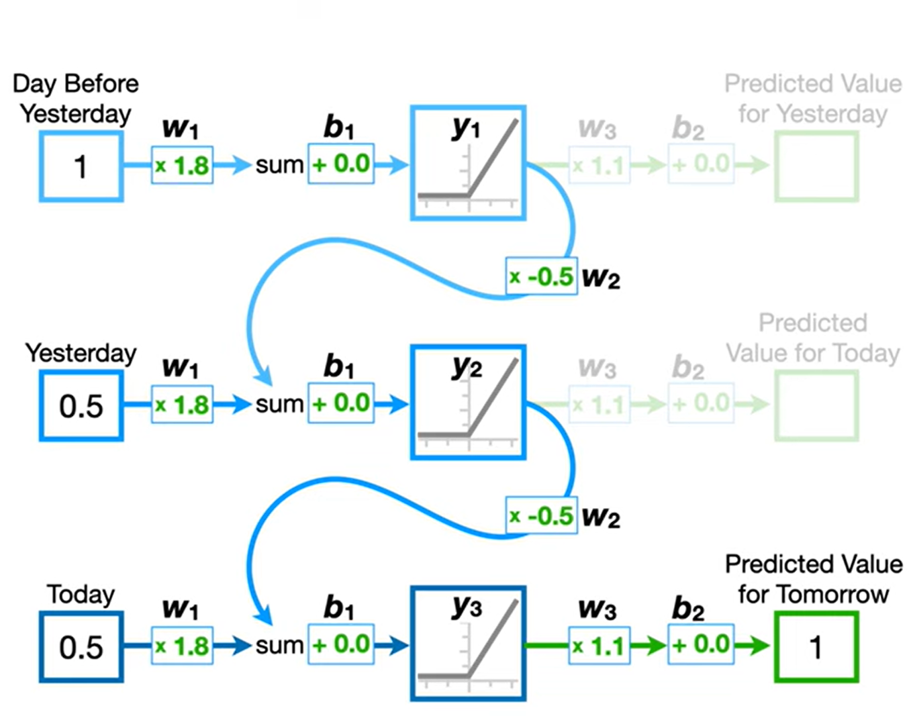

# Recurrent Neural Networks (RNNs) 

https://youtu.be/AsNTP8Kwu80?si=LTTvqACQVUHUAFFc

- 시점이 여러개인 데이터를 가지고, 다음에 나올 값을 예측할 수 있는 모델.

- 학습을 할 첫 시점을 일단 모델에 통과시킴.
- 근데 중간에 ReLU를 통과한 값을 저장함 (Hidden State라는 이름으로).
- 한 입력에 대해서 정상적으로 통과하고, 채점은 다음 시점이 정답이 되니 그걸로 채점하면 됨.
- 다음 시점 인풋으로 모델을 또 돌림. 이전에 저장했던 Hidden state에 w를 곱해서 첫 Affine 후 더함.
- 그대로 ReLU 통과하고 또 새로운 Hidden state 저장.
- 모델 통과해서 저장하고 이를 계속 반복.

- 시계열 데이터의 길이가 총 3개($t=1, 2, 3$)라고 가정
- RNN이 처음 가동될 때는 과거의 기억이 존재하지 않음. 그래서 보통 첫 은닉 상태($h_0$)는 모두 0으로 채워진 영벡터(Zero Vector)로 시작

$$h_0 = \begin{bmatrix} 0 \\ 0 \\ \vdots \\ 0 \end{bmatrix}$$

- 첫 번째 시점 ($t=1$) : 첫 입력이 들어왔을 때

기억 생성 ($h_1$): 첫 입력 $x_1$과, 방금 0으로 초기화했던 $h_0$를 결합해. ($h_0$가 0이므로 그 항은 그냥 `0`임.)

$$h_1 = \tanh(W_{hx} x_1 + W_{hh} h_0 + b_h)$$

첫 예측 ($y_1$): 방금 만든 $h_1$을 가지고 첫 번째 아웃풋을 뽑아내. (어차피 일단 저장할 hidden state이랑 실제 아웃풋은 같기 때문에 둘다에 활용하는 것)

$$y_1 = W_{yh} h_1 + b_y$$

- 두 번째 시점 ($t=2$) : 과거의 기억이 처음으로 쓰이는 순간

기억 업데이트 ($h_2$): 새로운 입력 $x_2$와, 방금 $t=1$에서 정성껏 만들어둔 **과거의 기억 $h_1$**을 결합해.

$$h_2 = \tanh(W_{hx} x_2 + W_{hh} h_1 + b_h)$$

두 번째 예측 ($y_2$): 과거($t=1$)와 현재($t=2$)의 정보가 모두 담긴 $h_2$를 바탕으로 아웃풋을 계산해.

$$y_2 = W_{yh} h_2 + b_y$$

- 세 번째 시점 ($t=3$) : 기억의 누적

기억 업데이트 ($h_3$): 새로운 입력 $x_3$와, $x_1$과 $x_2$의 정보가 응축되어 있는 **과거의 기억 $h_2$**를 결합.

$$h_3 = \tanh(W_{hx} x_3 + W_{hh} h_2 + b_h)$$

세 번째 예측 ($y_3$): 세 시점의 맥락이 전부 누적된 $h_3$로 최종 아웃풋을 계산해.

$$y_3 = W_{yh} h_3 + b_y$$

