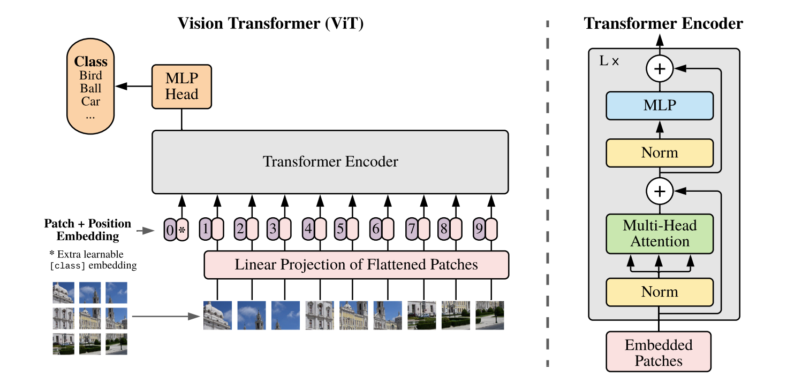
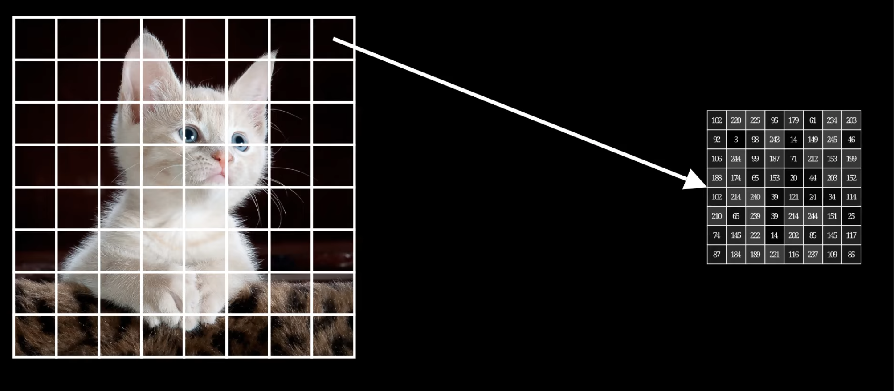
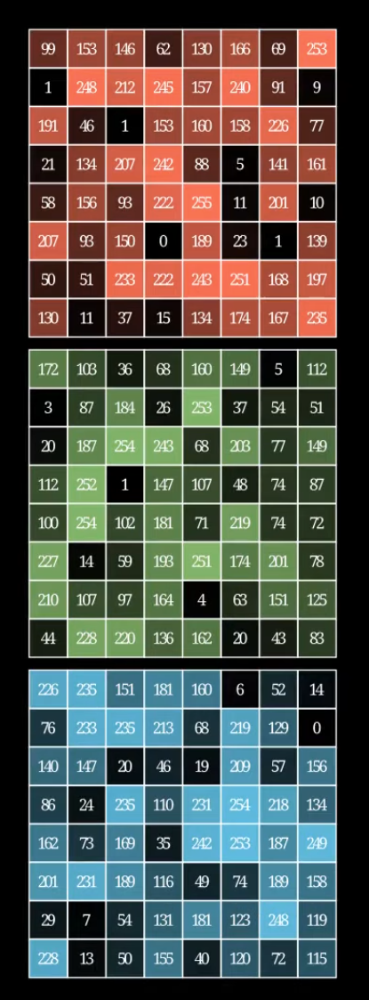
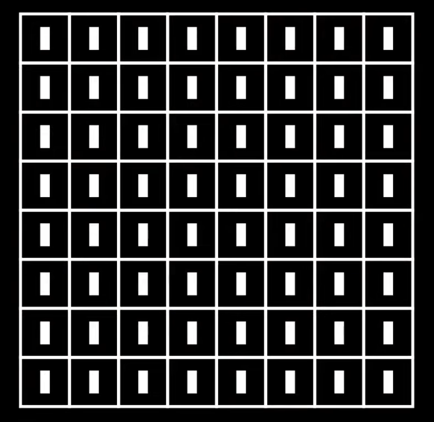
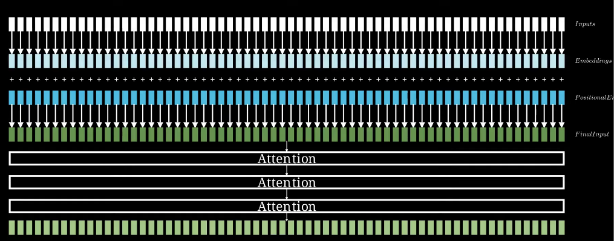

### 계획

- [x] ViT 공부계획
- [x] 영상 시청
- [x] 정리
- [x] 논문 발췌독

# ViT: Vision Transformer

AN IMAGE IS WORTH 16X16 WORDS: TRANSFORMERS FOR IMAGE RECOGNITION AT SCALE에서 제안됨.
https://arxiv.org/pdf/2010.11929

https://www.youtube.com/watch?v=vJF3TBI8esQ

- ViT는 그냥 인풋이 이미지인 Transformer임.

- 근데 이미지가 들어가니 이미지를 쪼개서 넣을 뿐.

이렇게 먼저 이미지를 여럿으로 쪼갠다. 각각의 조각들은 patches라고 부른다.

- 물론 RGB 이미지면 쪼갠 한 조각에 3개의 채널이 마찬가지로 있다.

- 0~255로 있던 값들은 전부 0~1로 정규화를 시키고.

- 이 조각을 (RGB 3개 채널 모두) 하나의 벡터로 평탄화 시킨다.

- 그리고 이를 모든 구역들의 조각에 똑같이한다.

즉, 지금은 나눠진 조각의 수 만큼 평탄화로 만들어진 벡터가 존재한다.

이 각 벡터들이 하나하나의 토큰이다. (또는 아직 임베딩이 덜 된 토큰)

- 이들을 이제 문장마냥 1열로 붙이면 된다.

- 이 토큰들을 하나의 학습 되는 선형 투영 (Trainable Linear Projection) 층을 통과함. MLP는 아니고 단일 레이어임. 이제 제대로된 임베딩이 됐음.
    - 이는 트랜스포머가 모든 레이어에서 단일 크기의 벡터를 사용하기 위해 이 패치의 임베딩의 크기를 D로 맞추기 위해서임.

- 여기에 Positional Embedding을(마찬가지로 학습) 더하고, Attention 블록을 돌린다.

#### 근데 이 많은 아웃풋 중에서 뭘 어떻게 해서 분류하냐고?

- ACT 때 배운 CLS을 여기에서도 사용함.

- 처음 부터 분류 전용 토큰을 하나 더 넣어서 학습했던거임.

- 벡터 크기가 D인 class 토큰을 추가하여 다른 이미지들과 정보를 교환함.
    - 최종적으로는 전체 이미지에 대한 전역적인 표현을 담게 됨.

- 종장에는 이 class 토큰만 뽑아서 MLP에 돌려서 분류를 완료함.

#### 멀티헤드는 사용하나?

- 여기서도 멀티헤드는 사용. 다만 모델마다 다름.
    ViT-Base: 12개
    ViT-Large: 16개
    ViT-Huge: 16개

> 참고로 멀티헤드 과정에서 더 작은 $W_Q$를 곱하는 것도 차원 축소 Linera Projection의 일종이기도함. (예를 들어 원래 64x512 $W_Q$에(원래 512x512) 512x1을 곱하면 64x1로 작아지니)

- 멀티헤드로 작아진 임베딩은 Multi head Attention 과정이 끝난 직후 (스킵 커넥션 합 전에) 바로 다시 concatenate 돼서 다시 합쳐짐.

### 위치 임베딩은 어떻게 했냐?

- NLP 분야의 트포가 sinusoidal 임베딩을 사용한 것과 달리, 학습에 기반한 위치 임베딩을 넣음.

- 애초에 더해지는 값이기에 그냥 bias가 하나 추가된 것 처럼 간단한게 학습됨.
    - 근데 놀랍게도 학습에 의해 약간 sinusoidal하게 보여지게 됨. (물론 항상 그런건 아님)

### Inductive Bias는?

- 일단 CNN 보다 매우 작음.

- 전역적 처리: 이미지 전 패치들이 전역적으로 처리되기에 위치를 다 볼 수 있음.

- 위치 관계 완전 백지 학습: 위치 임베딩도 학습해서 배우기에 초기에는 사실상 아예 공간에 대한 정보가 없음.
