### 계획

- [x] 디퓨젼 모델 공부 계획
- [x] 영상 시청
- [x] 논문 발췌독
- [x] flow matching

# Diffusion Policy

https://arxiv.org/pdf/2303.04137

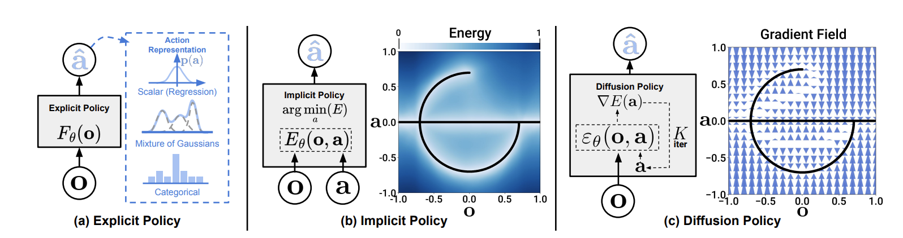

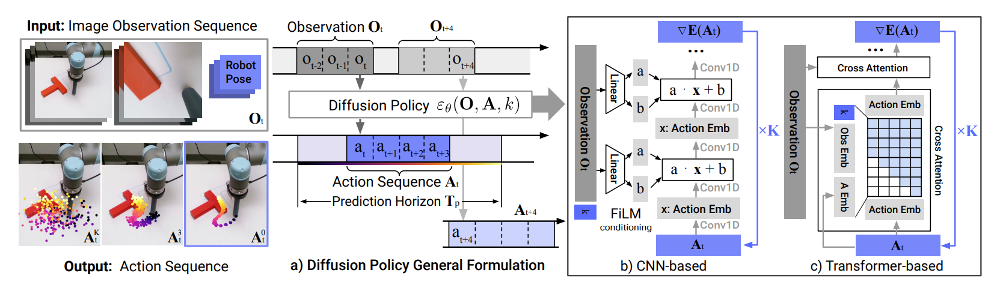

https://www.youtube.com/watch?v=firXjwZ_6KI

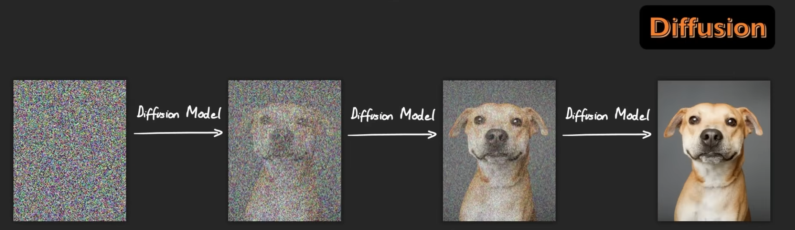

- 일단 이미지에서 랜덤한 이미지를 뽑는다고 가정해보자.

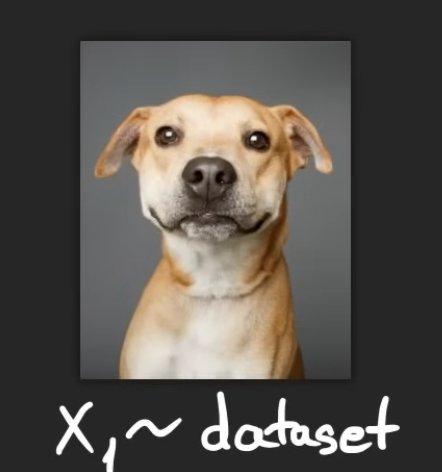

$X_1 \sim dataset$  
 
($X_1$이 데이터셋에 분포한다)

- 그리고 0과 1 사이의 랜덤한 시간 t를 뽑는다.

$t \sim U(0,1)$

이 t의 용도가 뭐냐고?

- `t=1`일때는 이미지가 원본이라고 가정하고. `t=0`일때는 풀 노이즈의 이미지라고 생각한다.

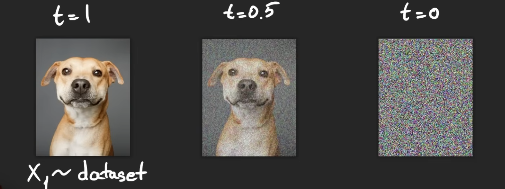

### Training

- 훈련은 원본 이미지 기준에서 시작한다.

- $t \sim U(0,1)$를 통해 0과 1 사이의 랜덤한 수 t를 뽑는다.

- 그리고 원본 $x_1$ 이미지에 뽑은 시간에 대한 노이즈를 추가하여(가우시안 노이즈) 노이즈가 포함된 이미지 $x_t$를 만든다. (참고로 t=1일때 원본인 것이다.)

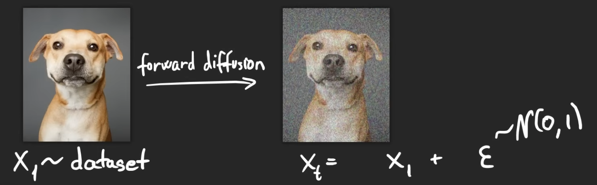

- 물론 이게 공식 전부는 아니고 $x_1$과 $x_t$를 둘다 스케일링 해야한다.

$$x_t = a_t x_1 + b_t \epsilon \quad$$

- 이때 $\epsilon \sim \mathcal{N}(0, 1)$, 즉 표준 정규 분포 가우시안 노이즈라는 뜻.
- $a_t, b_t$: $t$ 시점에 따라 결정되는 계수 (Noise Schedule에 의해 결정됨)
    - `t=1`이면 노이즈가 아예 없게 설정되고, `t=0`이면 완전한 가우시안 노이즈다.

- $\epsilon$: 평균이 0이고 분산이 1인 표준 정규 분포에서 샘플링된 가우시안 노이즈

- 노이즈 스케줄이 머임? -> 아래 자세히

#### 이 공식을 조금 더 단순화 시켜보자. 

$x_t = a_t x_1 + b_t \epsilon \quad$

- 일단 $\epsilon$의 분산은 $Var(\epsilon) = 1$ 이다.
- $x_1$도 결국 표준 정규화 과정을 통과한 이미지이기에, 이 또한 분산이 1이다. $Var(x_1) = 1$ 
- $x_t$는 그냥 분산이 1일거라고 **가정**, 또는 **강제**해서 계산하는 것이다. 이걸 가정하지 않으면 디퓨젼 모델을 못 품. $Var(x_t) \stackrel{!}{=} 1$

- 그러면 위 사실을 염두하고 전개를 해보자.

- 통계학에서 **독립**인(정규화된 이미지랑 디퓨젼 모델의 노이즌 당연히 서로 상관이 없다.) 두 변수의 합의 분산은 각각의 분산의 합과 같습니다.

$$Var(x_t) = Var(a_t x_1 + b_t \epsilon)$$

그러면 이렇게 만들 수 있음.

$$Var(x_t) = a_t^2 Var(x_1) + b_t^2 Var(\epsilon)$$

- 근데 기억하고 있겠지만 위에서 Var은 전부 0이다.

즉, 이것만 남는다.

$$1 = a_t^2 + b_t^2$$

오? 그러면 a,b를 하나의 변수로 줄일 수 있겠네?

- 편의를 위해 $\alpha_t := a_t^2$으로 치환하고 계산한다.

$$a_t = \sqrt{\alpha_t}$$

$$b_t = \sqrt{1 - \alpha_t}$$

- 최종적으로 식이 아래 처럼 간단해진다. 그리고 **이 식은 앞으로 자주 보게 될 것이다**.

$$x_t = \sqrt{\alpha_t} x_1 + \sqrt{1 - \alpha_t} \epsilon$$

- 이게 Forward를 평가하기 위한 공식임.

- 보통 U-net을 이용하고. 트포에 t를 위치 임베딩으로 넣어서도 구현할 수 있음.

- 그러면 일단 모델은 **t스텝**에 맞는 **노이즈가 들어간 이미지를 인풋**으로 받고, 여러 레이어를 거쳐 **아웃풋**으로 현 상태가 **얼마나 많은** 가우시안 **노이즈**를 원본 이미지에 알고보니 추가했을지 $\hat{\epsilon}$로 추정함.

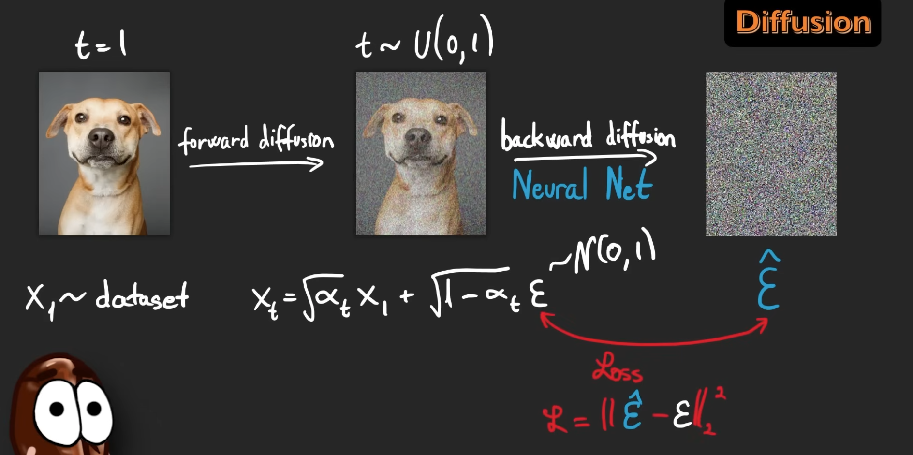

당연히 우리가 잡은 기준점, 이미지 더한 진짜 노이즈 $\epsilon$과 모델이 추측한 노이즈 $\hat{\epsilon}$은 **다를** 것이고. 이 둘의 **차이**를 구하는게 **Loss function**임.

- 다시 한번 정리하자면, 실제 학습은 특정 타임스텝을 랜덤으로 하나 집어 계산하는게 하나의 iteration임.
    1. 아무 타임스텝 $t$를 무작위로 하나 뽑습니다.
    1. 앞서 본 정답지 생성 공식 $x_t = \sqrt{\bar{\alpha}_t} x_1 + \sqrt{1 - \bar{\alpha}_t} \epsilon$ 을 써서 원본 데이터에 노이즈를 한 번에 들이붓고 $x_t$를 만듭니다.
    1. 모델에게 $x_t$를 주고 "여기에 들어간 노이즈 $\epsilon$이 뭐게?" 하고 추정값 $\epsilon_\theta$를 내놓게 합니다.
    1. 우리가 주입했던 정답 노이즈와 모델이 추정한 노이즈의 차이(MSE)만 계산해서 오차를 줄이고 끝냅니다.

- 그러면 모델이 현 **이미지**에서 **가우시안 노이즈**가 얼마나 있는지 상태로 **추정하는** 방법을 배우게 됨.
    - 근데 애초에 노이즈만 추정하는 것이니 쥰네 가벼울 수 밖에 없음.

- 이를 수많은 이미지, 수많은 t에 걸쳐서 학습하게 됨.

#### 근데 놀랍게도 평가식을 이항해서 정리하고, 노이즈를 얼마나 채웠는지 배운 모델 아웃풋을 그대로 이용하여 이미지를 복원하는 과정을 만들 수 있음.

원본:
$$x_t = \sqrt{\alpha_t} x_1 + \sqrt{1 - \alpha_t} \epsilon$$

- 보통 $\hat{x}_1$ 대신에 $\hat{x}_0$를 많이 쓰기에 바꿈. 알파를 누적곱인 $\bar{\alpha}_t$으로 바꿈.

- 그러면 이항만 하고 나누기만 하면 이렇게 됨. 

$$\hat{x}_0 = \frac{x_t - \sqrt{1 - \bar{\alpha}_t} \epsilon_\theta(x_t, t)}{\sqrt{\bar{\alpha}_t}}$$

- 그리고 여기서 어떻게 아래가 된다고? 베이지안 공식과 마르코프 체인을 사용해서 길게 전개하면 결국 나옴. 하지만 일단 넘어갈 것.

$$x_{t-1} = \frac{1}{\sqrt{\alpha_t}} \left( x_t - \frac{1 - \alpha_t}{\sqrt{1 - \bar{\alpha}_t}} \epsilon_\theta(x_t, t) \right) + \sigma_t z \quad \text{where } z \sim \mathcal{N}(0, I)$$

- $x_{t-1}$ (다음 목표): 현재보다 노이즈가 한 꺼풀 벗겨져, 원본에 한 발짝 더 가까워진 상태입니다.
- $x_t$ (현재 상태): 지금 우리가 들고 있는 노이즈 낀 데이터입니다. (추론의 맨 처음 단계라면 완전한 백색 소음입니다.)
- $\alpha_t$: 딱 **'이번 1스텝'**에서 원본 정보가 살아남은 비율 ($1 - \beta_t$).
- $\bar{\alpha}_t$ (알파 바): 처음부터 현재 스텝 $t$까지 '누적해서' 살아남은 원본 정보의 총비율 ($\alpha_1 \times \alpha_2 \times \dots \times \alpha_t$).
- $\epsilon_\theta(x_t, t)$ (**신경망의 출력**): **U-Net**(또는 Transformer)이 현재 상태 $x_t$를 보고 "여기엔 이런 노이즈가 껴있어!"라고 **추정해 낸 노이즈 값**입니다.
- $\sigma_t z$ (확률적 양념): $\sigma_t$는 미리 정해둔 분산의 크기이고, $z$는 무작위 가우시안 노이즈입니다. 단순히 계산된 평균으로만 직진하지 않고, 주변을 살짝 무작위로 탐색하게 만들어줍니다. -> 이를 통해 하나의 정답만 고집하지 않음.

1. **풀 노이즈** 이미지를 모델 인풋으로 주기 시작하여 이 이미지는 **노이즈가 얼마나 있을까**? 일단 추정함. 
1. 그리고 그 추정치를 위 공식에 대입하여 그 노이즈로 가득한 이미지에 **추정한 노이즈만큼** **뺌**.
1. 조금 노이즈가 빠진 이미지를 또 모델에게 줘서 노이즈 추정.
1. 다시 빼고 반복. 

### 그래서 노이즈 스케줄이 뭐임?

현재 노이즈가 반영 안 된 비율을 나타내는 지표가 $\alpha$임. 값은 0과 1사이.

- 이 $\alpha$를 **조절**하는 방법이 노이즈 스케줄링.

- 물론 이는 $\alpha$는 매 스텝마다 있는 것이기에, 전체 프로세스를 보기 위해서는 누적 곱으로 봐야함.

$$\bar{\alpha}_t = \prod_{i=1}^t \alpha_i$$

그러면 알파를 이렇게 정의할 수 있음.

살아남은 원본 비율 ($\bar{\alpha}_t$): 1에서 0으로 감소.

주입된 노이즈의 비율 ($1 - \bar{\alpha}_t$): 0에서 1로 증가.

#### 노이즈 스케줄링 방법

- Linear Schedule
    - 만약 매 스텝마다 추가하는 쌩 노이즈의 양을 선형적으로 서서히 늘린다고 가정하면.
    - $\alpha$는 1에서 0으로 매번 감소하는 것.
    - 다만 누적 곱인 $\bar{\alpha}_t$은 생각보다 너무 빠르게 0으로 곤두박질 것임. 0과 1 사이의 값으로 계속 곱하는 결과이니.
- Cosine Schedule
    - 위 문제를 해결하기 위해, 살아남는 원본 비율인 $\bar{\alpha}_t$가 1에서 0으로 코사인 함수 곡선을 그리며 아주 부드럽게 감소하도록 스케줄을 역산해서 짠 방식.
    - 이를 통해 신경망이 학습하기 훨씬 쉬워짐.
    - 참고로 Diffusion Policy 논문은 Square Cosine Schedule을 사용함.

### 마르코프 체인

- 미래의 상태는 오직 현재의 상태에만 영향을 받고, 그 이전의 과거는 상관하지 않는다는 성질.
    - 이를 마르코프 성질, 또는 무기억성이라고도 함.

- 다음과 같이 정의됨

확률 변수의 시퀀스 $X_1, X_2, \dots, X_t$가 있을 때.

다음 스텝인 $X_{t+1}$이 일어날 조건부 확률은 다음과 같이 정의됨.

$$P(X_{t+1} | X_t, X_{t-1}, \dots, X_1) = P(X_{t+1} | X_t)$$

- 조건부 확률의 바( $|$ ) 오른쪽에 아무리 많은 과거의 역사($X_{t-1}, X_{t-2} \dots$)가 주렁주렁 매달려 있어도, 계산할 때는 깔끔하게 다 무시하고 바로 직전의 상태($X_t$) 딱 하나만 남길 수 있다는 마법 같은 공식.

## Diffusion 모델은 결국 SDE을 역으로 진행하는 것이다.

#### SDE(Stochastic Differential Equation, 확률미분방정식)란?

$$dx = f(x, t) dt + g(t) dw$$

- 아래에 보면 알겠지만 ODE에서 확률을 더한거임.
    - $g(t)dw$가 예측 불가능한 랜덤 노이즈.

- 하지만 디퓨젼 모델에서 위 두항은 $f(x, t) dt$, $g(t)$ 결국 우리가 수동으로 입력하는 값들의 산물이다!
    - $f(x, t) dt$와 $g(t)$는 forward할때마다 얼마나 노이즈가 추가될지 나타내는 지표가 결국 됨. 결국 노이즈 스케줄링의 역할임.

#### 결국 중요한 것은 Reverse SDE

$$dx = \left[ f(x, t) - g(t)^2 \nabla_x \log p_t(x) \right] dt + g(t) d\bar{w}$$

$f(x, t)$와 $g(t)$는 우리가 Forward에서 이미 정해뒀으니 아는 값임, 무시해도 됨.

- 중요한 것은 $\nabla_x \log p_t(x)$. 지금 내 위치에서 원본 쪽으로 가려면 어느 쪽으로 가야하는지 가리키는 벡터장임.
    
    - 매 스텝마다 저 벡터장 위에 올라가 다음 방향을 찾아가는 것.

- Diffusion Policy 모델에서도 결국 훈련시켰던 노이즈 예측 신경망 $\epsilon_\theta$가, 사실 알고 보니 로봇 액션 분포($a$)의 스코어(Score) 방향을 음수(-) 방향으로 예측하는 것과 수학적으로 완전히 똑같다고 말함.
$$\nabla_a \log p(a|o) \approx -\epsilon_\theta(a, o)$$ 

- 우리는 모래사장 위에 있다(벡터장). 모래 성들이 있다. 그 모래 성들을 단계적으로 무로 돌려보내며 우리는 부수는 것을 연습한다. 그걸 배운 이유는, 랜덤의 굴곡이 있는 모래사장에서, 우리가 원하는 방향으로 점차 모래성을 쌓기 위함이다.

# Flow-Matching

## Flow-Matching은 결국 ODE이다.

#### ODE(Ordinary Differential Equation, 상미분방정식)란?

- 사실 SDE 보다 ODE가 더 간단한거임.

그냥 상미분방정식임.

$$dx = f(x, t) dt$$

- 비유하자면 바다 위의 튜브 x와 시간 t가 있을 때. 파도의 **흐름(유속) dx**가 완벽하게 예측 가능하고. 튜브가 현재 위치($x$)와 시간($t$)에 따라 어디로 흘러갈지 정확한 공식으로 정의됨. 
    - 운명은 정해져 있고, 무작위성은 0%.

#### 수학적으로 복습해보자면

예를 들어 $x = at^2 + bt$으로 x가 정의 될 때, $\frac{dx}{dt} = 2at + b$는 그저 미분을 한번 한 것이다.

상미분 방정식은 이를 역산하는거다. 반대에서 시작하는 것이다.

$\frac{dx}{dt} = 2at + b = f(x, t)$

$f(x, t) = 2at + b$가 t에 대한 x의 변화량을 나타낸다는데. 원래 방정식은 뭐였을까? (미분 전에)

그래서 적분해서 $x(t) = at^2 + bt + C$ **궤적함수**를 찾는게 목표임.

- 바다 위의 **유속**을 원래 알고 있는데... 이를 통해 **튜브가 움직일 궤적**을 역산해서 찾는 것. (그 튜브가 그린 궤적을 미분하면 유속이 나오고)

- 플로우 매칭에서 **신경망(Neural Net)이 학습하고 출력하는 것이 바로 저 바다의 유속 $f(x, t)$이다.** 
    - 튜브의 현재 위치(노이즈 낀 상태 $x_t$)와 시간($t$)을 신경망에 넣으면, 목적지(원본 데이터)로 가려면 어떤 유속을 타야하는지 알려준다.
    - 그리고 컴퓨터(ODE Solver)가 신경망이 알려준 유속을 전부 **적분**해서, 최종적으로 튜브를 목적지(완벽한 로봇의 액션 궤적)에 데려다 놓는 과정이 바로 Inference다.

### 그러면 이를 어떻게 사용하게 되냐고?

- 상미분 방정식, 예를 들어 x가 위치 t가 시간이면 dx는 그냥 속도임.

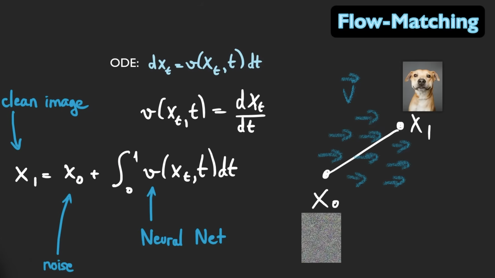

만약 두 점 $x_0$, $x_1$ 사이의 속도를 적분하면 그냥 거리가 되는 것.

- 이를 학습해서 찾아가는게 Flow-matching. 말 그대로 흐름을 찾아가는거임.

$x_0$, $x_1$가 각각 노이즈 있는 이미지와 없는 이미지면, 그냥 거기로 가는 흐름을 찾는 것.

- 아래 처럼 원본 이미지 데이터와 풀 노이즈를 가지고. 0~1 사이에 무작위로 뽑아 시점에 알맞게 섞어준다.

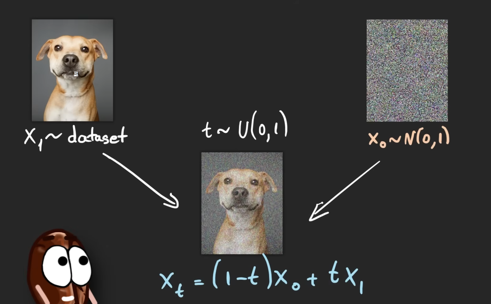

$x_t = (1-t)x_0 + tx_1$

- 그리고 $x_0$와 $x_1$ 사이의 속도 또는 gradient를 다음 공식으로 부터 구한다.

$v(x_t, t) = x_1 - x_0$

정확히는 

$$v(x_t, t) = \frac{dx_t}{dt} = \frac{d}{dt} \left[ (1-t)x_0 + t x_1 \right] = x_1 - x_0$$

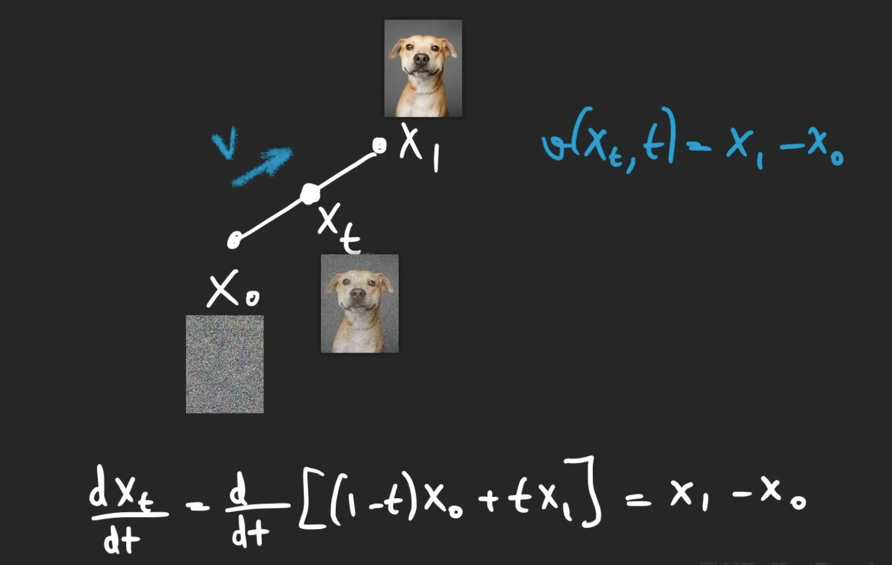

- 이 $v(x_t, t) = x_1 - x_0$으로 구한 값을, 즉 변화량 또는 속도를 (사실 단순히 이미지끼리 서로 뺀거임) 평가 지표로 설정하고.

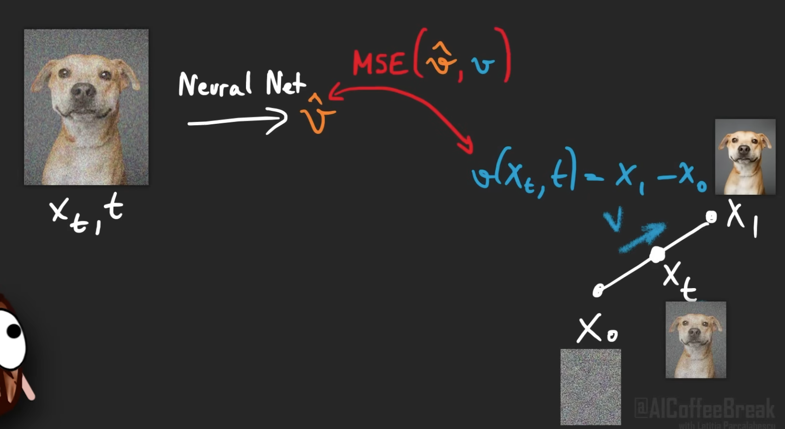

이를 신경망이 출력한 $\hat{v}$와 MSE로 비교한다.

> 현 $x_t$ 이미지와 t 모델에 인풋으로 한다. 트랜스포머의 경우 t를 위치 임베딩으로 넣는다.

- 이를 계속 반복해서 모델이 실제 변화량을 잘 구하도록 훈련한다.

### 추론

- 추론 또한 디퓨젼 모델 보다 간단하다.

$x_1$이 복원할 이미지, $x_0$가 풀 노이즈라고 생각하면.

$$x_1 = x_0 + \int_{0}^{1} \hat{v}(x_t, t) dt$$

우리 모델이 추론하는 변화량만 쭉 적분하면 이미지를 복원할 수 있다.

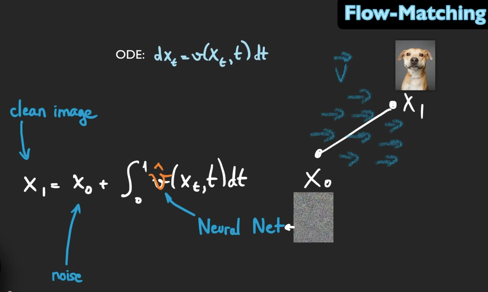

- 잔잔하지만 눈에 보이지 않는 거대한 **해류(Vector Field)**가 흐르는 바다 위에 튜브($x_0$, 노이즈)를 띄웠다. 신경망은 현재 내 위치와 시간에서 목적지($x_1$, 원본)로 향하는 가장 곧고 빠른 **물길의 방향과 속도($\hat{v}$)**를 예측해 준다. 우리는 무작위 파도에 휩쓸리는 것이 아니라, 모델이 알려주는 물길을 따라 궤적을 긋듯이(적분) 부드럽고 빠르게 목적지에 도착한다.

### 근데 디퓨젼이고 플로우 매칭이고.. 이미지 복원하는 능력은 알겠는데 어떤 이미지를 복원할지 어케 암?

이건 모델마다 다르겠지만 Diffusion Policy 논문 기준으로 다음과 같이 비교할 수 있음.

- 기존 무조건부 모델: $\epsilon_\theta(x_t, t)$ (현재 노이즈 상태와 시간만 봄)
- Diffusion Policy 모델: $\epsilon_\theta(O_t, A_t^k, k)$ (카메라 이미지 $O_t$를 힌트로 함께 봄)
    - 트랜스포머 디코더에 노이즈 낀 액션 토큰($A_t^k$)들이 들어감. 이 노이즈 토큰들이 Query가 되고, 힌트로 주어진 카메라 이미지 임베딩($O_t$)이 Key와 Value가 되는걸로. 이를 통해 매 레이어를 지날 때마다 노이즈들이 다른 K, V를 참고하며 디노이징이 됨.

### Diffusion과 Flow 매칭이 추론 하는 방법 개형 차이

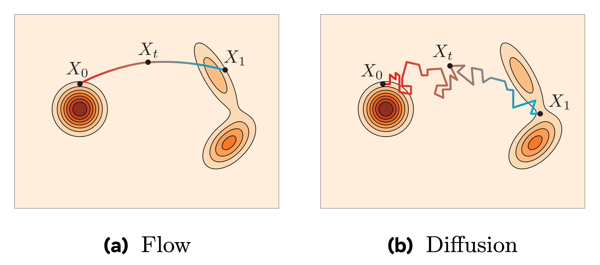

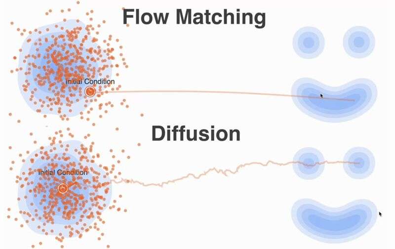

결국 이게 SDE와 ODE의 차이이기도 함.

# Diffusion Policy

- 결국 위의 디퓨젼 원리를 이용해 Diffusion Policy로 무작위의 노이즈에서 로봇의 궤적을 만들 수 있다.

- 일단 단일 액션이 아닌 액션 청크(Action Chunk) $A_t$를 예측한다.

- 이를 CNN 및 트포 모두에 적용해봤다.