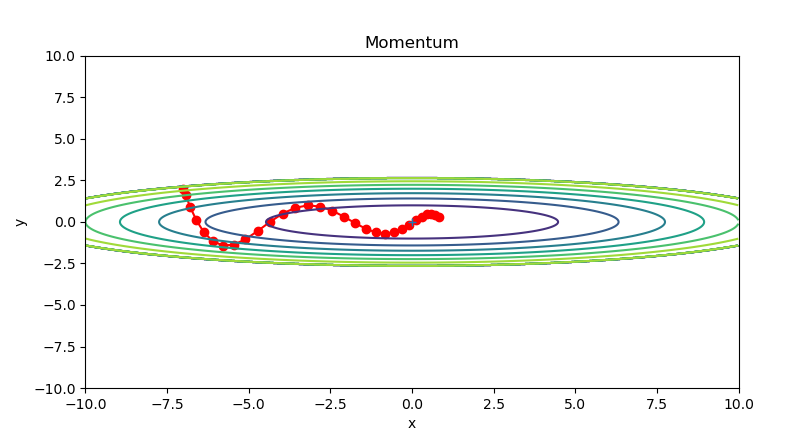
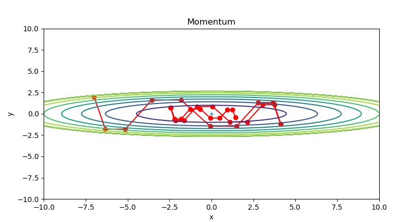
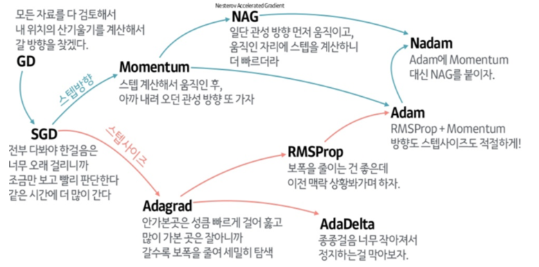
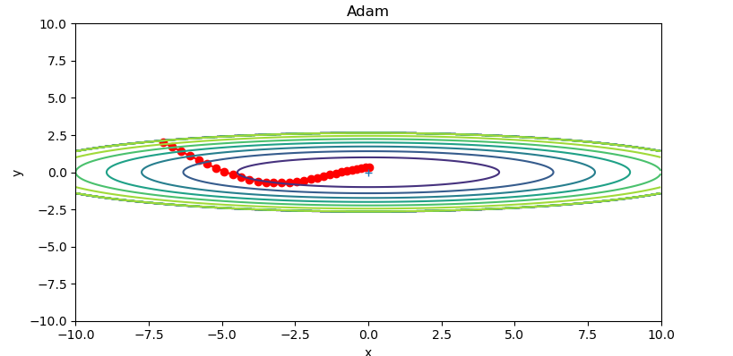
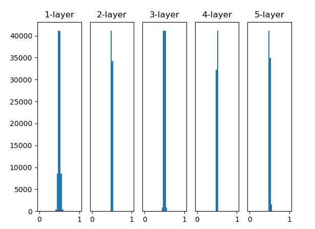
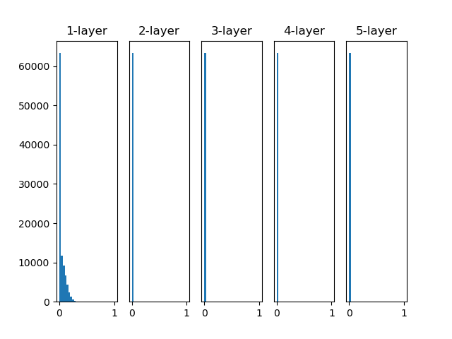
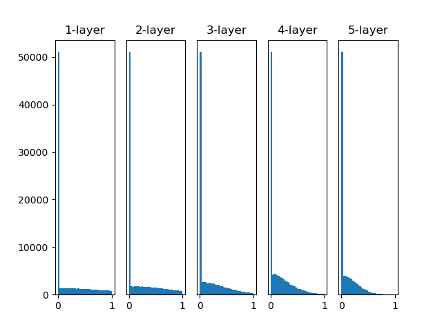
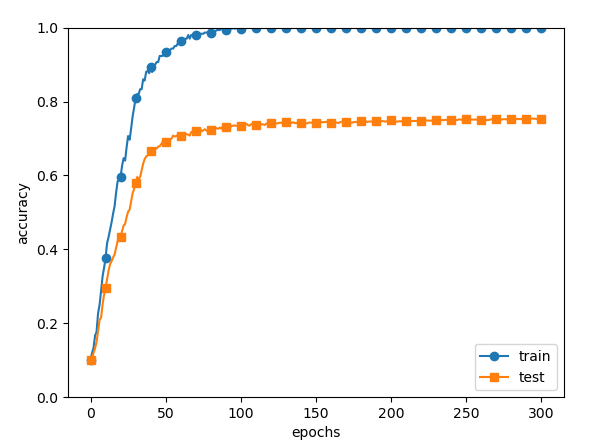
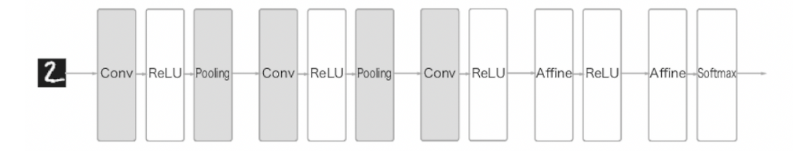

# 계획

- [x] 딥러닝 공부 계획
- [x] 강의 조사
- [ ] 공부

# 밑바닥부터 시작하는 딥러닝 1

<div align="center">
  
</div>

- 여러번 배운 내용이고, 이후에 파이토치와 함께 한번 더 복습할 것이기에 딥러닝 이론 위주로 복습하는 방식으로 진행할 예정.


# CHAPTER 2 퍼셉트론

- 퍼셉트론은 다수의 신호를 입력 받아 하나의 신호, `0` 또는 `1`을 내보냄.


- 그림에서 보이는 하나의 원이 하나의 **노드**, 다른말로 **뉴런**임.
- w는 각각의 weight(가중치)이다.


이를 수식으로 나타내면 아래와 같으며


- 여기서 이 노드 또는 뉴런의 활성 임계값을 **세타**로 표기함.

- 하지만 이 세타는 나중에 가면 잘 안씀, 수학적으로 이 임계값이 결국 bias(b로 표기)의 역할이 똑같아서 그냥 교체 됨. 오히려 더 심플함.
 - 즉, bias는 뉴런이 얼마나 쉽게 활성화 되느냐를 가르는 용도. 적어도 퍼셉트론에서는.


- 이런 퍼셉트론 뉴런을 여럿 이용해서 보다 복잡한 논리도 구현할 수 있음. XOR 같은.


# CHAPTER 3 신경망

- 신경망은 위 퍼셉트론에서 더 응용된 개념임. 어찌보면 더 포괄적인 개념이기도하고.

- 신경망은 Input, Hidden, Output layer으로 구성됨.


(이걸 문헌에 따라 2개의 층이라 가졌다하기도 하고, 3개의 층이라는 말도 있음. 이 교재에서는 2층이라고 말함.)

- bias를 포함하여 아래 그림 처럼 보여주기도 함.


### 행렬곱

- 당연하지만 이런 신경망의 입력과 가중치 곱셈들은 행렬 곱셈으로 진행됨.


- 이른 공간변환적으로 생각하면, 원래 2차원 벡터가 3개 있었는데.. 이들은 각각 1차원 scalar 값으로 정사영 시키고 곱한 값을 통해 3개의 변환된 scalar 값을 얻는 것과 같음.

### 활성화 함수

- 활성화 함수: 입력 신호의 총합을 출력 신호로 변환하는 함수.
  - 노드 안에서 작동한다고 생각하면 쉬움.
  - 퍼셉트론 처럼 꼭 임계치를 넘겨야 활성화가 되고말고를 결정하는 것은 아니고, 활성화 함수마다 출력 방식이 다름.


- 활성화 함수는 주로 `h()`으로 표현하며, 인풋으로 input 총합을 알맞게 아웃풋으로 만들어냄. 위 예시는 퍼셉트론과 같은 0과 1만을 출력하는 계단함수임. 당연하지만 이 계단함수를 실제로 잘 쓰지는 않음.

> 참고로 계단말고 인풋을 아웃풋에 그대로 전달하는 방식도 있긴함. 하지만 쓰이지는 않음. 왜냐하면 그렇게 하면 시스템이 선형밖에 안됨. 즉, 여러개의 행렬을 붙인다는 말이 되는거고, 그 말은 사실 하나의 행렬을 이용하는 것과 같음. 이는 아무리 많은 레이어를 쌓아도 결국 하나의 선형변환 밖에 안된다는 소리.

- 아래 처럼 **시그모이드** 함수를 이용하기도 함. 이는 명백한 비선형이고, 0 부근에서 확실한 고저차가 있어서 좋음. 미분도 가능하고.


참고로 `exp(-x)`는 $e^{-x}$를 표현한 것.

- 파이썬으로 쓰면 아래 처럼 됨.

```py
import numpy as np
def sigmoid(x):
    return 1 / (1 + np.exp(-x))    
```

> 아무튼 비선형 함수를 꼭 사용해야함. 아니면 층을 쌓는 의미가 없고, 이는 곡 학습을 못한다는 의미임.

- 시그모이드 보다 많이 쓰이는게 **ReLU** 함수임.


어떻게 보면 0보다 크면 선형이라고 볼 수 있음.

계산도 적게 들고, 오히려 ReLU가 실제 우리 뇌가 연산하는거랑 조금 더 비슷해서 많이 사용됨.

```py
def relu(x):
  return np.maximum(0,x) # 이 함수는 두 매개변수 중에 더 큰 것을 반환함. 
```

### 그러면 모든 층에 활성화 함수가 있나?

- **그렇다**, 적어도 요즘 MLP에서는 모든 은닉층에 활성화 함수가 있다. 마지막이나 특정 층에만 넣는 것이 아니다.
  - 그리고 보통 항상 **ReLU**를 사용한다.
    - 은닉층에 활성화 함수가 없는 것은 선형회귀나 초기 퍼셉트론 개념과 헷갈린 것.

- 근데 왜 ReLU인가? 일단 **미분이 간단**하고, 실제 인간의 뉴런 상호작용과 그나마 비슷하다. (실제로는 강도가 선형적으로 증가하는 것이 아닌, 출력의 빈도가 선형적으로 증가하는 것이지만 아무튼)

### 그렇다면 출력층 뉴런에서도 활성화 함수가?

- 상황마다 다르다. 분류냐 회귀냐 등등

- 만약 신경망의 결과 그대로 아웃풋을 얻는 신경망이라면 identity_function(), 즉 항등함수를 사용한다. 하지만 말이 함수지 그냥 `y = x`다.

- 일반적인 회귀에서는 그냥 항등함수를 사용한다.

- 분류에서는 주로 소프트맥스, 시그모이드(결과가 두개만 있으면) 등을 사용한다.

### 소프트맥스

그러면 **출력층**에서 사용하는 활성화 함수인 소프트맥스에 대해서 복습해보자.


- exp() : 지수함수 $e^x$
- n : 출력층의 뉴런 수
- yk : 그중 k번째 출력
- ak : 입력 신호 k번째

이를 통해 0~1.0 사이에 모든 결과 값이 정규화됨. + 모든 결과의 총합이 1.0.

> 참고로 지수 함수는 값이 매우 가파르게 증가하기 때문에 입력 값이 크면 오버플로우가 발생할 수 있음. 이 경우를 예방하기 위해 입력으로 들어오는 값 중에서 최대 값으로 모든 인풋을 일광적으로 뺌. 이를 통해 값을 0 근처로 어느 정도 재비치 가능.

- **중요**: 소프트맥스는 어디까지 **학습시** 사용되는 출력층의 활성화 함수임. 어차피 사용하든말든 가장 큰 아웃풋을 내보내는 뉴런의 **위치는 달라지지 않음**. 추론시(순전파) 최적화를 위해 보통 소프트맥스를 **생략함**.

### 잠시 용어 정리

- 참고로 입력 데이터에 특정 변환을 가하는 것을 **전처리**라고 함.

- 그리고 그 전처리 과정 중에서 예를 들어 0\~255를 0\~1 사이로 범위를 변환하는 것을 **정규화**라고 함.

#### 배치(batch) 처리

- 파이썬 라이브러리 행렬 계산 방식과 GPU 특성상, 작은 행렬을 여러번 반복 시키는 것 보다, 아예 처음 부터 큰 행렬을 한번 돌리는게 더 빠름.

- 즉 아래 X 데이터 하나를 돌리고. (784 픽셀의 한 이미지라고 가정할 때)


이를 100번 반복하는 것보다. 아래 처럼 그 784 이미지 100개를 (GPU마다 다름) 합산해서 학습하는게 훨씬 더 빠름.


이 100개 묶음 하나를 **미니배치(Mini-batch)**라고 부른다.

- 즉 데이터끼리 먼저 쌓아서 커다란 행렬을 만든 뒤에 한번에 계산하는 것.

# CHAPTER 4 신경망 학습

- 딥러닝은 end-to-end machinge learning이라고 불리기도 함. 학습 및 사용에서 처음 부터 끝까지 사람의 개입이 없다는 뜻임.

## 손실 함수

현재 신경망의 오차가 얼마나 큰지 알려주는 함수.

#### SSE, Sum of Squared Errors (오차제곱합)

$$SSE = \sum_{i=1}^{n} (y_i - \hat{y}_i)^2$$

- $y_i$ : 실제 정답 레이블
- $\hat{y}_i$ : 신경망의 출력

> 햇(hat, $\hat{}$ ) 기호는 보통 추정치 또는 예측치를 의미할 때 많이 붙임

가장 심플한 방식의 손실함수.  물론 데이터의 양이 커지면 예도 같이 커지지 보통은 평균을 내는 MSE를 더 많이 사용.

### MSE, Mean Squared Error (평균제곱오차)

$$MSE = \frac{1}{n} \sum_{i=1}^{n} (y_i - \hat{y}_i)^2$$

그냥 위 SSE에서 데이터 개수 만큼 나눈 것.

### Cross Entropy Error, CEE (교차 엔트로피 오차)

$$CEE = -\sum_{i=1}^{n} y_i \log(\hat{y}_i)$$

- $y_i$: 실제 정답 (보통 One-hot encoding)
- $\hat{y}_i$: 모델의 예측 확률

> [0 1 0 0 0 0] <- 이 처럼 하나만 `1`이고 나머지가 전부 `0`이 결과 및 표기방식을 **One-hot 인코딩**이라고 함.

- 정답말고 나머지가 정답이 보통 `0`이기에 다 0이 곱해져서 정답이 `1`인 출력층만 보게됨. 그 정답에 대한 오차만 계산하는 것.

- log 함수를 사용했기에 신경망 결과가 1에 가까울수록 (보통 이전에 0~1.0으로 정규화를(아마 소프트맥스 같은 것을 사용해서) 시켜서 최대가 1임) log 함수의 결과는 0에 수렴함.

> 손실함수는 당연히 학습시이란 test시에만 사용하기에 평소 추론에는 적용안함. 그렇기에 손실함수를 위한 소프트맥스 같은 것들도 필요 없어짐.

- 반대로 log이기에 정답이었는데 신경망은 0을 출력했다면 무한대에 가까운 오차를 반환함.

#### 미니배치용 CEE

- MSE와 다르게 CEE는 원래 부터 데이터 하나만을 위해 오차를 계산하기에 $1/N$이 필요 없음. 다만 실제 학습시 데이터들을 묶어서 학습하기에, 그 미니배치끼리의 평균 오차를 구할 필요는 있음.

$$E = -\frac{1}{N} \sum_{n} \sum_{i} t_{ni} \log(y_{ni})$$

- $N$: 총 데이터 개수 
- $t_{ni}$: $n$번째 데이터의 $i$번째 정답 레이블 
- $y_{ni}$: $n$번째 데이터의 $i$번째 출력값

#### BCE, Binary Cross-Entropy

- 참고로 CEE를 이진분류 문제만 한정하면 다음과 같이 식이 더 간단하게 나옴.

$$BCE = -[y \log(\hat{y}) + (1-y) \log(1-\hat{y})]$$

물론 여기서도 one-hot 인코딩으로 답이 세팅 됐으니 두항 중에 하나는 그냥 0되는 것.

시그마를 쓸 필요도 없이 그냥 두 출력 뉴런의 아웃풋을 표현한 것임.

## Gradient (기울기)

$x_0$와 $x_1$ 두 개의 변수를 가진 공식을 $x_0$와 $x_1$ 각각 편미분하고 이 둘을 모아 하나의 벡터로 모은다면 다음과 같이 보일 수 있음.

$$\left( \frac{\partial f}{\partial x_0}, \frac{\partial f}{\partial x_1} \right) = \nabla f$$

- $\frac{\partial f}{\partial x_0}$ : $x_1$을 상수로 취급하고 $x_0$에 대해서만 미분한 값
- $\frac{\partial f}{\partial x_1}$ : $x_0$를 상수로 취급하고 $x_1$에 대해서만 미분한 값

- 그리고 이 둘을 모아 한 벡터를 만든 것이 $\nabla$ f, 즉 Gradient(기울기)임. 

> 벡터인데 `[]`를 안쓰고 왜 `()`를 사용해서 표현하냐? 그냥 수학이나 통계학적 관례임, 순서쌍이라는 것을 강조하기 위해 ()를 많이 사용함. []는 주로 선형대수학적인 접근방법임.

- 아래와 같은 그림을 많이 봤을텐데 이는 각 변수에 대해서 편미분하고, 그 기울기들은 정리한 벡터장을 표현한 것임.


각 $x_0$와 $x_1$의 값에 따른 기울기에 대한 벡터(gradient)들을 구하고 보기 좋게 나타낸 것.

당연히 최적화는 이 gradient들이 줄어드는 방향, 즉 gradient들이 가리키는 곳 진행하는 것. 같은말로 변수가 w으로 바뀌었을 때 오차가 가장 줄어든 곳으로 나아가야함.

### Del, 또는 $\nabla$ Nabla에 대헤

잠시 $\nabla$ (나블라, Nabla) 기호에 대해서 설명. 

- $\nabla$는 **델(Del) 연산자**라고도 부르며, 미분 관련하여 주로 쓰임. 

- 주로 Gradient $\nabla f$나, 발산(Divergence) $\nabla \cdot \mathbf{F}$를(벡터장이 한 점에서 퍼져 나가는지, 모여드는지를 나타냄) 표현할 때 사용함.

- 딥러닝에서 $\nabla$를 만난다면? 손실 함수 L의 가중치 w들로 편미분해서, 어느 방향으로 업데이트해야 오차가 줄어들지 알려주는 벡터를 구해라!의 역할에서 나타남. ($\mathbf{w} - \eta \nabla_{\mathbf{w}} L$)

## 경사(하강)법

얼마나 틀렸고, 그 기울기가 얼마나 되는지를 알 수 있으면 이제는 학습을 해야한다.

> 손실함수에서 극솟값, 최솟값, 안장점이 되는 곳에서 기울기가 0이 됨. 함수가 복잡해지면 학습 도중에 평평한 고원 같은 것들이 생길 수 있음. 그래서 마냥 0에 도착했다고 좋아하면 안됨.

- 딥러닝에서 학습은 주로 주어진 정보에서 옵티마이저를 통해 오차를 줄일 수 있는 방향으로 나아가는 형태.

- 가장 베이스가 되는 옵티마이저가 경사하강법. 경상상승법도 있긴한데 사용할 일은 아마 없을 듯.

다음과 같이 웨이트와 손실함수가 있을 때:


$$\mathbf{w} \leftarrow \mathbf{w} - \eta \frac{\partial L}{\partial \mathbf{w}}$$

또는 위에서 배운 gradient를 이용하여(navla 기호) 표현하면

$$\mathbf{w} \leftarrow \mathbf{w} - \eta \nabla L$$

- $\leftarrow$ : (Assignment이라고 발음함) 오른쪽에서 계산 된 값을 왼쪽의 w에 **덮어씌운다**는 뜻. (`=` 수학적으로 양쪽이 같다는 의미이니, 컴공 개념의 `=`를 가져온 느낌?) 

- $\eta$ : 학습률(Learning Rate, 에타)

- $\nabla L$ : (Gradient of Loss) 손실 함수의 기울기

- 마이너스를 붙이는 이유는 보통 $\nabla L$은 함수값이 가장 커지는 방향을 가리키기 때문임.

## 잠시 정리

- 전제: 신경망에는 적응 가능한 가중치와 편향이 있고, 이 가중치와 편향을 훈련 데이터에 적응하도록 조정하는 과정이 학습임.

- 학습의 4단계:

1. 미니배치: 훈련 데이터 중 일부를 무작위로 가져옴. 이렇게 선별한 데이터를 미니배치라고 하며, 그 미니배치의 손실함수 결과값을 줄이는 것이 목표이다. (위에서 봤던 100개씩 이미지 쌓는 모습에서 그 100개가 하나의 미니배치인 (사이즈 100의 미니배치) 것)
1. 기울기 산출: 미니배치의 손실 함수 값을 줄이기 위해서 각 가중치의 매개변수의 기울기를 산출해서 gradient(차원수가 w개수 만큼 커다란 벡터)를 만듬. 그 gradient, 즉 기울기는 손실 함수의 값을 가장 적게하는 방향을 제시함.
1. 매개변수 갱신: 가중치 매개변수를 기울기 방향으로 갱신함.
1. 반복: 1~3 단계를 반복.

> 참고로 미니배치를 뽑아 경사하강법을 돌렸으니, 이는 일반 경사하강법이 아닌 **확률적 경사하강법(SGD)**이라고 불러야 마땅하다.

# CHAPTER 5 오차역전파법

### 연쇄법칙
- 역전파는 국소적인 미분을 역방향으로 보내는 과정. 원리는 연쇄법칙을 이용.
- 연쇄법칙을 통해 전체를 한번에 미분하는 것이 아닌, 각 부분들을 독립적으로 미분할 수 있고. 그 부분들이 최종 출력에 영향을 미칠 수 있는지 알 수 있음.


### 계산 그래프를 통한 오차역전파와 연쇄법칙 설명

- 서로 + 되는 더하기 노드는 그냥 그대로 뒤로 보내짐.


왜냐하면 x + y를 각자 그 변수대로 편미분하면 나머지 변수는 0 되고, 그 변수는 1되기 때문.

- 곱셈 노드는 다른 쪽을 같이 뒤로 보내게 됨.


- 예시


#### 과연 다음 빈칸의 정답은?


<details>

<summary>정답</summary>


</details>

#### ReLU


0 이상이면 그대로 통과이고, 0이하면 0을 반환.

가장 널리 쓰임.

#### Sigmoid


### Softmax with Loss 계층

- [따로 공부해서 알고 있긴하지만](https://www.notion.so/robots-oh/MLE-Maximum-Likelihood-Estimation-30d63918d42a809c96f9c573233f3756#30d63918d42a80eaae2ace94c5514cae), 기본적으로 Softmax와 Cross Entropy는 꼭 같이 씀. 그래야만 계산이 엄청 간단해지기 때문.


원래 복잡하던 계산 다른 손실함수 미분 처럼 결국 y - q로 떨어짐.


- 참고로 CEE에서 하나의 Softmax 노드의 출력으로만 Loss를 구한다고 하긴 하지만, CEE랑 Softmax랑 합쳐지면 결국 모든 노드의 출력에 대해서 채점하는 공식으로 바뀜.

$q_i - y_i$ (여기서는 $y_i - t_i$ 로 표시) 이 결국 Softmax 하류로 내려가는 편미분 도함수인데, 이 i는 딱 정답 레이블이 아니라 각 노드에 맞는 레이블이 고려하는 것이다.

예를 들어 출력이 $y = [0.2, 0.1, 0.7]$ 이고 정답이 $t = [0, 0, 1]$ 이면 각 채점은 -0.3, 0.2, 0.1 만큼 손실이 하류로 들어가는 것이다.

### 어? 근데 생각해보니 ReLU를 활성화함수로 모든 레이어에서 사용하면.. 결국 앞으로 전달하는 것은 Loss하나 뿐인거 아닌가?
그러면 학습이 이상하게 되는거 아닌가?

- 아니다, ReLU를 모든 노드에 사용해서 잠시 잊을 수도 있는데, 모든 노드 안의 ReLU가 들어간거지 애초에 가장 중요한 노드 간의 선형 진행 ($wx + b$) 편미분은 잊고 있는거다.
- 원래 활성화함수가 없더라고 선형계층은 원래도 있었고, 애초에 편미분을 통한 업데이트는 정확히 이들을 편미분학 업데이트하기 위한거다. ReLU는 그저 잠시 지나가는거다.

#### 그러면 실제 업데이트는 어떻게 하냐?

잠시 **상류**에서 -> **ReLU** -> **Affine** -> **하류** 역전파 과정 및 업데이트에 대해서 배워보자.

- 상류에서 온 기울기 $\frac{\partial L}{\partial a}$ 가 있다고 가정하자.

- ReLU 활성화 함수 단계를 타고 내려가면서 1 또는 0을 곱해 하류로 보내게 된다.

$$\frac{\partial L}{\partial a} \times (1 \text{ or } 0) = \frac{\partial L}{\partial z}$$

- 근데 이 받은 값으로 두 가지 일을 병렬적으로 진행한다. (서로 영향을 미치지는 않음)
  - **임무1**: 먼저 받은 값에 순전파 입력으로 들어온 x를(wx+b=y w기준 편미분) 곱하여 가중치를 업데이트하는 곳에 사용한다.

  $$\frac{\partial L}{\partial w} = \frac{\partial L}{\partial z} \times x$$

  나중에 업데이트시 사용.

  $$w \leftarrow w - \eta \frac{\partial L}{\partial w}$$

  - **임무2**: 상류에서 받은 값에 w를 곱하고 뒤로 전달한다.

  $$\frac{\partial L}{\partial x} = \frac{\partial L}{\partial z} \times w$$

  이 값은 그 다음 하류 활성화함수 편미분으로 다시 들어간다.

- 그동안 오해했던 것은 위 임무1, 임무2 분리를 모르고 같은 것으로 생각했기 때문이다.
- 위 과정을 수행하면 확실히 잘잘못을 반영하여 업데이트를 진행할 수 있다.

#### 근데 그러면 Bias는? 학습을 어떻게 시키는거지?

- 더하기는 편미분은 어차피 그냥 1로 끝난다.

- 상류에서 넘어온 것에 1를 곱하고, 이 값을 기반으로 바로 업데이트 하는 것이다.

### Gradient check

딥러닝 코드 구현시 오차역전파법 계산 과정 중에서 오류가 휴먼 에러나 버그로 결과가 다를 수 있다. 이때 오래 걸리더라고 신뢰도가 높은 수치 미분을 이용해서 한번 더 구하고, 두 값을 대조해보는게 gradient check 과정이다.

- 물론 요즘 파이토치는 Autograd라는 강력한 기능을 지원하기에 거의 신경 쓸 일은 없다.

- 커스텀 레이어를 새로 창조하거나, C++ 또는 CUDA단으로 내려가야만 신경 쓸일 있을 듯?


# CHAPTER 6 학습 관련 기술들

이번 장에서는 옵티마이저(최적화 기법), 가중치 매개변수 초깃값, 하이퍼 파라미터 설정 방법, 과대적합 대응책 등에 대해 알아볼 것이다.

## 최적화

신경망의 학습 목적은 Loss funxtion의 값을 가능한 낮추는 것. 

| 그리고 이는 곧 MLE, 신경망의 마음을 추측하여 최적화 하는것과 같다.

당연하지만 최적화할 매개변수가 엄청많기에 수식을 풀어서 얻는 방법 따위는 없다.

그래도 이 문제를 풀기 위해 괜찮은 여러 최적화 방식. 즉 옵티마이저들이 있다.

- 참고로 그동안 하던 미니배치에서 경사하강법을 진행하는 것을 **SGD**라고 부르기도 한다.
  - 물론 엄밀히 말하면 Stochastic Gradient Descent와 우리가 했던 Mini-batch GD는 다른거긴 하다. 순수 SGD는 원래 데이터를 하나만 쓰는데 애초에 너무 비효율적이라 사용하지 않아서... 그래서  그냥 미니배치에서 GD를 예시로 많이 불러서 같은 것이 됐다.

- SGD는 단순 무식한 방법이지만, 그래도 무작정 랜덤으로 최적화하는 것보다 훨씬 똑똑하고, 빠른 방법이다.

- 물론 시간이 지남에 따라 SGD에서 업그레이드된 더 좋은 옵티마이저들이 많이 나왔다.

#### 용사의 이야기

| 나는 다크소울의 세계 속에 있고, 현재 묘왕 니토를 잡으러 거인의 묘지에 왔다. 묘왕 니토는 묘지의 최심부에 있다. 그런데 이미 지하 깊은 곳이라 한치의 앞도 보이지 않는다. 내가 보고 느낄 수 있는 것은 오직 내 발 바로 밑 뿐. 내가 지금 딛고 있는 바다과 경사면의 방향과 각도를 보고 최심부로 나아가야한다. 어떻게 하면 앞으로 잘 나아갈 수 있을까?

### SGD, Stochastic Gradient Descent (확률적 경사하강법)

그동안 책에서 디폴트로 나오던거.

확률적인 이유는 미니배치로 뽑는거라서 그럼.

$$w \leftarrow w - \eta \frac{\partial L}{\partial w}$$

- $\eta$ (Eta): 학습률(Learning Rate), 모델마다 다르겠지만 0.01, 0.001 같은 값을 미리 정해서 사용.

- 참고로 `<-`는 좌측을 우측으로 덮어쓴다는 코딩적 의미.

- 당연하지만 단순 무식한 방식이라 아직 단점이 많음.

예를 들어 실제 Loss 그래프가 아래 그림 처럼 골짝이 모양이면


바로 내려갈 것을 한참동안 반복하면서 왔다갔다 하면서 내려감.


그래서 불안정하고 시간이 더 오래 걸린다.

### Momentum

SGD 개선 방안.

Momentum, 말 그대로 운동량임.

$$v \leftarrow \alpha v - \eta \frac{\partial L}{\partial w}$$

$$w \leftarrow w + v$$

- $v$ (Velocity): 물체의 속도. 속도할 때 그 v 맞음.

- $\alpha$ (Alpha): 모멘텀 계수 (보통 0.9로 설정하며, 마찰력처럼 속도를 줄이는 역할)

- 기존 w에 그대로 더하는게 아니라, 그 이전 기울기를 기억해서 거기에 하이퍼 파라미터 $\alpha$를 곱해 살짝 줄인 다음 그만큼 더 더하는 것.

- 이를 통해 속도를 일정하게 늘릴 수 있음. 특히 x축의 가속도를 안정적으로 높여가 더 빨리 수렴하기 가능.



- 물론 아직 y축으로는 불안정함.

- 참고로 위 SGD 보다 훨씬 작은 학습률로 시작해서 초반부터 작게 움직이는 것 처럼 보이는거임. 만약 위 SGD랑 같은 학습률을 사용했다면 아마 엄청 크게 움직이는 것 처럼 보였을 것.

현재 학습률 파라미터:
```py
optimizers["SGD"] = SGD(lr=0.95)
optimizers["Momentum"] = Momentum(lr=0.1)
```

<details>

<summary>만약 Momentum의 학습률도 0.95로 만들면 다음과 같이 보임 ㅋㅋㅋ</summary>

`optimizers["Momentum"] = Momentum(lr=0.95)`



</details>

### AdaGrad (Adaptive Gradient)

다른 SGD 개선 방안.

바로 학습률을 동적으로 만드는거임.

사실 가면 갈수록 학습률은 보통 작아져야함. (물론 골짜기나 고원 같은 곳에 가면 안되겠지만)

이 작아진다는 전제하에 AdaGrad라는 옵티마이저가 나옴.

$$h \leftarrow h + \frac{\partial L}{\partial w} \odot \frac{\partial L}{\partial w}$$

$$w \leftarrow w - \eta \frac{1}{\sqrt{h} + \epsilon} \frac{\partial L}{\partial w}$$

- $h$: 과거의 기울기 값을 제곱하여 계속 더해나간 값 (기울기의 누적합)

- $\odot$: 행렬의 원소별 곱셈 (Hadamard product)

- $\epsilon$ (Epsilon): 0으로 나누는 것을 방지하기 위한 아주 작은 값 (예: $10^{-7}$)

- 매번 기울기와 학습률로 업데이트하는 것에서, 곱하기 현재 w의 기울기의 제곱(정확히는 행렬 원소별 곱셈, '$\odot$')으로 h를 만들고 + 이전 h를 더한 값의 제곱근으로 낮춤.

  - 당연히 h는 가면 갈수록 증가할테니 (이전 값의 누적), 업데이트 속도는 점점 낮아질 것임.

  - 여기서 중요한 것는 개별의 $\frac{\partial L}{\partial w}$ 를 계산에 포함하는 것이기에, 각 **w마다 개별적인 학습률 조정**이 가능해짐!! 그래서 w 중에서 크게 움직인 것들만 학습률이 크게 낮아진다는 것.


> 하지만 AdaGrad를 사용하다 보면 어느 순간 **업데이트량이 0**으로 수렴됨. 이 문제를 개선한 방법으로 **RMSProp**이 나중에 나옴. AdaGrad의 개선판임. 먼 과거의 기울기는 *서서히 잊고*, **새로운 기울기 위주**로 업데이트 하는 방싱임. 이 방법론을 Exponential Moving Average라 하여, 과거의 기울기를 급격하게 감소시킴.

### Adam

- 위 모멘텀과 AdaGrad(의 개선판인 RMSProp)의 장점을 합친게 Adam임.



모멘텀도 있고, 학습률도 w마다 적응적으로 업데이트 됨.

- **대부분의 상황에서 일단 Adam 부터 사용됨**.



(물론 위 그래프 최적화 문제에서는 AdaGrad이 제일 좋았지만, 이는 간단한 방식이고, 신경망 최적화에 사용하려면 결국 모멘텀의 역할이 필요함)


## 가중치의 초깃값

신경망에서 각 weight들의 초깃값이(w의 시작값) 생각보다 디게 중요함.

- 보통 초깃값은 가우시안 분포(정규 분포)를 기반으로 랜덤하게 생성함.

- 책에서는 예시로 다음과 같이 세팅함: `np.random.randn(10,100) * 0.01`

  - `randn`의 뒤 `n`이 정규분포(Normal distributin)을 의미한다.

  - 이를 통해 0을 편균으로 하는, 대부분이 **-1.0**과 **1.0** 사이에 분포하고, 가끔 -2, 3 같은 값들도 만드는 랜덤한 숫자들을 뽑아낸다.
  
  - 참고로 10, 100은 세로 10 가로 100의 행렬을 꽉 채우라는 것이다. 그리고 0.01은 **표준편차**를 곱하는 것으로, 표준편차가 0.01인 정규분포를 사용했다는 뜻이다.

$$ 분산 = 표준편차^2 = \sigma^2 = \frac{1}{N} \sum_{i=1}^{N} (x_i - \mu)^2$$

#### 그냥 초깃값을 0이나 같은 값으로 통일 하면 안될까?

- 안된다. 정확히는 안좋다.

- 오차역전파 과정에서 가중치가 모두 똑같이 갱신되기에, 결국 모든 가중치가 똑같이 학습된다는 말과 같다.

- 이는 가중치를 여러개를 갖는 의미를 퇴색하게 만든다.

- 그렇기에 초깃값은 **무작위**로 설정해야한다. 이를 방지하기 위해서.
  - 이를 Symmetry Breaking이라고 부른다. (대칭성 깨기)

### 활성화 값의 분포 (중요) 

은닉층에서의 활성화 값의 분포도 신경을 써줘야한다.

- 위 방식대로 정규분포 기반으로 랜덤으로 w를 입력해서 초깃값을 정하는 것은 좋지만. **아쉽게도 그것만으로는 부족하다**.

- 위에서는 정규분포도 임의로 0.01의 값을 곱해서 0.01 표준편차 기준으로 w를 세팅했지만. 사실 이 또한 임의로 하면 **학습이 잘 안된다**. 또는 운이 아주 아주 좋아야한다.

#### 한번 5개 레이어, 노드 100개씩, 각 노드는 시그모이드를 갖는 신경망이 있다고 가정하자.

한번 신경망이 잘 학습되는지 각 레이어마다 활성화 함수들이 반환하는 값을 다양한 경우에서 검사해보자.

#### 정규분포 * 1, 즉 그냥 표준편차가 1일 때 

활성화된 값들이 거의 전부 0과 1로 지우쳐져 있다.


(참고로 이거는 100개 노드의 출력이니 한 그래프 도합이 100이 아니라, 1000개의 데이터를(미니배치 기준으로) 100개의 노드에 통과했으니 그래프에 배치되는 값이 총 100,000개인 것이다)

- 이러면 좋은거 아니야? 시그모이드 값들이 확실하게 배치가 됐잖아?
  - 뭐 끝단에서는 좋을 수도 있지만, 중간 레이어들은 아니다.

- 시그모이드 함수는 다음 그래프 처럼 생겼다.


0,1 양 끝단에 시그모이드 결과 값들이 위치한다면, 그 기울기 들은 거의 0에 수렴하는 것이다.

- 그러면 오차역전파 과정에서 미분이 0나오고, 그러면 뒤로 전달할 오차가 소실 된다.
  - 그게 바로 **Gradient Vanishing**이다!!

- 이유는 가중치 w들이 상대적으로 크게 세팅된 것이다. 정균분포 표준편차 1로 하는 바람에, `2,3,1` 같은 이 신경망이 받아들이기에 **너무 큰 수**들이 입력으로 들어간 것이고. 너무 큰 수가 시그모이드 인풋으로 들어가는 바람에 출력들이 0이나 1 근처로 밀려나 굳어버리는 것이다.
  - 이를 전문적으로 Saturation(포화) 현상이라고 말함.

#### 그러면 이번에 정규분포(가우시안)를 0.01으로 해볼까나?

이번에는 활성화된 값들이(시그모이드 아웃풋) 0.5에 지우쳐져 있다.



- 기울기 소실 문제는 일어나지 않는다, 시그모이드 함수 중앙에 있기에.

- 하지만 그럼에도 이 상태에는 분명히 문제가 있다. 대부분의 뉴런들이 비슷한 것을 출력하고 있다는 것이다.
  - 그리고 이는 다수의 뉴런을 사용하는 의미를 없게 만든다. 그냥 다 비슷 비슷하게 내뱉고 있으니.

- 이번에는 너무 작은 표준편차로 w들을 세팅했기에, 학습을 좀 수행했음에도 거의 변화가 없던 것이다. 초기 세팅을 너무 좁게 세팅한 것이다.
  - 너무 0 부근의 값으로 세팅하여, 0이 아님에도 위에서 언급했던 학습이 안되기 때문에 초깃값들을 무작위로 세팅했기에 완벽한 대칭(Symmetry) 상태는 피했지만, 그 차이가 너무 미미해서 결국 모든 뉴런이 0.5라는 비슷한 값을 출력하게 되었다.
  - 이 현상을 '**표현력이 제한되었다**'고 말한다.

- 물론 분포의 정도에 어느 정도 주관적인면이 있겠지만. 그럼에도 활성화된 값은 비교적 고루 고루 분포가 되어야 비로소 의미가 있는 신경망이라고 볼 수 있다. 물론 그런 신경망이 Loss가 적을 것이기도 하고.

#### 흐음.. 그르면 어떻게 w 초기값을 세팅하지?? $\frac{1}{\sqrt{n}}$

연구에 따르면 Xavier를 사용하는게 좋다고한다.

- 명칭은 거창하지만 그냥 이거다:

$$\sigma = \frac{1}{\sqrt{n}}$$

- n : 이전 층의 노드 개수

- 즉, 입력 노드가 많으면 많을수록 표준편차를 좁게하는 것이다.

그리고 놀랍게도 결과가 굉장히 잘 나온다.


> 참고로 만약에 활성화 단계에서 시그모이드가 안좋다면 tanh 함수를 사용하는 방법도 있다. 둘이 생긴 것은 비슷하지만, tanh는 원점 기준으로 대칭이고 sigmoid는 (0,0.5) 중심 대칭이다. 활성화 함수용으로는(출력용말고) 원 대칭인 함수가 더 성능이 좋다고 알려져 있다.

#### 그동안 시그모이드로 했다. 그러면 ReLU는 다른가?

일단 만약에 정규분포 x 표준편차 1이든 0.01을 하든 학습이 잘 안될 것이다.

- 표준편차: 1


- 표준편차: 0.01



- 표준편차: Xavier ($\frac{1}{\sqrt{n}}$)



- 물론 당연하지만 ReLU도 이상적인 정규분포 세팅 방식이 있다.

바로 **He**이다.

- 위에 Xavier에 그냥 2의 제곱근만 곱했을 뿐이다.

$$\sigma = \sqrt{\frac{2}{n}}$$

- 새로운걸 곱하는 이유는 ReLU가 0이하, 즉 절반 이하의 데이터 인풋을 날려버리기 때문에 정보를 조금 더 보상하기 위함이다.

보면 위에 ReLU + Xavier 보다 레이어가 깊어도 보다 고르게 분포된 것을 볼 수 있다.


- 제곱근 2인 이유는 분산 기준으로 보기 때문이다. 분산을 2배 시키고 싶으면 표준편차는 $\sqrt{2}$ 배를 해야한다. 

## 배치 정규화

- 위에서 이상적인 초깃값을 세팅해봤다. 근데 배우면서 느껴지는 것이.. 너무 불합리하다고 느껴지지 않나?

- 위의 이상적인 Xavier, He 세팅도 레이어가 깊어지면 까닥하면 또 분포가 이상해질 수도 있다.

- 초기세팅말고... 진행하는 도중에 입력 분포를 다잡을 수 없을까?

그게 바로 **Batch Normalization**이다. 즉, **배치 정규화**.


- 위 표 처럼 각 레이러 사이마다 배치 정규화 단계를 추가하는 것이다.

- 위에서 봤던 이상한 활성화 분포를 잡는 레이어를 추가한 것.
  - 당연히 이는 순전파 및 역전파 과정에서도 포함되니 추가적인 메모리를 잡긴할 것이다.

$$\mu_B=\frac{1}{m}\sum_{i=1}^mx_i$$

- $\mu_B$ : 입력 x들의 평균 (w의 평균 아님! 진짜 흐로고 있는 입력들의 평균!)

$$\sigma_B^2=\frac{1}{m}\sum_{i=1}^m(x_i-\mu_B)^2$$

- 그 값을 기반으로 분산을 구함. ($\sigma_B^2$)

$$\hat{x}_i=\frac{x_i-\mu_B}{\sqrt{\sigma_B^2+\epsilon}}$$

- $\hat{x}_i$ : 이제 정규화된 각각의 x입력들. 그냥 x를 평균으로 빼고 표준편차로 나누면 됨. 그러면 입력이 이상하더라도 조금 이쁘게 펴짐.

$$y_i=\gamma\hat{x}_i+\beta$$

- 위에서 이쁘게 펴진 분포를 더 알맞게 퍼트리고 이동시켜야할 수도 있음. 학습 과정에서 자동으로 됨.

- $\gamma$ : 스케일(분포 조절) 파라미터 (초깃값: 1) (하이퍼파라미터 아님)

- $\beta$ : 시프트(이동 조절) 파라미터 (초깃값: 0) (하이퍼파라미터 아님)


- 아무래도 모든 단계의 입력들이 완벽한 분포를 띌 필요는 없음. 어떤 레이어 단계의 분포들은 조금 더 지우친 경향을 띄어야 더 좋은 결과를 보일 수도 있는것임.
  - 물론 시작할 때는 디폴트 분포임(스케일:1, 시프트:0). 신경망이 학습하면서 더 이상적인 분포를 찾게되는 것.

#### 근데 이상하다... Affine과 ReLU 사이에 이를 두는게 맞나? 뒤에 두는 것도 상관없지 않나?

맞다, 사실 활성화 단계 앞에 둘지 뒤에 둘지는 갑론을박이 오가는 주제다.

책에서는 활성화값들에 진입하기 전에 입력 값들을 전부 정규화 시키는 입장에서 소개했다.

- 하지만 최근들어서는 오히려 **뒤**에 두는게 **더 좋다**는 평이 많다. 적어도 ReLU의 경우에서는.

- ReLU 이전에 정규화를 진행해봤자 어차피 정규화한 정보의 절반이 날아간다. 차라리 이후에 나온 값들은 정규화하는게 정보를 더 많이 세이브할 수 있고, 성능도 보통 더 좋다고한다.

#### 근데 ReLU 활성화 이후에.. 정규화를 해버리면... ReLU 결과값들이 0에서 다 뛰쳐 나오는거 아님?

- 맞다, 다 뛰쳐나오게 된다. 원래 결과가 0이던 값도 평균이 2이고 표준편차가 1이면 (0-2)/1 = -2로 나온다.

- 이는 ReLU가 만들어낸 희소성을 박살내는 것이다. 수학적으로 ReLU가 좋았던 이유가 사라지는 것이다.

- 하지만 이상하게도 실험적으로 ReLU 이후에 Batch Normalization을 하는게 더 좋다는 결과도 나오는 것이다.

## 과대적합 문제

신경망이 훈련 데이터에 너무 지나치게 적응되어 다른 데이터에서는 오히려 성능이 떨어지는 현상.

아마 예기치 못하는 상관없는 노이즈나 패턴도 학습하게 되어 발생.

- 과대적합이 일어나는 경우:

  - 매개변수 많고 표현력이 너무 높음

  - 훈련 데이터 부족

- 아래 처럼 train셋에 대하여 정확도가 100이 되버리면 오버핏 된거라로 볼 수 있음.



- 이를 위한 다양한 해결책이 있다.

### Weight decay 방법

말그대로 가중치를 감소시키는 것.

- 이론상으로 최종 손실에 무언가를 추가적으로 더해서 Loss를 더 크게 하고, 역전파 과정에서 w을 더 작게 만든다.

$$\text{Total Loss} = \text{Original Loss} + \frac{1}{2} \lambda W^2$$

- $\lambda$ : weight decay 하이퍼 파라미터
- $\frac{1}{2} \lambda W^2$ : 이 부분 을 L2 norm이라고도 부름.
- 위에 공식만 보면 잘 와닿지 않을 수 있음. 하지만 역전파 과정에서 보면 더 간단함.
  - 일단 L2 norm 미분하면 아래와 같이 간단해짐.

$$\frac{\partial}{\partial W} \left( \frac{1}{2} \lambda W^2 \right) = \lambda W$$

- 그리고 실제 w 업데이트 과정을 보면?

$$W \leftarrow W - \eta (\text{Original Gradient} + \lambda W)$$

그냥 오리지널 기울기(y-q)에다가 $\lambda W$를 더해서 더 많이 뺀 것이다!

### 드롭아웃 방법

Weight decay는 좋은 방법이다. 하지만 모델이 커지면 가중치 감소만으로 대응이 어렵다.

- 이럴때 가장 흔하게 사용되는 것이 **드롭아웃**이다.


- 무작위적으로 뉴런을 골라 끄는 것이다. (물론 은닉층에서만)

- 훈련 때마다 삭제할 뉴런들을 무작위로 끄고 학습하는 것이다. (역전파도 받지 않음)
  - 물론 실제 test시에는 전부 키고 한다.

> 참고로 드롭 아웃은 의미가 소수의 노드가 하는 일을 최대한 분산하기 위함임. 이를 통해 개별적인 노드들이 너무 크지 않도록 예방하는 것. 애초에 드롭아웃의 이론을 만든 사람 조차도 드롭아웃을 하면 수많은 얇은 신경망을 개별적으로 학습하고 합치는 일과 유사하다고 이야기했음 (Ensemble 학습 처럼).

여담으로 인간의 실제 뇌도 뉴런 발동이 확률적으로 일어나는 경우가 꽤 있긴함.

## 하이퍼파라미터 튜닝

하이퍼파라미터를 조절하는 것은 골머리를 앓게한다. 학습 경과를 보고 수동적으로 조절해야하니..

- 지금까지 배운 하이퍼파라미터:
  - 배치 크기 (미니배치로 한번에 행렬 연산하는 크기)
  - 학습률 `lr`(AdaGrad, Adam은 훈련 중에 정응되긴하지만 초깃값이자 최대값을 지정해야함)
  - weight decay의 $\lambda$.
  - 드롭 아웃 비율.

등이 있다. 

하지만 이는 **test**(시험) 데이터의 경과를 보고 파악해서는 **안된다**.

- 하이퍼 파라미터 또한 특정 데이터셋에 대한 **과적합**이 될 수 있기 때문이다. 그래서 보통 **하이퍼파라미터 튜닝 전용 데이터**를 따로 모아둔다. -> Validation data set

- 그렇기에 데이터셋은 크게 3개로 나누는 것이 정석이다.

  - 훈련 데이터 (**Training**): 오직 가중치($W$)와 편향($b$)을 미분으로 깎고 업데이트하는 데만 씀.

  - 검증 데이터 (**Validation**): 학습률, 가중치 감소($\lambda$), 층(Layer)의 개수 등 '하이퍼파라미터'가 잘 설정되었는지 평가하는 데 씀.

  - 시험 데이터 (**Test**): 모든 학습과 세팅이 끝난 후, 모델의 최종 성능을 평가하는 용.

- 참고로 이 Validation 셋 사용은 **훈련 도중에 사용하는게 아님**. 다양한 하이퍼파라미터도 여러 경우의 수를 돌려보고. 그 학습된 여러 모델을 이제 validation set으로 돌려 어떤 하이퍼파라미터가 가장 좋은 평가하는 것.
  - 위 과정을 끊임없이 반복하는 것을 **하이퍼파라미터 튜닝**이라고 함.
  - 당연하지만 튜닝 시간 단축을 위해 **에포크를 짧게**해서 일단 모델들은 여러번 돌린 뒤, 최적의 하이퍼파라미터를 구한 뒤에 나중에 에포크를 늘리는게 낫다.
  - 하이퍼파라미터 튜닝을 위한 서치는 규칙적인 탐색보다 무작위적으로 샘플링해서 찾아가는 것이 더 효율적이다. 최종 결과에 미치는 영향이 하이퍼파라미터마다 다르기에, 일단 추천값 부터 시작해서 무작위적으로 조금씩 바꿔가면 될 듯하다.


# CHAPTER 7 합성곱 신경망(CNN)

Convolution Neural Network

**이미지** 및 **음성** 인식 분야에서 많이 쓰임.




- 연산하기 편하게 합성곱 데이터와 필터들을 2차원으로 펴서 계산함.
  - 물론 파이토치를 사용하면 신경 쓸일 없긴함.

- 그냥 일반적인 딥러닝 신경망 정확도가 96.9%였다면, CNN을 사용하면 98.9%까지 올라감. 작은 신경망인 것 치고 굉장히 잘 되는 편임.

# CHAPTER 8 딥러닝

#### 흐음.. 그동안 배우 딥러닝 지식을 생각하면 너무 Loss에만 집중 됐지, 실제 뇌가 학습하는 주 방향인 Reward에 따른 회로 강화의 초점이 없음.

맞음, 이유는 지금까지 배운 신경망은 어디까지나 분류 문제에서만 기능하기 때문임. 이곳에서는 괜찮음.

Loss의 감소가 곧 Reward가 아닐까 싶지만, 사실 메커니즘이 조금 다름. 아니, 달라야함.

- 다행히도 **강화학습**에서는 생각했던 것 처럼 Loss가 아닌 Reward가 위주임.

- 강화학습시에 사용하는 **Policy Gradient**의 실제 수식을 보면, Loss에 따라 빼는게 아니라, Reward(R)에 비례해서 가중치를 더해서 그 신경망 w를 강화해줌.

$$w \leftarrow w + \alpha \nabla \log \pi(a|s) \times R$$

