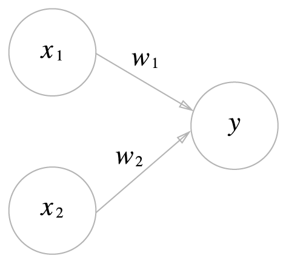
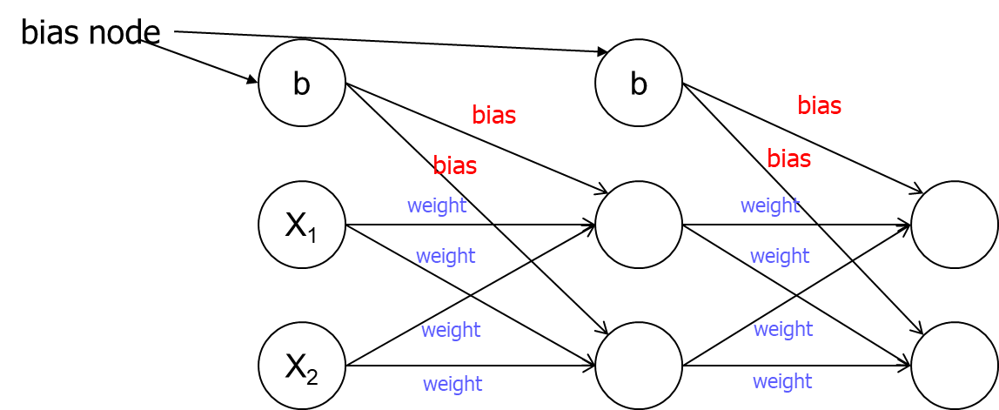
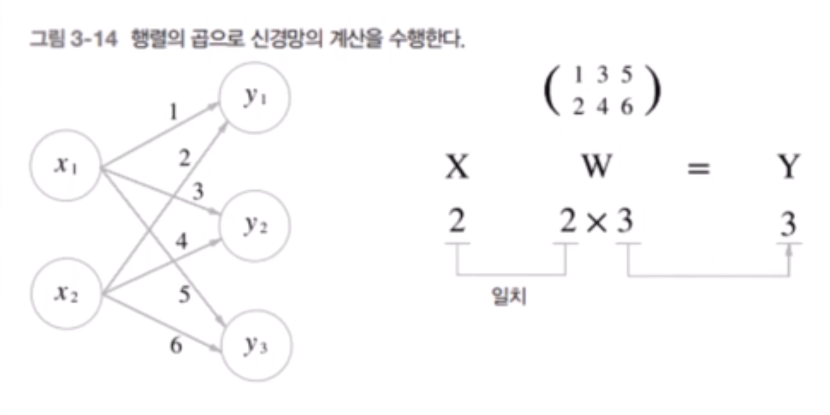
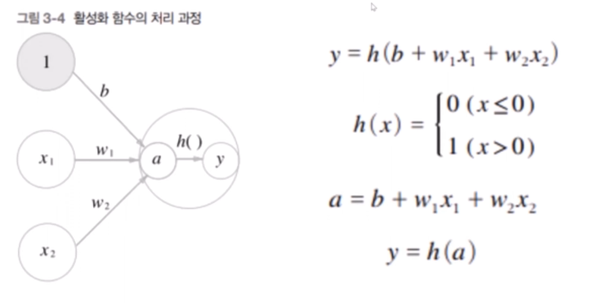
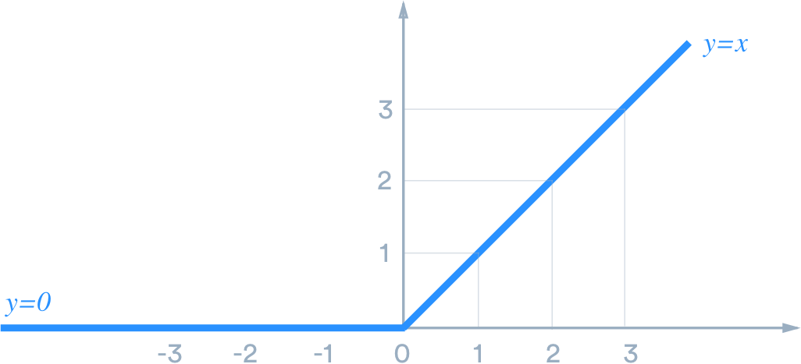
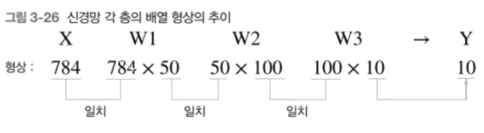
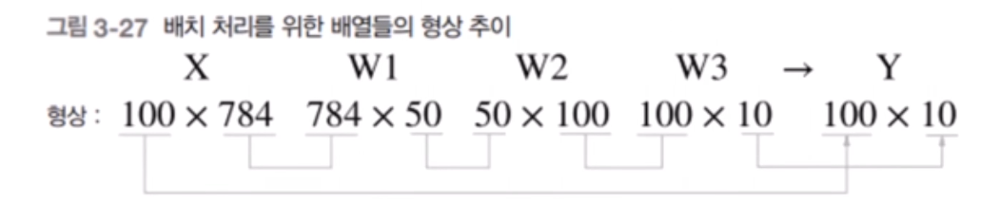
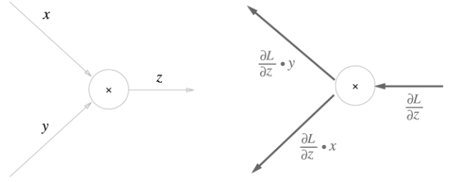
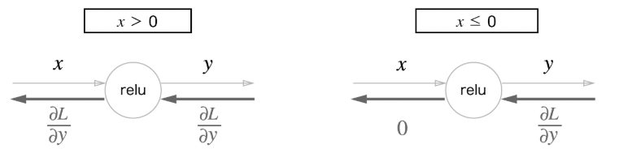
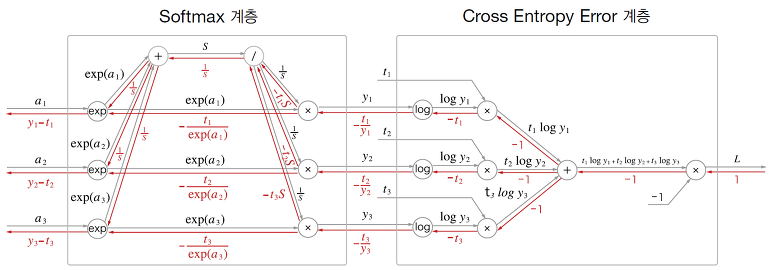

# 계획

- [x] 딥러닝 공부 계획
- [x] 강의 조사
- [ ] 공부

# 밑바닥부터 시작하는 딥러닝 1

<div align="center">
  
</div>

- 여러번 배운 내용이고, 이후에 파이토치와 함께 한번 더 복습할 것이기에 딥러닝 이론 위주로 복습하는 방식으로 진행할 예정.


# CHAPTER 2 퍼셉트론

- 퍼셉트론은 다수의 신호를 입력 받아 하나의 신호, `0` 또는 `1`을 내보냄.




- 그림에서 보이는 하나의 원이 하나의 **노드**, 다른말로 **뉴런**임.
- w는 각각의 weight(가중치)이다.


이를 수식으로 나타내면 아래와 같으며


- 여기서 이 노드 또는 뉴런의 활성 임계값을 **세타**로 표기함.

- 하지만 이 세타는 나중에 가면 잘 안씀, 수학적으로 이 임계값이 결국 bias(b로 표기)의 역할이 똑같아서 그냥 교체 됨. 오히려 더 심플함.
 - 즉, bias는 뉴런이 얼마나 쉽게 활성화 되느냐를 가르는 용도. 적어도 퍼셉트론에서는.


- 이런 퍼셉트론 뉴런을 여럿 이용해서 보다 복잡한 논리도 구현할 수 있음. XOR 같은.


# CHAPTER 3 신경망

- 신경망은 위 퍼셉트론에서 더 응용된 개념임. 어찌보면 더 포괄적인 개념이기도하고.

- 신경망은 Input, Hidden, Output layer으로 구성됨.


(이걸 문헌에 따라 2개의 층이라 가졌다하기도 하고, 3개의 층이라는 말도 있음. 이 교재에서는 2층이라고 말함.)

- bias를 포함하여 아래 그림 처럼 보여주기도 함.



### 행렬곱

- 당연하지만 이런 신경망의 입력과 가중치 곱셈들은 행렬 곱셈으로 진행됨.



- 이른 공간변환적으로 생각하면, 원래 2차원 벡터가 3개 있었는데.. 이들은 각각 1차원 scalar 값으로 정사영 시키고 곱한 값을 통해 3개의 변환된 scalar 값을 얻는 것과 같음.

### 활성화 함수

- 활성화 함수: 입력 신호의 총합을 출력 신호로 변환하는 함수.
  - 노드 안에서 작동한다고 생각하면 쉬움.
  - 퍼셉트론 처럼 꼭 임계치를 넘겨야 활성화가 되고말고를 결정하는 것은 아니고, 활성화 함수마다 출력 방식이 다름.



- 활성화 함수는 주로 `h()`으로 표현하며, 인풋으로 input 총합을 알맞게 아웃풋으로 만들어냄. 위 예시는 퍼셉트론과 같은 0과 1만을 출력하는 계단함수임. 당연하지만 이 계단함수를 실제로 잘 쓰지는 않음.

> 참고로 계단말고 인풋을 아웃풋에 그대로 전달하는 방식도 있긴함. 하지만 쓰이지는 않음. 왜냐하면 그렇게 하면 시스템이 선형밖에 안됨. 즉, 여러개의 행렬을 붙인다는 말이 되는거고, 그 말은 사실 하나의 행렬을 이용하는 것과 같음. 이는 아무리 많은 레이어를 쌓아도 결국 하나의 선형변환 밖에 안된다는 소리.

- 아래 처럼 **시그모이드** 함수를 이용하기도 함. 이는 명백한 비선형이고, 0 부근에서 확실한 고저차가 있어서 좋음. 미분도 가능하고.


참고로 `exp(-x)`는 $e^{-x}$를 표현한 것.

- 파이썬으로 쓰면 아래 처럼 됨.

```py
import numpy as np
def sigmoid(x):
    return 1 / (1 + np.exp(-x))    
```

> 아무튼 비선형 함수를 꼭 사용해야함. 아니면 층을 쌓는 의미가 없고, 이는 곡 학습을 못한다는 의미임.

- 시그모이드 보다 많이 쓰이는게 **ReLU** 함수임.




어떻게 보면 0보다 크면 선형이라고 볼 수 있음.

계산도 적게 들고, 오히려 ReLU가 실제 우리 뇌가 연산하는거랑 조금 더 비슷해서 많이 사용됨.

```py
def relu(x):
  return np.maximum(0,x) # 이 함수는 두 매개변수 중에 더 큰 것을 반환함. 
```

### 그러면 모든 층에 활성화 함수가 있나?

- **그렇다**, 적어도 요즘 MLP에서는 모든 은닉층에 활성화 함수가 있다. 마지막이나 특정 층에만 넣는 것이 아니다.
  - 그리고 보통 항상 **ReLU**를 사용한다.
    - 은닉층에 활성화 함수가 없는 것은 선형회귀나 초기 퍼셉트론 개념과 헷갈린 것.

- 근데 왜 ReLU인가? 일단 **미분이 간단**하고, 실제 인간의 뉴런 상호작용과 그나마 비슷하다. (실제로는 강도가 선형적으로 증가하는 것이 아닌, 출력의 빈도가 선형적으로 증가하는 것이지만 아무튼)

### 그렇다면 출력층 뉴런에서도 활성화 함수가?

- 상황마다 다르다. 분류냐 회귀냐 등등

- 만약 신경망의 결과 그대로 아웃풋을 얻는 신경망이라면 identity_function(), 즉 항등함수를 사용한다. 하지만 말이 함수지 그냥 `y = x`다.

- 일반적인 회귀에서는 그냥 항등함수를 사용한다.

- 분류에서는 주로 소프트맥스, 시그모이드(결과가 두개만 있으면) 등을 사용한다.

### 소프트맥스

그러면 **출력층**에서 사용하는 활성화 함수인 소프트맥스에 대해서 복습해보자.


- exp() : 지수함수 $e^x$
- n : 출력층의 뉴런 수
- yk : 그중 k번째 출력
- ak : 입력 신호 k번째

이를 통해 0~1.0 사이에 모든 결과 값이 정규화됨. + 모든 결과의 총합이 1.0.

> 참고로 지수 함수는 값이 매우 가파르게 증가하기 때문에 입력 값이 크면 오버플로우가 발생할 수 있음. 이 경우를 예방하기 위해 입력으로 들어오는 값 중에서 최대 값으로 모든 인풋을 일광적으로 뺌. 이를 통해 값을 0 근처로 어느 정도 재비치 가능.

- **중요**: 소프트맥스는 어디까지 **학습시** 사용되는 출력층의 활성화 함수임. 어차피 사용하든말든 가장 큰 아웃풋을 내보내는 뉴런의 **위치는 달라지지 않음**. 추론시(순전파) 최적화를 위해 보통 소프트맥스를 **생략함**.

### 잠시 용어 정리

- 참고로 입력 데이터에 특정 변환을 가하는 것을 **전처리**라고 함.

- 그리고 그 전처리 과정 중에서 예를 들어 0\~255를 0\~1 사이로 범위를 변환하는 것을 **정규화**라고 함.

#### 배치(batch) 처리

- 파이썬 라이브러리 행렬 계산 방식과 GPU 특성상, 작은 행렬을 여러번 반복 시키는 것 보다, 아예 처음 부터 큰 행렬을 한번 돌리는게 더 빠름.

- 즉 아래 X 데이터 하나를 돌리고. (784 픽셀의 한 이미지라고 가정할 때)



이를 100번 반복하는 것보다. 아래 처럼 그 784 이미지 100개를 (GPU마다 다름) 합산해서 학습하는게 훨씬 더 빠름.



이 100개 묶음 하나를 **미니배치(Mini-batch)**라고 부른다.

- 즉 데이터끼리 먼저 쌓아서 커다란 행렬을 만든 뒤에 한번에 계산하는 것.

# CHAPTER 4 신경망 학습

- 딥러닝은 end-to-end machinge learning이라고 불리기도 함. 학습 및 사용에서 처음 부터 끝까지 사람의 개입이 없다는 뜻임.

## 손실 함수

현재 신경망의 오차가 얼마나 큰지 알려주는 함수.

#### SSE, Sum of Squared Errors (오차제곱합)

$$SSE = \sum_{i=1}^{n} (y_i - \hat{y}_i)^2$$

- $y_i$ : 실제 정답 레이블
- $\hat{y}_i$ : 신경망의 출력

> 햇(hat, $\hat{}$ ) 기호는 보통 추정치 또는 예측치를 의미할 때 많이 붙임

가장 심플한 방식의 손실함수.  물론 데이터의 양이 커지면 예도 같이 커지지 보통은 평균을 내는 MSE를 더 많이 사용.

### MSE, Mean Squared Error (평균제곱오차)

$$MSE = \frac{1}{n} \sum_{i=1}^{n} (y_i - \hat{y}_i)^2$$

그냥 위 SSE에서 데이터 개수 만큼 나눈 것.

### Cross Entropy Error, CEE (교차 엔트로피 오차)

$$CEE = -\sum_{i=1}^{n} y_i \log(\hat{y}_i)$$

- $y_i$: 실제 정답 (보통 One-hot encoding)
- $\hat{y}_i$: 모델의 예측 확률

> [0 1 0 0 0 0] <- 이 처럼 하나만 `1`이고 나머지가 전부 `0`이 결과 및 표기방식을 **One-hot 인코딩**이라고 함.

- 정답말고 나머지가 정답이 보통 `0`이기에 다 0이 곱해져서 정답이 `1`인 출력층만 보게됨. 그 정답에 대한 오차만 계산하는 것.

- log 함수를 사용했기에 신경망 결과가 1에 가까울수록 (보통 이전에 0~1.0으로 정규화를(아마 소프트맥스 같은 것을 사용해서) 시켜서 최대가 1임) log 함수의 결과는 0에 수렴함.

> 손실함수는 당연히 학습시이란 test시에만 사용하기에 평소 추론에는 적용안함. 그렇기에 손실함수를 위한 소프트맥스 같은 것들도 필요 없어짐.

- 반대로 log이기에 정답이었는데 신경망은 0을 출력했다면 무한대에 가까운 오차를 반환함.

#### 미니배치용 CEE

- MSE와 다르게 CEE는 원래 부터 데이터 하나만을 위해 오차를 계산하기에 $1/N$이 필요 없음. 다만 실제 학습시 데이터들을 묶어서 학습하기에, 그 미니배치끼리의 평균 오차를 구할 필요는 있음.

$$E = -\frac{1}{N} \sum_{n} \sum_{i} t_{ni} \log(y_{ni})$$

- $N$: 총 데이터 개수 
- $t_{ni}$: $n$번째 데이터의 $i$번째 정답 레이블 
- $y_{ni}$: $n$번째 데이터의 $i$번째 출력값

#### BCE, Binary Cross-Entropy

- 참고로 CEE를 이진분류 문제만 한정하면 다음과 같이 식이 더 간단하게 나옴.

$$BCE = -[y \log(\hat{y}) + (1-y) \log(1-\hat{y})]$$

물론 여기서도 one-hot 인코딩으로 답이 세팅 됐으니 두항 중에 하나는 그냥 0되는 것.

시그마를 쓸 필요도 없이 그냥 두 출력 뉴런의 아웃풋을 표현한 것임.

## Gradient (기울기)

$x_0$와 $x_1$ 두 개의 변수를 가진 공식을 $x_0$와 $x_1$ 각각 편미분하고 이 둘을 모아 하나의 벡터로 모은다면 다음과 같이 보일 수 있음.

$$\left( \frac{\partial f}{\partial x_0}, \frac{\partial f}{\partial x_1} \right) = \nabla f$$

- $\frac{\partial f}{\partial x_0}$ : $x_1$을 상수로 취급하고 $x_0$에 대해서만 미분한 값
- $\frac{\partial f}{\partial x_1}$ : $x_0$를 상수로 취급하고 $x_1$에 대해서만 미분한 값

- 그리고 이 둘을 모아 한 벡터를 만든 것이 $\nabla$ f, 즉 Gradient(기울기)임. 

> 벡터인데 `[]`를 안쓰고 왜 `()`를 사용해서 표현하냐? 그냥 수학이나 통계학적 관례임, 순서쌍이라는 것을 강조하기 위해 ()를 많이 사용함. []는 주로 선형대수학적인 접근방법임.

- 아래와 같은 그림을 많이 봤을텐데 이는 각 변수에 대해서 편미분하고, 그 기울기들은 정리한 벡터장을 표현한 것임.


각 $x_0$와 $x_1$의 값에 따른 기울기에 대한 벡터(gradient)들을 구하고 보기 좋게 나타낸 것.

당연히 최적화는 이 gradient들이 줄어드는 방향, 즉 gradient들이 가리키는 곳 진행하는 것. 같은말로 변수가 w으로 바뀌었을 때 오차가 가장 줄어든 곳으로 나아가야함.

### Del, 또는 $\nabla$ Nabla에 대헤

잠시 $\nabla$ (나블라, Nabla) 기호에 대해서 설명. 

- $\nabla$는 **델(Del) 연산자**라고도 부르며, 미분 관련하여 주로 쓰임. 

- 주로 Gradient $\nabla f$나, 발산(Divergence) $\nabla \cdot \mathbf{F}$를(벡터장이 한 점에서 퍼져 나가는지, 모여드는지를 나타냄) 표현할 때 사용함.

- 딥러닝에서 $\nabla$를 만난다면? 손실 함수 L의 가중치 w들로 편미분해서, 어느 방향으로 업데이트해야 오차가 줄어들지 알려주는 벡터를 구해라!의 역할에서 나타남. ($\mathbf{w} - \eta \nabla_{\mathbf{w}} L$)

## 경사(하강)법

얼마나 틀렸고, 그 기울기가 얼마나 되는지를 알 수 있으면 이제는 학습을 해야한다.

> 손실함수에서 극솟값, 최솟값, 안장점이 되는 곳에서 기울기가 0이 됨. 함수가 복잡해지면 학습 도중에 평평한 고원 같은 것들이 생길 수 있음. 그래서 마냥 0에 도착했다고 좋아하면 안됨.

- 딥러닝에서 학습은 주로 주어진 정보에서 옵티마이저를 통해 오차를 줄일 수 있는 방향으로 나아가는 형태.

- 가장 베이스가 되는 옵티마이저가 경사하강법. 경상상승법도 있긴한데 사용할 일은 아마 없을 듯.

다음과 같이 웨이트와 손실함수가 있을 때:


$$\mathbf{w} \leftarrow \mathbf{w} - \eta \frac{\partial L}{\partial \mathbf{w}}$$

또는 위에서 배운 gradient를 이용하여(navla 기호) 표현하면

$$\mathbf{w} \leftarrow \mathbf{w} - \eta \nabla L$$

- $\leftarrow$ : (Assignment이라고 발음함) 오른쪽에서 계산 된 값을 왼쪽의 w에 **덮어씌운다**는 뜻. (`=` 수학적으로 양쪽이 같다는 의미이니, 컴공 개념의 `=`를 가져온 느낌?) 

- $\eta$ : 학습률(Learning Rate, 에타)

- $\nabla L$ : (Gradient of Loss) 손실 함수의 기울기

- 마이너스를 붙이는 이유는 보통 $\nabla L$은 함수값이 가장 커지는 방향을 가리키기 때문임.

## 잠시 정리

- 전제: 신경망에는 적응 가능한 가중치와 편향이 있고, 이 가중치와 편향을 훈련 데이터에 적응하도록 조정하는 과정이 학습임.

- 학습의 4단계:

1. 미니배치: 훈련 데이터 중 일부를 무작위로 가져옴. 이렇게 선별한 데이터를 미니배치라고 하며, 그 미니배치의 손실함수 결과값을 줄이는 것이 목표이다. (위에서 봤던 100개씩 이미지 쌓는 모습에서 그 100개가 하나의 미니배치인 (사이즈 100의 미니배치) 것)
1. 기울기 산출: 미니배치의 손실 함수 값을 줄이기 위해서 각 가중치의 매개변수의 기울기를 산출해서 gradient(차원수가 w개수 만큼 커다란 벡터)를 만듬. 그 gradient, 즉 기울기는 손실 함수의 값을 가장 적게하는 방향을 제시함.
1. 매개변수 갱신: 가중치 매개변수를 기울기 방향으로 갱신함.
1. 반복: 1~3 단계를 반복.

> 참고로 미니배치를 뽑아 경사하강법을 돌렸으니, 이는 일반 경사하강법이 아닌 **확률적 경사하강법(SGD)**이라고 불러야 마땅하다.

# CHAPTER 5 오차역전파법

### 연쇄법칙
- 역전파는 국소적인 미분을 역방향으로 보내는 과정. 원리는 연쇄법칙을 이용.
- 연쇄법칙을 통해 전체를 한번에 미분하는 것이 아닌, 각 부분들을 독립적으로 미분할 수 있고. 그 부분들이 최종 출력에 영향을 미칠 수 있는지 알 수 있음.


### 계산 그래프를 통한 오차역전파와 연쇄법칙 설명

- 서로 + 되는 더하기 노드는 그냥 그대로 뒤로 보내짐.


왜냐하면 x + y를 각자 그 변수대로 편미분하면 나머지 변수는 0 되고, 그 변수는 1되기 때문.

- 곱셈 노드는 다른 쪽을 같이 뒤로 보내게 됨.



- 예시


#### 과연 다음 빈칸의 정답은?


<details>

<summary>정답</summary>


</details>

#### ReLU



0 이상이면 그대로 통과이고, 0이하면 0을 반환.

가장 널리 쓰임.

#### Sigmoid


### Softmax with Loss 계층

- [따로 공부해서 알고 있긴하지만](https://www.notion.so/robots-oh/MLE-Maximum-Likelihood-Estimation-30d63918d42a809c96f9c573233f3756#30d63918d42a80eaae2ace94c5514cae), 기본적으로 Softmax와 Cross Entropy는 꼭 같이 씀. 그래야만 계산이 엄청 간단해지기 때문.



원래 복잡하던 계산 다른 손실함수 미분 처럼 결국 y - q로 떨어짐.


- 참고로 CEE에서 하나의 Softmax 노드의 출력으로만 Loss를 구한다고 하긴 하지만, CEE랑 Softmax랑 합쳐지면 결국 모든 노드의 출력에 대해서 채점하는 공식으로 바뀜.

$q_i - y_i$ (여기서는 $y_i - t_i$ 로 표시) 이 결국 Softmax 하류로 내려가는 편미분 도함수인데, 이 i는 딱 정답 레이블이 아니라 각 노드에 맞는 레이블이 고려하는 것이다.

예를 들어 출력이 $y = [0.2, 0.1, 0.7]$ 이고 정답이 $t = [0, 0, 1]$ 이면 각 채점은 -0.3, 0.2, 0.1 만큼 손실이 하류로 들어가는 것이다.

### 어? 근데 생각해보니 ReLU를 활성화함수로 모든 레이어에서 사용하면.. 결국 앞으로 전달하는 것은 Loss하나 뿐인거 아닌가?
그러면 학습이 이상하게 되는거 아닌가?

- 아니다, ReLU를 모든 노드에 사용해서 잠시 잊을 수도 있는데, 모든 노드 안의 ReLU가 들어간거지 애초에 가장 중요한 노드 간의 선형 진행 ($wx + b$) 편미분은 잊고 있는거다.
- 원래 활성화함수가 없더라고 선형계층은 원래도 있었고, 애초에 편미분을 통한 업데이트는 정확히 이들을 편미분학 업데이트하기 위한거다. ReLU는 그저 잠시 지나가는거다.

#### 그러면 실제 업데이트는 어떻게 하냐?

잠시 **상류**에서 -> **ReLU** -> **Affine** -> **하류** 역전파 과정 및 업데이트에 대해서 배워보자.

- 상류에서 온 기울기 $\frac{\partial L}{\partial a}$ 가 있다고 가정하자.

- ReLU 활성화 함수 단계를 타고 내려가면서 1 또는 0을 곱해 하류로 보내게 된다.

$$\frac{\partial L}{\partial a} \times (1 \text{ or } 0) = \frac{\partial L}{\partial z}$$

- 근데 이 받은 값으로 두 가지 일을 병렬적으로 진행한다. (서로 영향을 미치지는 않음)
  - **임무1**: 먼저 받은 값에 순전파 입력으로 들어온 x를(wx+b=y w기준 편미분) 곱하여 가중치를 업데이트하는 곳에 사용한다.

  $$\frac{\partial L}{\partial w} = \frac{\partial L}{\partial z} \times x$$

  나중에 업데이트시 사용.

  $$w \leftarrow w - \eta \frac{\partial L}{\partial w}$$

  - **임무2**: 상류에서 받은 값에 w를 곱하고 뒤로 전달한다.

  $$\frac{\partial L}{\partial x} = \frac{\partial L}{\partial z} \times w$$

  이 값은 그 다음 하류 활성화함수 편미분으로 다시 들어간다.

- 그동안 오해했던 것은 위 임무1, 임무2 분리를 모르고 같은 것으로 생각했기 때문이다.
- 위 과정을 수행하면 확실히 잘잘못을 반영하여 업데이트를 진행할 수 있다.

#### 근데 그러면 Bias는? 학습을 어떻게 시키는거지?

- 더하기는 편미분은 어차피 그냥 1로 끝난다.

- 상류에서 넘어온 것에 1를 곱하고, 이 값을 기반으로 바로 업데이트 하는 것이다.

### Gradient check

딥러닝 코드 구현시 오차역전파법 계산 과정 중에서 오류가 휴먼 에러나 버그로 결과가 다를 수 있다. 이때 오래 걸리더라고 신뢰도가 높은 수치 미분을 이용해서 한번 더 구하고, 두 값을 대조해보는게 gradient check 과정이다.

- 물론 요즘 파이토치는 Autograd라는 강력한 기능을 지원하기에 거의 신경 쓸 일은 없다.

- 커스텀 레이어를 새로 창조하거나, C++ 또는 CUDA단으로 내려가야만 신경 쓸일 있을 듯?


# CHAPTER 6 학습 관련 기술들

# CHAPTER 7 합성곱 신경망(CNN)

# CHAPTER 8 딥러닝

