### 계획
- [ ] 논문 읽기
- [x] 영상 시청
- [ ] KL divergence 이해
- [ ] Bayesian rule 시각화 정리 이해

# VAE & CVAE  

[Tutorial on Variational Autoencoders](https://arxiv.org/pdf/1606.05908) <- 사실 이것만 제대로 봐도 좋음. VAE, CVAE 둘다 정리됨.

[VAE: Auto-Encoding Variational Bayes](https://arxiv.org/pdf/1312.6114)

[CVAE: Learning Structured Output Representation using Deep Conditional Generative Models](https://proceedings.neurips.cc/paper_files/paper/2015/file/8d55a249e6baa5c06772297520da2051-Paper.pdf)

# Variational Autoencoder

https://www.youtube.com/watch?v=qJeaCHQ1k2w

- VAE의 대력적인 구조는 아래와 같이 생겼음.

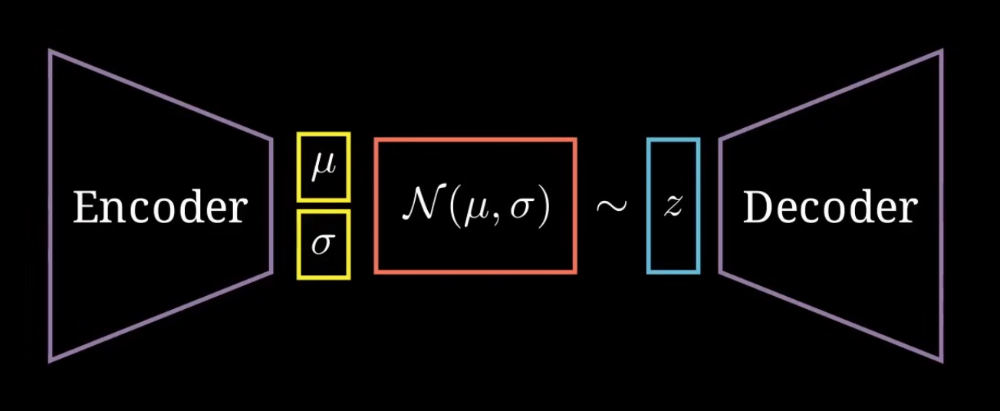

- Encoder는 인풋의 특징을 뽑바 저차원으로 압축함. 보통 1차원의 벡터임.

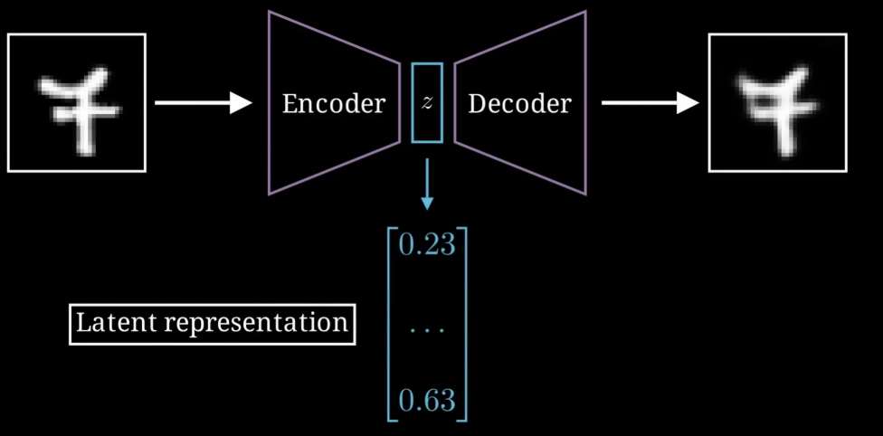

이를 **Latent space**라고 주로 말함.

- Decoder는 인풋에 대해서 생긴은 벡터들에 대해서 복원을 시도함.

근데 이게 쉬운게 아님.

기존 특정 이미지에 대한 latent vector를 아래 그래프 $z_{ref}$라고 칭한다면.

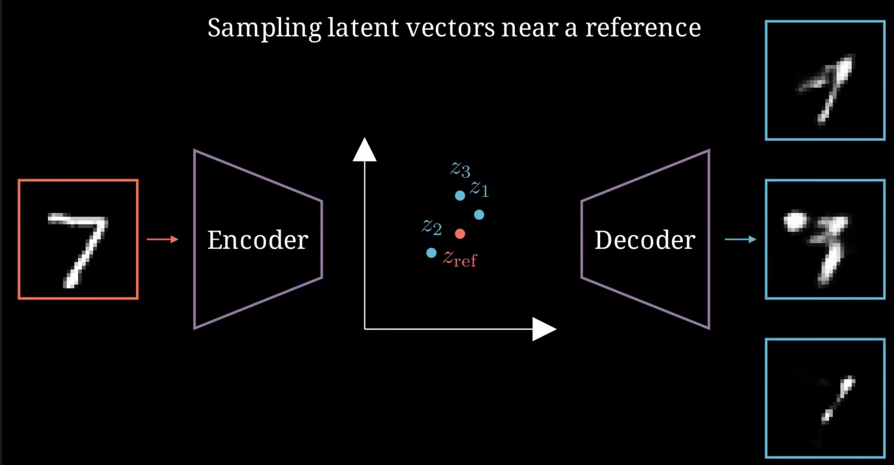

그 주변의 벡터를 샘플링해서 복원하면 이상한 이미지가 나옴.

$z_{ref}$ 벡터 위치 그대로 복원하면 사실상 같은 이미지만 나오고.

- 그래서 이 Latent space에 대한 리모델링이 필요함!

- 기본적인 틀은 Bayesian Rule을 사용. 

## Organize the Latent space!

일단 아래와 같은 상황이 있을 때 용어 정리를 해보자.

- $p(x)$ : Data Distribution (데이터 분포) 또는 Marginal Probability (주변 확률)
    - 원래 데이터가 존재하는 실제 세계의 복잡한 확률 분포. 여기서 뽑아낸 관측치 하나가 각 데이터 포인트 $x$가 됨.
- $p(z)$ : Prior Distribution (사전 확률 분포)
    - 데이터 $x$를 관측하기 전(Prior)에, 잠재 공간(Latent space)의 변수 $z$가 **따를 것이라고 미리 가정**해 두는 분포임.

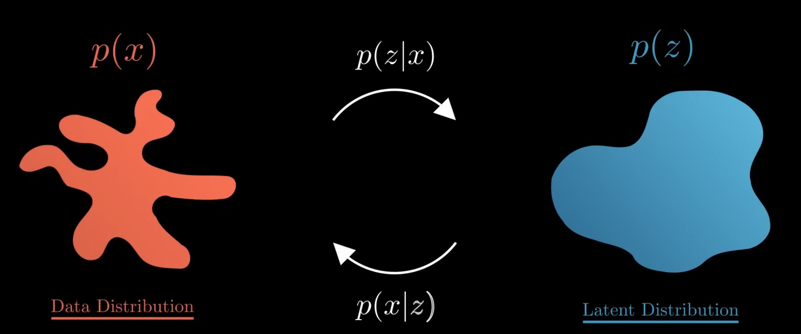

- $p(z|x)$ : 특정 데이터 $x$가 주어졌을 때(조건), 그 $x$를 만들어냈을 법한 잠재 변수 $z$의 분포. (나중에 이게 인코더 역할)

- $p(x|z)$ : 잠재 변수 $z$가 주어졌을 때(조건), 그 $z$로부터 특정 데이터 $x$가 만들어질 확률입니다. (나중에 이게 디코더 역할)

- 하지만 문제는 우리는 이 $p(z)$가 어떻게 생겨먹었는지 모른다는 것.
    - 그래서 일단 가우시안 분포, 그것도 **표준** **정규분포** $\mathcal{N}(0, I)$의 형태일거라고 가정하는거임.

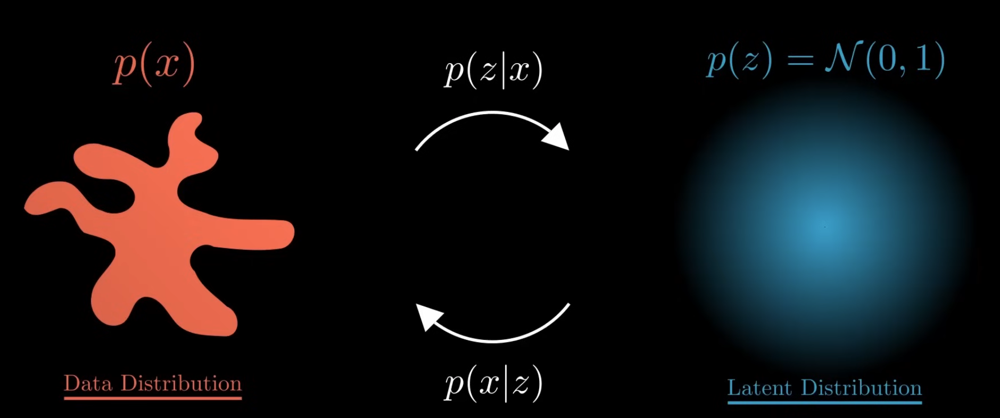

- 그리고 진짜 사후 확률 $p(z|x)$도 계산하기가 너무 어려워서, 이를 근사하는 함수 $q(z|x)$으로 바꿈. <- VAE 혁신 중 하나

$p(z|x) \approx q(z|x)$ <- 일단 어려우니까 대충 q라는 공식이라고 생각하고.

$q(z|x) = \mathcal{N}(\mu, \sigma)$ <- 그 q 공식 또한 가우시안 분포임, 하지만 **표준 정규분포는 아니며** $\mu, \sigma$는 **학습**해서 수정해야함. <- 물론 나중에 보면 조금 다름.

- 위 과정을 Encoder단에서 학습하는 것! $\mu, \sigma$ 포함

- 근데 위 과정을 어떻게 학습함? 정확히는 **Loss**를 어케 구함?

아래 공식이 있음, 처음에 조금 생소해보일 수 있음.

$$\mathcal{L}(x) = \mathbb{E}_{q(z|x)} [\log p(x|z)] - \text{KL}(q(z|x) \, \Vert \, p(z))$$

- 하지만 뜯어보면 별거 아님.

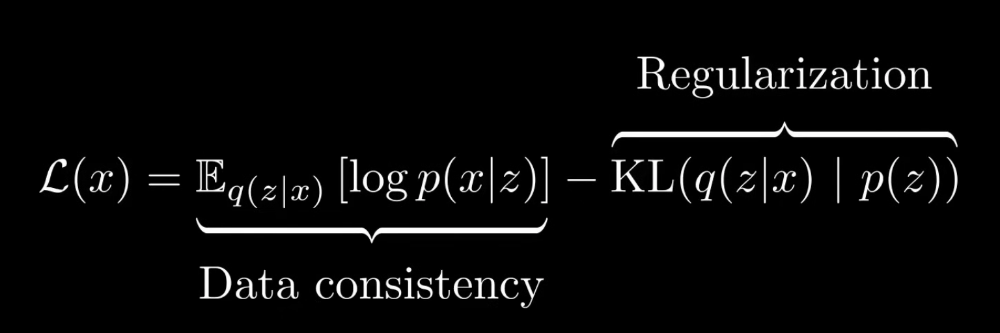

#### Data consistency 부분

- 그냥 인풋을 latent space에 보내고 다시 복원했을 때 이를 얼마나 잘 복원하는지 평가하는 것.

- 특정 인풋에 대해서 $q(z|x)$을 사용해서 Latent space으로 보내고.

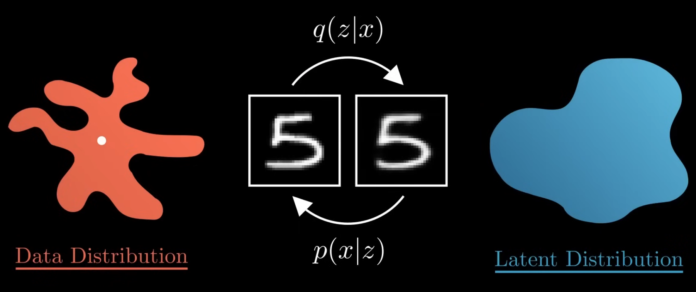

- 이를 $p(x|z)$으로 다시 복원한 것이 실제 이미지랑 얼마나 다른지 평가하는거임.

근데 사실 이게 MSE, 즉 L2랑 같은거임

$\mathbb{E}_{q(z|x)} [\log p(x|z)] = L2 = MSE$

그걸로 Loss를 구하는 것.

#### Regularization 부분

정확히는 Latent space의 regularization임.

- [ ] 이 부분을 정확히 알기 위해서는 KL divergence 스터디 필요

- 일단 $q(z|x)$을 통해 무언가를 만들기는 했음.

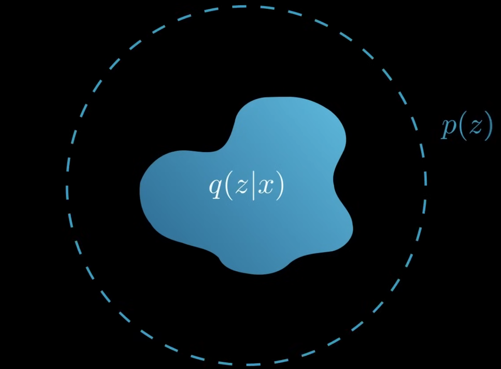

- 하지만 우리는 p(z)가 결국에 가우시안 표준 정규분포를 따른다고 가정했기에, 이 $q(z|x)$ 최적화에 대한 종착지가 표준 정규분포가 됨.

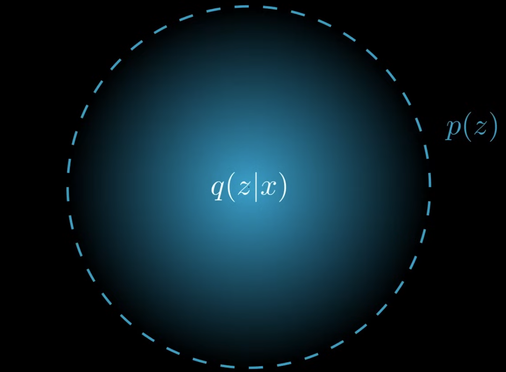

## Loss function of VAE

- 다시 돌아와서, $q(z|x)$가 아직 학습되지 않은 가우시안 분포를 통해 최종 목적지가 가우시안 표준 정규분포인 Latent space를 채워갈거임.

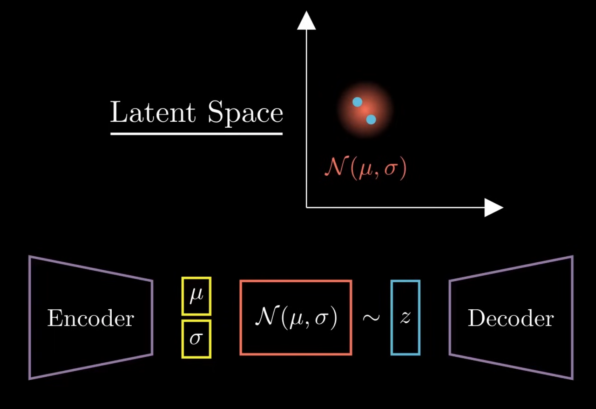

- 그런 분포에서 랜덤으로 특정 벡터를 샘플리해서 다시 Decoder로 넣어서 복원하는게 아웃풋을 만드는 과정.

- 그 아웃풋을 바탕으로 Loss를 구하면 됨.

$$\mathcal{L}(x, x') = L_2(x, x') + D_{KL}(\mathcal{N}(\mu, \sigma) \, \Vert \, \mathcal{N}(0, 1))$$

- ? 근데 이걸 backpropagate하는게 가능한가? 중간에 가우시안 과정은 진짜 어떻게 역전파를 하지? 특히 $\mu, \sigma$는 어케?

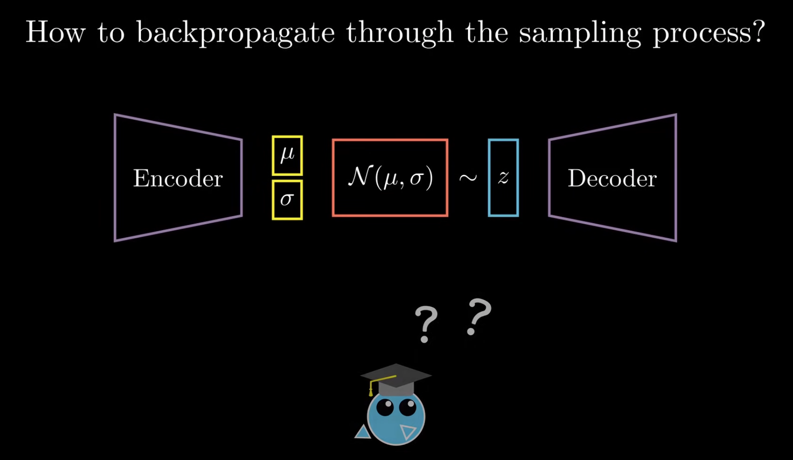

- 맞음, 평범하게는 못하는게 맞음. 무작위 샘플링은 미분이 안되는 요소임. 하지만 조금만 수정하면 괜찮음.

- 여기서 VAE의 두번째 영리한 트릭이 나옴: **Reparameterization** (재매개변수화)

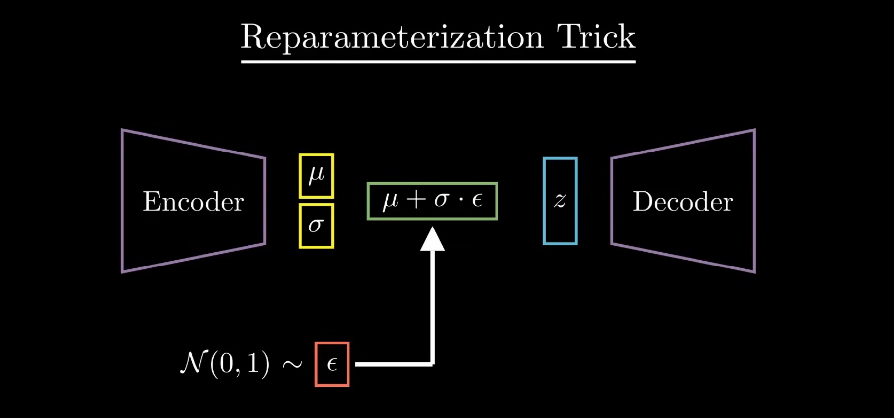

$$z = \mu + \sigma \cdot \epsilon$$

- $\epsilon$은 표준 정규 분포에서 무작위로 추출(Sampling)한 노이즈 벡터임. <- 모델이 고려하지 않아도 ㄱㅊ.
    - 이를 통해 $\epsilon$는 단순한 수정할 필요 없는 bias를 더하는 것으로 취급됨.
 
- 물론 그래도 $\mu, \sigma$는 학습에 의해서 배우는게 맞음 

> 참고로 $\mu$와 $\sigma$는 단일 값(스칼라)이 아니라, 잠재 벡터 $z$와 똑같은 개수의 요소(차원)를 가진 벡터임. Latent space가 64개의 요소를 가지고 있으면 가우시안 분포도 64개가 있는 것.

- 그리고 참고로 Loss function에서 KL을 따로 빼면 다음과 같이 간단하게 풀어짐.

$$\mathcal{L}(x, x') = L_2(x, x') + D_{KL}(\mathcal{N}(\mu, \sigma) \, \Vert \, \mathcal{N}(0, 1))$$

$$\mathcal{L}(x, x') = L_2(x, x') + \mathcal{L}_{KL}$$

$\mathcal{L}_{KL} = -\frac{1}{2} \sum (1 + \log(\sigma^2) - \mu^2 - \sigma^2)$

### 의의

- 아무튼 Latent space를 딱 고정된 벡터로 만드는게 아니라 가우시안 분포로 맞춤으로서 훨씬 더 완만한 복원을 만들 수 있음.

예를 들어 중앙값이 기존 이미지일 때, 그것을 중심으로 점점 떨어지면 그 원본의 형상을 완만하게 조금씩 일어감.

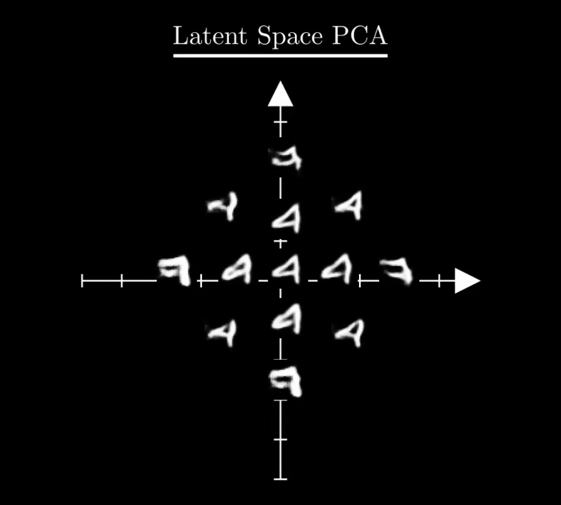

- 그 뿐만 아니라 여러 데이터 사이의 interpolation도 가능해져서, 이 특징의 이만큼, 다른 특징의 이만큼, 이런식으로도 담아내는 것이 가능해짐.

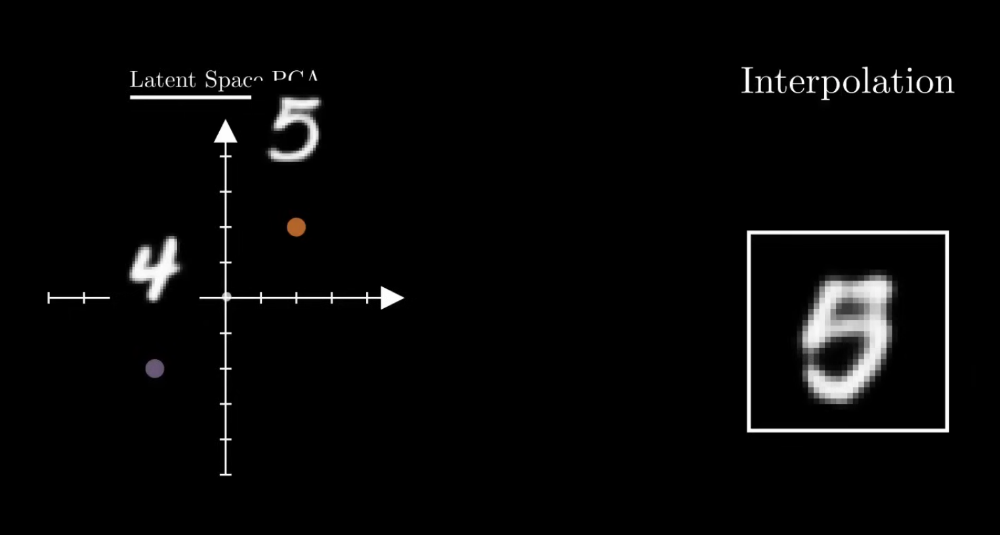

- VAE도 괜찮은 변화이지만 여러 한계가 많다. 일단 특정 입력에 대해서 아웃풋을 어떻게 바꿔야할지 조건을 넣는 과정이 아직 없다.

# Conditional VAE

- 그걸 해결한게 CVAE.

- 기존 VAE 그림에서는 인코더와 디코더가 데이터 하나만 바라봤다면, CVAE는 전체 생성 과정이 어떤 입력(조건)에 의존하도록 만듬.

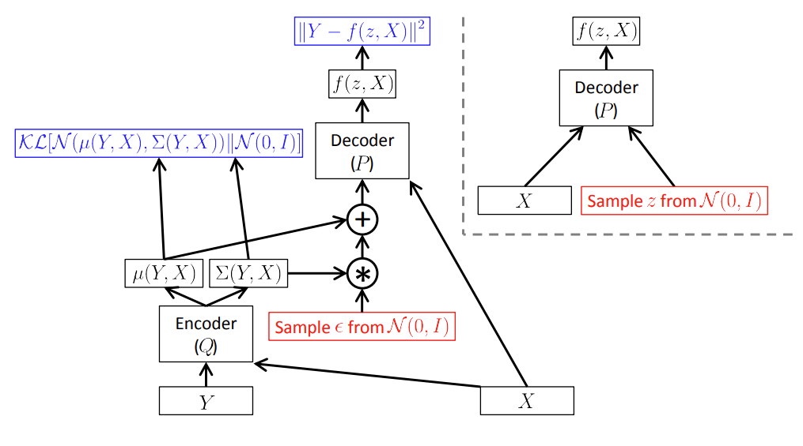

### Train 과정 변경점

- Encoder단에서 변화: 이제 인코더는 타겟 정답($Y$)뿐만 아니라, **조건 데이터**($X$)를 함께 입력으로 받게 됨. 이 두 가지를 동시에 보고 평균($\mu$)과 표준편차($\sigma$)를 만듬. 

- Decode단에서 변화: z만 받는게 아니라 **조건 데이터**($X$)를 또 받음! 신경망 작동 중에 초반에, 그리고 중반에 $X$를 넣는거임(2번). 이를 바탕으로 최종 타켓 $Y$를 복원함.

### Test 과정 변경점

- 아예 Encoder를 안씀. ($Y$가 정답이니 당연히 받으면 안됨)

- z를 무작위적으로 뽑고, 조건 데이터 $X$만을 받아 타겟 $Y$를 복원하는 형식.

