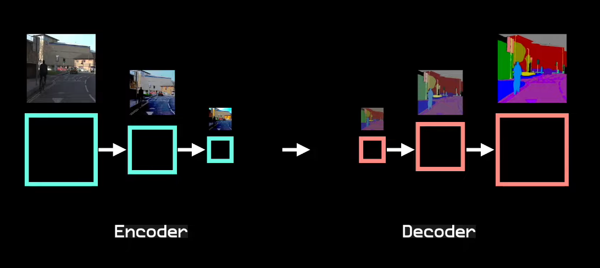
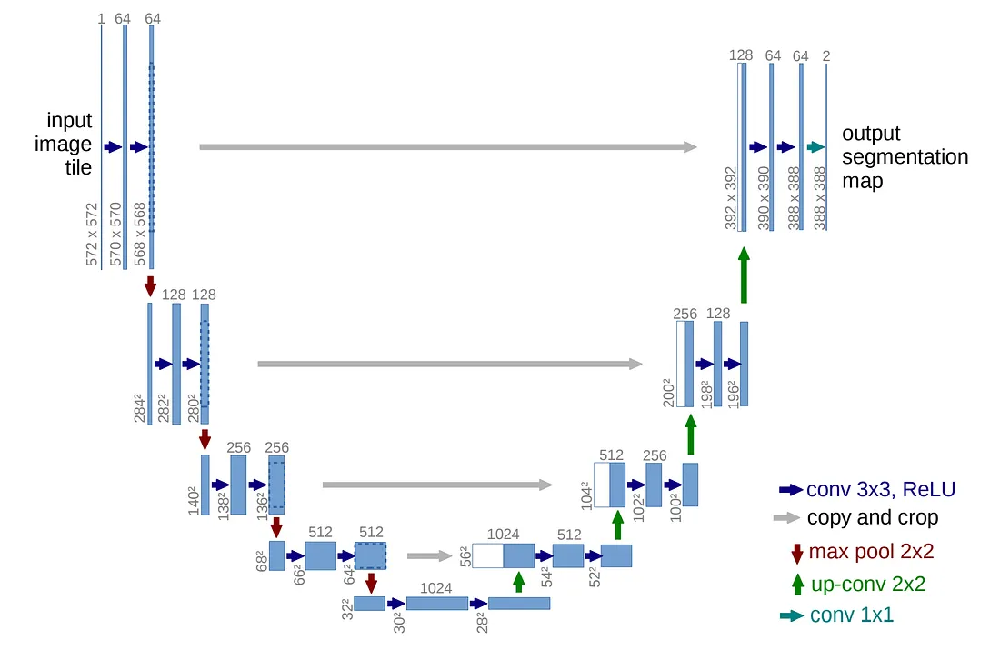
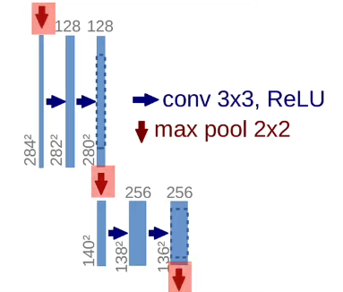
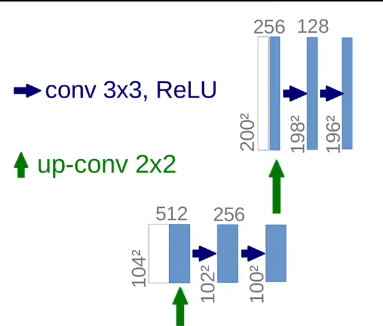
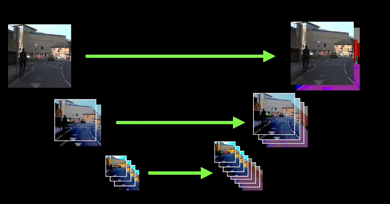
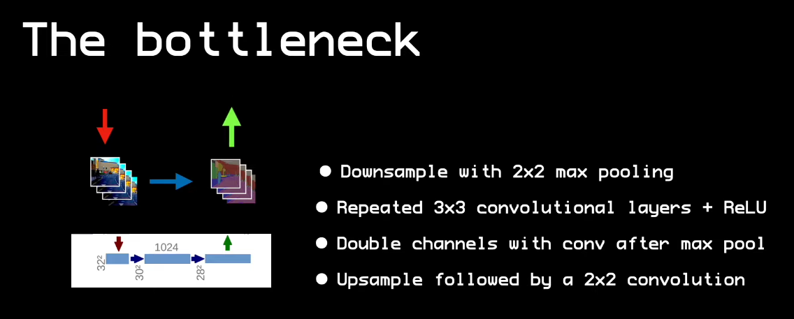
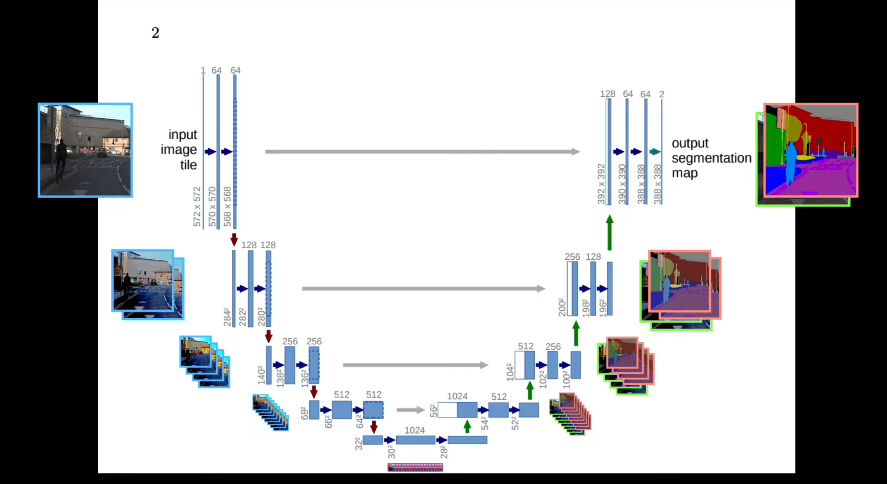

## 계획

- [x] ResNet <- 이 사람들은 무엇을 해결하려고 했는가? gradient vanishing는 아님, degrading problem? (논문 참고할 것)
  - [x] 그리고 ResNet 논문 읽고 분석
  - [x] 직접 구현할 것 (다 손으로 짜서)

# ResNet

https://arxiv.org/pdf/1512.03385

## 논문 분석

논문 자세히 보려면 클릭

---

- 스킵연결에 대해서 배우면 Resnet를 만든 사람들이 그저 gradient vanishing 문제를 해결하려는 것으로 보일 수 있으나, **사실 아니다**.

- ResNet 논문을 읽으면 Vanishing 문제는 이미 초깃값 및 배치 정규화으로 어느 정도 해결 된것으로 보고 있으며.
    - 그들이 해결하려는 것은 모델이 깊어지고 커짐에 따라 오히려 성능이 이상하게 떨어지는 **degradation problem**을 해결하는 것이었다.

> Degradation 문제는 Bias Variance 문제와 **다르다**!! Bias Variance는 모델이 깊어짐에 따라 train에 대한 에러는 **내려**가지만, val에 대한 에러가 올라가는 문제고. **Degradation**은 모델이 깊어짐에 따라 train, val에 대한 **에러가 둘다 그냥 중가**하는거임!!

- 논리적으로 생각해보자, 어느 정도 성능이 나오는 얕은 모델에 레이어를 더 깊게 추가해본다. 이때, 더 추가된 레이어가 아무리 쓸모가 없어도, 그저 **항등 함수 역할**을 한다면, 아무리 못해도 얕은 모델 보다 깊은 모델이 **최소 같거나** 더 성능이 좋아야하지 않을까?
    - 하지만 실험적으로 봤을 때 그렇지 않았다.
    - 이 문제를 그들은 해결하려고 했다.
    - 바로 잔차 함수, **Residual Function**을 도입해서.

## Residual Function & Skip Connection

- 이론은 생각보다 매우 간단하다.

- 인풋이 x인 신경의 아웃풋을 H(x)라고 해보자. 신경망을 최대한 **함수 처럼 생각**하는 것이다.

- x가 들어갔다가, 변해서 H(x)가 돼서 나오는 것, 이는 당연하게 들린다.

- 하지만 더 쉽게 생각할 수 있다. 만약에, 이 함수가 x를 **단지 변동**하는 것이라고 생각할 때.. 그냥 단순히 x가 얼마나 변하고 이를 추가하는... 즉, **그 차이만 주는** 모델을 주면 어떨까?

- x -> H(x)가 아니라 x -> x + F(x) -> H(x)
    - 이 x에다가 그저 **F(x)** 를 더하는 방식으로 x에 대한 변동을 주는 것이다!
    - 이 블록들이 **F(x)** 를 학습하는 것이다!

- 이론상으로 차이가 있다! 신경망 입장에서 **이 추측이 더 쉬운** 것이다!

    - 위에서 얕은 함수에 레이어를 추가했을 때 아무리 못해도 **항등함수**라도 되면 성능이 저하되지 않을텐데라는 말을 했다.
    - 하지만 한번 신경망에 들어가버리면 아웃풋이 어떻게 나올지 아무것도 모르는 모델 입장에서 그 **항등함수 조차 만들기 어렵다**.
    - 하지만 차이 F(x)라면? 극단적으로 생각했을 때 그냥 F(x)가 **0이 되버리면 그만**이다.
    - 그래고 최소 기준점이 있으니 모델이 학습하기가 더 쉬워지는 것!

- 이 F(x)를 **Residual Function**이라고 부르고.
    - 이 모델은 이를 적즉적으로 사용했기에 **Residual Network**, 즉 **ResNet**으로 불리는 것이다.

- 그리고 이 방법이 기존에 앞과 뒤를 연결하려고 했던 방법들 (맨앞과 뒤 Linear 모델들, gate을 지니고 앞과 뒤를 연결하는 highway network) 보다 가볍고, 학습하기 간편하다. 또한 기존 방법들은 100 레이어 이상에서 괜찮은 성적을 보여주지 못했다.

## ResNet 모델

- 아무튼 이 Residual Function을 적극적으로 사용한 이 모델을 탐구해보고 실습해보자.

- 일단 이 잔차 함수 적용을 위해 인풋과 아웃풋은 같아야한다.

- 기본적인 공식은 이렇게 생겼다:

$y = \mathcal{F}(x, \{W_i\}) + x$ 

- $x$: 블록의 첫 번째 입력값
- $W_i$: weight layer 행렬

- 근데 만약에 인풋과 아웃풋이 다르다? 그러면 인풋 x를 아웃풋에 맞춰 정사영 시켜야한다.

$y = \mathcal{F}(x, \{W_i\}) + W_sx$

- 이때 $W_s$ 는 정방행렬로, CNN 구조에서는 채널수를 맞춰주기 위해 1x1 합성곱 연산으로 구현된다.

> 참고로 잔차 함수에 포함되는 블록이 딱 하나면 사실 선형 레이어 형태가 되버려 거의 의미가 없고, 보통 2~3개 정도가 적당하다. 50층 이상의 깊은 모델은 연산의 효율을 위해서 3개로 묶어서 했다.

### CIFAR-10 적용

- 어떻게 학습했는지 파라미터까지 꽤 상세하게 논문에서 나타남:
    - SGD 사용
    - weight decay 0.0001
    - momentum 0.9
    - 드롭아웃 미사용
    - batch size 128 (GPU 2대 기준)
    - lr 시작값 0.1
        - 32k와 48k 단계에서 각각 한번 1/10을 함.
    - 45k/5k train/val
    - 4픽셀 패딩
    - 데이터 증강했음
    - 보통 3x3 conv 사용
    - 2개 레이어보다 3개의 레이어로 잔차함수를 쓰는게 좋음.
    - 적어도 residual 블록, 즉 Conv 레이어에서 bias는 생략함

## U-Net

U-Net은 이미지 segmentation, 이미지 화질 개선, 디퓨젼 모델 등등에 쓰임

- 비교적 화질이 높은 이미지를 '만드는' 것에 자주 쓰임 (segmentation도 원본 이미지 위에 그림 그리는거임)

- U-Net은 Encoder와 Decoder으로 구성됨

- 기존의 배웠던 CNN 모델들은 결국 이미지의 특징을 압축해서 의미있는 정보를 추출해서 분류하는 문제였음.
    - 하지만 U-Net 그 추출된 의미있는 정보에서 그치지 않고, 다시 복원까지 하는 과정임.

### U-Net 구조

- U-Net의 전체 구조다.

- 일단 **Encoder** 단계 부터 보자.

3x3 conv + Relu로 우측으로 이동 (채널 수는 두 배씩) (파란색 화살표)

그리고 max pool 2x2로 크기 압축을 한번하며 아래로 이동한다 (빨간색 화살표)

- **Decoder** 과정

3x3 + Relu로 우측으로 이동하며 채널수 절반씩 날림.

**up-conv** 2x2를 해서 사이즈를 키움

> 참고로 Up-conv의 역할은 각 픽셀 값에 필터를 곱해서 2x2 크기로 키워서 퍼뜨리는 연산 과정임. 풀링의 반대지만 이 친구는 weight가 있음.

- **Connection** 과정

별거 없고 말그대로 **Encoder 피쳐맵를 Decoder에 갖다 붙임**. Decoder 흰색 부분이 갖다 붙여진 부분.

**Encoder**은 **자잘한 특징**들이 담겨있음, 모서리와 선분, 실제 물체 등이 있음. <- **공간**에 대해 잘 안다.

**Decoder**은 그 반면에 그 물체가 뭔지 같은 더 **고차원이 이야기**를 하는거임. <- **개념**적인 것을 잘 안다.

위 둘을 합쳐서 **공간**과 **개념**을 **둘다** 챙겨가는 것. 즉 개념도 알고, 그게 어디있는지도 비교적 정확히 아는거다.

- 가운데 과정 **bottleneck**

생각보다 딱히 특별한 없고 그냥 Encoder와 Decoder 사이의 **bridge** 역할임.

> 물론 네트워크에서 가장 깊은 곳이라 해상도는 제일 낮지만, 이미지 **전체의 개념**을 **가장 압축적**으로 담고 있는 핵심 구간이라고 볼 수 있음.

- 최종적으로 아래 그림 처럼 보임

우측 초록색 피쳐맵들은 그냥 좌측의 피쳐맵을 가져다가 붙인것.

- 참고로 만약에 Encoder에서 가져온 이미지가 Decoder와 사이즈가 안맞으면 그냥 큰 쪽의 이미지를 **잘라서 해결**함.

- 생각보다 모델 구조가 간단하다. 비교적 **작은 특징의 피쳐맵**과 **고차원의 피쳐맵**을 **합성곱**에 **같이 돌려** **정밀한 공간에 개념까지 합친** 것이다.

- ResNet은 항등함수 기준을 제시함으로서 모델의 학습이 더 쉬워지는 inductive bias를 제시한거고. **U-Net**은 **작은 특징**과 **고차원의 개념**을 **같이 학습**함으로서 **정밀성**에 대한 **inductive bias**를 제시한 것이다. 

    - 마치 우리가 **시야**에 딱 **칼**이라는 위험한 물체가 보였을 때, 그 칼이 가져오는 **위험성과 서늘함**이 각인되고(조금 더 **고차원**적인 것을 판단한 뇌 부분에서), 그 **시야 속에 칼**이 딱 **어디**있는지 각인되어 (**칼의 뾰족한** **부분**이 내 시야에서 어디있는지) **신경 쓰이**는 느낌과 비슷하게 생각해도 될 듯?

#### 근데 학습 단계에서.. ResNet 처럼 뒤로 그대로 미분값이 전달되거나 그런건 있나?

ㅇㅇㅇ 있음. U-Net의 스킵 커넥션도 편미분 값을 그대로 바로 내려감. 이를 통해 작은 특징들까지 빠르게 한번에 학습 가능.