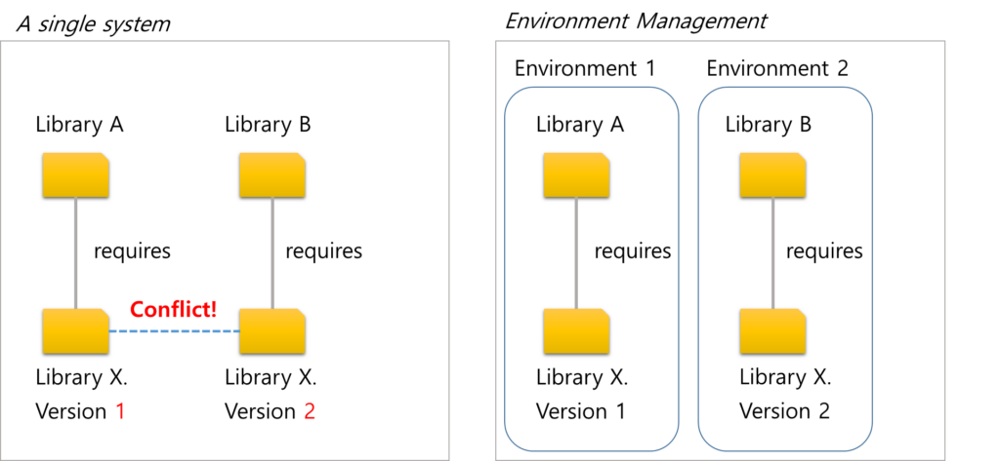
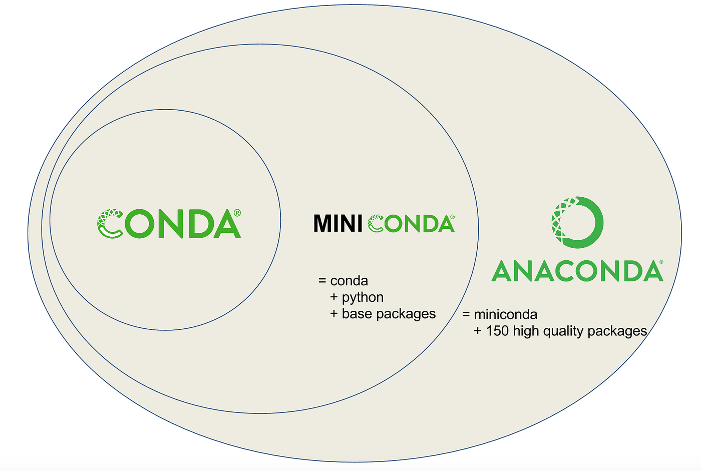
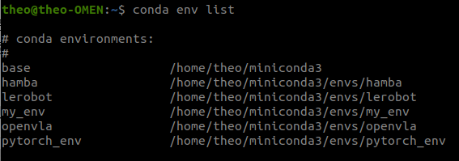

### 계획
- [x] 아나콘다 이론 복습
- [x] 설치 및 기본 세팅
- [x] 명령어 정리
- [x] [실습 프로젝트](conda_practice_project_gemini_robotics.md)

---

## Conda 가상환경

Conda 가상 환경은 특정 폴더에 별도의 실행 파일들을 모아놓고, 운영체제가 이를 먼저 보도록 하는 것.

### 시작 부터 base에 들어가지 않게 막기.
`conda config --set auto_activate_base false`

### 작동 방식
우리가 `conda activate my_env`를 입력하면 터미널의 기본 $PATH 환경 변수 맨 앞에 `~/anaconda3/envs/my_env/bin`이 추가된다.

### 사용 이유
우분투 시스템에 이미 파이썬 설치되있음. 만약 가상 환경 없이 라이브러리와 의존성을 막 설치하면 나중에 특정 소프트웨어를 사용하지 못하게 되거나, 아예 OS가 고장날 수도 있음.

포맷을 주기적으로 하기 싫으면 가상환경을 생활화하는게 좋다.

(하지만 가상환경으로 할 때 버그가 더 많이 생기는 것 같은 느낌이...)

### 가상환경의 종류
- **Venv** (+pip): 파이썬 표준 가상환경. 기본적으로 설치되어 있고 가장 가볍기도 함.
    - 오직 Python 패키지만 관리 가능.
    - C++, Cuda toolkit 같은 비파이썬 언어 관리 불가능 <- 시스템 것을 사용해야함.
    - 간단한 파이썬 스크립트나 복잡한 의존성이 없을 때 사용.
- **Conda**: 범용적인 가상환경.
    - Python 뿐만 아니라 C++, Cuda toolkit 등도 관리 가능.
    - 속도가 다소 느림, 기본적으로 용량이 큼.
    - Ai 분야에서 Docker을 사용하지 않으면 써야함.
- **Docker**: 시스템 전체 격리 방식.
    - OS 계층 위에서 그 환경 전체를 패키징함.
    - 의존성 문제 완전 봉쇄.
    - 사용이 어려움, 초기 설정이 까다로움(GPU 패스스루 등). (+터미널이 안 예쁨)

### Conda base란?

Base는 아나콘다 설치시 기본적으로 설치되는 패키지로, 다른 가상환경들의 패키지를 관리하는 용도임. 작업 공간 보다 관리 사무소 느낌?

여기에 이것저것 설치하지 말 것!

### Conda 안에 pip로 설치해도 괜찮을까?

가능은 하지만 마지막 수단으로 사용 권장.

Conda는 pip으로 설치한 패키지들이 일으키는 의존성 문제를 잘 관리하지 못함. 

만약 동시에 같은 패키지를 설치하게 되면 예기치 못한 충돌이 발생할 것.

### Conda 가상 환경을 사용하면 로컬에 설치한 패키지 및 의존성에 대해 영향을 안받나?

격리되는 것들이 있고, 안되는 것들이 있다.

일단 Python 패키지들은(Pytorch, Numpy 등) 완벽하게 격리된다. 로컬이 간섭할 일이 없다.

Cuda Toolkit도 로컬과 가상환경 동시에 다른 버전이 설치됐다고 해도, 가상환경 이용시 해당 환경 기준으로 실행된다.

하지만 NVIDIA Driver은 같은 하드웨어와 직접 소통하는 프로그램들은 가상환경에서도 건드릴 수 없다. 이들은 로컬에서만 설치가 가능하다.

> 참고로 가상환경의 Cuda 버전은 로컬 드라이버가 지원하는 최대 버전보다 낮거나 같아야 함.

### Conda, Anaconda? 둘의 차이는?

Conda는 이 가상환경 시스템의 엔진이자 관리 도구. Anaconda는 이를 이용하는 종합 선물 세트.

|	|Conda	|Miniconda	|Anaconda|
|:---:|:---:|:---:|:---:|
|성격	|관리 도구 (명령어)	|최소 설치 버전	|전체 설치 버전|
|포함 내역	|관리자 엔진만|	엔진 + Python + 기본 도구|	엔진 + Python + 1,500개 라이브러리|
|용량|	매우 작음|	작음 (~400MB)|	매우 큼 (3GB 이상)|
|사용자층|	개발자/시스템|	대부분의 AI 연구자|	초보자/교육용|

## 기본 명령어 정리

**`conda config --set auto_activate_base false`** : 터미널 시작 시 conda base가 안뜨게 하기. 

`conda create -n [환경이름] python=3.9` : 새로운 가상환경 생성. 파이썬 버전은 3.9로 지정.

`conda env list` : 이 PC에 존재하는 가상 환경 목록.

`conda activate [환경이름]`
`conda deactivate`

`conda remove -n [환경이름] --all`

#### 패키지 관리 명령어

`conda install [패키지명]` : 새로운 패키지 설치 (가상 환경 안에서)

`conda install -c conda-forge [패키지명]` : conda-forge 이용

`conda list` : 현재 가상환경에 설치한 패키지 list.

#### 기타 명령어

~~`conda env export > 환경세팅.yaml` : 환경을 문서로 내보내기~~ <- 하지만 너무 지저분해져서 추천하지 않는다고 하네요...

`conda env create -f 환경세팅.yaml` : 환경 세팅 문서 기반으로 환경 생성.

`conda create --name [새환경이름] --clone [기존환경이름]` : 환경 복사

`conda clean --all` : 불필요 캐시/패키지 삭제

> 참고로 터미널 파이썬 창에서 ctrl+d를 눌러야 거기서 빠져나옴.

