### 계획
- [ ] 도커(Docker) 기초: 1~12강 시청
    - [ ] 도커와 vscode
- [ ] [인프런] 비전공자도 이해할 수 있는 Docker 입문/실전: 1.1~2.8 시청.
- [ ] 도커 실습

# Docker study


[도커 기초 강의 1~12강](https://youtube.com/playlist?list=PLlTylS8uB2fDLJRJCXqUowsOViG-ZKnWy&si=r5twdtdIIQlsAnHI)

[비전공자도 이해할 수 있는 Docker 입문/실전 1.1~2.8강(총 12회)](https://youtube.com/playlist?list=PLtUgHNmvcs6rS5aNCRIZtVcyk3gRX2iOd&si=rcllx93oBu5SZAzI)

- 참고로 윈도우11에서는 도커 데스크톱 앱을 실행시켜야 cli에서 docker 명령어가 먹힌다 (근데 그냥 docker는 신기하게 되고, 뒤에 무언가를 붙인 순간 안된다.)

# 도커 기초 강의

## 1. [도커 기초강의 안내](https://youtu.be/p1-wm-ThnTI?si=5p0gFUGJ9eVFvugT)

도커란 **Container** 기반의 가상화 플랫폼.

어떤 프로그램이든 외부 환경과 격리된 채로 구동할 수 있게 만듬.

기본적으로 Linux 환경으로 설계됨.


- Infrastructure: PC의 하드웨어. (CPU, GPU, RAM)
- HOST Operating System: OS (Window, Linux)
- 그 위에 docker가 올라감. (정확히는 각 컨테이너를 돌릴 엔진 역할)
- 각각 하나의 App이 하나의 container인 것. (OS 위에 프로그램을 작동하는데 필요한 요소들만 모아 별도의 서버 처럼 작동.)


### 도커 생성과 배포는 윈도우, 리눅스 등을 따지지 않고 이루어질 수 있나?

양방향은 아니다. 리눅스 컨테이너는 윈도우, 맥, 리눅스 다른 버전 상관 없이 어디서든 실행가능하다. 기본적으로 리눅스 베이스로 설계 됐고. 윈도우와 맥 이용시 라이트한 리눅스 가상 머신을 띄워서 실행하기 때문이다.
> 참고로 그냥 리눅스에서 실행할때는 가상 머신을 만들지 않음.

하지만 윈도우 컨테이너는 오직 윈도우에서만 가능하다(윈도우에서 리눅스를 가상머신으로 띄워서 만든 컨테이너와 다른거다). 물론 이를 만들 일은 아마 없을 것이다.

### 도커 배포를 하드웨어 아키텍처를 고려하지 않고 할 수 있나?

배포는 가능하지만, 고려를 해야한다.

32비트와 64비트, 인텔/AMD CPU와 맥 CPU 등, 각각에서 돌아가고 만든 도커는 원래 다른 기기에서 작동하지 않는다.

그래서 도커에서 Multi-Arch Build이라는, 하나의 도커 이미지에 여러 아키텍처용 실행 파일을 담는 기능을 제공한다. 이를 통해 사용자는 본인 환경에 맞는 버전에 맞춰서 빌드를 할 수 있다.

물론 그러면 사용자 입장에서 할 일이 살짝 늘어나긴 한다.

근데 그 도커 속의 라이브러리들이 해당 아키텍처를 지원해야한다. 안하면 빌드가 안될 수도?

### 도커와 VM(Virtual Machine)의 차이는?

- VM: 완전히 독립된 완전한 OS. 모든 기능들을 다 갖추고 있음. But 넘 무겁고 느림. 사실상 집 안에다 집을 지은 느낌?
- Docker: OS 커널을 기존과 공유하면서도, 가상 환경의 최소 조건을 갖춤. 훨씬 가볍고 빠름. 집에 방을 월세 내서 다른 사람 입주 시킨 것과 같음.

물론 그대신에 Docker는 보안성이 약하다는 단점이 있음.

### 도커와 Conda/Venv의 차이는?

두쪽 모두 독립된 환경을 만드는 것은 같음. 하지만 어느 수준까지 독립시키느냐가 차이점이다.

- Venv/Conda: 패키지 및 시스템 라이브러리, Cuda 등을 분리.
- Docker: OS 전체를 분리. 파일, 시스템, 네트워크, 환경변수 등 다 분리됨. 심지어 NVIDA GPU 드라이버까지 분리됨 (물론 근데 이건 개인의 GPU마다 조금 다르니 마냥 배포를 따르게 할 수는 없음).


## 2. [컨테이너 구조 및 커맨드 사용법 -이론편-](https://youtu.be/M25Pl0tX8yw?si=vG3Za_augQ_MW-kW)


 
도커 켄터이너는 두 계층으로 구성 됨.
- Container Layer: 읽기/쓰기 전용의 얇은 계층. 컨테이너 사용하면서 생기는 변경사항들은 전부 여기에.
- Image Layers: 읽기 전용 게층으로, 가져온 이미지의 레이어. 다른 컨테이너와 공유 가능.

서로 다른 컨테이너 계층은 서로 소통을 안하지만, 이미지 레이어는 여럿을 동시에, 여러 컨테이너에 사용하는 것이 가능.

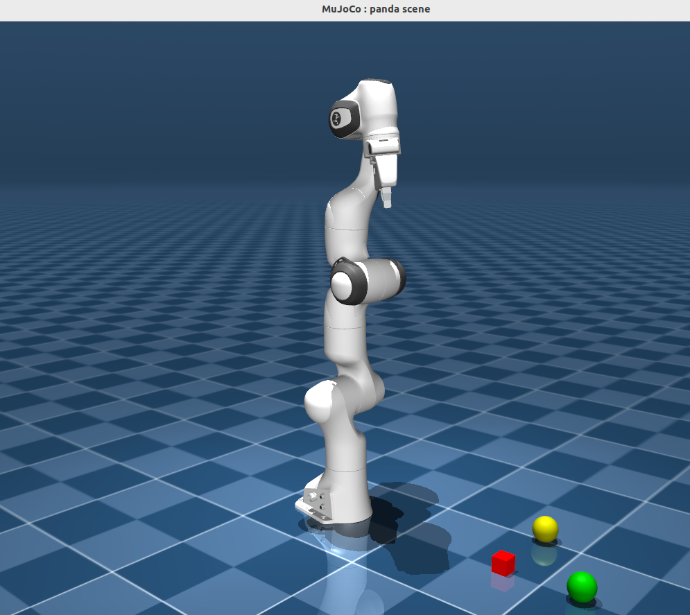

이미지 레이어를 공유할 수 있기에 용량을 절약할 수 있음. 하나의 이미지를 여러 곳에서 사용할 수 있으니.

### 도커 명령어

> 모든 도커 명령어는 `docker {대상} {커맨드} {옵션} {인자}` 형태임.

명령어가 궁금하면?

`docker`

또는

`docker {대상} --help`

생각보다 그리 많지 않음.

- docker container 주 명령어


- docker image 주 명령어


- 주로 사용하는 옵션 설명


-i와 -t를 같이 많이 쓴다고 함.

## 3. [도커 커맨드 사용법 -실습편-](https://youtu.be/prohMhNwZF0?si=4wZnvjEQ4tAUgwT6)

## 실습 전에 도커 설치

### 윈도우11에서 설치

https://www.docker.com/get-started/

`wsl --update`

파워쉘 켜서 docker 한번 쳐서 잘 되는지 확인.


`docker container --help`

`docker container ls`: 현재 컨테이너 목록 체크.

`docker image ls` : 현재 이미지 목록 체크.

`docker container stop {컨테이너명(NAME)}` : 해강 컨테이너 중지. (잠시 중단하는 것, start으로 다시 킬 수 있음.)

`docker container rm {컨테이너명(NAME)}` : 해당 컨테이너 삭제. (삭제를 하기 전에 먼저 stop을 먼저 해야함.)

`docker container ls -a` : 이미 삭제된 컨테이너 포함해서 목록보기.는 아니고 삭제된 것들 뿐만 아니라 다양한 상태의 컨테이너 전부 보기.

`docker image rm {이미지명(NAME)}` : 해당 이미지 삭제.


### 도커와 vscode

## 4. [도커 컨테이너 통신하기 -이론편-](https://youtu.be/jTOqXmRKGzA?si=5mae4-Qaf8IxxYuE)

도커는 기본적으로 독립된 환경이라 외부에서 접근이 쉽지 않음.

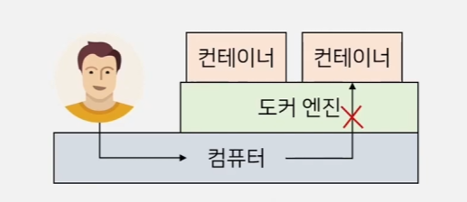

통신을 따로 해야함. `-p` 옵션을 쓰지 않으면 어려움.

- 이 `-p` 옵션은 Port의 약자로, Port Mapping을 설정하는데 필요함. 이 포트를 기반으로 도커는 가상 네트워크에서 돌아가는데, 이 IP 포트 주소가 사전에 없으면 외부에서 접근하기가 어려움.
    - 예시: 만약 사이트를 만드는 도커 파일을 실행할 때 다음과 같은 명령으로 킬 수 있음: `docker run -p 8080:80 nginx`. 8080이 호스트 포트 (내 브라우저에 입력할 포트). 80이 컨테이너 포트, 즉 컨테이너 내부 웹 서버(Nginx)가 실제 사용 중인 포트. 이제 누가 사이트에 들어가서 신호를 준다면, 그게 8080 포트 -> 80 포트 -> 도커로 가게 됨.
    - 만약 일일히 포트를 작성하기 귀찮으면 대분자 `-P`를 사용할 것. 알아서 남는걸로 지정함.

영상에서도 설명하지만 아래 처럼 쓰면 됨.

 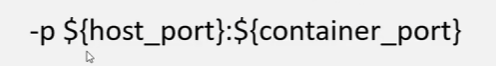

 이게 `-p` 옵션을 사용했을 때 통신 구조.

 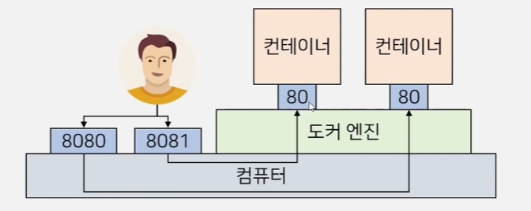

 이미지를 보면 알 수 있지만, 컨테이너들의 내부는 서로 전부 독립이기에 포트 번호가 서로 같아도 충돌이 발생하지 않는다. 그냥 외부 호스트 포트만 다르면 된다.

## 5. [도커 컨테이너 통신하기 -실습편-](https://youtu.be/v6KJAovryCo?si=U-jwN2YAzKSKlsDt)

[강의자료 깃허브 링크](https://github.com/Around-Hub-Studio/around-hub-spring-boot)

음.. http 도커 이미지를 compose해서 사용해야 될 것 같은데 안보이누.. 뭐 이 실습은 이전 수업에서 했으니 일단 넘어가주자.

jenkins 이미지를 다운받아서 해당 실습을 진행해봤다.

`docker run --name test1 -d jenkins/jenkins:lts`

`docker run --name test2 -d -p 8080:80 jenkins/jenkins:lts`

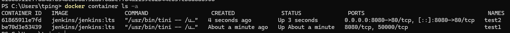

`-p` 옵션 유뮤에 따라 포트가 생긴 것을 볼 수 있다. 

> 참고로 옵션 `-d`는 백그라운드에서 실행한다는 의미로, 해당 옵션을 사용하지 않으면 현재 터미널에서 아웃풋이 쭉 출력된다.

## 6. [도커파일(Dockerfile) 작성하기 -이론편-](https://youtu.be/8p9RvxVOQEY?si=WcrQxiOtltb42b_F)

Docker file이란? Docker image를 생성하기 위한 파일. 도커 이미지가 컨테이너의 설계도이니. 도커 파일은 설계도의 설계도라고 할 수 있으려나?

### Docker file 주요 Instruction

- FROM: base가 되는 이미지를 지정. 모든 이미지를 노 베이스에서 만들 수는 없으니 지정함. 주로 OS 같은걸 베이스로 잡음.

- RUN: 이미지를 빌드할때 발동하는 커맨드 지정용.

- ADD: 이미지 안에 호스트의(로컬) 파일이나 폴더를 추가하는 용도. 만약 없다면 자동 생성 됨.

- COPY: 호스트 환경의 파일이나 폴더를 이미지 안에 복사함. 위 add와 동작은 동일하지만, URL을 지정하거나, 압축파일을 자동으로 풀지 않음(조금 더 보수적).

- EXPOSE: 통신에 사용할 포트 지정.

- ENV: 환경 변수 지정용. else 문법 이용 가능.

- CMD: **컨테이너**가 실행될 때 실행하는 커맨드 지정. 이미지 빌드할때 실행되는 것 아님! 그건 RUN.

- ENTRYPOINT: 도커 이미지가 실행될 때 사용되는 기본 커맨드 지정. (CMD는 상황에 따라서 조금 바뀔 수 있는데 이건 그렇지 않음. 베이스가 되는 필수 명령어를 실행하는데 용도.)

- WORKDIR: 위 RUN, CMD, ENTRYPOINT 등을 실행할 디렉토리 지정. 그냥 빌드할 때 `-w` 옵션으로 오버라이딩으로도 가능.

- VOLUME: **퍼시스턴스 데이터**를 저장할 경로 지정. 호스트의 디렉토리를 도커 컨테이너에 연결하는 것. 주로 중요한 데이터들, 백업할 필요가 있는 데이터들을 지정하기 위함. (예를 들어 모델 트레이닝하고 체크포인트 등을 저장)

> 참고로 퍼시스턴스 데이터는 지속석으로 필요한, 영속적인 데이터를 일컫는다.

> 컨테이너가 삭제되면 그 속의 데이터들은 다 함께 삭제됨. 집에 방을 월세로 잠시 내서 방을 빼면 다 같이 빼는 느낌?

### 도커 빌드

도커 빌드를 이용하여 도커 파일을 실행.

`docker build {옵션} {도커파일 디렉토리}`

(ex: docker build -t test)

위 명령어를 시행하면 이미지가 만들어짐.

이제 run을 통해 그 이미지를 컨테이너로 만들어 실행하면 됨.


## 7. [도커파일(Dockerfile) 작성하기 -실습편-](https://youtu.be/BCsiVlmEQCQ?si=USMi7pIvc-Z1iNMP)

### 도커 파일을 만들어 직접 빌드하는 실습

Flask를 이용해 간단한 사이트를 호스팅하는 코드를 작성-> app.py

```docker
# 1. FROM: 베이스 이미지 지정 (파이썬 3.9 버전 사용)
FROM python:3.9-slim

# 작업 디렉토리 생성 (이 이후 명령어는 /app 내부에서 실행됨)
WORKDIR /app

# 2. RUN: 이미지 생성 과정에서 실행할 명령어 (Flask 라이브러리 설치)
RUN pip install flask

# 3. ENV: 환경 변수 설정 (기본값을 'DockerUser'로 설정)
ENV USER_NAME="DockerUser"

# 4. ADD: 호스트의 파일을 이미지 안으로 복사
# (현재 폴더의 app.py를 컨테이너의 /app 폴더로 추가)
ADD app.py .

# 5. VOLUME: 컨테이너 내부의 데이터 저장소 지정
# (로그 파일이 저장될 /data 디렉토리를 볼륨으로 지정)
VOLUME ["/data"]

# 6. EXPOSE: 이 컨테이너가 사용할 포트 명시 (문서화 목적이 큼)
EXPOSE 5000

# 7. CMD: 컨테이너가 시작될 때 실행할 기본 명령어
CMD ["python", "app.py"]
```

위 파일들을 etc 폴더에 배치하고.

이제 빌드를 하면 된다.

`docker build -t my-web-server .`


이제 이미지 목록에 추가됐음을 볼 수 있다.


이제 이미지를 가지고 컨테이너를 만들어보자.

`docker run -d -p 5000:5000 -v $(pwd)/logs:/data --name my-container my-web-server`


이제 크롬창에 아래 사이트에 들어가서 확인하면 됨.

http://localhost:5000/

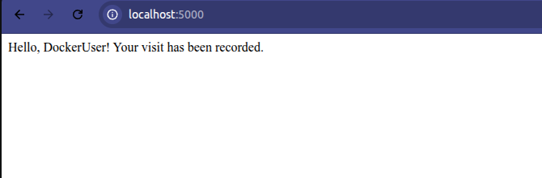

etc 속 logs 폴더의 access.log를 보면 기록이 잘 남아있다. 이를 통해 효과적으로 도커 속에서 외부로 파일이 잘 저장된 것.

```
[2026-01-27 12:53:23] Access from DockerUser
```

- 권한 떄문에 컨테이너가 종료되지 않는다.

`docker rm -f my-container`

```
Error response from daemon: cannot remove container "my-container": could not kill container: permission denied
```

앞에 sudo를 붙여도 안된다.

- Ubuntu 보안 모듈 때문이 22.04에서 이런 문제가 종종 발생한다고 한다.

그래서 OS 차원에서 직접 해당 프로세스를 찾아 죽여야한다고 한다.

`docker inspect --format '{{.State.Pid}}' my-container`

그러면 번호가 출력된다. 이를 아래 명령어에 기입. (컨테이너 프로세스 종료)

`sudo kill -9 {번호}`

이제 도커에서 제거가 가능할 것이다.

`docker rm -f my-container`

- 하지만 결국 재발. 아래 명령어들을 사용해서 충돌 해결.
```bash
# 1. AppArmor 관리 도구 설치
sudo apt-get update
sudo apt-get install -y apparmor-utils

# 2. 꼬여있는(Unknown) 보안 프로필 제거
sudo aa-remove-unknown

# 3. 도커 서비스 재시작
sudo systemctl restart docker
```
이제 잘 됨.

- 아래 명령어도 실행해서 인풋을 다르게 해보자.

`docker run -d -p 5000:5000 -v $(pwd)/logs:/data -e USER_NAME="HanyangStudent" --name my-container my-web-server`

### 이미지 레이어 보기

참고로 `docker inspect my-web-server`를 보면 다양한걸 볼 수 있는데, 아래 처럼 이미지의 레이어들을 볼 수 있다.


- 여기서 한층 한층이 쌓여서 현재 컨테이너가 된 것이다.

가장 위에 있는 것이 기본 OS일 것이고, 가장 아래에 있는 것들이 내가 추가한 것들이다.
```
"RootFS": {
    "Type": "layers",
    "Layers": [
        "sha256:d7c97cb6f1fe...",  <-- Bottom Layer (Base OS)
        "sha256:4f237755fbae...",
        "sha256:298992e09a03...",
        "sha256:c8f6b54339a8...",
        "sha256:46a942acd0a6...",
        "sha256:ae4e9e9853ec...",  <-- Your 'pip install flask'
        "sha256:510b4f540a57..."   <-- Your 'ADD app.py' (Top Layer)
    ]
}
```
도커는 이러한 레이어로 구성된다. 이렇게 한층 한층이 파일 시스템을 바꾸는 것이고, 현재 컨테이너가 되는 것이다.

이를 통해 노베이스에서 부터 컨테이너를 만들 필요가 없다. 

- 이제 비로소 위에 그림에서 왜 이렇게 표현했는지 이해가 완전히 간다.

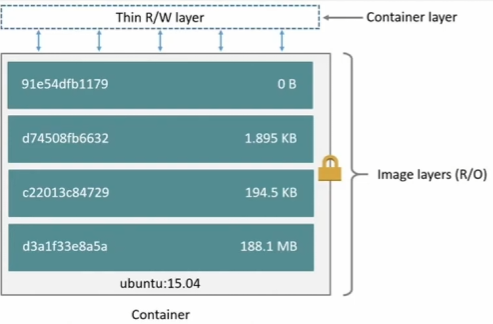

## 8. [도커 컴포즈(docker-compose) 파일 작성하기 -이론편-](https://youtu.be/3FY-DzXYu7E?si=cmIGua6Z1AtuQ_fo)


이 한줄로 컨테이너를 만들 수 있다.

`docker-compose up -d`

docker compose는 도커 애플리케이션의 서비스, 네트워크, 볼륨 등의 설정을 yaml 형식으로 작성하는 파일.

보통 compose 파일은 아래 같이 생겼다.

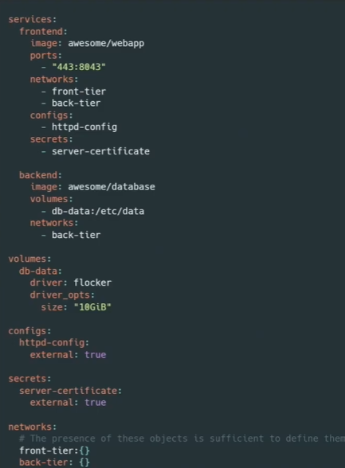

### docker compose와 dockerfile의 차이는?
비슷하게 보이지만 엄연히 다르다. 
- Dockerfile은 도커 이미지를 빌드할 때 이용하는 것이다. 도커는 이미지 빌드시 이 파일을 보고 아웃풋으로 **image**하나를 내놓는 것이다.
- Docker Compose은 이 이미지를 바탕으로 **컨테이너**를 만들때 필요한 설정들을 지시하는 것이다. 그렇기에 Run의 단계에서 실행할 때 이용된다.

### 왜 Docker Compose가 필요한가?

위에서 실습할 때 Run 중에 이런 명령어를 사용했다.

`docker run -d -p 5000:5000 -v $(pwd)/logs:/data -e USER_NAME="HanyangStudent" --name my-container my-web-server`

이렇게 매번 치면 오타가 날 확률이 매우 높다. Compose를 사용하면 이 모든 옵션들을 하나의 `docker-compose.yml`에 적어두고. 이를 한줄로 실행할 수 있다.

- 예를 들어 위 cli 명령어를 아래 docker-compose.yaml 파일로 만들고.

```yaml
version: '3.8'

services:
  web-server:
    # 1. 이미지: 아까 만든 이미지를 쓰거나, 여기서 바로 빌드할 수도 있음
    build: .  # 현재 폴더의 Dockerfile을 보고 빌드해라!
    
    # 2. 이름 설정 (--name)
    container_name: my-compose-container
    
    # 3. 포트 연결 (-p 5000:5000)
    ports:
      - "5000:5000"
    
    # 4. 볼륨 연결 (-v)
    volumes:
      - ./logs:/data
    
    # 5. 환경 변수 (-e)
    environment:
      - USER_NAME=HanyangStudent
```

### 위 compose 요소들 중에서 가장 자주 쓰이는 것은 services다 나머지는 잘 안쓴다.

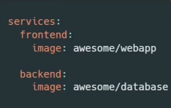

Frontend와 backend이 각각 컨테이너 이름이 되는거다. 그리고 아래에 보이는 이미지들이 해당 컨테이너가 사용하는 각각의 이미지가 되는 것이다.

이미지와 마찬가지로 아래와 같은 키워드로 많은 것을 정의할 수 있다.

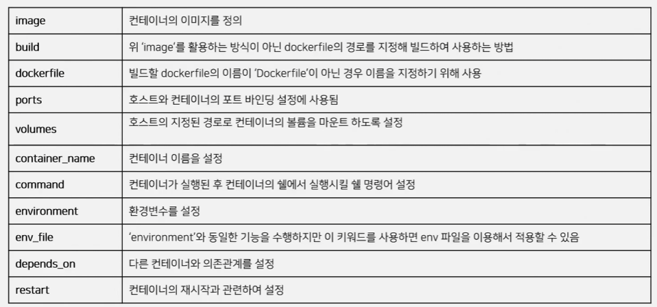

- 작성한 compose.yaml 파일은 `docker-compose up`으로 실행할 수 있다.

> 만약 다른 이름을 사용한다면 `docker-compose -f custom_file.yml up`을 사용하면 된다.

## 9. [도커 컴포즈(docker-compose) 파일 작성하기 -실습편-](https://youtu.be/vwL0I5dhdyI?si=EGhaAOYFFRoBwOOp)

신기하게도 docker-compose.yaml를 작성하면 좌측에 이미지가 고래로 바뀜.


그러니까 yaml 형식이 전부가 아니고 docker-compose.yaml이 디폴트명이고, 기본적으로 이를 인식한다는 것. 그래서 이름을 바꿀시 개별적인 커맨드가 필요한 것임.

- docker-compose.yaml
```yaml
version: '3.8'

services:
  my-flask-app:
    # 1. build: 현재 폴더(.)에 있는 Dockerfile을 보고 이미지 빌드
    build: . 
    
    # 2. container_name: 컨테이너 이름 지정
    container_name: practice-container
    
    # 3. ports: 윈도우 포트 5000 <-> 컨테이너 포트 5000 연결
    ports:
      - "5000:5000"
    
    # 4. volumes: 윈도우의 현재폴더 내 logs 폴더를 컨테이너 /data와 연결
    # 윈도우에서도 상대 경로(./)를 쓰면 도커가 알아서 처리해줍니다.
    volumes:
      - ./logs:/data
    
    # 5. environment: 환경변수 설정 (윈도우 사용자임을 표시해봅시다)
    environment:
      - USER_NAME=최태오
```

- 이재 해당 compose 파일을 이용해서 빌드해보자.

`docker-compose up -d --build`

> 참고로 여기서 `--build`는 코드가 바뀌었을 수도 있으니 강제로 새로 빌드하라는 옵션임. 아니면 기존의 코드를 그대로 가져옴. (compose 수정사항들은 바로바로 반영되지만, app.py 같은 소스코드는 이 옵션을 추가해야 반영됨.)

이제 짧은 cli으로 도커를 run할 수 있다!

## 10. [도커 이미지 생성 및 저장하기 -이론편-](https://youtu.be/az46ttJ8JUQ?si=MBMz67SchFjzgyZt)

주로 쓰이는 이미지를 만드는 방식에는 두가지가 있음.

- 하나는 기존 이미지에(또는 노베이스에서 시작하여) 추가 레이어를 포함하여 컨테이너 생성.

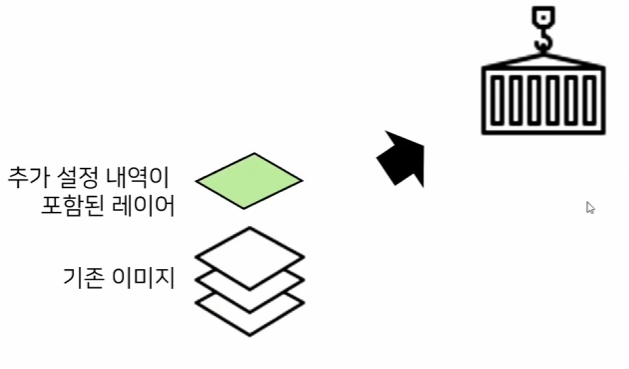

위 방법이 기존에 우리가 하던 방법이다.

- 나머지 하나는 현재 컨테이너에서 이것저것 만들고 변경하고. 현재 상태를 이미지로 저장하는 것이다.


이 방식은 다음 명령어를 사용한다.

`docker commit {대상 컨테이너명} {생성할 이미지명}`

> 주의: VOLUME에 저장된 데이터는 commit에 포함되지 않음. 컨테이너 내부 파일 시스템 사항만 저장됨.

### 이미지 저장 및 전송

이렇게 만든 이미지는 생각보다 용량이 꽤 된다.

도커파일 자체는 얼마 안되지만, 그걸 이용해서 빌드한 이미지나, 아니면 현재 컨테이너로 부터 추출한 이미지는 꽤 무겁다. 일단 현재 docker 엔진이 저장하고 있지만, 이를 운반할 필요성도 있다.

이러한 이미지들은 docker hub에 올리거나, 아니면 로컬로 저장해서 운반 시킬 수 있다. 

로컬 저장 및 불러오기 방식에 docker 이미지용 saver과 load / 컨테이너용 export와 import 커맨드를 이용할 수 있음..

#### save, load <- 대상 이미지를 내보내는용

- **save**: 도커 이미지를 tar 파일로 변환.

`docker save -o my_image.tar my_imager`

> 참고로 tar 파일은 암축이 아닌, 여러 파일을 하나로 묶는 메타데이터 저장 방식임.

- **load**: tar 파일을 가져와 로드함.

`docker load -i my_image.tar`

save과 load 방식은 여러 레이어 계층을 유지함.


### export, import <- 대상 컨테이너에서 이미지를 내보내는용

하지만 export과 import는 아님. 여러 레이어를 하나로 통합하여 추출.

- export

`docker export my-container > my-container.tar`

- import

`docker import my-container.tar my-container`

만약 레이어 계층을 유지하고 싶으면 그냥 commit하고 이미지를 만든 뒤에 그냥 save/load를 사용하자.

> 그리도 다양한 환경에서 작동하게 만들려면 무조건 save/load 방식이 권장된다고 한다.

## 11. [도커 이미지 생성 및 저장하기 -실습편-](https://youtu.be/bK6sHpy9au0?si=YpPTirMAuV4pI3xX)

`docker-compose up -d --build`으로 컨테이너 실행.

- 아래 명령어를 사용해서 해당 컨테이너로 접속한다.

`docker exec -it practice-container bash`


- 뭔가 추가로 설치하고 나온다.

```
pip install requests
exit
```

- 이제 현 상태를 이미지로 만든다

`docker commit practice-container practice-image:v1`


그러면 아래 처럼 새로운 이미지가 생긴다.


- 이제 이미지를 save 해보자.

`docker save -o practice-image-v1.tar practice-image:v1`

잘 저장됐다.


- 이제 기존 이미지를 삭제하고 다시 불러오자.

이미지를 삭제한다. (rm image는 안된다. `rmi`라고 적어야한다.)

`docker rmi practice-image:v1`

- 이제 불러오기 위해 load를 한다.

`docker load -i practice-image-v1.tar`

이제 로컬 파일로 이미지를 주고 받을 수 있는 능력을 습득했다!

### Docker Hub 이용해보기

하지만 로컬은 기본적으로 불편함 또한 존재한다. 용량과 관리의 불편함이다.

이를 해결해주는 것이 Docker Hub. 바로 사용해보자.

- 일단 로그인

`docker login`

- 이미지에 이름표를 달아야 업로드가 된다. `docker tag [현재이미지] [내아이디]/[올릴이름]:[버전]`

`docker tag practice-image:v1 bigenlight/practice-image:v1`

- 그리고 마지막으로 이를 푸쉬하면 된다.

`docker push bigenlight/practice-image:v1`


이제 Docker Hub에 들어가서 잘 업로드 됐다는 것을 확인할 수 있다.

https://hub.docker.com/repositories/bigenlight

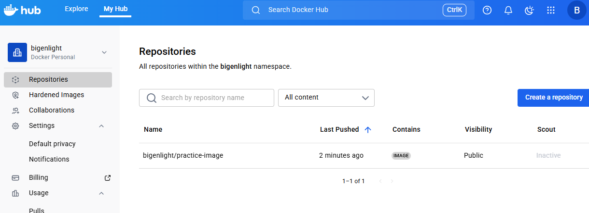


> 참고로 commit안에 compose 파일이 들어가지는 않는다. 만약 공유하고 싶으면 깃리포에 compose 파일을 올리고, 해당 리포를 클론하고, docker hub에서 이미지를 pull한 뒤에 docker compose를 시키면 된다.

- 최종 테스트

기존 이미지 삭제해보고.

`docker rmi practice-image:v1`

도커허브에서 직업 pull하는 동시에 run.

`docker run -d -p 5000:5000 --name remote-test bigenlight/practice-image:v1`

## 12. [스프링 부트 Dockerfile 만들기](https://youtu.be/MsMHStVibEk?si=NPNfP0_nUw5EGwfA)
