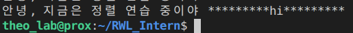

### 계획
- [x] 공부 계획

- 기본적인 내용은 최대한 생략하고 빠르게 진행할 예정. 파이썬의 기술에 더 많은 시간을 투자할 것.

- 기억이 애매하거나 다시 복습할 필요가 있는 부분 위주로 진행.

- 5장까지 진행 후 7장 공부. 1장은 생략.

https://wikidocs.net/book/1

# [점프 투 파이썬](https://wikidocs.net/5)


## [파이썬 프로그래밍의 기초, 자료형](https://wikidocs.net/11)

자료형이란 숫자, 문자열 등 프로그램에서 사용하는 모든 데이터의 형태

### 숫자형
- Integer
```py
a = 123
a = -178
a = 0
```

- Float
```py
a = 1.2 
a = -3.45
a = 4.2E10
a = 4.2e10 # 지수 표현할때 e, E 둘가 가능.
a = 4.2e-10
```
### 8진수와 16진수

8진수(octal)는 0o 또는 0O(숫자 0 + (알파벳 소문자 o 또는 대문자 O))로 8진수 표현을 시작한다.

숫자 '0'뒤에 octal의 'o'가 붙는 것이다. 숫자 '0'는 그냥 접두사임.

비슷하게 2진수는 0b (binary라서 그렇게 표현), 16진수는 0x이다 (Hexadecimal)

```py
a = 0o177
a = 0b1010
a = 0x8ff
```

## 문자열 자료형

- 줄 바꿈 표현

역슬래쉬 n

```py
multiline = "Life is too short\nYou need python"
```

또는

```py
multiline='''
... Life is too short
... You need python
... '''
```

- 참고로 문자열도 리스트이니 연산 가능함. 아래와 같이 긴줄 표현할 때 사용할 것.

```py
print("=" * 50)
```

물론 인덱싱도 가능.

```py
a = "Life is too short, You need Python"
a[3]
```

### 이스케이프 코드 모음 (문자열에 넣는거)


### f 문자열 포매팅
이게 가장 추천되는 방법이고 빠르니 그냥 다른거말고 이거 쓰면 됨.

```py
age = 30
print(f'나는 내년이면 {age + 1}살이 된다.')
```

- f 문자열 포매팅으로 정령하기.

```py
>>> f'{"hi":<10}'  # 왼쪽 정렬
'hi        '
>>> f'{"hi":>10}'  # 오른쪽 정렬
'        hi'
>>> f'{"hi":^10}'  # 가운데 정렬
'    hi    '
```

```py
print(f"안녕, 지금은 정렬 연습 중이야 {"hi":>10}")
print(f"안녕, 지금은 정렬 연습 중이야 {"hi":^10}")
```


- 이런식으로 뭔갈 넣은 상태로도 정령 가능

```
print(f"안녕, 지금은 정렬 연습 중이야 {"hi":*^20}")
```



### 자주 쓰는 함수

- 양쪽 공백지우기

```
>>> a = " hi "
>>> a.strip()
'hi'
```

- 문자열 교체

```
>>> a = "Life is too short"
>>> a.replace("Life", "Your leg")
'Your leg is too short'
```

참고로 이런 함수를 사용했다고 해서 a 기존 값이 바뀐 것이 아님.
이건 어디까지나 함수고, 새로운 문자여을 반환한 것 뿐.

## 리스트 자료형

- 삼주 리스트에서 인덱싱하기

```
>>> a = [1, 2, ['a', 'b', ['Life', 'is']]]
>>> a[2][2][0]
'Life'
```
2-3 

## [프로그램의 구조를 쌓는다! ](https://wikidocs.net/19)

## [파이썬의 입출력](https://wikidocs.net/23)

## [파이썬 날개 달기](https://wikidocs.net/27)

## [파이썬 날아오르기](https://wikidocs.net/184208)