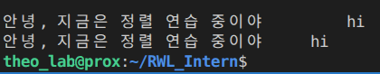
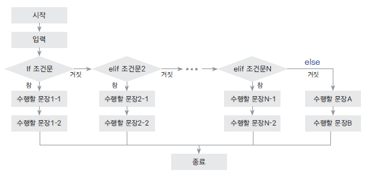
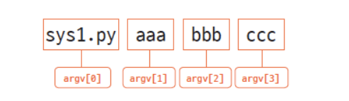
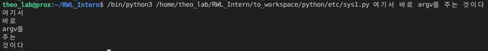
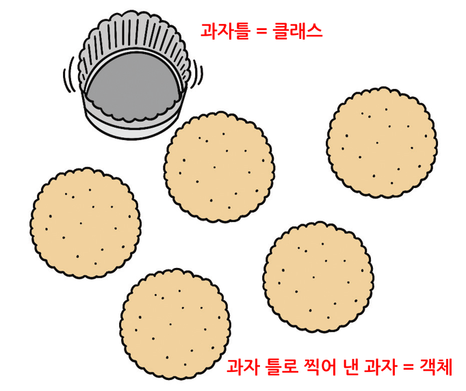
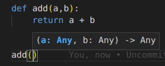
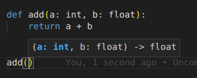

### 계획
- [x] 공부 계획

- 기본적인 내용은 최대한 생략하고 빠르게 진행할 예정. 파이썬의 기술에 더 많은 시간을 투자할 것.

- 기억이 애매하거나 다시 복습할 필요가 있는 부분 위주로 진행.

- 5장까지 진행 후 7장 공부. 1장은 생략.

https://wikidocs.net/book/1

# [점프 투 파이썬](https://wikidocs.net/5)


# [파이썬 프로그래밍의 기초, 자료형](https://wikidocs.net/11)

자료형이란 숫자, 문자열 등 프로그램에서 사용하는 모든 데이터의 형태

### 숫자형
- Integer
```py
a = 123
a = -178
a = 0
```

- Float
```py
a = 1.2 
a = -3.45
a = 4.2E10
a = 4.2e10 # 지수 표현할때 e, E 둘가 가능.
a = 4.2e-10
```
### 8진수와 16진수

8진수(octal)는 0o 또는 0O(숫자 0 + (알파벳 소문자 o 또는 대문자 O))로 8진수 표현을 시작한다.

숫자 '0'뒤에 octal의 'o'가 붙는 것이다. 숫자 '0'는 그냥 접두사임.

비슷하게 2진수는 0b (binary라서 그렇게 표현), 16진수는 0x이다 (Hexadecimal)

```py
a = 0o177
a = 0b1010
a = 0x8ff
```

## 문자열 자료형

- 줄 바꿈 표현

역슬래쉬 n

```py
multiline = "Life is too short\nYou need python"
```

또는

```py
multiline='''
... Life is too short
... You need python
... '''
```

- 참고로 문자열도 리스트이니 연산 가능함. 아래와 같이 긴줄 표현할 때 사용할 것.

```py
print("=" * 50)
```

물론 인덱싱도 가능.

```py
a = "Life is too short, You need Python"
a[3]
```

### 이스케이프 코드 모음 (문자열에 넣는거)


### f 문자열 포매팅
이게 가장 추천되는 방법이고 빠르니 그냥 다른거말고 이거 쓰면 됨.

```py
age = 30
print(f'나는 내년이면 {age + 1}살이 된다.')
```

- f 문자열 포매팅으로 정령하기.

```py
>>> f'{"hi":<10}'  # 왼쪽 정렬
'hi        '
>>> f'{"hi":>10}'  # 오른쪽 정렬
'        hi'
>>> f'{"hi":^10}'  # 가운데 정렬
'    hi    '
```

```py
print(f"안녕, 지금은 정렬 연습 중이야 {"hi":>10}")
print(f"안녕, 지금은 정렬 연습 중이야 {"hi":^10}")
```



- 이런식으로 뭔갈 넣은 상태로도 정령 가능

```
print(f"안녕, 지금은 정렬 연습 중이야 {"hi":*^20}")
```


### 자주 쓰는 함수

- 양쪽 공백지우기

```
>>> a = " hi "
>>> a.strip()
'hi'
```

- 문자열 교체

```
>>> a = "Life is too short"
>>> a.replace("Life", "Your leg")
'Your leg is too short'
```

참고로 이런 ~~함수~~를 사용했다고 해서 a 기존 값이 바뀐 것이 아님.
이건 어디까지나 ~~함수~~고, 새로운 문자열을 반환한 것 뿐. <- 함수가 아니라 정확히 method(매서드)임. Function과 Method는 엄연히 다름.

> Function은 독립적으로 함수명으로만 호출할 수 있는 반면에 Method는 어디 객체에 속해야함. 예: `a.append(4), a.sort(), a.pop()`

## 리스트 자료형

- 삼주 리스트에서 인덱싱하기

```
>>> a = [1, 2, ['a', 'b', ['Life', 'is']]]
>>> a[2][2][0]
'Life'
```

### 리스트

- del 명령어로 리스트 요소 제거. 

```
>>> a = [1, 2, 3, 4, 5]
>>> del a[2:]
>>> a
[1, 2]
```

- 리스트에 요소 추가 - append
```
>>> a = [1, 2, 3]
>>> a.append(4)
>>> a
[1, 2, 3, 4]
```

- 여기서 또 보면 수정이 바로 반영된다. 위에 a.replace()와 다르게.

> 둘 모두 Method인 것은 마찬가지지만, 다르게 행동되는 이유는 string은 변경할 수 없는 **Immutable**이고, list는 변결 가능한 **Mutable**이기 때문이다.

Mutable에 적용되는 Method만이 바로 수정사항을 반영할 수 있다.

Immutable은 수정이 안되기에, 수정이 반영된 새로운 객체를 만들어야한다.

## 튜플 자료형

- 튜플

```
t1 = ()
t2 = (1,)
t3 = (1, 2, 3)
t4 = 1, 2, 3
t5 = ('a', 'b', ('ab', 'cd'))
```

튜플을 요소값을 수정하는 것이 **불가능**이다.

그 요소들을 가져와 연산을 하는 것은 가능하지만 결국 새로운 튜플을 만들어 저장해야한다.

```
>>> t2 = (3, 4)
>>> t3 = t2 * 3
>>> t3
(3, 4, 3, 4, 3, 4)
```

- `t4 = 1, 2, 3` 처럼 소괄호(())를 생략 가능.

## 딕셔너리

- Key와 Value의 쌍 여러 개가 {}로 둘러싸여 있다

```
dic = {'name': 'pey', 'phone': '010-9999-1234', 'birth': '1118'}
```

- 키는 중복 불가능. Value는 가능.

참고로 보통 키로 밸류를 찾는 구조임. 그 반대는 한번에 안됨.

- 딕셔너리의 Key로는 **Immutable**만 가능함. 그래서 튜플도 키로 사용할 수 있음.

Value 안에는 뭘 넣든 상관 없다.

- 많이 쓰는거:

```
my_dict = {'apple': 1, 'banana': 2, 'cherry': 1}

for key, value in my_dict.items():
```

## 집합 자료형

- 집합(set): 중복을 허용하지 않고 순서가 없는 데이터의 모임

- 중괄호나 set함수를 이용해서 만들면 됨.

```
>>> s3 = {1, 2, 3}
>>> s3
{1, 2, 3}
>>> s4 = {'a', 'b', 'c'}
>>> s4
{'a', 'c', 'b'}
```

```
>>> s2 = set("Hello")
>>> s2
{'e', 'H', 'l', 'o'}
```

딕셔너리에서 키만 사용한다고 생각하면 편한 듯.

### 집합 연산

```
>>> s1 = set([1, 2, 3, 4, 5, 6])
>>> s2 = set([4, 5, 6, 7, 8, 9])
```

- 교집합

```
>>> s1 & s2
{4, 5, 6}
```

- 합집합

```
>>> s1 | s2
{1, 2, 3, 4, 5, 6, 7, 8, 9}
```

- 차집합

```
>>> s1 - s2
{1, 2, 3}
>>> s2 - s1
{8, 9, 7}
```

## 불 자료형 (Boolean)

- 참/거짓

```
>>> a = True
>>> b = False
>>> type(a)
<class 'bool'>
>>> type(b)
<class 'bool'>
```

```
>>> 1 == 1
True
>>> 2 < 1
False
```

- 참고로 무언가 비었으면 그냥 False임.

## 자료형의 값을 저장하는 공간, 변수

```
>>> a = 1
>>> b = "python"
>>> c = [1, 2, 3]
```
### 변수명 규칙
1. 영문자, 숫자, 언더스코어(_)만 사용할 수 있다.
1. 숫자로 시작할 수 없다.
1. 예약어는 사용할 수 없다.
1. 대소문자를 구분한다.

예약어 목록:
```py
False, None, True, and, as, assert, break, class, continue, def, del, elif, else, except, finally, for, from, global, if, import, in, is, lambda, nonlocal, not, or, pass, raise, return, try, while, with, yield
```

- 튜플과 리스트에 집어넣기

```
>>> a, b = ('python', 'life')
>>> [a, b] = ['python', 'life']
```

# [프로그램의 구조를 쌓는다! ](https://wikidocs.net/19)

## if문

여기 부터 indentation이 중요함. Tab과 스페이스를 혼용하지말것.

아니 그냥 space 위주로만 사용할 것.

```
if 조건문:
    수행할_문장1 
    수행할_문장2
    ...
elif 조건문:
    수행할_문장1
    수행할_문장2
    ...
elif 조건문:
    수행할_문장1
    수행할_문장2
    ...
...
else:
   수행할_문장1
   수행할_문장2
   ... 
```



## while문

### while-else

- while문에 else를 결합하여, break으로 나왔을때랑 안나왔을 때를 구별할 수 있다.

```
# 그냥 지나갔을 때 else 발동
>>> count = 0
>>> while count < 3:
...     print(f"카운트: {count}")
...     count += 1
... else:
...     print("while 문이 정상 종료되었습니다.")
...
카운트: 0
카운트: 1
카운트: 2
while 문이 정상 종료되었습니다.
```

```
# break이 발동하면 else가 작동을 안함.
>>> count = 0
>>> while count < 5:
...     if count == 2:
...         break
...     print(f"카운트: {count}")
...     count += 1
... else:
...     print("while 문이 정상 종료되었습니다.")
...
카운트: 0
카운트: 1
```

## for문

### for + continue

- continue를 통해 이후 코드를 실행하지 않고 다시 위로 올라가서 실행함.

```
marks = [90, 25, 67, 45, 80]

number = 0 
for mark in marks: 
    number = number + 1 
    if mark < 60:
        continue 
    print("%d번 학생 축하합니다. 합격입니다. " % number)
```

`1번 학생 축하합니다. 합격입니다.
3번 학생 축하합니다. 합격입니다.
5번 학생 축하합니다. 합격입니다.`

### 리스트 컴프리헨션

- for 문을 리스트 안에 집어넣는걸 리스트 컴프리헨션이라고함.

```
>>> a = [1,2,3,4]
>>> result = [num * 3 for num in a]
>>> print(result)
[3, 6, 9, 12]
```

### for-else 문

- while과 마찬가지로 for문도 else로 break 작동에 따른 구별 두기 가능.

```
>>> for i in range(5):
...     print(i)
... else:
...     print("for 문이 정상 종료되었습니다.")
...
0
1
2
3
4
for 문이 정상 종료되었습니다.
```

```
>>> for i in range(5):
...     if i == 3:
...         break
...     print(i)
... else:
...     print("for 문이 정상 종료되었습니다.")
...
0
1
2
```

### 리스트에서 요소뿐만 아니라 숫자도 사용하기: enumerate 이용

- 원래 리스트를 그냥 for문에 돌리면 개별 요소가 튀어나오지만 enumerate를 사용하면 인덱스도 얻기 가능.

```
>>> fruits = ['apple', 'banana', 'orange']
>>> for i, fruit in enumerate(fruits):
...     print(f"{i}: {fruit}")
...
0: apple
1: banana
2: orange
```

### zip 함수로 여러 리스트 함께 동시 순회하기

- 두 개 이상의 리스트를 동시에 순회하고 싶을 때는 zip 함수를 사용한다.

```
>>> names = ['홍길동', '김철수', '이영희']
>>> scores = [85, 92, 78]
>>> for name, score in zip(names, scores):
...     print(f"{name}: {score}점")
...
홍길동: 85점
김철수: 92점
이영희: 78점
```

# [파이썬의 입출력](https://wikidocs.net/23)

## 함수

### 여러 개의 입력값을 받는 함수 만들기 : args

- args를 통해서 가변 양의 변수를 입력으로 받을 수 있음.

```
>>> def add_many(*args): 
...     result = 0 
...     for i in args: 
...         result = result + i   # *args에 입력받은 모든 값을 더한다.
...     return result 
>>> result = add_many(1,2,3,4,5,6,7,8,9,10)
>>> print(result)
55
```

저렇게 args으로 받으면 튜플로 모든 묶어서 받게 됨. 하나씩 꺼내서 쓰면 끝.

### 키워드 매개변수, kwargs

- 입력을 `키=밸류` 이렇게 받으면 맞춰서 딕셔너리로 만드는 입력 방식.

```
>>> def print_kwargs(**kwargs):
...     print(kwargs)

>>> print_kwargs(a=1)
{'a': 1}
>>> print_kwargs(name='태오', age=3)
{'age': 3, 'name': '태오'}
>>> print_kwargs(name='태오', age=25, city='서울', job='개발자')
{'name': '태오', 'age': 25, 'city': '서울', 'job': '개발자'}
```

- 이런식으로 args와 같이 쓰끼도 가능.

```
>>> def mixed_function(name, *args, **kwargs):
...     print(f"이름: {name}")
...     print(f"추가 인수들: {args}")
...     print(f"키워드 인수들: {kwargs}")
... 
>>> mixed_function('홍길동', 1, 2, 3, age=25, city='서울')
이름: 홍길동
추가 인수들: (1, 2, 3)
키워드 인수들: {'age': 25, 'city': '서울'}
```

### 함수의 반환값은 언제나 하나이다

- 여러개를 나오게하려면 하나의 튜플로 나오게하면 됨.

### 함수 안에서 변수

- 당연히 알고 있지만 함수 내의 변수는 외부와 분리된다. global 같은 것을 함수 안에 붙이지 않는한.

- 하지만 만약에 mutable한 객체를 다룰때는 이야기가 다르다.

예를 들어 이 리스트의 경우는 외부에 왔지만, 함수 내부에서 수정했을 뿐인데 수정이 밖에도 반영이 됐다.

```
>>> def change_list(my_list):
...     my_list.append(4)  # 리스트에 값을 추가
...     # 반환 없음
>>> a = [1, 2, 3]
>>> change_list(a)
>>> print(a)
[1, 2, 3, 4]
```

### Lambda

- 람다로 함수 만들기.

```
>>> add = lambda a, b: a+b
>>> result = add(3, 4)
>>> print(result)
7
```

### 함수의 Docstring

- 공개 코드의 함수에는 설명을 적는게 좋다.

아래처럼 함수 선언 바로 아래에 """ """를 사용하면 된다.

```
def add(a, b):
    """
    두 숫자를 더하는 함수

    Parameters:
    a (int, float): 첫 번째 숫자
    b (int, float): 두 번째 숫자

    Returns:
    int, float: 두 숫자의 합
    """
    return a + b

# 독스트링 확인하기
print(add.__doc__)
```

## 파일 읽고 쓰기

- open 사용시 항상 열고 close도 해줘야함.

```
f = open("foo.txt", 'w')
f.write("Life is too short, you need python")
f.close()
```

- 하지만 with를 사용하면 괜찮다.

```
# file_with.py
with open("foo.txt", "w") as f:
    f.write("Life is too short, you need python")
```
with문 블록이 끝나는 순간 자동으로 f가 닫히는 것이다.

## 프로그램의 입출력 - argv

- 파이썬 코드시 CLI단에서 입력을(인수 입력) 줄 수 있다.

```
# sys1.py
import sys

args = sys.argv[1:]
for i in args:
    print(i)
```

이 argv가 파이썬 코드 실행시 넣을 수 있는 인수들이다.





# [파이썬 날개 달기](https://wikidocs.net/27)

## 클래스



```
# calculator3.py
class Calculator:
    def __init__(self):
        self.result = 0

    def add(self, num):
        self.result += num
        return self.result

cal1 = Calculator()
cal2 = Calculator()

print(cal1.add(3))
print(cal1.add(4))
print(cal2.add(3))
print(cal2.add(7))
```

- 객체의 진실
> 클래스로 만들어낸 오브젝트가 **객체**? 객체라는 용어를 다른 곳에서도 많이 사용하지 않았나? 맞다. 다른 곳에서도 쓰인다. 아니, 사실 파이썬의 거의 모든 것이 객체다! 심지어 int 숫자도 `10` 이런것도 객체다. 왜냐하면 이것도 다음과 같이 엄연히 매서드도 사용할 수 있다: `10.bit_length()`. "10" 또한 '10'이라는 이름을 가진 클래스로 만들어낸 엄연한 객체이다. 그걸 잘 못 느낄 뿐.

- 그렇기에 파이썬이 객체 지향의 언어로 불리기도 하는 것이다. 왜냐하면 모든 것이 클래스의 부속물인 객체니까!

C와 엄연히 다르다.

- 객체(object)와 인스턴스의 차이. 사실 거의 말장난이긴 함.

> 클래스로 만든 객체를 '인스턴스'라고도 한다. 그렇다면 객체와 인스턴스의 차이는 무엇일까? 예를 들어 a = Cookie()로 만든 a는 객체이다. 그리고 a 객체는 Cookie의 인스턴스이다. 즉, 인스턴스라는 말은 특정 객체(a)가 어떤 클래스(Cookie)의 객체인지를 관계 위주로 설명할 때 사용한다. 'a는 인스턴스'보다 '**a는 객체**'라는 표현이 어울리며 'a는 Cookie의 객체'보다 '**a는 Cookie의 인스턴스**'라는 표현이 훨씬 잘 어울린다.

### 상속

- 상속 기능은 왜 쓰는 걸까?

보통 상속은 기존 클래스를 변경하지 않고 기능을 추가하거나 기존 기능을 변경하려고 할 때 사용. 

기존 클래스를 수정하면 편하겠지만, 그게 안되는 경우가 많음. 왜냐하면 많은 경우 클래스들을 라이브러리 형태로 불러오기 때문임. 그래서 상속해서 수정해서 사용하는 것.

상속을 하면 당연히 이를 수정하기 위한 것이고 method를 추가할 수 있음. 하지만 기존 method를 수정하고 싶은 일도 있을테고, 이 경우 같은 이름으로 상속 받은 매서드를 새로운 매서드를 덮어 쓰는 것으로, 메서드 오버라이딩(method overriding)이라고 부름.

### 클래스 속의 변수들

- 참고로 이렇게 클래스 바로 아래 선어나는 변수를 `클래스 변수`.

```
>>> class Family:
...     lastname = "김"

>>> a = Family()
>>> b = Family()
>>> a.lastname
김
>>> b.lastname
김
```
모든 객체들에서 통일되게 적용. 사실상 공유자원.

만약 한 곳에서 수정해도?
```
>>> Family.lastname = "박"
>>> a.lastname
박
>>> b.lastname
박
```
모든 객체에게 적용됨. (또는 Family들의 인스턴스들)

하지만 이런 방식으로 코딩을 거의 안함.

- 훨씬 더 자주 사용하는 것은 `객체 변수`.

이렇게 self를 붙여서 주로 추가하는 변수들이다.

```
def setdata(self, first, second):   # 메서드의 매개변수
    self.first = first              # 메서드의 수행문
    self.second = second            # 메서드의 수행문
```

이들은 객체마다 전부 다르다. 각각의 객체가 자기의 self 변수들을 지니고 있는 것이다.


## 모듈

아래와 같이 add와 sub 함수만 있는 파일 mod1.py를 만들고 C:\doit 디렉터리에 저장하자. 

```
# mod1.py
def add(a, b):
    return a + b

def sub(a, b): 
    return a-b
```

이 mod1.py 파일이 바로 모듈이다.

- 그리고 다음과 같이 불러올 수 있다.

```
>>> import mod1
>>> print(mod1.add(3, 4))
7
>>> print(mod1.sub(4, 2))
2
```

`import 모듈_이름`

또는

`from 모듈_이름 import 모듈_함수`

> 그래서 "모듈화 해라"라는 말은 코드의 가독성과 유지보수성을 높이기 위해 분산시키는 것을 말함.

### 모듈 파일 개별 실행.

- 디버깅을 위해 원래 메인이 없고 함수만 있는 모듈 파일을 개별적으로 실행할 필요가 있는 경우가 많다.

이 경우 아래 처럼 작성한다.

```
# mod1.py
def add(a, b): 
    return a+b

def sub(a, b): 
    return a-b

if __name__ == "__main__":
    print(add(1, 4))
    print(sub(4, 2))
```

`if __name__ == "__main__":`이 개별 모듈 수행을 가능하게 한다.

물론 함수말고 클래스도 모듈화를 많이함.


- `__name__` 변수란?

> 파이썬의 `__name__` 변수는 파이썬이 내부적으로 사용하는 특별한 변수 이름이다. C:\doit>python mod1.py처럼 직접 mod1.py 파일을 실행할 경우, mod1.py의 `__name__` 변수에는 `__main__` 값이 저장된다. 하지만 파이썬 셸이나 다른 파이썬 모듈에서 mod1을 import할 경우에는 mod1.py의 `__name__` 변수에 mod1.py의 모듈 이름인 mod1이 저장된다.

- 참고로 sys.path.append와 set PYTHONPATH 등으로 현재 모듈을 내 로컬 파이썬 디폴트 모듈로 만들 수 있다.


## 패키지

패키지(packages)란 관련 있는 **모듈의 집합**이다. 패키지를 사용하면 파이썬 모듈을 계층적(디렉터리 구조)으로 관리할 수 있다.

> 파이썬에서 모듈은 하나의 .py 파일이다.

예를 들어 간단한 게임의 패키지의 구조는 다음과 같다:

```
game/
    __init__.py
    sound/
        __init__.py
        echo.py
        wav.py
    graphic/
        __init__.py
        screen.py
        render.py
    play/
        __init__.py
        run.py
        test.py
```

### init.py의 용도?

`__init__.py` 파일은 해당 디렉터리가 패키지의 일부임을 알려주는 역할.

없다면 패키지로 인식이 안됨.

아무것도 없을 수도 있지만 경우에 따라 패키지 설정이나 초기화 코드 포함 가능. (버전 관련 된걸 표시하거나, 다른 것들은 import하거나 등)

## 예외 처리

### try-except 문

- 오류 상관없이 다 잡는 방법.

```
try:
    ...
except:
    ...
```

- 특정 오류만 감지

```
try:
    ...
except 발생오류:
    ...
```

이렇게 한번에 여러 오류도 각각 알맞게 다룰 수 있다!

```
try:
    ...
except 발생오류1:
   ... 
except 발생오류2:
   ...
```

- 발생 오류와 오류 변수까지 포함한 except 문

오류의 내용까지 알고 싶을 때 사용
```
try:
    ...
except 발생오류 as 오류변수:
    ...
```
예시:
```
# try_except.py
try:
    4 / 0
except ZeroDivisionError as e:
    print(e)
```

표시되는 오류: `division by zero`

### try-finally 문

- finally 절은 try 문 수행 도중 오류 발생 여부에 상관없이 항상 수행된다.

보통 무언가를 close 해야할 때 자주 사용된다.

```
# try_finally.py
try:
    f = open('foo.txt', 'w')
    # 무언가를 수행한다.

finally:
    f.close()  # 중간에 오류가 발생하더라도 무조건 실행된다.
```

물론 except를 사용하면 그 이후도 원래 실행된다. 하지만 except를 사용하지 않고 try만 사용하는 경우도 있으니.

### try-else 문

- try 문 수행 중 오류가 발생하면 except 절이, 오류가 발생하지 않으면 else 절이 수행된다.

```
try:
    ...
except [발생오류 [as 오류변수]]:
    ...
else:  # 오류가 없을 경우에만 수행
    ...
```

참고로 이런 try, if, except, else 안에 뭐 쓸게 없으면 적어도 pass는 작성해야한다.

### 오류나 예외 발생시키기

- raise를 사용하면 된다.

```
raise NotImplementedError
```

## 내장 함수

### map

- 함수를 반복해서 적용해주는 함수.

```
>>> def two_times(x): 
...     return x*2
...
>>> list(map(two_times, [1, 2, 3, 4])) # 리스트에 반복 적용
[2, 4, 6, 8]
```

## 표준 라이브러리

> 패키지와 라이브러리 차이는? 사실 서로 개념이 달라 비교하기 애매함. 패키지는 여러개의 `..py` 파일이 모인 하나의 폴더이고. 라이브러리는 가져올 수 있는 특정 기능을 위한 코드의 모음임, 여러개의 패키지일 수도, 하나의 패키지일 수도 있음. 패키지는 구조적인 개념, 라이브러리는 기능적인 개념임.


자주 사용하는 라이브러리 모음

- datetime.date

```
>>> import datetime
>>> day1 = datetime.date(2021, 12, 14)
>>> day2 = datetime.date(2023, 4, 5)
```
- time

```
import time
for i in range(10):
    print(i)
    time.sleep(1)
```

- random

```
>>> import random
>>> random.random()
0.53840103305098674
>>> random.randint(1, 10)
6
```

- os

```
>>> import os
>>> os.environ['PATH']
'C:\\ProgramData\\Oracle\\Java\\javapath;...생략...'
```

### threading

- 병렬 수행 (정확히는 빠르게 왔다갔다 하는)

```
import threading
import time

# 1. 쓰레드가 수행할 함수 정의
def print_numbers():
    for i in range(5):
        time.sleep(0.5) # 0.5초간 쉼
        print(f"숫자: {i}")

def print_letters():
    for char in "ABCDE":
        time.sleep(0.5)
        print(f"문자: {char}")

# 2. 쓰레드 생성 (대상 함수를 지정)
thread1 = threading.Thread(target=print_numbers)
thread2 = threading.Thread(target=print_letters)

# 3. 쓰레드 시작
thread1.start()
thread2.start()

# 4. 쓰레드가 종료될 때까지 메인 프로그램이 기다리게 함
thread1.join()
thread2.join()

print("모든 작업 완료!")
```

### tempfile

임시 파일 생성용

```
>>> import tempfile
>>> filename = tempfile.mkstemp()
>>> filename
'C:\WINDOWS\TEMP\~-275151-0'
```

`filename.close()`으로 닫아줘여한다.

### traceback

- 오류 추적을 도와주는 라이브러리.

```
# traceback_test.py
import traceback

def a():
    return 1/0

def b():
    a()

def main():
    try:
        b()
    except:
        print("오류가 발생했습니다.")
        print(traceback.format_exc())

main()
```

위 코드에서 traceback을 사용하지 않았으면 원래 그냥 "오류가 발생했습니다."만 나오고 끝났음.

하지만 이제는 아래 처럼 뜸:

`오류가 발생했습니다.
Traceback (most recent call last):
  File "c:\doit\traceback_sample.py", line 14, in main
    b()
  File "c:\doit\traceback_sample.py", line 9, in b
    a()
  File "c:\doit\traceback_sample.py", line 5, in a
    return 1/0
ZeroDivisionError: division by zero`


## 외부 라이브러리

### pip

파이썬 모듈이나 패키지를 쉽게 설치할 수 있도록 도와주는 도구

- 의존성 있는 모듈이나 패키지를 자동으로 함께 설치해줌.

`pip install SomePackage`

`pip list`


# [파이썬 날아오르기](https://wikidocs.net/184208)

## 클로저와 데코레이터

### 클로저

- 외부 함수의 변수를 기억하는 내부 함수

함수 안에 또 다른 함수가 있을 때, 밖에 있는 함수의 변수를 내부의 함수가 기억하는거임. 설령 밖의 함수를 한번 호출했다가 꺼도.

```
# wrapper.py
def mul(m):
    def wrapper(n):
        return m * n
    return wrapper

if __name__ == "__main__":
    mul3 = mul(3)
    mul5 = mul(5)

    print(mul3(10))  # 30 출력
    print(mul5(10))  # 50 출력
```

위에 보면 분명이 `mul()` 함수는 한번 실행되고 끝남.

하지만 반환으로 내부 함수 `wrapper()` 자체를 줬음.

그리고 받은걸로 함수를 실행하면 놀랍게도 이전 값 `m`을 기억하고 맞게 연산함.

- 즉, 클로저는 함수가 생성될 때의 환경(변수 값)을 기억하는 특별한 함수라고 할 수 있다

### 데코레이터 (**중요!**)

`@함수` (보통 클로저 함수를 많이 씀)

데코레이터는 클로저에서 응용된 개념이다.

기존 함수 외부에 간단하게 함수를 추가하기 위함이다.

- 예를 들어 아래와 같이 그냥 무언가를 출력하는 함수가 있다고 가정하자.

```
def myfunc():
    print("함수가 실행됩니다.")
```

- 만약 이 함수를 수행하는데 걸린 시간이 궁금하면 다음과 같이 해야할 것이다.

```
import time

def myfunc():
    start = time.time()
    print("함수가 실행됩니다.")
    end = time.time()
    print("함수 수행시간: %f 초" % (end-start))

myfunc()
```

이 하나의 경우는 괜찮다. 하지만 시간을 구해야하는 함수가 더 많다면?

- 클로저를 사용하면 더 쉬지 않을까?

아래 처럼 외부 함수가 될 클로저를 미리 만들고. 

```
# decorator.py
import time

def elapsed(original_func):   # 기존 함수를 인수로 받는다.
    def wrapper():
        start = time.time()
        result = original_func()    # 기존 함수를 수행한다.
        end = time.time()
        print("함수 수행시간: %f 초" % (end - start))  # 기존 함수의 수행시간을 출력한다.
        return result  # 기존 함수의 수행 결과를 반환한다.
    return wrapper

def myfunc():
    print("함수가 실행됩니다.")

decorated_myfunc = elapsed(myfunc)
decorated_myfunc()
```

`클로저 함수(시간 측정하고 싶은 함수)` 이런식으로 또 함수 형식으로 건넨 받은 다음에.

최종적으로 그걸 또 실행해서 함수도 실행하고 시간도 얻을 수 있다.

- 하지만 이것보다 더 편한 방법이 있다!! 바로 `@함수`, 즉 **데코레이터**를 사용하는 것이다!!

@elapsed라는 데코레이터를 추가
```
# decorator.py
import time

def elapsed(original_func):   # 기존 함수를 인수로 받는다.
    def wrapper():
        start = time.time()
        result = original_func()    # 기존 함수를 수행한다.
        end = time.time()
        print("함수 수행시간: %f 초" % (end - start))  # 기존 함수의 수행시간을 출력한다.
        return result  # 기존 함수의 수행 결과를 반환한다.
    return wrapper

@elapsed
def myfunc():
    print("함수가 실행됩니다.")

# decorated_myfunc = elapsed(myfunc)  # @elapsed 데코레이터로 인해 더이상 필요하지 않다.
# decorated_myfunc()

myfunc()
```

파이썬은 함수 위에 @함수명이 있으면 데코레이터 함수로 인식한다

myfunc 함수는 elapsed 데코레이터를 통해 수행될 것이다


- 하지만 문제가 하나 있다. 그것은 데코라이터가 현 상태에서는 외부에서 인수를 받지 못한다.

당연하지만 방법이 있다.  *args, **kwargs 매개변수를 추가하는 것이다.

```
# decorator2.py
import time

def elapsed(original_func):   # 기존 함수를 인수로 받는다.
    def wrapper(*args, **kwargs):   # *args, **kwargs 매개변수 추가
        start = time.time()
        result = original_func(*args, **kwargs)  # 전달받은 *args, **kwargs를 입력파라미터로 기존함수 수행
        end = time.time()
        print("함수 수행시간: %f 초" % (end - start))  # 수행시간을 출력한다.
        return result  # 함수의 결과를 반환한다.
    return wrapper

@elapsed
def myfunc(msg):
    """ 데코레이터 확인 함수 """
    print("'%s'을 출력합니다." % msg)

myfunc("You need python")

```

이를 통해 데코레이터는 어떤 인풋도 받을 수 있다.

앞으로 **`@`를 보면, 다른 함수가 이 함수를 감싸고 있다고 생각하면** 된다.

> 물론 반드시 `*args, **kwargs`를 사용할 필요는 없긴 하다. args은 가변 변수 길이 입력이고(튜플로 변환), kwargs는 키 밸류 입력을 (딕셔너리로 변환) 위한거다. 하지만 데코레이터는 범용성이 중요하다. 우리가 만든 함수에 인수로 리스트가 지나가든, 딕셔너리가 지나가든, 문제가 없는게 좋다. 만약 이 데코레이터는 정말 딱 문자열을 위한거면 `*args, **kwargs` 대신에 그냥 `a` 이렇게 띡 적어도 작동을 계속 잘할 것이다.


## 이터레이터와 제너레이터

이터레이터는 next() 함수로 값을 하나씩 꺼낼 수 있는 객체

- 물론 다 반복이 된다고 해서 이터레이터는 아니다.

```
>>> a = [1, 2, 3]
>>> next(a)
Traceback (most recent call last):
  File "<stdin>", line 1, in <module>
TypeError: 'list' object is not an iterator
```

- 리스트도 iter을 통해 이터레이터로 만들고 사용해야한다.

```
>>> a = [1, 2, 3]
>>> ia = iter(a)
>>> type(ia)
<class 'list_iterator'>
>>> next(ia)
1
>>> next(ia)
2
>>> next(ia)
3
>>> next(ia)
Traceback (most recent call last):
  File "<stdin>", line 1, in <module>
StopIteration
```

또는

```
>>> a = [1, 2, 3]
>>> ia = iter(a)
>>> for i in ia:
...     print(i)
... 
1
2
3
```

리스트를 이터레이터로 변환했다

하지만 직접 상세하게 이터레이션 과정을 만들 수도 있다.

- 클래스로 이터레이터 만들기

파이썬에는 다음의 고유 함수가 있다.

`__iter__` 메서드: 이터레이터 객체 자신을 반환한다.

`__next__` 메서드: 다음 값을 반환하고, 더 이상 값이 없으면 StopIteration 예외를 발생시킨다.

위 둘은 우리가 만드는 것이 아닌 **고유** 함수이다.

위 두 함수를 이용해 단순한 리스트 반복을 구현해보자.

```
# iterator.py
class MyIterator:
    def __init__(self, data):
        self.data = data
        self.position = 0

    def __iter__(self):
        return self

    def __next__(self):
        if self.position >= len(self.data):
            raise StopIteration
        result = self.data[self.position]
        self.position += 1
        return result

if __name__ == "__main__":
    i = MyIterator([1,2,3])
    for item in i:
        print(item)
```

지금 보면 엄청 쓸때 없이 보이고 불편해보인다. 하지만 반복도 세심하게 조절해야할 때가 오는 것이다. 최적화가 필요할 수도 있는 것이고.

- 그래도 이 **이터레이터 만들기 과정을 간단하게** 해주는 장치가 있다. 그것은 바로 **제네레티어!!**.

## 제너레이터

제네레이터를 이용하면 저 위 이터레이터 클래스의 처럼 하지 않고, 간단한 함수로 간단하게 이터레티어를 만들 수 있다.

제너레이터의 핵심 특징:

1. 일반 함수와 비슷하지만 return 대신 **yield** 키워드를 사용한다.
1. yield를 만나면 값을 반환하고 함수 실행을 일시 정지한다.
1. 다시 호출하면 일시 정지했던 지점부터 계속 실행한다.
1. 마치 음악 플레이어의 재생/일시 정지 기능처럼 동작한다.

- 사용

```
>>> def mygen():
...     yield 'a'
...     yield 'b'
...     yield 'c'
... 
>>> g = mygen()
>>> type(g)
<class 'generator'>
>>> next(g)
'a'
>>> next(g)
'b'
>>> next(g)
'c'
>>> next(g)
Traceback (most recent call last):
  File "<stdin>", line 1, in <module>
StopIteration
```
사용법은 클래스와 상당히 비슷하다. 

클래스가 인스턴스를 만드는 것처럼 먼저 g를 선언하고, 그 다음에 그걸 `next()`(고유) 함수로 계속 굴린다.

- 1부터 1,000까지 각각의 숫자를 제곱한 값을 순서대로 반환하는 제너레이터

```
# generator.py
def mygen():
    for i in range(1, 1000):
        result = i * i
        yield result

gen = mygen()

print(next(gen))
print(next(gen))
print(next(gen))
```

- 제네레이터를 사용하는 것이 클래스로 이터레이터를 만드는 것보다 훨씬 간단하긴 하지만, 매우 복잡한 반복이 필요한 경우 이터레이터 클래스를 사용해야할 수도 있다.

- 참고로 yield를 이용해 제네리이터를 만들 수도 있지만, `[]` 안에 for문을 집어 넣어 컴프리헨션을 만들었다시피, `()` 안에 for문을 집어넣어 제네레이터를 만들 수 있다.

```
gen = (i * i for i in range(1, 1000))
```

인지부조화가 오겠지만 이것도 제네레이터이다. 컴프리헨션 리스트와 다르다!

- 제네레이터의 장점이자 단점.

제네레이터는 선언 단계에서 실행되지 않는다. 오직 next()를 해야 실행되고, 다음 단계로 넘어간다.

예를 들어 아래 같은 간단한 함수가 있고.

```
import time

def longtime_job():
    print("job start")
    time.sleep(1)  # 1초 지연(실제로는 데이터베이스 조회, 파일 처리 등)
    return "done"
```

컴프리헨션 리스트가 아래 처럼 있다면

```
list_job = [longtime_job() for i in range(5)]
print(list_job[0])
```

해당 과정은 반복을 5번하고, 리스트를 다 채우고, 그 뒤에 print가 될 것이다.

```
job start
job start
job start
job start
job start
done # 현재 리스트 내부: ['done', 'done', 'done', 'done', 'done']
```

하지만 만약에 리스트 전부가 아니라, 오직 첫번째 값만 필요했던 상황이라면 (뭐 테스트로 첫 값을 확인하는 용도) 이는 자원 낭비였을 것이다. 매우 많은 반복이 필요하면 더더욱.

- 이때 제네레이터를 사용한다면

```
list_job = (longtime_job() for i in range(5))
print(next(list_job))  # 첫 번째 값만 요청
```

놀랍게도 윗줄 단게에서 리스트가 생성 된 것이 아니다.

아직 준비만 된거고, next를 해야지만 해당 연산이 돌아가 비로소 리스트가 채워지기 시작한다.

덕분에 첫 값만이 궁금하다면, 훨씬 더 빨리 원하는 바를 이룰 수 있다.

## 파이썬 타입 어노테이션

원래 파이썬의 자료형은 자동으로 할당된다.

```
>>> a = 1
>>> type(a)
<class 'int'>
>>> a = "Hello"
>>> type(a)
<class 'str'>
```

이를 수동으로 할줄도 알아야한다.


- 마치 C언에서 자료형을 먼적 확정하듯이 가능.

```
num: int = 1
name: str = "홍길동"
numbers: list = [1, 2, 3]
```

- 물론 함수단에서도 가능하다.

```
def add(a: int, b: int) -> int: 
    return a + b

def greet(name: str) -> str:
    return f"안녕하세요, {name}님!"

def get_user_info(user_id: int) -> dict:
    return {"id": user_id, "name": "홍길동"}
```

`-> int`는 함수가 어떤 타입을 반환하는지 명시하는 것. 근데 강제성은 없음. 그래도 에러가나면 이를 보고 알려줌.

일반함수의 경우



명시하지 않았을 때...도 보이긴하네.. 뭐지?


(근데 사실 현재 코드에서는 붙이지 않아도 보이긴 했다. 그래도 일단 이렇게 쓰는게 안전할 듯?)

- 리스트나 딕셔너리에서도 내부 값을 명시화할 때

```
scores: list[int] = [95, 87, 92]
user_data: dict[str, str] = {"name": "홍길동"}
```