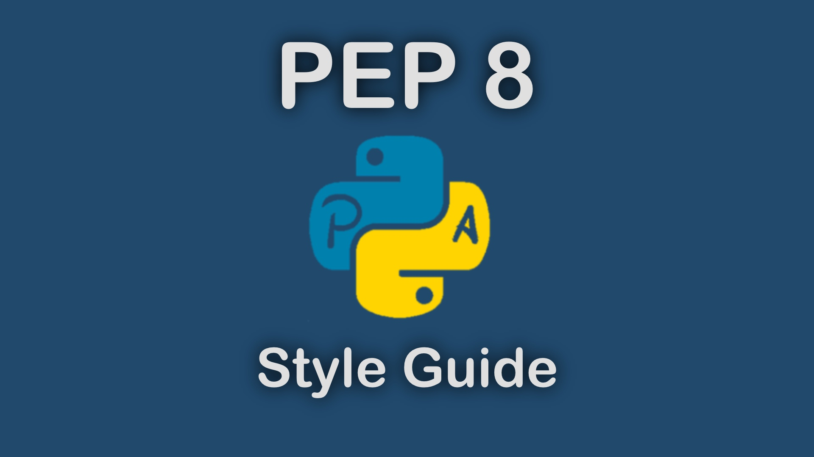
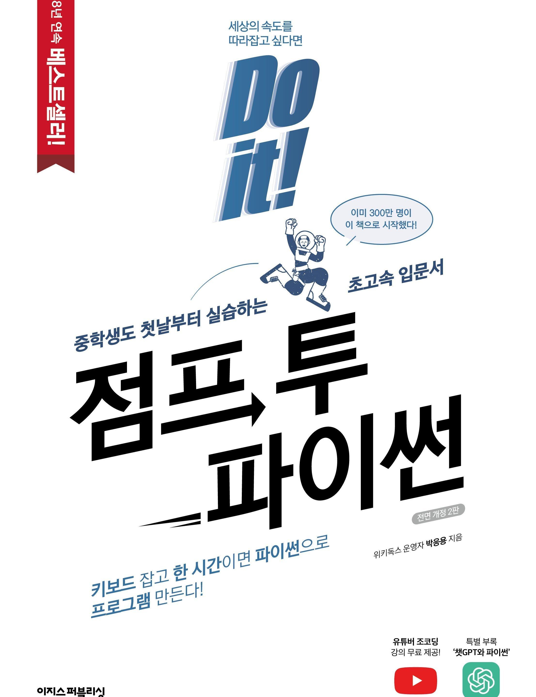

### 계획
- [ ] PEP 8 탐색 및 스터디 구상

# PEP 8



https://peps.python.org/pep-0008/

PEP 8은 파이썬 코드 작성시 지켜야하는 공식 스타일 가이드. 코드는 작성하는 시간 보다 읽는 시간이 훨씬 길기에 가독성을 높이는 것이 목표.

들여쓰기, 이름 짓기, 코드 레이아웃 등, 다양한 규칙이 존재함.

해당 가이드라인은 어디까지는 기본적인 기준일 뿐이며, 만약 특정 프로젝트나 코드에서 다른 가이드라인을 이용하고 있다면 해당 환경에 맞추는 것이 맞다.

## Code Lay-out

### Indentation

파이썬은 기본적으로 들여쓰기로 많은 것을 구분하기에 매우 중요하다.

들여쓰기는 스페이스 4칸이 기준.

```py
# Arguments는  () 기준으로 배치되는 것이 좋다.
foo = long_function_name(var_one, var_two,
                         var_three, var_four)
```

```py
# 함수 내부와 분리되는 것이 보여야한다.
def long_function_name(
        var_one, var_two, var_three,
        var_four):
    print(var_one)
```

> 참고로 VScode 설정에서 Tab을 space 여러개로 바꿀 수 있다. ctrl+shit+p로 들어가서 설정을 space으로 바꿔주자. 그리고 size를 4로 할당하자.



### Maximum Line Length

모든 파이썬 줄은 최대 **79**자를 넘기면 안된다.

주석 텍스트의 경우 최대 **72**자.

```py
# 참고로 아래가 각각 총 72자다 (공백 포함)
# Tabs should be used solely to remain consistent with code that is alr
# 참고로 VScode 설정에서 Tab을 space 여러개로 바꿀 수 있다. ctrl+shit+p로 들어가서 설정을 space으로 
```

### 연산자 배치

여러 연산자를 배치할 때 연산자를 앞으로 배치하여 가독성을 높인다.

```py
income = (gross_wages
          + taxable_interest
          + (dividends - qualified_dividends)
          - ira_deduction
          - student_loan_interest)
```

### Blank Lines

함수 정의와 클래스 정의는 서로 두 줄 공백을 뛴다.

한 클래스 내부의 함수끼리는 한 줄만 뛴다.

**가급적 줄 공백 사용을 지양한다.**

### Source File Encoding (import, from 등)


```py

```